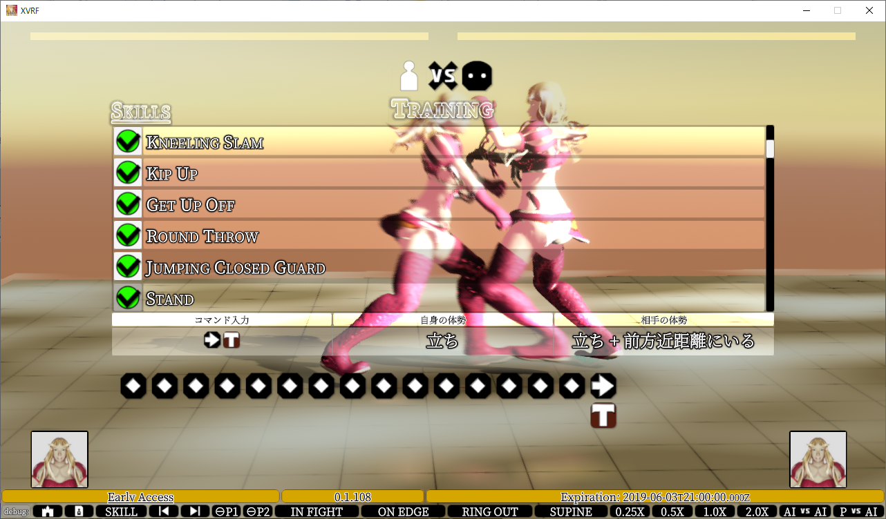
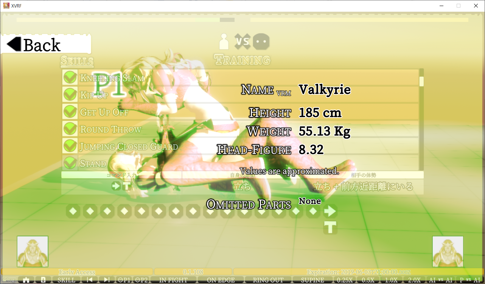
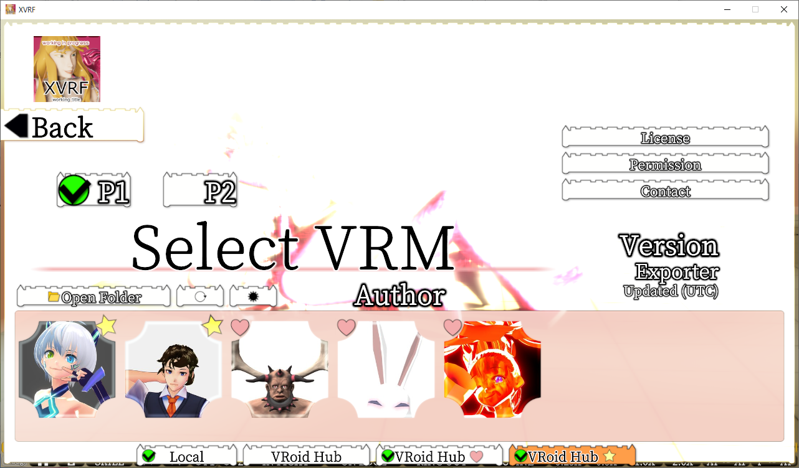
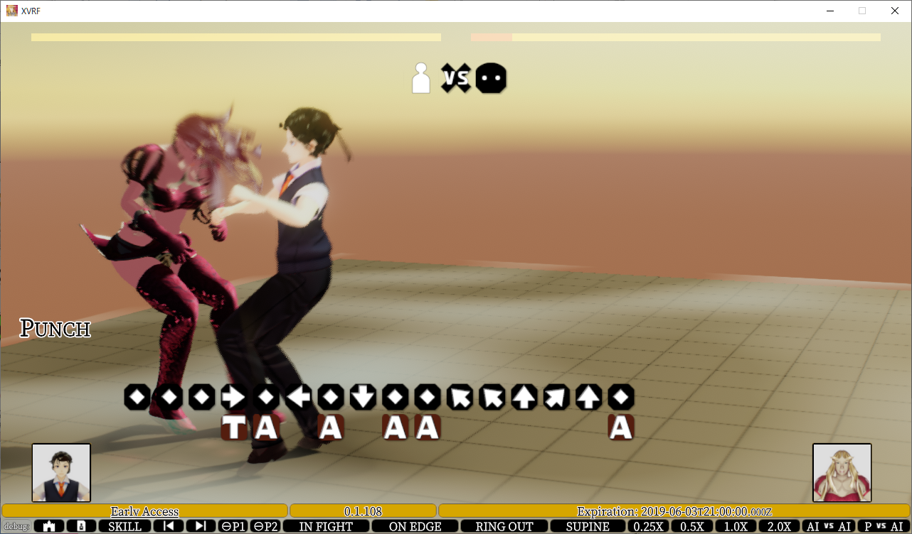

||||||
|-|-|-|-|-|
**`English`**: | [`User's Manual`](manual.md) | [`Controls`](controls.md) | ~~`History`~~ | [`Debug Tools`](debug.md)
**`Japanese`**: | [`取扱説明書`](ja/manual.md) | [`操作方法`](controls.md) | [`更新履歴`](ja/history.md) | [`デバッグツール`](ja/debug.md)

----

# Virtueld Outpost
* Home site of `Virtueld` (draft title) / `XVRF` (project name)
* A 🎮 game development project by individual developer
* Works on `Unity 2021.1.0b12` / `UniVRM 0.58.1`+ / `VRoid SDK 0.0.21`
* [License / Third party notices](LICENSE.md)

## Downloads

☛ [Virtueld Download Site](https://xelf.booth.pm/items/1341365) for `Windows 10`

<!--
## User's Manual

[`English`](manual.md) / [`Japanease`](ja/manual.md)
-->

## History

* For more details and/or newer patch notes, see [`更新履歴 in Japanese`](ja/history.md).

📷2019-05-30: `0.1.108` `Snapshots in Japanese` 

* 2019-05-01: `0.1.37` Early Access (as prototype / alpha) version released (first version).

📷2019-03-03: ᚡᛆᛚᚴᚤᚱᛄᛆ - HDRP edition as a promotional material ⚠HDRP game versions are currently not planned 

📷2019-02-01: VRoid Hub available 

📷2019-01-13: local VRM import screen 

📷2019-01-07 

📷2018-12-21 

----

## About Title

Right now considering the official title name along with the logo.
The following are current candidates: I will touch on it briefly.

* `Virtueld` /` 🆅i🆁tueld` / `Vertueld`
* 🔈 /və́ːrtʃuəld/, /vɜːrtjuəld/, /vɝtʃuəld/ for `English`
* 🔈 /ヴァーチュエルド/ for `Japanese`
* I coined it from the followings:

|`English` Words|Related Words|Related `Japanese` Words|
|--|--|--|
|virtue||剛勇 武勇 美徳|
|virtual reality||仮想現実|
|eld|age, era|時代 世代 古代|
|world|(hu)man + age|世界|

> * Use the new draft title `Virtueld` since `0.3.21` `2019-08-12`.
> * `XVRF` will remain as the project name for a while.
> * Keyword `VRoid Fight` is not a title candidate.

> These names are not intended to narrow the category, but it indicates the started development part.

## 👤 Snapshots Cast by

* `VRoid Hub` 🔗 [ᚡᛆᛚᚴᚤᚱᛄᛆ](https://hub.vroid.com/characters/5500341240985797385/models/2347767225951567710): Valkyrie / Valkyrja / ᚡᛆᛚᚴᚤᚱᛄᛆ / 🆅alky🆁ie created by XELF on `XISMO`
* A working-in-progress character (1) created by XELF on `VRoid Studio`
* `VRoid Hub` 🔗 [Victorine](https://hub.vroid.com/characters/1204568412013961579/models/5757254838117644958): XVRF Specimen Female 2 created by XELF on `VRoid Studio`
* `VRoid Hub` 🔗 [Virtueld Specimen Male 1](https://hub.vroid.com/characters/6507936595093002129/models/7670077723001265143) created by XELF on `VRoid Studio`
* `VRoid Hub` 🔗 [じんるい](https://hub.vroid.com/characters/7101894907524669339/models/7778036813709384965)
* `VRoid Hub` 🔗 [うさ](https://hub.vroid.com/characters/8735174771329069411/models/7787870287866500519)

## Reserved Specimens

...

## 💡 Powered by

* 🔗 [`Unity`](https://unity3d.com/) 🔗 [UniVRM](https://github.com/vrm-c/UniVRM) 🔗 [VRoid Studio](https://studio.vroid.com/) 🔗 [VRoid Hub](https://hub.vroid.com/) 🔗 [VRoid SDK](https://developer.vroid.com/sdk/)

## ✒ Topics

For example, characters on `VRoid Hub`, there are varied body type of characters. Now under investigation that, but I have not in this time whether enable to provide good combat or not. If it is unfair but both players can be enjoyable, that will be provided as a special mode I think.

<!-- obsolete due to dead link
### Informative Characters
* `VRoid Hub` イフリート 🔗 https://hub.vroid.com/characters/852382471780392945/models/6959713455822728834
  * Spinning hair
  * High load at `VRMSpringBone` updating
  * Transparent legs
-->

## 🎮 ☛ [How to Control / Input Device](controls.md) [`English`](controls.md) [`Japanese`](ja/controls.md)

## Schedule before 0.1.37

* I am thinking about taking like the early access development model and to build this up with future patrons / supporters help. If so, it will do on a small scale. Though the informations limited, how do you think about it?

<!--
* `日本語`による関連の投稿 (Related post in `Japanese`) 🔗 https://www.pixiv.net/fanbox/creator/33312285/post/239934
-->

|||
|----|----|
|Early Access Date|2019-05-01 `0.1.37` Public Early Access released|
|Release Date|TBD|

## ✒Application form for Virtueld closed alpha features

* Closed alpha features in 0.2.x or later
  * `Discord`-related features

If you have interested in Virtueld, feel free to submit the [✒Application form for Virtueld closed alpha features](https://docs.google.com/forms/d/e/1FAIpQLSc65YglSrOXShY44_p9BFVY2vyvtz4U2IY4n2N3NwmA4jZvYg/viewform)

> This form is written in bilingual of `Japanese`/`English`.

## Developers' References

* 🔗 `Japanese` [VRoid 更新履歴 🌟 VRoid Update History](https://twitter.com/i/moments/1038317938049134592)
* 🔗 `Japanese` Anyone can help: Unity Editor crash [Shared Stack Traces](https://scrapbox.io/XVRF/Shared_Stack_Traces)

--------
Support Me ☛ [Patreon](https://www.patreon.com/XELF) or [PixivFANBOX](https://www.pixiv.net/fanbox/creator/33312285)

--------
🆇🅴🅻🅵
©2018-2021 XELF
