**`English`**: | ~`User's Manual`~ | [`Controls`](controls.md) | ~`History`~ | ~`Debug Tools`~
|-|-|
**`Japanese`**: | [`User's Manual`](ja/manual.md) | [`Controls`](controls.md) | [`更新履歴`](history.md) | [`デバッグツール`](debug.md)

----

# XVRF Outpost
* `XVRF` (working title) home site
* A 🎮 game development project by individual developer
* Works on `Unity 2019.1.1f1` / `UniVRM 0.50` / `VRoid SDK 0.0.17`
* [License / Third party notices](LICENSE.md)

## Downloads

☛ [XVRF Download Site](https://xelf.booth.pm/items/1341365) for `Windows 10`

## User's Manual

`English (N/A)` / [`Japanease`](ja/manual.md)

## History

* For more details and/or newer logs, see [`更新履歴 in Japanese`](ja/history.md).
* 2019-05-01: `0.1.37` Early Access (as prototype / alpha) version released (first version).

📷2019-03-03: ᚡᛆᛚᚴᚤᚱᛄᛆ - HDRP edition as a promotional material ⚠HDRP game versions are currently not planned 

📷2019-02-01: VRoid Hub available 
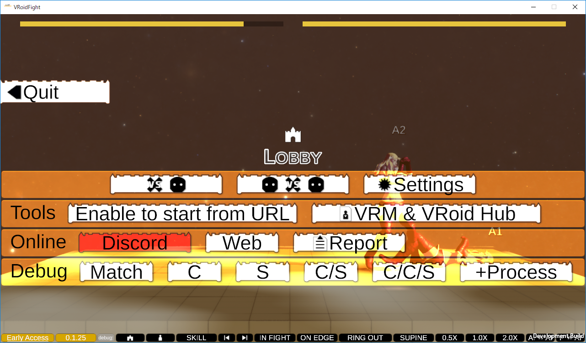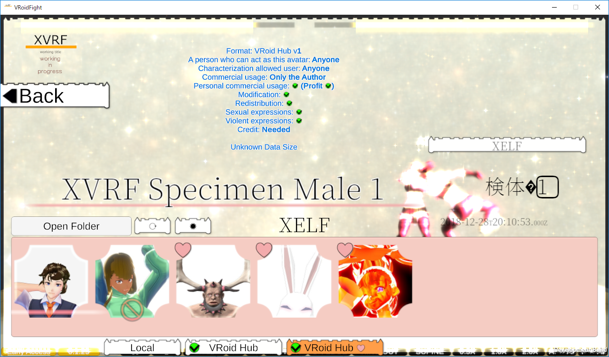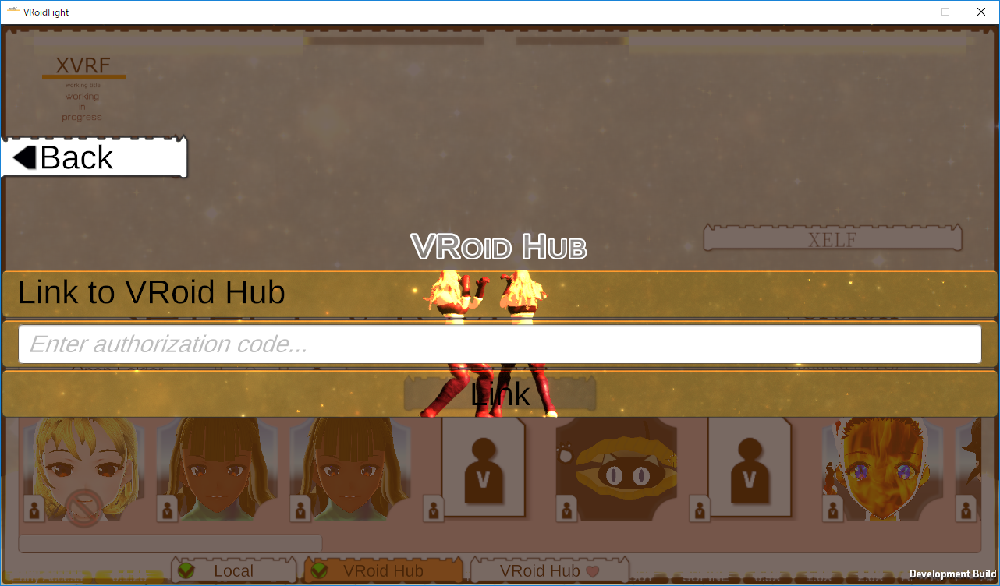

📷2019-01-13: local VRM import screen 
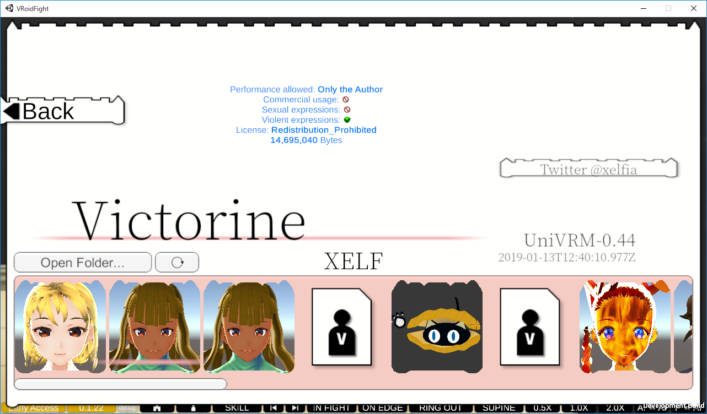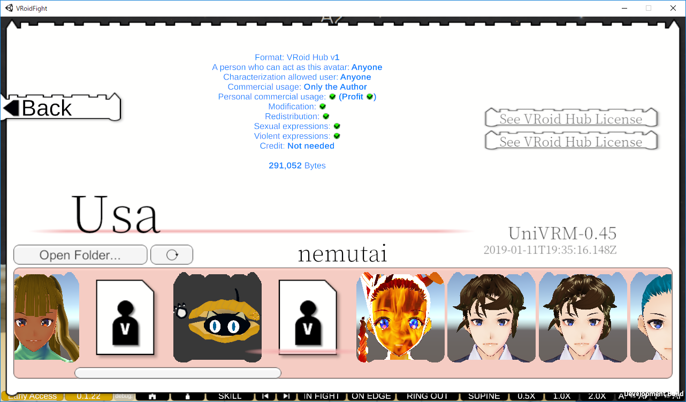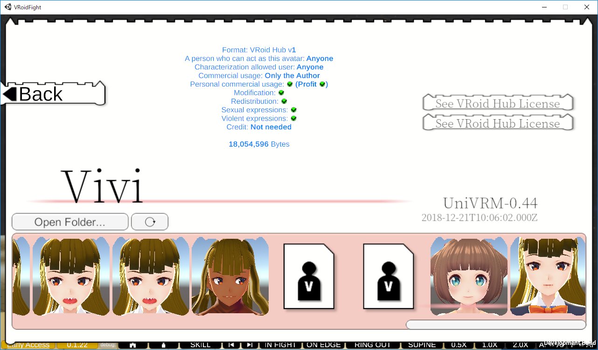

📷2019-01-07 
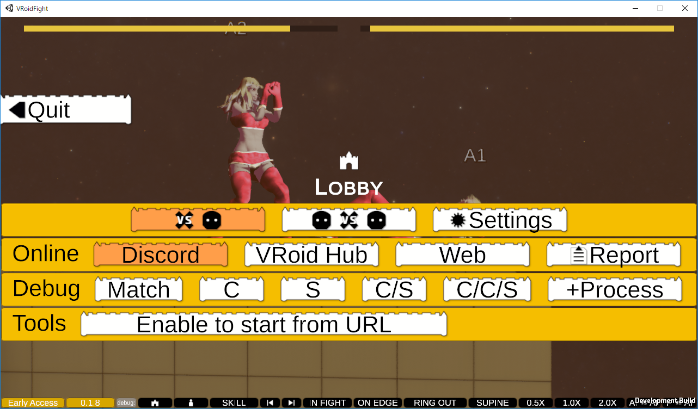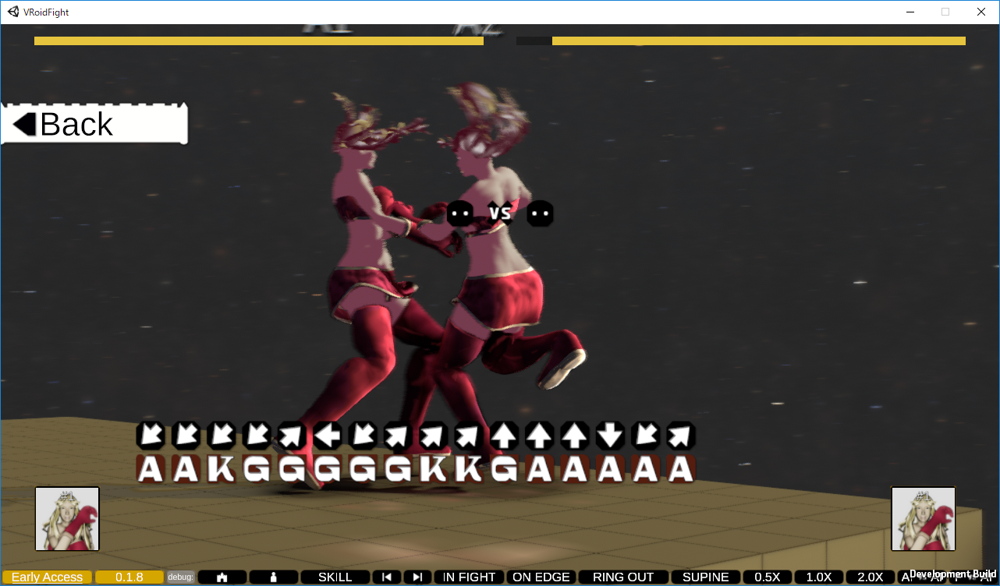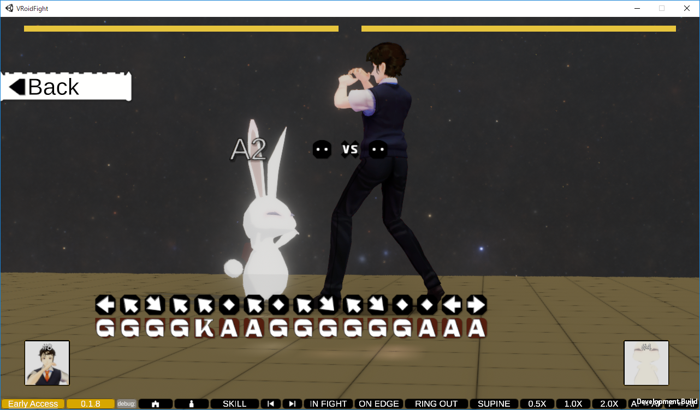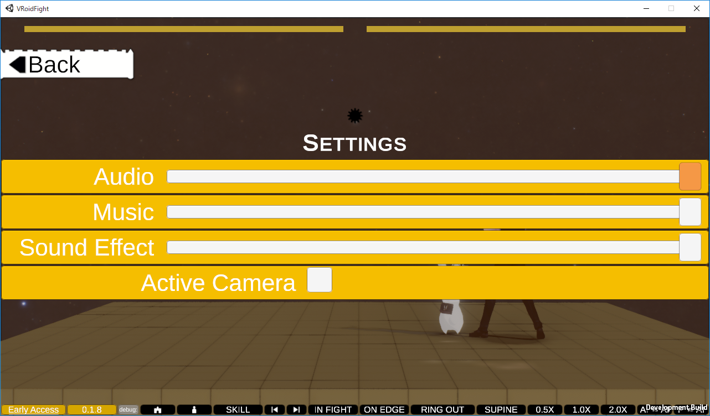

📷2018-12-21 
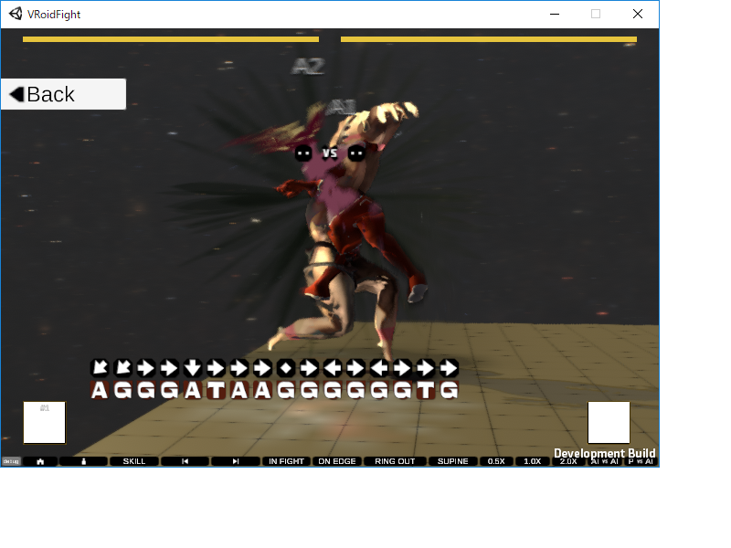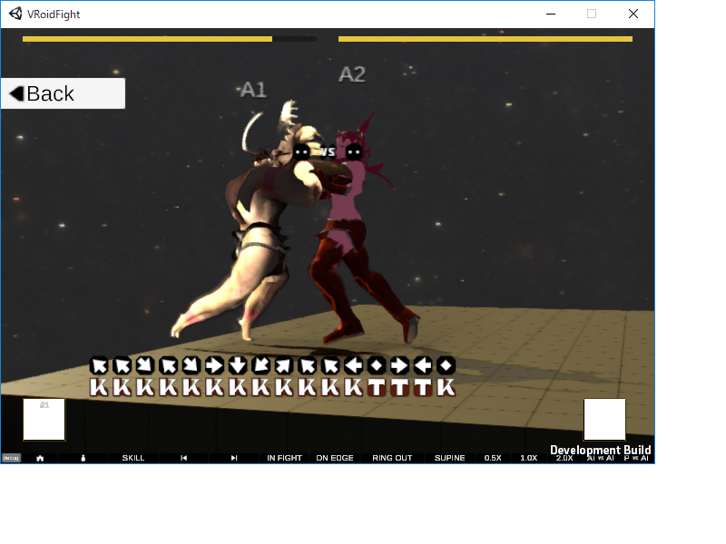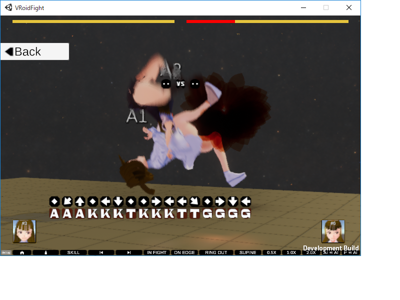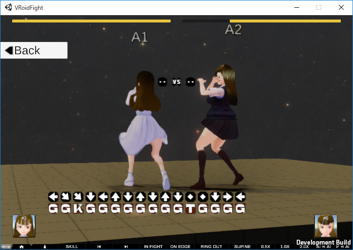

----

* `XVRF` / `VRoid Fight` are temporal names.
These names are not intended to narrow the category, but it indicates the started development part.

## 👤 Snapshots Cast by

* `VRoid Hub` 🔗 [ᚡᛆᛚᚴᚤᚱᛄᛆ](https://hub.vroid.com/characters/5500341240985797385/models/2347767225951567710): Valkyrie / Valkyrja / ᚡᛆᛚᚴᚤᚱᛄᛆ / 🆅alky🆁ie created by XELF on `XISMO`
* A working-in-progress character (1) created by XELF on `VRoid Studio`
* `VRoid Hub` 🔗 [Victorine](https://hub.vroid.com/characters/1204568412013961579/models/5757254838117644958): XVRF Specimen Female 2 created by XELF on `VRoid Studio`
* `VRoid Hub` 🔗 [XVRF Specimen Male 1](https://hub.vroid.com/characters/6507936595093002129/models/7670077723001265143) created by XELF on `VRoid Studio`
* `VRoid Hub` 🔗 [じんるい](https://hub.vroid.com/characters/7101894907524669339/models/7778036813709384965)
* `VRoid Hub` 🔗 [うさ](https://hub.vroid.com/characters/8735174771329069411/models/7787870287866500519)

## Reserved Specimens

...

## 💡 Powered by

* 🔗 [`Unity`](https://unity3d.com/) 🔗 [UniVRM](https://github.com/vrm-c/UniVRM) 🔗 [VRoid Studio](https://studio.vroid.com/) 🔗 [VRoid Hub](https://hub.vroid.com/) 🔗 [VRoid SDK](https://developer.vroid.com/sdk/)

## ✒ Topics

For example, characters on `VRoid Hub`, there are varied body type of characters. Now under investigation that, but I have not in this time whether enable to provide good combat or not. If it is unfair but both players can be enjoyable, that will be provided as a special mode I think.

### Informative Characters
* `VRoid Hub` イフリート 🔗 https://hub.vroid.com/characters/852382471780392945/models/6959713455822728834
  * Spinning hair
  * High load at `VRMSpringBone` updating
  * Transparent legs

## 💻 Recommended System Requirements

| |Recommended Specifications|
|----|----|
|Operating System|Windows 10 64-bit|
|Video|DirectX 11 or later|
|Memory|4GB RAM|
|Storage|25GB available space|
|Broadband Internet connection|✅ (as currently planned)|

* only as a guide

## 🎮 ☛ [How to Control / Input Device](controls.md) [`English`](controls.md) [`Japanese`](ja/controls.md)

## 📜 Feedback / Report a Bug

> This is preliminary

* You can send via the in-game `Report`. Most of fields are automatically filled and read-only. `Log` is editable. Please confirm that there is no problem to submitting with that content, press `Send`.

> Feel free to give your feedback. Even if there is no issue, it is also able to know your system environments as statistics☺️

* If the in-game `Report` is not available, use the web form instead (in planned).

## Schedule before 0.1.37

* I am thinking about taking like the early access development model and to build this up with future patrons / supporters help. If so, it will do on a small scale. Though the informations limited, how do you think about it?

If 👍/📧 ➡ 🔗 https://www.pixiv.net/fanbox/creator/33312285

* `日本語`による関連の投稿 (Related post in `Japanese`) 🔗 https://www.pixiv.net/fanbox/creator/33312285/post/239934

|||
|----|----|
|Early Access Date|2019-05-01 `0.1.37` Public Early Access released|
|Release Date|TBD|

## Attitude Survey for Early Access

If you have interested in XVRF, feel free to submit the [📜Form](https://docs.google.com/forms/d/e/1FAIpQLSc65YglSrOXShY44_p9BFVY2vyvtz4U2IY4n2N3NwmA4jZvYg/viewform)

> This form is written in bilingual of `Japanese`/`English`.

## Developers' References

* 🔗 `Japanese` [VRoid 更新履歴 🌟 VRoid Update History](https://twitter.com/i/moments/1038317938049134592)
* 🔗 `Japanese` Anyone can help: Unity Editor crash [Shared Stack Traces](https://scrapbox.io/XVRF/Shared_Stack_Traces)

--------
🆇🅴🅻🅵
©2018-2019 XELF

