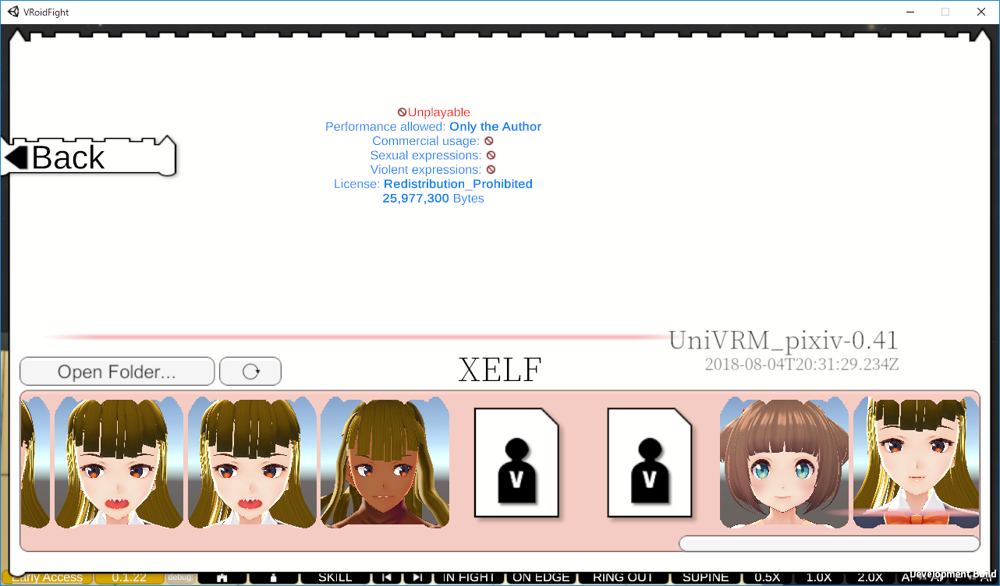
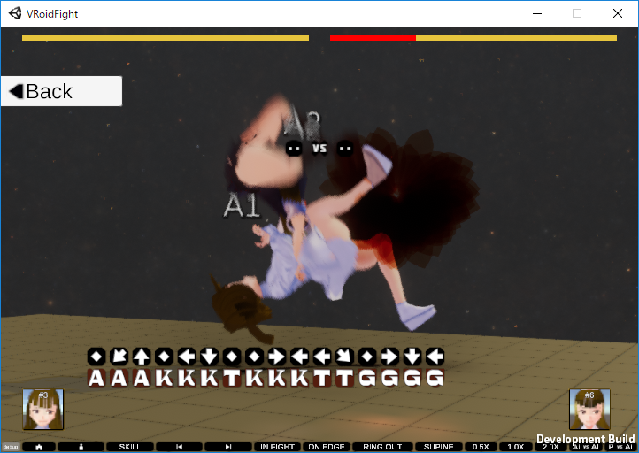

# XVRF Outpost
* Project `XVRF` (working title) teaser site
* A 🎮 game development project by individual developer
* Works preliminarily on `Unity 2018.3.2f1` / `UniVRM 0.45`
* [License / Third party notices](LICENSE.md)

📷2019-01-13: local VRM import screen 

📷2019-01-07 

📷2018-12-21 

----

* `XVRF` / `VRoid Fight` are temporal names.
These names are not intended to narrow the category, but it indicates the started development part.

## Snapshots Cast by

* A working-in-progress character created by XELF on `xismo`
* A working-in-progress character (1) created by XELF on `VRoid Studio`
* `Vroid Hub` 🔗 [Victorine](https://hub.vroid.com/characters/1204568412013961579/models/5757254838117644958): XVRF Specimen Female 2 created by XELF on `VRoid Studio`
* `VRoid Hub` 🔗 [XVRF Specimen Male 1](https://hub.vroid.com/characters/6507936595093002129/models/7670077723001265143) created by XELF on `VRoid Studio`
* `VRoid Hub` 🔗 [じんるい](https://hub.vroid.com/characters/7101894907524669339/models/7778036813709384965)
* `VRoid Hub` 🔗 [うさ](https://hub.vroid.com/characters/8735174771329069411/models/7787870287866500519)

## Reserved Specimens

...

## Powered by

* 🔗 [`Unity`](https://unity3d.com/) 🔗 [UniVRM](https://github.com/dwango/UniVRM) 🔗 [VRoid Studio](https://studio.vroid.com/) 🔗 [VRoid Hub](https://hub.vroid.com/)

## Topics

For example, characters on `VRoid Hub`, there are varied body type of characters. Now under investigation that, but I have not in this time whether enable to provide good combat or not. If it is unfair but both players can be enjoyable, that will be provided as a special mode I think.

### Informative Characters
* `VRoid Hub` イフリート 🔗 https://hub.vroid.com/characters/852382471780392945/models/6959713455822728834
  * Spinning hair
  * High load at `VRMSpringBone` updating
  * Transparent legs

## Recommended System Requirements

| |Recommended Specifications|
|----|----|
|Operating System|Windows 10 64-bit|
|Video|DirectX 11 or later|
|Memory|4GB RAM|
|Storage|25GB available space|
|Broadband Internet connection|✅ (as currently planned)|

* only as a guide

## How to Control / Input Device

> This is preliminary

* Gamepad is mainly used.
  * For combat, left stick and 4 buttons are mainly used.
  * Additional buttons are also used auxiliary.
  * `Skill` (Command inputs) will be short (in planned).
* Though gamepad is recommended, you can also play with Keyboard/Mouse under your input bindings.
* You can customize the input bindings on `Input` tab of Configuration dialog.

### How to open the Configuration dialog

* Open XVRF's `.exe` file with holding `[Ctrl]` to start the game app.

### Notations

* Following notations are for generalize input devices.
* Symbols are shown as similar icons in game screen.

|Symbols (notations)|Name on `Input` tab|Basic Usage|
|----|----|----|
|Ⓐ|Ⓐ Attack|Attack|
|Ⓚ|Ⓚ Kick|Kick|
|Ⓣ|Ⓣ Throw|Throw / Face to Opponent / Clinch|
|Ⓖ|Ⓖ Guard|Guard|
|←/→|Left Stick Horizontal|Move / Naviagte on Menu|
|↑/↓|Left Stick Vertical|Move / Navigate on Menu|
|🄻¹|L1|-|
|🅁¹|L2|-|
|🔙|Back|Go Back on Menu / Open Escape Menu|

### Controls in Menu

|Controls|Basic Usage|
|----|----|
|↑/↓/←/→|Navigate|
|Ⓐ|Select / OK|
|Ⓚ|Cancel|

### Controls in Combat

* Your Position and Opponent Position are required conditions.
* Skills are optional: character customizable features (in planned).
* ⚠ Note that described as when you are facing rightward view in screen.

|Controls|Your Position|Opponent Position|Default Move|Skills (optional)|
|----|----|----|----|----|
|🄻¹+🅁¹|-|-|Reset Combat in Training Mode|-|
|→|`Stand`|-|`Step Forward`|-|
|←|`Stand`|-|`Step Backward`|-|
|↑|`Stand`|-|`Step Leftward`|-|
|↓|`Stand`|-|`Step Rightward`|-|
|Ⓐ|`Stand`|-|-|`Punch`|
|Ⓐ|`Punch`|-|-|`Jab`|
|→Ⓐ|`Stand`|-|-|`Splash`|
|Ⓚ|`Stand`|-|-|`Round Kick`|
|→Ⓚ|`Stand`|-|-|`Low Kick`|
|Ⓖ|`Stand`|-|`Guard`|-|
|Ⓣ|`Stand`|`Stand`|-|`Round Throw`|
|Ⓣ|`Stand`|`Supine`/`Prone`|-|`Kneeling Mount`|
|Ⓐ|`Kneeling Mount`|`Supine`/`Prone`|-|`Kneeling Slam`|
|→|`Supine`/`Prone`|-|`Kip up`|-|
|↑/↓|	`Supine`/`Prone`|Not Mounted|`Roll Over`|-|
|etc…|…|…|…|…|

## Feedback / Report a Bug

> This is preliminary

* You can send via the in-game `Report`. Most of fields are automatically filled and read-only. `Log` is editable. Please confirm that there is no problem to submitting with that content, press `Send`.

> Feel free to give your feedback. Even if there is no issue, it is also able to know your system environments as statistics☺️

* If the in-game `Report` is not available, use the web form instead (in planned).

## To be continued…❓

❓❓❓

## Schedule

* I am thinking about taking like the early access development model and to build this up with future patrons / supporters help. If so, it will do on a small scale. Though the informations limited, how do you think about it?

If 👍/📧 ➡ 🔗 https://www.pixiv.net/fanbox/creator/33312285

* `日本語`による関連の投稿 (Related post in `Japanese`) 🔗 https://www.pixiv.net/fanbox/creator/33312285/post/239934

|||
|----|----|
|Early Access Date|TBD|
|Release Date|TBD|

## Attitude Survey for Early Access

If you have interested in XVRF, feel free to submit the [📜Form](https://docs.google.com/forms/d/e/1FAIpQLSc65YglSrOXShY44_p9BFVY2vyvtz4U2IY4n2N3NwmA4jZvYg/viewform)

> This form is written in bilingual of `Japanese`/`English`.

## Developers' References

* 🔗 `Japanese` [VRoid 更新履歴 🌟 VRoid Update History](https://twitter.com/i/moments/1038317938049134592)

--------
🆇🅴🅻🅵
©2018 XELF

