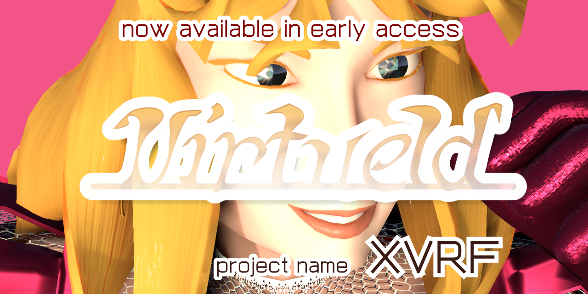

<!--[🔙](../README.md) | -->
[`取扱説明書`](manual.md) | [`操作方法`](controls.md) | `更新履歴` | [`デバッグツール`](debug.md) || ~~**English**~~ | **Japanese**

----

> * ☛ [更新記録](https://scrapbox.io/XVRF/Virtueld:_%E6%9B%B4%E6%96%B0%E8%A8%98%E9%8C%B2)にて、内容を補足している場合があります。
> * 履歴にある`Discord`関連機能とオンライン関連機能の項目は ☛ [`Discord関連機能`](manual.md#Discord関連機能) と [最新情報](https://scrapbox.io/XVRF/Virtueld%2FDiscord%E9%96%A2%E9%80%A3%E6%A9%9F%E8%83%BD%E3%81%AE%E6%9A%AB%E5%AE%9A%E3%83%9E%E3%83%8B%E3%83%A5%E3%82%A2%E3%83%AB) に、より詳細な情報があります。

# 更新履歴 🙼 Update Logs

# `2022-10-08` 0.17.38 on `HDRP` Physics:`U` Ragdoll:`U+` `Unity 2021.3.11f1` `UniVRM 0.89.0`+ `VRoidSDK 0.1.0`+
* 一部動作を調整しました。

# `2022-10-07` 0.17.37 on `HDRP` Physics:`U` Ragdoll:`U+` `Unity 2021.3.11f1` `UniVRM 0.89.0`+ `VRoidSDK 0.1.0`+
* 一部動作を調整しました。

# `2022-10-06` 0.17.36 on `HDRP` Physics:`U` Ragdoll:`U+` `Unity 2021.3.11f1` `UniVRM 0.89.0`+ `VRoidSDK 0.1.0`+
* 一部動作を調整しました。

# `2022-10-05` 0.17.35 on `HDRP` Physics:`U` Ragdoll:`U+` `Unity 2021.3.11f1` `UniVRM 0.89.0`+ `VRoidSDK 0.1.0`+
* 一部動作を調整しました。

# `2022-10-04` 0.17.34 on `HDRP` Physics:`U` Ragdoll:`U+` `Unity 2021.3.11f1` `UniVRM 0.89.0`+ `VRoidSDK 0.1.0`+
* 一部動作を調整しました。

# `2022-10-03` 0.17.33 on `HDRP` Physics:`U` Ragdoll:`U+` `Unity 2021.3.11f1` `UniVRM 0.89.0`+ `VRoidSDK 0.1.0`+
* 一部動作を調整しました。

# `2022-10-02` 0.17.32 on `HDRP` Physics:`U` Ragdoll:`U+` `Unity 2021.3.11f1` `UniVRM 0.89.0`+ `VRoidSDK 0.1.0`+
* 一部動作を調整しました。

# `2022-10-01` 0.17.31 on `HDRP` Physics:`U` Ragdoll:`U+` `Unity 2021.3.11f1` `UniVRM 0.89.0`+ `VRoidSDK 0.1.0`+
* 一部動作を調整しました。

# `2022-09-30` 0.17.30 on `HDRP` Physics:`U` Ragdoll:`U+` `Unity 2021.3.11f1` `UniVRM 0.89.0`+ `VRoidSDK 0.1.0`+
* Unityを更新しました。
* 一部依存パッケージを更新しました。

# `2022-09-29` 0.17.29 on `HDRP` Physics:`U` Ragdoll:`U+` `Unity 2021.3.10f1` `UniVRM 0.89.0`+ `VRoidSDK 0.1.0`+
* 一部動作を調整しました。

# `2022-09-28` 0.17.28 on `HDRP` Physics:`U` Ragdoll:`U+` `Unity 2021.3.10f1` `UniVRM 0.89.0`+ `VRoidSDK 0.1.0`+
* 一部動作を調整しました。

# `2022-09-27` 0.17.27 on `HDRP` Physics:`U` Ragdoll:`U+` `Unity 2021.3.10f1` `UniVRM 0.89.0`+ `VRoidSDK 0.1.0`+
* 一部動作を調整しました。

# `2022-09-26` 0.17.26 on `HDRP` Physics:`U` Ragdoll:`U+` `Unity 2021.3.10f1` `UniVRM 0.89.0`+ `VRoidSDK 0.1.0`+
* 一部動作を調整しました。

# `2022-09-25` 0.17.25 on `HDRP` Physics:`U` Ragdoll:`U+` `Unity 2021.3.10f1` `UniVRM 0.89.0`+ `VRoidSDK 0.1.0`+
* 一部動作を調整しました。

# `2022-09-24` 0.17.24 on `HDRP` Physics:`U` Ragdoll:`U+` `Unity 2021.3.10f1` `UniVRM 0.89.0`+ `VRoidSDK 0.1.0`+
* 一部動作を調整しました。

# `2022-09-23` 0.17.23 on `HDRP` Physics:`U` Ragdoll:`U+` `Unity 2021.3.10f1` `UniVRM 0.89.0`+ `VRoidSDK 0.1.0`+
* 一部動作を調整しました。

# `2022-09-22` 0.17.22 on `HDRP` Physics:`U` Ragdoll:`U+` `Unity 2021.3.10f1` `UniVRM 0.89.0`+ `VRoidSDK 0.1.0`+
* 一部動作を調整しました。

# `2022-09-21` 0.17.21 on `HDRP` Physics:`U` Ragdoll:`U+` `Unity 2021.3.10f1` `UniVRM 0.89.0`+ `VRoidSDK 0.1.0`+
* 一部動作を調整しました。

# `2022-09-20` 0.17.20 on `HDRP` Physics:`U` Ragdoll:`U+` `Unity 2021.3.10f1` `UniVRM 0.89.0`+ `VRoidSDK 0.1.0`+
* 一部動作を調整しました。

# `2022-09-19` 0.17.19 on `HDRP` Physics:`U` Ragdoll:`U+` `Unity 2021.3.10f1` `UniVRM 0.89.0`+ `VRoidSDK 0.1.0`+
* 一部動作を調整しました。

# `2022-09-18` 0.17.18 on `HDRP` Physics:`U` Ragdoll:`U+` `Unity 2021.3.10f1` `UniVRM 0.89.0`+ `VRoidSDK 0.1.0`+
* 一部動作を調整しました。

# `2022-09-17` 0.17.17 on `HDRP` Physics:`U` Ragdoll:`U+` `Unity 2021.3.10f1` `UniVRM 0.89.0`+ `VRoidSDK 0.1.0`+
* Unityを更新しました。

# `2022-09-16` 0.17.16 on `HDRP` Physics:`U` Ragdoll:`U+` `Unity 2021.3.9f1` `UniVRM 0.89.0`+ `VRoidSDK 0.1.0`+
* 一部動作を調整しました。

# `2022-09-15` 0.17.15 on `HDRP` Physics:`U` Ragdoll:`U+` `Unity 2021.3.9f1` `UniVRM 0.89.0`+ `VRoidSDK 0.1.0`+
* 一部動作を調整しました。

# `2022-09-14` 0.17.14 on `HDRP` Physics:`U` Ragdoll:`U+` `Unity 2021.3.9f1` `UniVRM 0.89.0`+ `VRoidSDK 0.1.0`+
* 一部動作を調整しました。

# `2022-09-13` 0.17.13 on `HDRP` Physics:`U` Ragdoll:`U+` `Unity 2021.3.9f1` `UniVRM 0.89.0`+ `VRoidSDK 0.1.0`+
* 一部動作を調整しました。

# `2022-09-12` 0.17.12 on `HDRP` Physics:`U` Ragdoll:`U+` `Unity 2021.3.9f1` `UniVRM 0.89.0`+ `VRoidSDK 0.1.0`+
* 一部動作を調整しました。

# `2022-09-11` 0.17.11 on `HDRP` Physics:`U` Ragdoll:`U+` `Unity 2021.3.9f1` `UniVRM 0.89.0`+ `VRoidSDK 0.1.0`+
* 一部動作を調整しました。

# `2022-09-10` 0.17.10 on `HDRP` Physics:`U` Ragdoll:`U+` `Unity 2021.3.9f1` `UniVRM 0.89.0`+ `VRoidSDK 0.1.0`+
* 一部動作を調整しました。

# `2022-09-09` 0.17.9 on `HDRP` Physics:`U` Ragdoll:`U+` `Unity 2021.3.9f1` `UniVRM 0.89.0`+ `VRoidSDK 0.1.0`+
* 一部動作を調整しました。

# `2022-09-08` 0.17.8 on `HDRP` Physics:`U` Ragdoll:`U+` `Unity 2021.3.9f1` `UniVRM 0.89.0`+ `VRoidSDK 0.1.0`+
* 一部動作を調整しました。

# `2022-09-07` 0.17.7 on `HDRP` Physics:`U` Ragdoll:`U+` `Unity 2021.3.9f1` `UniVRM 0.89.0`+ `VRoidSDK 0.1.0`+
* 一部動作を調整しました。

# `2022-09-06` 0.17.6 on `HDRP` Physics:`U` Ragdoll:`U+` `Unity 2021.3.9f1` `UniVRM 0.89.0`+ `VRoidSDK 0.1.0`+
* 一部動作を調整しました。

# `2022-09-05` 0.17.5 on `HDRP` Physics:`U` Ragdoll:`U+` `Unity 2021.3.9f1` `UniVRM 0.89.0`+ `VRoidSDK 0.1.0`+
* 一部動作を調整しました。

# `2022-09-04` 0.17.4 on `HDRP` Physics:`U` Ragdoll:`U+` `Unity 2021.3.9f1` `UniVRM 0.89.0`+ `VRoidSDK 0.1.0`+
* 一部動作を調整しました。

# `2022-09-03` 0.17.3 on `HDRP` Physics:`U` Ragdoll:`U+` `Unity 2021.3.9f1` `UniVRM 0.89.0`+ `VRoidSDK 0.1.0`+
* 一部動作を調整しました。

# `2022-09-02` 0.17.2 on `HDRP` Physics:`U` Ragdoll:`U+` `Unity 2021.3.9f1` `UniVRM 0.89.0`+ `VRoidSDK 0.1.0`+
* Unityを更新しました。
* 試験的リング`Voxel`(仮名)を更新しました。
  * キャラクターに試験的な浮力を追加しました。
  * 一部描画を復元しました。
  * 🎶音楽を更新しました。

# `2022-09-01` 0.17.1 on `HDRP` Physics:`U` Ragdoll:`U+` `Unity 2021.3.8f1` `UniVRM 0.89.0`+ `VRoidSDK 0.1.0`+
* 一部動作を調整しました。

# `2022-08-31` 0.17.0 on `HDRP` Physics:`U` Ragdoll:`U+` `Unity 2021.3.8f1` `UniVRM 0.89.0`+ `VRoidSDK 0.1.0`+
* 一部依存パッケージを更新しました。
* UIの効果音を復元しました。

# `2022-08-30` 0.16.61 on `HDRP` Physics:`U` Ragdoll:`U+` `Unity 2021.3.8f1` `UniVRM 0.89.0`+ `VRoidSDK 0.1.0`+
* 🎶音楽関連を更新しました。

# `2022-08-29` 0.16.60 on `HDRP` Physics:`U` Ragdoll:`U+` `Unity 2021.3.8f1` `UniVRM 0.89.0`+ `VRoidSDK 0.1.0`+
* 一部依存パッケージを更新しました。
* 🎶音楽関連を更新しました。

# `2022-08-28` 0.16.59 on `HDRP` Physics:`U` Ragdoll:`U+` `Unity 2021.3.8f1` `UniVRM 0.89.0`+ `VRoidSDK 0.1.0`+
* 🎶音楽関連を更新しました。
  * 新しい（0.16.55以降の）演奏機能において、`⚙Settings`の`音量`/`音楽`に対応しました。
  * クロスフェード挙動を修正しました。

# `2022-08-27` 0.16.58 on `HDRP` Physics:`U` Ragdoll:`U+` `Unity 2021.3.8f1` `UniVRM 0.89.0`+ `VRoidSDK 0.1.0`+
* 一部依存パッケージを更新しました。
  * DOTS 0.51.1-preview.21系にしました。
* 一部座標変換を試験的に変更しました。
* 🎶音楽関連を更新しました。

# `2022-08-26` 0.16.57 on `HDRP` Physics:`U` Ragdoll:`U+` `Unity 2021.3.8f1` `UniVRM 0.89.0`+ `VRoidSDK 0.1.0`+
* 🎶音楽関連を更新しました。

# `2022-08-25` 0.16.56 on `HDRP` Physics:`U` Ragdoll:`U+` `Unity 2021.3.8f1` `UniVRM 0.89.0`+ `VRoidSDK 0.1.0`+
* 一部動作を調整しました。

# `2022-08-24` 0.16.55 on `HDRP` Physics:`U` Ragdoll:`U+` `Unity 2021.3.8f1` `UniVRM 0.89.0`+ `VRoidSDK 0.1.0`+
* 🎶音楽関連を変更しました。
 * これまでの曲と演奏に代わり、`BeepBox 4.1`を移植（一部除く）して、新たないくつかの曲を使うようにしました。
 * 曲の内容/どの場面で演奏されるか/制御などは調整中です。

# `2022-08-23` 0.16.54 on `HDRP` Physics:`U` Ragdoll:`U+` `Unity 2021.3.8f1` `UniVRM 0.89.0`+ `VRoidSDK 0.1.0`+
* 一部動作を調整しました。

# `2022-08-22` 0.16.53 on `HDRP` Physics:`U` Ragdoll:`U+` `Unity 2021.3.8f1` `UniVRM 0.89.0`+ `VRoidSDK 0.1.0`+
* 一部動作を調整しました。

# `2022-08-21` 0.16.52 on `HDRP` Physics:`U` Ragdoll:`U+` `Unity 2021.3.8f1` `UniVRM 0.89.0`+ `VRoidSDK 0.1.0`+
* 一部依存パッケージを更新しました。

# `2022-08-20` 0.16.51 on `HDRP` Physics:`U` Ragdoll:`U+` `Unity 2021.3.8f1` `UniVRM 0.89.0`+ `VRoidSDK 0.1.0`+
* 一部動作を調整しました。

# `2022-08-19` 0.16.50 on `HDRP` Physics:`U` Ragdoll:`U+` `Unity 2021.3.8f1` `UniVRM 0.89.0`+ `VRoidSDK 0.1.0`+
* 一部動作を調整しました。

# `2022-08-18` 0.16.49 on `HDRP` Physics:`U` Ragdoll:`U+` `Unity 2021.3.8f1` `UniVRM 0.89.0`+ `VRoidSDK 0.1.0`+
* 一部動作を調整しました。

# `2022-08-17` 0.16.48 on `HDRP` Physics:`U` Ragdoll:`U+` `Unity 2021.3.8f1` `UniVRM 0.89.0`+ `VRoidSDK 0.1.0`+
* 一部動作を調整しました。

# `2022-08-16` 0.16.47 on `HDRP` Physics:`U` Ragdoll:`U+` `Unity 2021.3.8f1` `UniVRM 0.89.0`+ `VRoidSDK 0.1.0`+
* 一部動作を調整しました。

# `2022-08-15` 0.16.46 on `HDRP` Physics:`U` Ragdoll:`U+` `Unity 2021.3.8f1` `UniVRM 0.89.0`+ `VRoidSDK 0.1.0`+
* 一部動作を調整しました。

# `2022-08-14` 0.16.45 on `HDRP` Physics:`U` Ragdoll:`U+` `Unity 2021.3.8f1` `UniVRM 0.89.0`+ `VRoidSDK 0.1.0`+
* 一部動作を調整しました。

# `2022-08-13` 0.16.44 on `HDRP` Physics:`U` Ragdoll:`U+` `Unity 2021.3.8f1` `UniVRM 0.89.0`+ `VRoidSDK 0.1.0`+
* 一部動作を調整しました。

# `2022-08-12` 0.16.43 on `HDRP` Physics:`U` Ragdoll:`U+` `Unity 2021.3.8f1` `UniVRM 0.89.0`+ `VRoidSDK 0.1.0`+
* 一部動作を調整しました。

# `2022-08-11` 0.16.42 on `HDRP` Physics:`U` Ragdoll:`U+` `Unity 2021.3.8f1` `UniVRM 0.89.0`+ `VRoidSDK 0.1.0`+
* 一部動作を調整しました。

# `2022-08-10` 0.16.41 on `HDRP` Physics:`U` Ragdoll:`U+` `Unity 2021.3.8f1` `UniVRM 0.89.0`+ `VRoidSDK 0.1.0`+
* 一部動作を調整しました。

# `2022-08-09` 0.16.40 on `HDRP` Physics:`U` Ragdoll:`U+` `Unity 2021.3.8f1` `UniVRM 0.89.0`+ `VRoidSDK 0.1.0`+
* Unityを更新しました。
* 一部依存パッケージを更新しました。

# `2022-08-08` 0.16.39 on `HDRP` Physics:`U` Ragdoll:`U+` `Unity 2021.3.7f1` `UniVRM 0.89.0`+ `VRoidSDK 0.1.0`+
* 一部動作を調整しました。

# `2022-08-07` 0.16.38 on `HDRP` Physics:`U` Ragdoll:`U+` `Unity 2021.3.7f1` `UniVRM 0.89.0`+ `VRoidSDK 0.1.0`+
* 一部動作を調整しました。

# `2022-08-06` 0.16.37 on `HDRP` Physics:`U` Ragdoll:`U+` `Unity 2021.3.7f1` `UniVRM 0.89.0`+ `VRoidSDK 0.1.0`+
* 一部動作を調整しました。

# `2022-08-05` 0.16.36 on `HDRP` Physics:`U` Ragdoll:`U+` `Unity 2021.3.7f1` `UniVRM 0.89.0`+ `VRoidSDK 0.1.0`+
* 一部依存パッケージを更新しました。

# `2022-08-04` 0.16.35 on `HDRP` Physics:`U` Ragdoll:`U+` `Unity 2021.3.7f1` `UniVRM 0.89.0`+ `VRoidSDK 0.1.0`+
* 一部依存パッケージを更新しました。

# `2022-08-03` 0.16.34 on `HDRP` Physics:`U` Ragdoll:`U+` `Unity 2021.3.7f1` `UniVRM 0.89.0`+ `VRoidSDK 0.1.0`+
* 一部動作を調整しました。

# `2022-08-02` 0.16.33 on `HDRP` Physics:`U` Ragdoll:`U+` `Unity 2021.3.7f1` `UniVRM 0.89.0`+ `VRoidSDK 0.1.0`+
* 一部動作を調整しました。

# `2022-08-01` 0.16.32 on `HDRP` Physics:`U` Ragdoll:`U+` `Unity 2021.3.7f1` `UniVRM 0.89.0`+ `VRoidSDK 0.1.0`+
* 一部動作を調整しました。

# `2022-07-31` 0.16.31 on `HDRP` Physics:`U` Ragdoll:`U+` `Unity 2021.3.7f1` `UniVRM 0.89.0`+ `VRoidSDK 0.1.0`+
* 一部動作を調整しました。

# `2022-07-30` 0.16.30 on `HDRP` Physics:`U` Ragdoll:`U+` `Unity 2021.3.7f1` `UniVRM 0.89.0`+ `VRoidSDK 0.1.0`+
* 一部動作を調整しました。

# `2022-07-29` 0.16.29 on `HDRP` Physics:`U` Ragdoll:`U+` `Unity 2021.3.7f1` `UniVRM 0.89.0`+ `VRoidSDK 0.1.0`+
* Unityを更新しました。

# `2022-07-28` 0.16.28 on `HDRP` Physics:`U` Ragdoll:`U+` `Unity 2021.3.6f1` `UniVRM 0.89.0`+ `VRoidSDK 0.1.0`+
* 一部動作を調整しました。

# `2022-07-27` 0.16.27 on `HDRP` Physics:`U` Ragdoll:`U+` `Unity 2021.3.6f1` `UniVRM 0.89.0`+ `VRoidSDK 0.1.0`+
* 一部動作を調整しました。

# `2022-07-26` 0.16.26 on `HDRP` Physics:`U` Ragdoll:`U+` `Unity 2021.3.6f1` `UniVRM 0.89.0`+ `VRoidSDK 0.1.0`+
* 一部動作を調整しました。

# `2022-07-25` 0.16.25 on `HDRP` Physics:`U` Ragdoll:`U+` `Unity 2021.3.6f1` `UniVRM 0.89.0`+ `VRoidSDK 0.1.0`+
* 一部動作を調整しました。

# `2022-07-24` 0.16.24 on `HDRP` Physics:`U` Ragdoll:`U+` `Unity 2021.3.6f1` `UniVRM 0.89.0`+ `VRoidSDK 0.1.0`+
* 一部動作を調整しました。

# `2022-07-23` 0.16.23 on `HDRP` Physics:`U` Ragdoll:`U+` `Unity 2021.3.6f1` `UniVRM 0.89.0`+ `VRoidSDK 0.1.0`+
* 💧`Drip`を更新しました。

# `2022-07-22` 0.16.22 on `HDRP` Physics:`U` Ragdoll:`U+` `Unity 2021.3.6f1` `UniVRM 0.89.0`+ `VRoidSDK 0.1.0`+
* 一部動作を調整しました。

# `2022-07-21` 0.16.21 on `HDRP` Physics:`U` Ragdoll:`U+` `Unity 2021.3.6f1` `UniVRM 0.89.0`+ `VRoidSDK 0.1.0`+
* 💧`Drip`を更新しました。

# `2022-07-20` 0.16.20 on `HDRP` Physics:`U` Ragdoll:`U+` `Unity 2021.3.6f1` `UniVRM 0.89.0`+ `VRoidSDK 0.1.0`+
* 💧`Drip`を更新しました。

# `2022-07-19` 0.16.19 on `HDRP` Physics:`U` Ragdoll:`U+` `Unity 2021.3.6f1` `UniVRM 0.89.0`+ `VRoidSDK 0.1.0`+
* 💧`Drip`を更新しました。

# `2022-07-18` 0.16.18 on `HDRP` Physics:`U` Ragdoll:`U+` `Unity 2021.3.6f1` `UniVRM 0.89.0`+ `VRoidSDK 0.1.0`+
* `Portal`で起きるクラッシュへの対策を加えました。
* 照明の挙動を調整しました。
* 一部動作を調整しました。

# `2022-07-17` 0.16.17 on `HDRP` Physics:`U` Ragdoll:`U+` `Unity 2021.3.6f1` `UniVRM 0.89.0`+ `VRoidSDK 0.1.0`+
* 遠景の表示を調整しました。
* `Chamber`にて、🔥`炎`を更新しました。
* 💧`Drip`を更新しました。
* 一部動作を調整しました。

# `2022-07-16` 0.16.16 on `HDRP` Physics:`U` Ragdoll:`U+` `Unity 2021.3.6f1` `UniVRM 0.89.0`+ `VRoidSDK 0.1.0`+
* 💧`Drip`を更新しました。

# `2022-07-15` 0.16.15 on `HDRP` Physics:`U` Ragdoll:`U+` `Unity 2021.3.6f1` `UniVRM 0.89.0`+ `VRoidSDK 0.1.0`+
* 一部動作を調整しました。

# `2022-07-14` 0.16.14 on `HDRP` Physics:`U` Ragdoll:`U+` `Unity 2021.3.6f1` `UniVRM 0.89.0`+ `VRoidSDK 0.1.0`+
* 遠景の表示を復元しました。
* `Fragile`の表示を復元しました。
* 試験的リング`Voxel`(仮名)の一部動作を復元しました。
* 一部動作を調整しました。

# `2022-07-13` 0.16.13 on `HDRP` Physics:`U` Ragdoll:`U+` `Unity 2021.3.6f1` `UniVRM 0.89.0`+ `VRoidSDK 0.1.0`+
* 💧`Drip`を更新しました。
* 一部動作を調整しました。

# `2022-07-12` 0.16.12 on `HDRP` Physics:`U` Ragdoll:`U+` `Unity 2021.3.6f1` `UniVRM 0.89.0`+ `VRoidSDK 0.1.0`+
* `Chamber`にて、🔥`炎`を更新しました。
* 一部動作を調整しました。

# `2022-07-11` 0.16.11 on `HDRP` Physics:`U` Ragdoll:`U+` `Unity 2021.3.6f1` `UniVRM 0.89.0`+ `VRoidSDK 0.1.0`+
* 一部動作を調整しました。

# `2022-07-10` 0.16.10 on `HDRP` Physics:`U` Ragdoll:`U+` `Unity 2021.3.6f1` `UniVRM 0.89.0`+ `VRoidSDK 0.1.0`+
* 一部動作を調整しました。

# `2022-07-09` 0.16.9 on `HDRP` Physics:`U` Ragdoll:`U+` `Unity 2021.3.6f1` `UniVRM 0.89.0`+ `VRoidSDK 0.1.0`+
* Unityを更新しました。
* 一部依存パッケージを更新しました。
* 一部動作を調整しました。

# `2022-07-08` 0.16.8 on `HDRP` Physics:`U` Ragdoll:`U+` `Unity 2021.3.5f1` `UniVRM 0.89.0`+ `VRoidSDK 0.1.0`+
* 一部動作を調整しました。

# `2022-07-07` 0.16.7 on `HDRP` Physics:`U` Ragdoll:`U+` `Unity 2021.3.5f1` `UniVRM 0.89.0`+ `VRoidSDK 0.1.0`+
* 一部動作を調整しました。

# `2022-07-06` 0.16.6 on `HDRP` Physics:`U` Ragdoll:`U+` `Unity 2021.3.5f1` `UniVRM 0.89.0`+ `VRoidSDK 0.1.0`+
* 一部動作を調整しました。

# `2022-07-05` 0.16.5 on `HDRP` Physics:`U` Ragdoll:`U+` `Unity 2021.3.5f1` `UniVRM 0.89.0`+ `VRoidSDK 0.1.0`+
* 一部動作を調整しました。

# `2022-07-04` 0.16.4 on `HDRP` Physics:`U` Ragdoll:`U+` `Unity 2021.3.5f1` `UniVRM 0.89.0`+ `VRoidSDK 0.1.0`+
* 一部動作を調整しました。

# `2022-07-03` 0.16.3 on `HDRP` Physics:`U` Ragdoll:`U+` `Unity 2021.3.5f1` `UniVRM 0.89.0`+ `VRoidSDK 0.1.0`+
* 一部動作を調整しました。

# `2022-07-02` 0.16.2 on `HDRP` Physics:`U` Ragdoll:`U+` `Unity 2021.3.5f1` `UniVRM 0.89.0`+ `VRoidSDK 0.1.0`+
* 一部動作を調整しました。

# `2022-07-01` 0.16.1 on `HDRP` Physics:`U` Ragdoll:`U+` `Unity 2021.3.5f1` `UniVRM 0.89.0`+ `VRoidSDK 0.1.0`+
* 一部動作を調整しました。

# `2022-06-30` 0.16.0 on `HDRP` Physics:`U` Ragdoll:`U+` `Unity 2021.3.5f1` `UniVRM 0.89.0`+ `VRoidSDK 0.1.0`+
* 戦闘画面の`P1`/`P2`の表示を復元しました。
* 一部動作を調整しました。

# `2022-06-29` 0.15.90 on `HDRP` Physics:`U` Ragdoll:`U+` `Unity 2021.3.5f1` `UniVRM 0.89.0`+ `VRoidSDK 0.1.0`+
* `Chamber`などでの一部外観を復元しました。
* 一部動作を調整しました。

# `2022-06-28` 0.15.89 on `HDRP` Physics:`U` Ragdoll:`U+` `Unity 2021.3.5f1` `UniVRM 0.89.0`+ `VRoidSDK 0.1.0`+
* Unityを更新しました。
* 一部依存パッケージを更新しました。
  * DOTS 0.51.0-preview.32系にしました。
    * これに依存した互換パッケージがない`Unity Animation`に関する動作を停止しました。
* `Chamber`にて、🔥`炎`を更新しました。
* 💧`Drip`を更新しました。
* 待機表示を調整しました。
* 以下を含む一部は調整中です。
  * 戦闘画面の`P1`/`P2`の表示
  * 迷路`Maze`

# `2022-06-27` 0.15.88 on `HDRP` Physics:`U` Ragdoll:`U+` `Unity 2021.1.28f1` `UniVRM 0.89.0`+ `VRoidSDK 0.1.0`+
* `Portal`で起きるクラッシュを修正しました。

# `2022-06-26` 0.15.87 on `HDRP` Physics:`U` Ragdoll:`U+` `Unity 2021.1.28f1` `UniVRM 0.89.0`+ `VRoidSDK 0.1.0`+
* 一部動作を調整しました。

# `2022-06-25` 0.15.86 on `HDRP` Physics:`U` Ragdoll:`U+` `Unity 2021.1.28f1` `UniVRM 0.89.0`+ `VRoidSDK 0.1.0`+
* 一部動作を調整しました。

# `2022-06-24` 0.15.85 on `HDRP` Physics:`U` Ragdoll:`U+` `Unity 2021.1.28f1` `UniVRM 0.89.0`+ `VRoidSDK 0.1.0`+
* 一部動作を調整しました。

# `2022-06-23` 0.15.84 on `HDRP` Physics:`U` Ragdoll:`U+` `Unity 2021.1.28f1` `UniVRM 0.89.0`+ `VRoidSDK 0.1.0`+
* 一部動作を調整しました。

# `2022-06-22` 0.15.83 on `HDRP` Physics:`U` Ragdoll:`U+` `Unity 2021.1.28f1` `UniVRM 0.89.0`+ `VRoidSDK 0.1.0`+
* 一部動作を調整しました。

# `2022-06-21` 0.15.82 on `HDRP` Physics:`U` Ragdoll:`U+` `Unity 2021.1.28f1` `UniVRM 0.89.0`+ `VRoidSDK 0.1.0`+
* 一部動作を調整しました。

# `2022-06-20` 0.15.81 on `HDRP` Physics:`U` Ragdoll:`U+` `Unity 2021.1.28f1` `UniVRM 0.89.0`+ `VRoidSDK 0.1.0`+
* 一部動作を調整しました。

# `2022-06-19` 0.15.80 on `HDRP` Physics:`U` Ragdoll:`U+` `Unity 2021.1.28f1` `UniVRM 0.89.0`+ `VRoidSDK 0.1.0`+
* 一部動作を調整しました。

# `2022-06-18` 0.15.79 on `HDRP` Physics:`U` Ragdoll:`U+` `Unity 2021.1.28f1` `UniVRM 0.89.0`+ `VRoidSDK 0.1.0`+
* 一部動作を調整しました。

# `2022-06-17` 0.15.78 on `HDRP` Physics:`U` Ragdoll:`U+` `Unity 2021.1.28f1` `UniVRM 0.89.0`+ `VRoidSDK 0.1.0`+
* 一部動作を調整しました。

# `2022-06-16` 0.15.77 on `HDRP` Physics:`U` Ragdoll:`U+` `Unity 2021.1.28f1` `UniVRM 0.89.0`+ `VRoidSDK 0.1.0`+
* 一部動作を調整しました。

# `2022-06-15` 0.15.76 on `HDRP` Physics:`U` Ragdoll:`U+` `Unity 2021.1.28f1` `UniVRM 0.89.0`+ `VRoidSDK 0.1.0`+
* キャラクターの一部動作を調整しました。
* 一部動作を調整しました。

# `2022-06-14` 0.15.75 on `HDRP` Physics:`U` Ragdoll:`U+` `Unity 2021.1.28f1` `UniVRM 0.89.0`+ `VRoidSDK 0.1.0`+
* 一部動作を調整しました。

# `2022-06-13` 0.15.74 on `HDRP` Physics:`U` Ragdoll:`U+` `Unity 2021.1.28f1` `UniVRM 0.89.0`+ `VRoidSDK 0.1.0`+
* 一部動作を調整しました。

# `2022-06-12` 0.15.73 on `HDRP` Physics:`U` Ragdoll:`U+` `Unity 2021.1.28f1` `UniVRM 0.89.0`+ `VRoidSDK 0.1.0`+
* キャラクターの技/アニメーションの挙動を修復しました。
* ゲームパッド🎮左スティックによるキャラクター移動に関する処理を修正しました。

# `2022-06-11` 0.15.72 on `HDRP` Physics:`U` Ragdoll:`U+` `Unity 2021.1.28f1` `UniVRM 0.89.0`+ `VRoidSDK 0.1.0`+
* 一部動作を調整しました。

# `2022-06-10` 0.15.71 on `HDRP` Physics:`U` Ragdoll:`U+` `Unity 2021.1.28f1` `UniVRM 0.89.0`+ `VRoidSDK 0.1.0`+
* 一部動作を調整しました。

# `2022-06-09` 0.15.70 on `HDRP` Physics:`U` Ragdoll:`U+` `Unity 2021.1.28f1` `UniVRM 0.89.0`+ `VRoidSDK 0.1.0`+
* 一部動作を調整しました。

# `2022-06-08` 0.15.69 on `HDRP` Physics:`U` Ragdoll:`U+` `Unity 2021.1.28f1` `UniVRM 0.89.0`+ `VRoidSDK 0.1.0`+
* 一部動作を調整しました。

# `2022-06-07` 0.15.68 on `HDRP` Physics:`U` Ragdoll:`U+` `Unity 2021.1.28f1` `UniVRM 0.89.0`+ `VRoidSDK 0.1.0`+
* キャラクターの一部動作を調整しました。
* 一部動作を調整しました。

# `2022-06-06` 0.15.67 on `HDRP` Physics:`U` Ragdoll:`U+` `Unity 2021.1.28f1` `UniVRM 0.89.0`+ `VRoidSDK 0.1.0`+
* キャラクターの一部動作を調整しました。
* 一部動作を調整しました。

# `2022-06-05` 0.15.66 on `HDRP` Physics:`U` Ragdoll:`U+` `Unity 2021.1.28f1` `UniVRM 0.89.0`+ `VRoidSDK 0.1.0`+
* キャラクターの一部動作を調整しました。

# `2022-06-04` 0.15.65 on `HDRP` Physics:`U` Ragdoll:`U+` `Unity 2021.1.28f1` `UniVRM 0.89.0`+ `VRoidSDK 0.1.0`+
* 一部動作を調整しました。

# `2022-06-03` 0.15.64 on `HDRP` Physics:`U` Ragdoll:`U+` `Unity 2021.1.28f1` `UniVRM 0.89.0`+ `VRoidSDK 0.1.0`+
* 一部動作を調整しました。

# `2022-06-02` 0.15.63 on `HDRP` Physics:`U` Ragdoll:`U+` `Unity 2021.1.28f1` `UniVRM 0.89.0`+ `VRoidSDK 0.1.0`+
* ラグドール物理の処理方法を変更しました。
  * `0.9.5`にて変更したラグドール物理（Ragdoll:`N`の表記）と、それ以前の処理（Ragdoll:`U`）とは異なる処理（Ragdoll:`U+`）に切り替えました。
  * 一部は試行中です。状況次第で元の方法（`N`/`U`）に戻る可能性もあります。

# `2022-06-01` 0.15.62 on `HDRP` Physics:`U` Ragdoll:`N` `Unity 2021.1.28f1` `UniVRM 0.89.0`+ `VRoidSDK 0.1.0`+
* キャラクターの一部動作を調整しました。

# `2022-05-31` 0.15.61 on `HDRP` Physics:`U` Ragdoll:`N` `Unity 2021.1.28f1` `UniVRM 0.89.0`+ `VRoidSDK 0.1.0`+
* 一部動作を調整しました。

# `2022-05-30` 0.15.60 on `HDRP` Physics:`U` Ragdoll:`N` `Unity 2021.1.28f1` `UniVRM 0.89.0`+ `VRoidSDK 0.1.0`+
* 一部動作を調整しました。

# `2022-05-29` 0.15.59 on `HDRP` Physics:`U` Ragdoll:`N` `Unity 2021.1.28f1` `UniVRM 0.89.0`+ `VRoidSDK 0.1.0`+
* 一部動作を調整しました。

# `2022-05-28` 0.15.58 on `HDRP` Physics:`U` Ragdoll:`N` `Unity 2021.1.28f1` `UniVRM 0.89.0`+ `VRoidSDK 0.1.0`+
* 一部動作を調整しました。

# `2022-05-27` 0.15.57 on `HDRP` Physics:`U` Ragdoll:`N` `Unity 2021.1.28f1` `UniVRM 0.89.0`+ `VRoidSDK 0.1.0`+
* 一部動作を調整しました。

# `2022-05-26` 0.15.56 on `HDRP` Physics:`U` Ragdoll:`N` `Unity 2021.1.28f1` `UniVRM 0.89.0`+ `VRoidSDK 0.1.0`+
* 一部動作を調整しました。

# `2022-05-25` 0.15.55 on `HDRP` Physics:`U` Ragdoll:`N` `Unity 2021.1.28f1` `UniVRM 0.89.0`+ `VRoidSDK 0.1.0`+
* 一部動作を調整しました。

# `2022-05-24` 0.15.54 on `HDRP` Physics:`U` Ragdoll:`N` `Unity 2021.1.28f1` `UniVRM 0.89.0`+ `VRoidSDK 0.1.0`+
* 一部動作を調整しました。

# `2022-05-23` 0.15.53 on `HDRP` Physics:`U` Ragdoll:`N` `Unity 2021.1.28f1` `UniVRM 0.89.0`+ `VRoidSDK 0.1.0`+
* 一部動作を調整しました。

# `2022-05-22` 0.15.52 on `HDRP` Physics:`U` Ragdoll:`N` `Unity 2021.1.28f1` `UniVRM 0.89.0`+ `VRoidSDK 0.1.0`+
* 一部動作を調整しました。

# `2022-05-21` 0.15.51 on `HDRP` Physics:`U` Ragdoll:`N` `Unity 2021.1.28f1` `UniVRM 0.89.0`+ `VRoidSDK 0.1.0`+
* 一部動作を調整しました。

# `2022-05-20` 0.15.50 on `HDRP` Physics:`U` Ragdoll:`N` `Unity 2021.1.28f1` `UniVRM 0.89.0`+ `VRoidSDK 0.1.0`+
* 一部動作を調整しました。

# `2022-05-19` 0.15.49 on `HDRP` Physics:`U` Ragdoll:`N` `Unity 2021.1.28f1` `UniVRM 0.89.0`+ `VRoidSDK 0.1.0`+
* 一部動作を調整しました。

# `2022-05-18` 0.15.48 on `HDRP` Physics:`U` Ragdoll:`N` `Unity 2021.1.28f1` `UniVRM 0.89.0`+ `VRoidSDK 0.1.0`+
* 一部動作を調整しました。

# `2022-05-17` 0.15.47 on `HDRP` Physics:`U` Ragdoll:`N` `Unity 2021.1.28f1` `UniVRM 0.89.0`+ `VRoidSDK 0.1.0`+
* 一部動作を調整しました。

# `2022-05-16` 0.15.46 on `HDRP` Physics:`U` Ragdoll:`N` `Unity 2021.1.28f1` `UniVRM 0.89.0`+ `VRoidSDK 0.1.0`+
* 一部動作を調整しました。

# `2022-05-15` 0.15.45 on `HDRP` Physics:`U` Ragdoll:`N` `Unity 2021.1.28f1` `UniVRM 0.89.0`+ `VRoidSDK 0.1.0`+
* 一部動作を調整しました。

# `2022-05-14` 0.15.44 on `HDRP` Physics:`U` Ragdoll:`N` `Unity 2021.1.28f1` `UniVRM 0.89.0`+ `VRoidSDK 0.1.0`+
* 一部動作を調整しました。

# `2022-05-13` 0.15.43 on `HDRP` Physics:`U` Ragdoll:`N` `Unity 2021.1.28f1` `UniVRM 0.89.0`+ `VRoidSDK 0.1.0`+
* 一部動作を調整しました。

# `2022-05-12` 0.15.42 on `HDRP` Physics:`U` Ragdoll:`N` `Unity 2021.1.28f1` `UniVRM 0.89.0`+ `VRoidSDK 0.1.0`+
* 一部動作を調整しました。

# `2022-05-11` 0.15.41 on `HDRP` Physics:`U` Ragdoll:`N` `Unity 2021.1.28f1` `UniVRM 0.89.0`+ `VRoidSDK 0.1.0`+
* 一部動作を調整しました。

# `2022-05-10` 0.15.40 on `HDRP` Physics:`U` Ragdoll:`N` `Unity 2021.1.28f1` `UniVRM 0.89.0`+ `VRoidSDK 0.1.0`+
* 一部動作を調整しました。

# `2022-05-09` 0.15.39 on `HDRP` Physics:`U` Ragdoll:`N` `Unity 2021.1.28f1` `UniVRM 0.89.0`+ `VRoidSDK 0.1.0`+
* 一部動作を調整しました。

# `2022-05-08` 0.15.38 on `HDRP` Physics:`U` Ragdoll:`N` `Unity 2021.1.28f1` `UniVRM 0.89.0`+ `VRoidSDK 0.1.0`+
* 一部動作を調整しました。

# `2022-05-07` 0.15.37 on `HDRP` Physics:`U` Ragdoll:`N` `Unity 2021.1.28f1` `UniVRM 0.89.0`+ `VRoidSDK 0.1.0`+
* 一部動作を調整しました。

# `2022-05-06` 0.15.36 on `HDRP` Physics:`U` Ragdoll:`N` `Unity 2021.1.28f1` `UniVRM 0.89.0`+ `VRoidSDK 0.1.0`+
* 一部動作を調整しました。

# `2022-05-05` 0.15.35 on `HDRP` Physics:`U` Ragdoll:`N` `Unity 2021.1.28f1` `UniVRM 0.89.0`+ `VRoidSDK 0.1.0`+
* 一部動作を調整しました。

# `2022-05-04` 0.15.34 on `HDRP` Physics:`U` Ragdoll:`N` `Unity 2021.1.28f1` `UniVRM 0.89.0`+ `VRoidSDK 0.1.0`+
* 一部動作を調整しました。

# `2022-05-03` 0.15.33 on `HDRP` Physics:`U` Ragdoll:`N` `Unity 2021.1.28f1` `UniVRM 0.89.0`+ `VRoidSDK 0.1.0`+
* 一部動作を調整しました。

# `2022-05-02` 0.15.32 on `HDRP` Physics:`U` Ragdoll:`N` `Unity 2021.1.28f1` `UniVRM 0.89.0`+ `VRoidSDK 0.1.0`+
* 一部動作を調整しました。

# `2022-05-01` 0.15.31 on `HDRP` Physics:`U` Ragdoll:`N` `Unity 2021.1.28f1` `UniVRM 0.89.0`+ `VRoidSDK 0.1.0`+
* 一部動作を調整しました。

# `2022-04-30` 0.15.30 on `HDRP` Physics:`U` Ragdoll:`N` `Unity 2021.1.28f1` `UniVRM 0.89.0`+ `VRoidSDK 0.1.0`+
* 一部動作を調整しました。

# `2022-04-29` 0.15.29 on `HDRP` Physics:`U` Ragdoll:`N` `Unity 2021.1.28f1` `UniVRM 0.89.0`+ `VRoidSDK 0.1.0`+
* 一部動作を調整しました。

# `2022-04-28` 0.15.28 on `HDRP` Physics:`U` Ragdoll:`N` `Unity 2021.1.28f1` `UniVRM 0.89.0`+ `VRoidSDK 0.1.0`+
* 一部動作を調整しました。

# `2022-04-27` 0.15.27 on `HDRP` Physics:`U` Ragdoll:`N` `Unity 2021.1.28f1` `UniVRM 0.89.0`+ `VRoidSDK 0.1.0`+
* 一部動作を調整しました。

# `2022-04-26` 0.15.26 on `HDRP` Physics:`U` Ragdoll:`N` `Unity 2021.1.28f1` `UniVRM 0.89.0`+ `VRoidSDK 0.1.0`+
* 一部動作を調整しました。

# `2022-04-25` 0.15.25 on `HDRP` Physics:`U` Ragdoll:`N` `Unity 2021.1.28f1` `UniVRM 0.89.0`+ `VRoidSDK 0.1.0`+
* 一部動作を調整しました。

# `2022-04-24` 0.15.24 on `HDRP` Physics:`U` Ragdoll:`N` `Unity 2021.1.28f1` `UniVRM 0.89.0`+ `VRoidSDK 0.1.0`+
* 一部動作を調整しました。

# `2022-04-23` 0.15.23 on `HDRP` Physics:`U` Ragdoll:`N` `Unity 2021.1.28f1` `UniVRM 0.89.0`+ `VRoidSDK 0.1.0`+
* 一部動作を調整しました。

# `2022-04-22` 0.15.22 on `HDRP` Physics:`U` Ragdoll:`N` `Unity 2021.1.28f1` `UniVRM 0.89.0`+ `VRoidSDK 0.1.0`+
* 一部動作を調整しました。

# `2022-04-21` 0.15.21 on `HDRP` Physics:`U` Ragdoll:`N` `Unity 2021.1.28f1` `UniVRM 0.89.0`+ `VRoidSDK 0.1.0`+
* 一部動作を調整しました。

# `2022-04-20` 0.15.20 on `HDRP` Physics:`U` Ragdoll:`N` `Unity 2021.1.28f1` `UniVRM 0.89.0`+ `VRoidSDK 0.1.0`+
* 一部動作を調整しました。

# `2022-04-19` 0.15.19 on `HDRP` Physics:`U` Ragdoll:`N` `Unity 2021.1.28f1` `UniVRM 0.89.0`+ `VRoidSDK 0.1.0`+
* 一部動作を調整しました。

# `2022-04-18` 0.15.18 on `HDRP` Physics:`U` Ragdoll:`N` `Unity 2021.1.28f1` `UniVRM 0.89.0`+ `VRoidSDK 0.1.0`+
* 一部動作を調整しました。

# `2022-04-17` 0.15.17 on `HDRP` Physics:`U` Ragdoll:`N` `Unity 2021.1.28f1` `UniVRM 0.89.0`+ `VRoidSDK 0.1.0`+
* 一部動作を調整しました。

# `2022-04-16` 0.15.16 on `HDRP` Physics:`U` Ragdoll:`N` `Unity 2021.1.28f1` `UniVRM 0.89.0`+ `VRoidSDK 0.1.0`+
* 一部動作を調整しました。

# `2022-04-15` 0.15.15 on `HDRP` Physics:`U` Ragdoll:`N` `Unity 2021.1.28f1` `UniVRM 0.89.0`+ `VRoidSDK 0.1.0`+
* 一部動作を調整しました。

# `2022-04-14` 0.15.14 on `HDRP` Physics:`U` Ragdoll:`N` `Unity 2021.1.28f1` `UniVRM 0.89.0`+ `VRoidSDK 0.1.0`+
* 一部動作を調整しました。

# `2022-04-13` 0.15.13 on `HDRP` Physics:`U` Ragdoll:`N` `Unity 2021.1.28f1` `UniVRM 0.89.0`+ `VRoidSDK 0.1.0`+
* 一部動作を調整しました。

# `2022-04-12` 0.15.12 on `HDRP` Physics:`U` Ragdoll:`N` `Unity 2021.1.28f1` `UniVRM 0.89.0`+ `VRoidSDK 0.1.0`+
* 一部動作を調整しました。

# `2022-04-11` 0.15.11 on `HDRP` Physics:`U` Ragdoll:`N` `Unity 2021.1.28f1` `UniVRM 0.89.0`+ `VRoidSDK 0.1.0`+
* 一部動作を調整しました。

# `2022-04-10` 0.15.10 on `HDRP` Physics:`U` Ragdoll:`N` `Unity 2021.1.28f1` `UniVRM 0.89.0`+ `VRoidSDK 0.1.0`+
* 一部動作を調整しました。

# `2022-04-09` 0.15.9 on `HDRP` Physics:`U` Ragdoll:`N` `Unity 2021.1.28f1` `UniVRM 0.89.0`+ `VRoidSDK 0.1.0`+
* 一部動作を調整しました。

# `2022-04-08` 0.15.8 on `HDRP` Physics:`U` Ragdoll:`N` `Unity 2021.1.28f1` `UniVRM 0.89.0`+ `VRoidSDK 0.1.0`+
* 一部動作を調整しました。

# `2022-04-07` 0.15.7 on `HDRP` Physics:`U` Ragdoll:`N` `Unity 2021.1.28f1` `UniVRM 0.89.0`+ `VRoidSDK 0.1.0`+
* 一部動作を調整しました。

# `2022-04-06` 0.15.6 on `HDRP` Physics:`U` Ragdoll:`N` `Unity 2021.1.28f1` `UniVRM 0.89.0`+ `VRoidSDK 0.1.0`+
* 一部動作を調整しました。

# `2022-04-05` 0.15.5 on `HDRP` Physics:`U` Ragdoll:`N` `Unity 2021.1.28f1` `UniVRM 0.89.0`+ `VRoidSDK 0.1.0`+
* 一部動作を調整しました。

# `2022-04-04` 0.15.4 on `HDRP` Physics:`U` Ragdoll:`N` `Unity 2021.1.28f1` `UniVRM 0.89.0`+ `VRoidSDK 0.1.0`+
* 一部動作を調整しました。

# `2022-04-03` 0.15.3 on `HDRP` Physics:`U` Ragdoll:`N` `Unity 2021.1.28f1` `UniVRM 0.89.0`+ `VRoidSDK 0.1.0`+
* 一部動作を調整しました。

# `2022-04-02` 0.15.2 on `HDRP` Physics:`U` Ragdoll:`N` `Unity 2021.1.28f1` `UniVRM 0.89.0`+ `VRoidSDK 0.1.0`+
* 一部依存パッケージを更新しました。

# `2022-04-01` 0.15.1 on `HDRP` Physics:`U` Ragdoll:`N` `Unity 2021.1.28f1` `UniVRM 0.89.0`+ `VRoidSDK 0.1.0`+
* 一部動作を調整しました。

# `2022-03-31` 0.15.0 on `HDRP` Physics:`U` Ragdoll:`N` `Unity 2021.1.28f1` `UniVRM 0.89.0`+ `VRoidSDK 0.1.0`+
* 一部動作を調整しました。

# `2022-03-30` 0.14.89 on `HDRP` Physics:`U` Ragdoll:`N` `Unity 2021.1.28f1` `UniVRM 0.89.0`+ `VRoidSDK 0.1.0`+
* 一部動作を調整しました。

# `2022-03-29` 0.14.88 on `HDRP` Physics:`U` Ragdoll:`N` `Unity 2021.1.28f1` `UniVRM 0.89.0`+ `VRoidSDK 0.1.0`+
* 一部動作を調整しました。

# `2022-03-28` 0.14.87 on `HDRP` Physics:`U` Ragdoll:`N` `Unity 2021.1.28f1` `UniVRM 0.89.0`+ `VRoidSDK 0.1.0`+
* 一部動作を調整しました。

# `2022-03-27` 0.14.86 on `HDRP` Physics:`U` Ragdoll:`N` `Unity 2021.1.28f1` `UniVRM 0.89.0`+ `VRoidSDK 0.1.0`+
* 一部動作を調整しました。

# `2022-03-26` 0.14.85 on `HDRP` Physics:`U` Ragdoll:`N` `Unity 2021.1.28f1` `UniVRM 0.89.0`+ `VRoidSDK 0.1.0`+
* VRoidSDKを更新しました。
* 一部動作を調整しました。

# `2022-03-25` 0.14.84 on `HDRP` Physics:`U` Ragdoll:`N` `Unity 2021.1.28f1` `UniVRM 0.89.0`+ `VRoidSDK 0.1.0`preview+
* 一部動作を調整しました。

# `2022-03-24` 0.14.83 on `HDRP` Physics:`U` Ragdoll:`N` `Unity 2021.1.28f1` `UniVRM 0.89.0`+ `VRoidSDK 0.1.0`preview+
* 一部動作を調整しました。

# `2022-03-23` 0.14.82 on `HDRP` Physics:`U` Ragdoll:`N` `Unity 2021.1.28f1` `UniVRM 0.89.0`+ `VRoidSDK 0.1.0`preview+
* 一部動作を調整しました。

# `2022-03-22` 0.14.81 on `HDRP` Physics:`U` Ragdoll:`N` `Unity 2021.1.28f1` `UniVRM 0.89.0`+ `VRoidSDK 0.1.0`preview+
* 一部動作を調整しました。

# `2022-03-21` 0.14.80 on `HDRP` Physics:`U` Ragdoll:`N` `Unity 2021.1.28f1` `UniVRM 0.89.0`+ `VRoidSDK 0.1.0`preview+
* 一部動作を調整しました。

# `2022-03-20` 0.14.79 on `HDRP` Physics:`U` Ragdoll:`N` `Unity 2021.1.28f1` `UniVRM 0.89.0`+ `VRoidSDK 0.1.0`preview+
* 一部動作を調整しました。

# `2022-03-19` 0.14.78 on `HDRP` Physics:`U` Ragdoll:`N` `Unity 2021.1.28f1` `UniVRM 0.89.0`+ `VRoidSDK 0.1.0`preview+
* 一部動作を調整しました。

# `2022-03-18` 0.14.77 on `HDRP` Physics:`U` Ragdoll:`N` `Unity 2021.1.28f1` `UniVRM 0.89.0`+ `VRoidSDK 0.1.0`preview+
* 一部動作を調整しました。

# `2022-03-17` 0.14.76 on `HDRP` Physics:`U` Ragdoll:`N` `Unity 2021.1.28f1` `UniVRM 0.89.0`+ `VRoidSDK 0.1.0`preview+
* 一部動作を調整しました。

# `2022-03-16` 0.14.75 on `HDRP` Physics:`U` Ragdoll:`N` `Unity 2021.1.28f1` `UniVRM 0.89.0`+ `VRoidSDK 0.1.0`preview+
* 一部動作を調整しました。

# `2022-03-15` 0.14.74 on `HDRP` Physics:`U` Ragdoll:`N` `Unity 2021.1.28f1` `UniVRM 0.89.0`+ `VRoidSDK 0.1.0`preview+
* 一部動作を調整しました。

# `2022-03-14` 0.14.73 on `HDRP` Physics:`U` Ragdoll:`N` `Unity 2021.1.28f1` `UniVRM 0.89.0`+ `VRoidSDK 0.1.0`preview+
* 一部動作を調整しました。

# `2022-03-13` 0.14.72 on `HDRP` Physics:`U` Ragdoll:`N` `Unity 2021.1.28f1` `UniVRM 0.89.0`+ `VRoidSDK 0.1.0`preview+
* 一部動作を調整しました。

# `2022-03-12` 0.14.71 on `HDRP` Physics:`U` Ragdoll:`N` `Unity 2021.1.28f1` `UniVRM 0.89.0`+ `VRoidSDK 0.1.0`preview+
* 一部動作を調整しました。

# `2022-03-11` 0.14.70 on `HDRP` Physics:`U` Ragdoll:`N` `Unity 2021.1.28f1` `UniVRM 0.89.0`+ `VRoidSDK 0.1.0`preview+
* 一部依存パッケージを更新しました。

# `2022-03-10` 0.14.69 on `HDRP` Physics:`U` Ragdoll:`N` `Unity 2021.1.28f1` `UniVRM 0.89.0`+ `VRoidSDK 0.1.0`preview+
* 一部動作を調整しました。

# `2022-03-09` 0.14.68 on `HDRP` Physics:`U` Ragdoll:`N` `Unity 2021.1.28f1` `UniVRM 0.89.0`+ `VRoidSDK 0.1.0`preview+
* 一部動作を調整しました。

# `2022-03-08` 0.14.67 on `HDRP` Physics:`U` Ragdoll:`N` `Unity 2021.1.28f1` `UniVRM 0.89.0`+ `VRoidSDK 0.1.0`preview+
* 一部動作を調整しました。

# `2022-03-07` 0.14.66 on `HDRP` Physics:`U` Ragdoll:`N` `Unity 2021.1.28f1` `UniVRM 0.89.0`+ `VRoidSDK 0.1.0`preview+
* 一部動作を調整しました。

# `2022-03-06` 0.14.65 on `HDRP` Physics:`U` Ragdoll:`N` `Unity 2021.1.28f1` `UniVRM 0.89.0`+ `VRoidSDK 0.1.0`preview+
* 一部動作を調整しました。

# `2022-03-05` 0.14.64 on `HDRP` Physics:`U` Ragdoll:`N` `Unity 2021.1.28f1` `UniVRM 0.89.0`+ `VRoidSDK 0.1.0`preview+
* 一部動作を調整しました。

# `2022-03-04` 0.14.63 on `HDRP` Physics:`U` Ragdoll:`N` `Unity 2021.1.28f1` `UniVRM 0.89.0`+ `VRoidSDK 0.1.0`preview+
* 一部動作を調整しました。

# `2022-03-03` 0.14.62 on `HDRP` Physics:`U` Ragdoll:`N` `Unity 2021.1.28f1` `UniVRM 0.89.0`+ `VRoidSDK 0.1.0`preview+
* 一部動作を調整しました。

# `2022-03-02` 0.14.61 on `HDRP` Physics:`U` Ragdoll:`N` `Unity 2021.1.28f1` `UniVRM 0.89.0`+ `VRoidSDK 0.1.0`preview+
* 一部動作を調整しました。

# `2022-03-01` 0.14.60 on `HDRP` Physics:`U` Ragdoll:`N` `Unity 2021.1.28f1` `UniVRM 0.89.0`+ `VRoidSDK 0.1.0`preview+
* 一部動作を調整しました。

# `2022-02-28` 0.14.59 on `HDRP` Physics:`U` Ragdoll:`N` `Unity 2021.1.28f1` `UniVRM 0.89.0`+ `VRoidSDK 0.1.0`preview+
* 一部動作を調整しました。

# `2022-02-27` 0.14.58 on `HDRP` Physics:`U` Ragdoll:`N` `Unity 2021.1.28f1` `UniVRM 0.89.0`+ `VRoidSDK 0.1.0`preview+
* 一部動作を調整しました。

# `2022-02-26` 0.14.57 on `HDRP` Physics:`U` Ragdoll:`N` `Unity 2021.1.28f1` `UniVRM 0.89.0`+ `VRoidSDK 0.1.0`preview+
* 一部動作を調整しました。

# `2022-02-25` 0.14.56 on `HDRP` Physics:`U` Ragdoll:`N` `Unity 2021.1.28f1` `UniVRM 0.89.0`+ `VRoidSDK 0.1.0`preview+
* 一部動作を調整しました。

# `2022-02-24` 0.14.55 on `HDRP` Physics:`U` Ragdoll:`N` `Unity 2021.1.28f1` `UniVRM 0.89.0`+ `VRoidSDK 0.1.0`preview+
* 一部動作を調整しました。

# `2022-02-23` 0.14.54 on `HDRP` Physics:`U` Ragdoll:`N` `Unity 2021.1.28f1` `UniVRM 0.89.0`+ `VRoidSDK 0.1.0`preview+
* 一部動作を調整しました。

# `2022-02-22` 0.14.53 on `HDRP` Physics:`U` Ragdoll:`N` `Unity 2021.1.28f1` `UniVRM 0.89.0`+ `VRoidSDK 0.1.0`preview+
* 一部動作を調整しました。

# `2022-02-21` 0.14.52 on `HDRP` Physics:`U` Ragdoll:`N` `Unity 2021.1.28f1` `UniVRM 0.89.0`+ `VRoidSDK 0.1.0`preview+
* 一部動作を調整しました。

# `2022-02-20` 0.14.51 on `HDRP` Physics:`U` Ragdoll:`N` `Unity 2021.1.28f1` `UniVRM 0.89.0`+ `VRoidSDK 0.1.0`preview+
* 一部動作を調整しました。

# `2022-02-19` 0.14.50 on `HDRP` Physics:`U` Ragdoll:`N` `Unity 2021.1.28f1` `UniVRM 0.89.0`+ `VRoidSDK 0.1.0`preview+
* 一部動作を調整しました。

# `2022-02-18` 0.14.49 on `HDRP` Physics:`U` Ragdoll:`N` `Unity 2021.1.28f1` `UniVRM 0.89.0`+ `VRoidSDK 0.1.0`preview+
* 一部動作を調整しました。

# `2022-02-17` 0.14.48 on `HDRP` Physics:`U` Ragdoll:`N` `Unity 2021.1.28f1` `UniVRM 0.89.0`+ `VRoidSDK 0.1.0`preview+
* 一部動作を調整しました。

# `2022-02-16` 0.14.47 on `HDRP` Physics:`U` Ragdoll:`N` `Unity 2021.1.28f1` `UniVRM 0.89.0`+ `VRoidSDK 0.1.0`preview+
* 一部動作を調整しました。

# `2022-02-15` 0.14.46 on `HDRP` Physics:`U` Ragdoll:`N` `Unity 2021.1.28f1` `UniVRM 0.89.0`+ `VRoidSDK 0.1.0`preview+
* 一部動作を調整しました。

# `2022-02-14` 0.14.45 on `HDRP` Physics:`U` Ragdoll:`N` `Unity 2021.1.28f1` `UniVRM 0.89.0`+ `VRoidSDK 0.1.0`preview+
* 一部動作を調整しました。

# `2022-02-13` 0.14.44 on `HDRP` Physics:`U` Ragdoll:`N` `Unity 2021.1.28f1` `UniVRM 0.89.0`+ `VRoidSDK 0.1.0`preview+
* 一部動作を調整しました。

# `2022-02-12` 0.14.43 on `HDRP` Physics:`U` Ragdoll:`N` `Unity 2021.1.28f1` `UniVRM 0.89.0`+ `VRoidSDK 0.1.0`preview+
* 一部依存パッケージを更新しました。
* 一部動作を調整しました。

# `2022-02-11` 0.14.42 on `HDRP` Physics:`U` Ragdoll:`N` `Unity 2021.1.28f1` `UniVRM 0.89.0`+ `VRoidSDK 0.1.0`preview+
* 一部動作を調整しました。

# `2022-02-10` 0.14.41 on `HDRP` Physics:`U` Ragdoll:`N` `Unity 2021.1.28f1` `UniVRM 0.89.0`+ `VRoidSDK 0.1.0`preview+
* 一部動作を調整しました。

# `2022-02-09` 0.14.40 on `HDRP` Physics:`U` Ragdoll:`N` `Unity 2021.1.28f1` `UniVRM 0.89.0`+ `VRoidSDK 0.1.0`preview+
* 一部動作を調整しました。

# `2022-02-08` 0.14.39 on `HDRP` Physics:`U` Ragdoll:`N` `Unity 2021.1.28f1` `UniVRM 0.89.0`+ `VRoidSDK 0.1.0`preview+
* 一部依存パッケージを更新しました。
* 一部動作を調整しました。

# `2022-02-07` 0.14.38 on `HDRP` Physics:`U` Ragdoll:`N` `Unity 2021.1.28f1` `UniVRM 0.89.0`+ `VRoidSDK 0.1.0`preview+
* 一部動作を調整しました。

# `2022-02-06` 0.14.37 on `HDRP` Physics:`U` Ragdoll:`N` `Unity 2021.1.28f1` `UniVRM 0.89.0`+ `VRoidSDK 0.1.0`preview+
* 一部動作を調整しました。

# `2022-02-05` 0.14.36 on `HDRP` Physics:`U` Ragdoll:`N` `Unity 2021.1.28f1` `UniVRM 0.89.0`+ `VRoidSDK 0.1.0`preview+
* 一部動作を調整しました。

# `2022-02-04` 0.14.35 on `HDRP` Physics:`U` Ragdoll:`N` `Unity 2021.1.28f1` `UniVRM 0.89.0`+ `VRoidSDK 0.1.0`preview+
* 一部動作を調整しました。

# `2022-02-03` 0.14.34 on `HDRP` Physics:`U` Ragdoll:`N` `Unity 2021.1.28f1` `UniVRM 0.89.0`+ `VRoidSDK 0.1.0`preview+
* 一部動作を調整しました。

# `2022-02-02` 0.14.33 on `HDRP` Physics:`U` Ragdoll:`N` `Unity 2021.1.28f1` `UniVRM 0.89.0`+ `VRoidSDK 0.1.0`preview+
* 一部動作を調整しました。

# `2022-02-01` 0.14.32 on `HDRP` Physics:`U` Ragdoll:`N` `Unity 2021.1.28f1` `UniVRM 0.89.0`+ `VRoidSDK 0.1.0`preview+
* 一部動作を調整しました。

# `2022-01-31` 0.14.31 on `HDRP` Physics:`U` Ragdoll:`N` `Unity 2021.1.28f1` `UniVRM 0.89.0`+ `VRoidSDK 0.1.0`preview+
* 一部動作を調整しました。

# `2022-01-30` 0.14.30 on `HDRP` Physics:`U` Ragdoll:`N` `Unity 2021.1.28f1` `UniVRM 0.89.0`+ `VRoidSDK 0.1.0`preview+
* 一部動作を調整しました。

# `2022-01-29` 0.14.29 on `HDRP` Physics:`U` Ragdoll:`N` `Unity 2021.1.28f1` `UniVRM 0.89.0`+ `VRoidSDK 0.1.0`preview+
* 一部動作を調整しました。

# `2022-01-28` 0.14.28 on `HDRP` Physics:`U` Ragdoll:`N` `Unity 2021.1.28f1` `UniVRM 0.89.0`+ `VRoidSDK 0.1.0`preview+
* 一部動作を調整しました。

# `2022-01-27` 0.14.27 on `HDRP` Physics:`U` Ragdoll:`N` `Unity 2021.1.28f1` `UniVRM 0.89.0`+ `VRoidSDK 0.1.0`preview+
* 一部動作を調整しました。

# `2022-01-26` 0.14.26 on `HDRP` Physics:`U` Ragdoll:`N` `Unity 2021.1.28f1` `UniVRM 0.89.0`+ `VRoidSDK 0.1.0`preview+
* 一部動作を調整しました。

# `2022-01-25` 0.14.25 on `HDRP` Physics:`U` Ragdoll:`N` `Unity 2021.1.28f1` `UniVRM 0.89.0`+ `VRoidSDK 0.1.0`preview+
* 一部動作を調整しました。

# `2022-01-24` 0.14.24 on `HDRP` Physics:`U` Ragdoll:`N` `Unity 2021.1.28f1` `UniVRM 0.89.0`+ `VRoidSDK 0.1.0`preview+
* 一部動作を調整しました。

# `2022-01-23` 0.14.23 on `HDRP` Physics:`U` Ragdoll:`N` `Unity 2021.1.28f1` `UniVRM 0.89.0`+ `VRoidSDK 0.1.0`preview+
* 一部動作を調整しました。

# `2022-01-22` 0.14.22 on `HDRP` Physics:`U` Ragdoll:`N` `Unity 2021.1.28f1` `UniVRM 0.89.0`+ `VRoidSDK 0.1.0`preview+
* 一部動作を調整しました。

# `2022-01-21` 0.14.21 on `HDRP` Physics:`U` Ragdoll:`N` `Unity 2021.1.28f1` `UniVRM 0.89.0`+ `VRoidSDK 0.1.0`preview+
* 一部動作を調整しました。

# `2022-01-20` 0.14.20 on `HDRP` Physics:`U` Ragdoll:`N` `Unity 2021.1.28f1` `UniVRM 0.89.0`+ `VRoidSDK 0.1.0`preview+
* 一部動作を調整しました。

# `2022-01-19` 0.14.19 on `HDRP` Physics:`U` Ragdoll:`N` `Unity 2021.1.28f1` `UniVRM 0.89.0`+ `VRoidSDK 0.1.0`preview+
* 一部動作を調整しました。

# `2022-01-18` 0.14.18 on `HDRP` Physics:`U` Ragdoll:`N` `Unity 2021.1.28f1` `UniVRM 0.89.0`+ `VRoidSDK 0.1.0`preview+
* 一部動作を調整しました。

# `2022-01-17` 0.14.17 on `HDRP` Physics:`U` Ragdoll:`N` `Unity 2021.1.28f1` `UniVRM 0.89.0`+ `VRoidSDK 0.1.0`preview+
* 一部動作を調整しました。

# `2022-01-16` 0.14.16 on `HDRP` Physics:`U` Ragdoll:`N` `Unity 2021.1.28f1` `UniVRM 0.89.0`+ `VRoidSDK 0.1.0`preview+
* 一部動作を調整しました。

# `2022-01-15` 0.14.15 on `HDRP` Physics:`U` Ragdoll:`N` `Unity 2021.1.28f1` `UniVRM 0.89.0`+ `VRoidSDK 0.1.0`preview+
* 一部動作を調整しました。

# `2022-01-14` 0.14.14 on `HDRP` Physics:`U` Ragdoll:`N` `Unity 2021.1.28f1` `UniVRM 0.89.0`+ `VRoidSDK 0.1.0`preview+
* 一部動作を調整しました。

# `2022-01-13` 0.14.13 on `HDRP` Physics:`U` Ragdoll:`N` `Unity 2021.1.28f1` `UniVRM 0.89.0`+ `VRoidSDK 0.1.0`preview+
* 一部動作を調整しました。

# `2022-01-12` 0.14.12 on `HDRP` Physics:`U` Ragdoll:`N` `Unity 2021.1.28f1` `UniVRM 0.89.0`+ `VRoidSDK 0.1.0`preview+
* 一部動作を調整しました。

# `2022-01-11` 0.14.11 on `HDRP` Physics:`U` Ragdoll:`N` `Unity 2021.1.28f1` `UniVRM 0.89.0`+ `VRoidSDK 0.1.0`preview+
* 一部動作を調整しました。

# `2022-01-10` 0.14.10 on `HDRP` Physics:`U` Ragdoll:`N` `Unity 2021.1.28f1` `UniVRM 0.89.0`+ `VRoidSDK 0.1.0`preview+
* 一部依存パッケージを更新しました。

# `2022-01-09` 0.14.9 on `HDRP` Physics:`U` Ragdoll:`N` `Unity 2021.1.28f1` `UniVRM 0.89.0`+ `VRoidSDK 0.1.0`preview+
* 一部動作を調整しました。

# `2022-01-08` 0.14.8 on `HDRP` Physics:`U` Ragdoll:`N` `Unity 2021.1.28f1` `UniVRM 0.89.0`+ `VRoidSDK 0.1.0`preview+
* 一部動作を調整しました。

# `2022-01-07` 0.14.7 on `HDRP` Physics:`U` Ragdoll:`N` `Unity 2021.1.28f1` `UniVRM 0.89.0`+ `VRoidSDK 0.1.0`preview+
* 一部動作を調整しました。

# `2022-01-06` 0.14.6 on `HDRP` Physics:`U` Ragdoll:`N` `Unity 2021.1.28f1` `UniVRM 0.89.0`+ `VRoidSDK 0.1.0`preview+
* 一部動作を調整しました。

# `2022-01-05` 0.14.5 on `HDRP` Physics:`U` Ragdoll:`N` `Unity 2021.1.28f1` `UniVRM 0.89.0`+ `VRoidSDK 0.1.0`preview+
* 一部動作を調整しました。

# `2022-01-04` 0.14.4 on `HDRP` Physics:`U` Ragdoll:`N` `Unity 2021.1.28f1` `UniVRM 0.89.0`+ `VRoidSDK 0.1.0`preview+
* 一部動作を調整しました。

# `2022-01-03` 0.14.3 on `HDRP` Physics:`U` Ragdoll:`N` `Unity 2021.1.28f1` `UniVRM 0.89.0`+ `VRoidSDK 0.1.0`preview+
* 一部動作を調整しました。

# `2022-01-02` 0.14.2 on `HDRP` Physics:`U` Ragdoll:`N` `Unity 2021.1.28f1` `UniVRM 0.89.0`+ `VRoidSDK 0.1.0`preview+
* 一部動作を調整しました。

# `2022-01-01` 0.14.1 on `HDRP` Physics:`U` Ragdoll:`N` `Unity 2021.1.28f1` `UniVRM 0.89.0`+ `VRoidSDK 0.1.0`preview+
* 一部動作を調整しました。

# `2021-12-31` 0.14.0 on `HDRP` Physics:`U` Ragdoll:`N` `Unity 2021.1.28f1` `UniVRM 0.89.0`+ `VRoidSDK 0.1.0`preview+
* 一部動作を調整しました。

# `2021-12-30` 0.13.61 on `HDRP` Physics:`U` Ragdoll:`N` `Unity 2021.1.28f1` `UniVRM 0.89.0`+ `VRoidSDK 0.1.0`preview+
* 一部動作を調整しました。

# `2021-12-29` 0.13.60 on `HDRP` Physics:`U` Ragdoll:`N` `Unity 2021.1.28f1` `UniVRM 0.89.0`+ `VRoidSDK 0.1.0`preview+
* 多くのUIの設定を変更しました。これにより以前の外観に近くなりました。

# `2021-12-28` 0.13.59 on `HDRP` Physics:`U` Ragdoll:`N` `Unity 2021.1.28f1` `UniVRM 0.89.0`+ `VRoidSDK 0.1.0`preview+
* マウス🖱カーソルの動作を調整しました。
  * これにより描画順序の制約が減ったことで、一部UIの設定を変更して処理負荷を軽減しました。

# `2021-12-27` 0.13.58 on `HDRP` Physics:`U` Ragdoll:`N` `Unity 2021.1.28f1` `UniVRM 0.89.0`+ `VRoidSDK 0.1.0`preview+
* 一部動作を調整しました。

# `2021-12-26` 0.13.57 on `HDRP` Physics:`U` Ragdoll:`N` `Unity 2021.1.28f1` `UniVRM 0.89.0`+ `VRoidSDK 0.1.0`preview+
* 一部動作を調整しました。

# `2021-12-25` 0.13.56 on `HDRP` Physics:`U` Ragdoll:`N` `Unity 2021.1.28f1` `UniVRM 0.89.0`+ `VRoidSDK 0.1.0`preview+
* 一部動作を調整しました。

# `2021-12-24` 0.13.55 on `HDRP` Physics:`U` Ragdoll:`N` `Unity 2021.1.28f1` `UniVRM 0.89.0`+ `VRoidSDK 0.1.0`preview+
* 一部動作を調整しました。

# `2021-12-23` 0.13.54 on `HDRP` Physics:`U` Ragdoll:`N` `Unity 2021.1.28f1` `UniVRM 0.89.0`+ `VRoidSDK 0.1.0`preview+
* `👤Character Selection`を調整しました。
* 一部依存パッケージを更新しました。
* 一部動作を調整しました。

# `2021-12-22` 0.13.53 on `HDRP` Physics:`U` Ragdoll:`N` `Unity 2021.1.28f1` `UniVRM 0.89.0`+ `VRoidSDK 0.1.0`preview+
* `👤Character Selection`を調整しました。
  * キャラクター選択後、`0.13.51`相当の`ロード中`画面が表示される動作に調整しました。

# `2021-12-21` 0.13.52 on `HDRP` Physics:`U` Ragdoll:`N` `Unity 2021.1.28f1` `UniVRM 0.89.0`+ `VRoidSDK 0.1.0`preview+
* UniVRMを更新しました。
* VRoidSDKを更新しました。
* 一部依存パッケージを更新しました。
* UniVRM/VRoidSDKの更新に伴って、一部挙動が変わっています。
  * パッケージの仕様変更によるものと、そうではなく今後調整する可能性があるものを含みます。
  * `VRoid Hub`連携で認可コードの貼り付け手順が省かれました。

# `2021-12-20` 0.13.51 on `HDRP` Physics:`U` Ragdoll:`N` `Unity 2021.1.28f1` `UniVRM 0.58.1`+ `VRoidSDK 0.0.21`
* 一部動作を調整しました。

# `2021-12-19` 0.13.50 on `HDRP` Physics:`U` Ragdoll:`N` `Unity 2021.1.28f1` `UniVRM 0.58.1`+ `VRoidSDK 0.0.21`
* `Grassy Platform`を更新しました。
  * `草`の挙動を一部調整しました。

# `2021-12-18` 0.13.49 on `HDRP` Physics:`U` Ragdoll:`N` `Unity 2021.1.28f1` `UniVRM 0.58.1`+ `VRoidSDK 0.0.21`
* `Grassy Platform`を更新しました。
  * `草`の挙動を一部調整しました。

# `2021-12-17` 0.13.48 on `HDRP` Physics:`U` Ragdoll:`N` `Unity 2021.1.28f1` `UniVRM 0.58.1`+ `VRoidSDK 0.0.21`
* `Grassy Platform`を更新しました。
  * `草`の挙動を一部調整しました。

# `2021-12-16` 0.13.47 on `HDRP` Physics:`U` Ragdoll:`N` `Unity 2021.1.28f1` `UniVRM 0.58.1`+ `VRoidSDK 0.0.21`
* `Grassy Platform`を更新しました。
  * `草`の挙動と外観を変更しました。一部調整中です。
  * 流れる塵を追加しました。
* 一部動作を調整しました。

# `2021-12-15` 0.13.46 on `HDRP` Physics:`U` Ragdoll:`N` `Unity 2021.1.28f1` `UniVRM 0.58.1`+ `VRoidSDK 0.0.21`
* 一部動作を調整しました。

# `2021-12-14` 0.13.45 on `HDRP` Physics:`U` Ragdoll:`N` `Unity 2021.1.28f1` `UniVRM 0.58.1`+ `VRoidSDK 0.0.21`
* 一部動作を調整しました。

# `2021-12-13` 0.13.44 on `HDRP` Physics:`U` Ragdoll:`N` `Unity 2021.1.28f1` `UniVRM 0.58.1`+ `VRoidSDK 0.0.21`
* 一部動作を調整しました。

# `2021-12-12` 0.13.43 on `HDRP` Physics:`U` Ragdoll:`N` `Unity 2021.1.28f1` `UniVRM 0.58.1`+ `VRoidSDK 0.0.21`
* 一部動作を調整しました。

# `2021-12-11` 0.13.42 on `HDRP` Physics:`U` Ragdoll:`N` `Unity 2021.1.28f1` `UniVRM 0.58.1`+ `VRoidSDK 0.0.21`
* 一部動作を調整しました。

# `2021-12-10` 0.13.41 on `HDRP` Physics:`U` Ragdoll:`N` `Unity 2021.1.28f1` `UniVRM 0.58.1`+ `VRoidSDK 0.0.21`
* 一部動作を調整しました。

# `2021-12-09` 0.13.40 on `HDRP` Physics:`U` Ragdoll:`N` `Unity 2021.1.28f1` `UniVRM 0.58.1`+ `VRoidSDK 0.0.21`
* 一部動作を調整しました。

# `2021-12-08` 0.13.39 on `HDRP` Physics:`U` Ragdoll:`N` `Unity 2021.1.28f1` `UniVRM 0.58.1`+ `VRoidSDK 0.0.21`
* `Chamber`にて、流れる塵を追加しました。

# `2021-12-07` 0.13.38 on `HDRP` Physics:`U` Ragdoll:`N` `Unity 2021.1.28f1` `UniVRM 0.58.1`+ `VRoidSDK 0.0.21`
* 一部動作を調整しました。

# `2021-12-06` 0.13.37 on `HDRP` Physics:`U` Ragdoll:`N` `Unity 2021.1.28f1` `UniVRM 0.58.1`+ `VRoidSDK 0.0.21`
* 一部動作を調整しました。

# `2021-12-05` 0.13.36 on `HDRP` Physics:`U` Ragdoll:`N` `Unity 2021.1.28f1` `UniVRM 0.58.1`+ `VRoidSDK 0.0.21`
* 一部動作を調整しました。

# `2021-12-04` 0.13.35 on `HDRP` Physics:`U` Ragdoll:`N` `Unity 2021.1.28f1` `UniVRM 0.58.1`+ `VRoidSDK 0.0.21`
* `Portal`にて、行先標の外観を調整しました。

# `2021-12-03` 0.13.34 on `HDRP` Physics:`U` Ragdoll:`N` `Unity 2021.1.28f1` `UniVRM 0.58.1`+ `VRoidSDK 0.0.21`
* `Portal`にて、行先標の外観を変更しました。

# `2021-12-02` 0.13.33 on `HDRP` Physics:`U` Ragdoll:`N` `Unity 2021.1.28f1` `UniVRM 0.58.1`+ `VRoidSDK 0.0.21`
* 一部動作を調整しました。

# `2021-12-01` 0.13.32 on `HDRP` Physics:`U` Ragdoll:`N` `Unity 2021.1.28f1` `UniVRM 0.58.1`+ `VRoidSDK 0.0.21`
* 一部動作を調整しました。

# `2021-11-30` 0.13.31 on `HDRP` Physics:`U` Ragdoll:`N` `Unity 2021.1.28f1` `UniVRM 0.58.1`+ `VRoidSDK 0.0.21`
* 一部動作を調整しました。

# `2021-11-29` 0.13.30 on `HDRP` Physics:`U` Ragdoll:`N` `Unity 2021.1.28f1` `UniVRM 0.58.1`+ `VRoidSDK 0.0.21`
* 一部動作を調整しました。

# `2021-11-28` 0.13.29 on `HDRP` Physics:`U` Ragdoll:`N` `Unity 2021.1.28f1` `UniVRM 0.58.1`+ `VRoidSDK 0.0.21`
* 🐈`猫`の質感を調整しました。
* 一部動作を調整しました。

# `2021-11-27` 0.13.28 on `HDRP` Physics:`U` Ragdoll:`N` `Unity 2021.1.28f1` `UniVRM 0.58.1`+ `VRoidSDK 0.0.21`
* 一部動作を調整しました。

# `2021-11-26` 0.13.27 on `HDRP` Physics:`U` Ragdoll:`N` `Unity 2021.1.28f1` `UniVRM 0.58.1`+ `VRoidSDK 0.0.21`
* 🐈`猫`の質感を調整しました。

# `2021-11-25` 0.13.26 on `HDRP` Physics:`U` Ragdoll:`N` `Unity 2021.1.28f1` `UniVRM 0.58.1`+ `VRoidSDK 0.0.21`
* 🐈`猫`の質感を調整しました。

# `2021-11-24` 0.13.25 on `HDRP` Physics:`U` Ragdoll:`N` `Unity 2021.1.28f1` `UniVRM 0.58.1`+ `VRoidSDK 0.0.21`
* 待機表示を復元/変更しました。

# `2021-11-23` 0.13.24 on `HDRP` Physics:`U` Ragdoll:`N` `Unity 2021.1.28f1` `UniVRM 0.58.1`+ `VRoidSDK 0.0.21`
* 一部依存パッケージを更新しました。
  * 統計モニタ`Graphy`を2.1.3に更新しました。
* 一部動作を調整しました。

# `2021-11-22` 0.13.23 on `HDRP` Physics:`U` Ragdoll:`N` `Unity 2021.1.28f1` `UniVRM 0.58.1`+ `VRoidSDK 0.0.21`
* `Life`バーを調整しました。

# `2021-11-21` 0.13.22 on `HDRP` Physics:`U` Ragdoll:`N` `Unity 2021.1.28f1` `UniVRM 0.58.1`+ `VRoidSDK 0.0.21`
* `Life`バーを更新しました。一部調整中です。

# `2021-11-20` 0.13.21 on `HDRP` Physics:`U` Ragdoll:`N` `Unity 2021.1.28f1` `UniVRM 0.58.1`+ `VRoidSDK 0.0.21`
* 追加のバージョン表示を調整しました。

# `2021-11-19` 0.13.20 on `HDRP` Physics:`U` Ragdoll:`N` `Unity 2021.1.28f1` `UniVRM 0.58.1`+ `VRoidSDK 0.0.21`
* 追加のバージョン表示を調整しました。

# `2021-11-18` 0.13.19 on `HDRP` Physics:`U` Ragdoll:`N` `Unity 2021.1.28f1` `UniVRM 0.58.1`+ `VRoidSDK 0.0.21`
* 追加のバージョン表示を調整しました。

# `2021-11-17` 0.13.18 on `HDRP` Physics:`U` Ragdoll:`N` `Unity 2021.1.28f1` `UniVRM 0.58.1`+ `VRoidSDK 0.0.21`
* これまでのものに加え、画面にバージョン表示を追加しました。動作は調整中です。

# `2021-11-16` 0.13.17 on `HDRP` Physics:`U` Ragdoll:`N` `Unity 2021.1.28f1` `UniVRM 0.58.1`+ `VRoidSDK 0.0.21`
* 一部動作を調整しました。

# `2021-11-15` 0.13.16 on `HDRP` Physics:`U` Ragdoll:`N` `Unity 2021.1.28f1` `UniVRM 0.58.1`+ `VRoidSDK 0.0.21`
* 一部動作を調整しました。

# `2021-11-14` 0.13.15 on `HDRP` Physics:`U` Ragdoll:`N` `Unity 2021.1.28f1` `UniVRM 0.58.1`+ `VRoidSDK 0.0.21`
* 一部動作を調整しました。

# `2021-11-13` 0.13.14 on `HDRP` Physics:`U` Ragdoll:`N` `Unity 2021.1.28f1` `UniVRM 0.58.1`+ `VRoidSDK 0.0.21`
* 一部動作を調整しました。

# `2021-11-12` 0.13.13 on `HDRP` Physics:`U` Ragdoll:`N` `Unity 2021.1.28f1` `UniVRM 0.58.1`+ `VRoidSDK 0.0.21`
* 一部動作を調整しました。

# `2021-11-11` 0.13.12 on `HDRP` Physics:`U` Ragdoll:`N` `Unity 2021.1.28f1` `UniVRM 0.58.1`+ `VRoidSDK 0.0.21`
* 試験的リング`Voxel`(仮名)を更新しました。
  * 石球が🌊`水`に沈むようにしました。

# `2021-11-10` 0.13.11 on `HDRP` Physics:`U` Ragdoll:`N` `Unity 2021.1.28f1` `UniVRM 0.58.1`+ `VRoidSDK 0.0.21`
* 試験的リング`Voxel`(仮名)を更新しました。
  * 🐈`猫`/🍑`桃`/🎃`カボチャ`が🌊`水`の`砕波`（さいは）から影響を受けるようになりました。
  * 一部動作を調整しました。

# `2021-11-09` 0.13.10 on `HDRP` Physics:`U` Ragdoll:`N` `Unity 2021.1.28f1` `UniVRM 0.58.1`+ `VRoidSDK 0.0.21`
* 一部依存パッケージを更新しました。
* 試験的リング`Voxel`(仮名)を更新しました。
  * 🌊`水`について、`砕波`（さいは）を含む動作に変更しました。ただし、試行中のため最終的な状態は未定です。
> `[F7]`長押しで試験的リング`Voxel`に移動します。

# `2021-11-08` 0.13.9 on `HDRP` Physics:`U` Ragdoll:`N` `Unity 2021.1.28f1` `UniVRM 0.58.1`+ `VRoidSDK 0.0.21`
* 一部動作を調整しました。

# `2021-11-07` 0.13.8 on `HDRP` Physics:`U` Ragdoll:`N` `Unity 2021.1.28f1` `UniVRM 0.58.1`+ `VRoidSDK 0.0.21`
* 一部動作を調整しました。

# `2021-11-06` 0.13.7 on `HDRP` Physics:`U` Ragdoll:`N` `Unity 2021.1.28f1` `UniVRM 0.58.1`+ `VRoidSDK 0.0.21`
* 一部動作を調整しました。

# `2021-11-05` 0.13.6 on `HDRP` Physics:`U` Ragdoll:`N` `Unity 2021.1.28f1` `UniVRM 0.58.1`+ `VRoidSDK 0.0.21`
* Unityを更新しました。
* 一部動作を調整しました。

# `2021-11-04` 0.13.5 on `HDRP` Physics:`U` Ragdoll:`N` `Unity 2021.1.27f1` `UniVRM 0.58.1`+ `VRoidSDK 0.0.21`
* 一部動作を調整しました。

# `2021-11-03` 0.13.4 on `HDRP` Physics:`U` Ragdoll:`N` `Unity 2021.1.27f1` `UniVRM 0.58.1`+ `VRoidSDK 0.0.21`
* 一部動作を調整しました。

# `2021-11-02` 0.13.3 on `HDRP` Physics:`U` Ragdoll:`N` `Unity 2021.1.27f1` `UniVRM 0.58.1`+ `VRoidSDK 0.0.21`
* 一部動作を調整しました。

# `2021-11-01` 0.13.2 on `HDRP` Physics:`U` Ragdoll:`N` `Unity 2021.1.27f1` `UniVRM 0.58.1`+ `VRoidSDK 0.0.21`
* 一部動作を調整しました。

# `2021-10-31` 0.13.1 on `HDRP` Physics:`U` Ragdoll:`N` `Unity 2021.1.27f1` `UniVRM 0.58.1`+ `VRoidSDK 0.0.21`
* 試験的リング`Voxel`(仮名)を更新しました。
  * 漂流物の浮力の動作を調整しました。漂流物が流れるようにしました。
  * 漂流物として🍑`桃`/🎃`カボチャ`を追加しました。
> `[F7]`長押しで試験的リング`Voxel`に移動します。

# `2021-10-30` 0.12.60 on `HDRP` Physics:`U` Ragdoll:`N` `Unity 2021.1.27f1` `UniVRM 0.58.1`+ `VRoidSDK 0.0.21`
* 試験的リング`Voxel`(仮名)を更新しました。
  * 試験的に石球を小さく軽くし、水に浮くようにしました。

# `2021-10-29` 0.12.59 on `HDRP` Physics:`U` Ragdoll:`N` `Unity 2021.1.27f1` `UniVRM 0.58.1`+ `VRoidSDK 0.0.21`
* 試験的リング`Voxel`(仮名)を更新しました。
  * 🌊`水`を更新しました。さざなみの質感を調整しました。注水/排水の動作を加えました。
  * 一部動作を調整しました。

# `2021-10-28` 0.12.58 on `HDRP` Physics:`U` Ragdoll:`N` `Unity 2021.1.27f1` `UniVRM 0.58.1`+ `VRoidSDK 0.0.21`
* 試験的リング`Voxel`(仮名)を更新しました。
  * `波紋`を更新しました。
  * 💦`しぶき`を追加しました。

# `2021-10-27` 0.12.57 on `HDRP` Physics:`U` Ragdoll:`N` `Unity 2021.1.27f1` `UniVRM 0.58.1`+ `VRoidSDK 0.0.21`
* Unityを更新しました。
* 試験的リング`Voxel`(仮名)を更新しました。
  * 🌊`水`を更新しました。
  * `波紋`を追加しました。

# `2021-10-26` 0.12.56 on `HDRP` Physics:`U` Ragdoll:`N` `Unity 2021.1.26f1` `UniVRM 0.58.1`+ `VRoidSDK 0.0.21`
* 試験的リング`Voxel`(仮名)を更新しました。
  * 🌊`水`を更新しました。

# `2021-10-25` 0.12.55 on `HDRP` Physics:`U` Ragdoll:`N` `Unity 2021.1.26f1` `UniVRM 0.58.1`+ `VRoidSDK 0.0.21`
* 試験的リング`Voxel`(仮名)を更新しました。
  * 🌊`水`を更新しました。
  * 🌊`海`を非表示にしました。

# `2021-10-24` 0.12.54 on `HDRP` Physics:`U` Ragdoll:`N` `Unity 2021.1.26f1` `UniVRM 0.58.1`+ `VRoidSDK 0.0.21`
* 試験的リング`Voxel`(仮名)を更新しました。
  * 🌊`水`を更新しました。

# `2021-10-23` 0.12.53 on `HDRP` Physics:`U` Ragdoll:`N` `Unity 2021.1.26f1` `UniVRM 0.58.1`+ `VRoidSDK 0.0.21`
* 試験的リング`Voxel`(仮名)を更新しました。
  * 🌊`水`を更新しました。地形との連動を追加しました。

# `2021-10-22` 0.12.52 on `HDRP` Physics:`U` Ragdoll:`N` `Unity 2021.1.26f1` `UniVRM 0.58.1`+ `VRoidSDK 0.0.21`
* 試験的リング`Voxel`(仮名)を更新しました。
  * 🌊`水`を更新しました。

# `2021-10-21` 0.12.51 on `HDRP` Physics:`U` Ragdoll:`N` `Unity 2021.1.26f1` `UniVRM 0.58.1`+ `VRoidSDK 0.0.21`
* Unityを更新しました。
* 試験的リング`Voxel`(仮名)を更新しました。
  * 🌊`水`を更新しました。調整中です。

# `2021-10-20` 0.12.50 on `HDRP` Physics:`U` Ragdoll:`N` `Unity 2021.1.25f1` `UniVRM 0.58.1`+ `VRoidSDK 0.0.21`
* 試験的リング`Voxel`(仮名)を更新しました。
  * 🌊`水`を更新しました。調整中です。

# `2021-10-19` 0.12.49 on `HDRP` Physics:`U` Ragdoll:`N` `Unity 2021.1.25f1` `UniVRM 0.58.1`+ `VRoidSDK 0.0.21`
* 試験的リング`Voxel`(仮名)を更新しました。
  * 🌊`水`を更新しました。調整中です。

# `2021-10-18` 0.12.48 on `HDRP` Physics:`U` Ragdoll:`N` `Unity 2021.1.25f1` `UniVRM 0.58.1`+ `VRoidSDK 0.0.21`
* 試験的リング`Voxel`(仮名)を更新しました。
  * 🌊`水`を更新しました。調整中です。

# `2021-10-17` 0.12.47 on `HDRP` Physics:`U` Ragdoll:`N` `Unity 2021.1.25f1` `UniVRM 0.58.1`+ `VRoidSDK 0.0.21`
* 試験的リング`Voxel`(仮名)を更新しました。
  * 🌊`水`を更新しました。

# `2021-10-16` 0.12.46 on `HDRP` Physics:`U` Ragdoll:`N` `Unity 2021.1.25f1` `UniVRM 0.58.1`+ `VRoidSDK 0.0.21`
* 試験的リング`Voxel`(仮名)を更新しました。
  * 🌊`水`を追加しました。調整中です。

# `2021-10-15` 0.12.45 on `HDRP` Physics:`U` Ragdoll:`N` `Unity 2021.1.25f1` `UniVRM 0.58.1`+ `VRoidSDK 0.0.21`
* Unityを更新しました。
* 一部動作を調整しました。

# `2021-10-14` 0.12.44 on `HDRP` Physics:`U` Ragdoll:`N` `Unity 2021.1.24f1` `UniVRM 0.58.1`+ `VRoidSDK 0.0.21`
* 試験的リング`Voxel`(仮名)を更新しました。内容は初期段階です。
> `[F7]`長押しで試験的リング`Voxel`に移動します。

# `2021-10-13` 0.12.43 on `HDRP` Physics:`U` Ragdoll:`N` `Unity 2021.1.24f1` `UniVRM 0.58.1`+ `VRoidSDK 0.0.21`
* 一部依存パッケージを更新しました。
* 試験的リング`Voxel`(仮名)を調整しました。内容は初期段階です。
> `[F7]`長押しで試験的リング`Voxel`に移動します。
* 一部動作を調整しました。

# `2021-10-12` 0.12.42 on `HDRP` Physics:`U` Ragdoll:`N` `Unity 2021.1.24f1` `UniVRM 0.58.1`+ `VRoidSDK 0.0.21`
* 試験的リング`Voxel`(仮名)を追加しました。内容は初期段階です。
> `[F7]`長押しで試験的リング`Voxel`に移動します。
* 一部動作を調整しました。

# `2021-10-11` 0.12.41 on `HDRP` Physics:`U` Ragdoll:`N` `Unity 2021.1.24f1` `UniVRM 0.58.1`+ `VRoidSDK 0.0.21`
* 一部動作を調整しました。

# `2021-10-10` 0.12.40 on `HDRP` Physics:`U` Ragdoll:`N` `Unity 2021.1.24f1` `UniVRM 0.58.1`+ `VRoidSDK 0.0.21`
* 一部動作を調整しました。

# `2021-10-09` 0.12.39 on `HDRP` Physics:`U` Ragdoll:`N` `Unity 2021.1.24f1` `UniVRM 0.58.1`+ `VRoidSDK 0.0.21`
* 一部動作を調整しました。

# `2021-10-08` 0.12.38 on `HDRP` Physics:`U` Ragdoll:`N` `Unity 2021.1.24f1` `UniVRM 0.58.1`+ `VRoidSDK 0.0.21`
* Unityを更新しました。
* 一部動作を調整しました。

# `2021-10-07` 0.12.37 on `HDRP` Physics:`U` Ragdoll:`N` `Unity 2021.1.23f1` `UniVRM 0.58.1`+ `VRoidSDK 0.0.21`
* 試験的リング`Brace`(仮名)を更新しました。
  * 🐉`龍の像`を更新しました。

# `2021-10-06` 0.12.36 on `HDRP` Physics:`U` Ragdoll:`N` `Unity 2021.1.23f1` `UniVRM 0.58.1`+ `VRoidSDK 0.0.21`
* 試験的リング`Brace`(仮名)を更新しました。
  * 🐉`龍の像`を更新しました。

# `2021-10-05` 0.12.35 on `HDRP` Physics:`U` Ragdoll:`N` `Unity 2021.1.23f1` `UniVRM 0.58.1`+ `VRoidSDK 0.0.21`
* 試験的リング`Brace`(仮名)を更新しました。
  * 構成を調整しました。

# `2021-10-04` 0.12.34 on `HDRP` Physics:`U` Ragdoll:`N` `Unity 2021.1.23f1` `UniVRM 0.58.1`+ `VRoidSDK 0.0.21`
* 一部依存パッケージを更新しました。
* 試験的リング`Brace`(仮名)を更新しました。
  * 構成を調整しました。

# `2021-10-03` 0.12.33 on `HDRP` Physics:`U` Ragdoll:`N` `Unity 2021.1.23f1` `UniVRM 0.58.1`+ `VRoidSDK 0.0.21`
* 試験的リング`Brace`(仮名)を更新しました。
  * 構成を調整しました。

# `2021-10-02` 0.12.32 on `HDRP` Physics:`U` Ragdoll:`N` `Unity 2021.1.23f1` `UniVRM 0.58.1`+ `VRoidSDK 0.0.21`
* 試験的リング`Brace`(仮名)を更新しました。
  * 一部動作を調整しました。

# `2021-10-01` 0.12.31 on `HDRP` Physics:`U` Ragdoll:`N` `Unity 2021.1.23f1` `UniVRM 0.58.1`+ `VRoidSDK 0.0.21`
* Unityを更新しました。
* 試験的リング`Brace`(仮名)を更新しました。
  * 🐉`龍の像`/🐈`猫`を更新しました。
  * 一部動作を調整しました。

# `2021-09-30` 0.12.30 on `HDRP` Physics:`U` Ragdoll:`N` `Unity 2021.1.22f1` `UniVRM 0.58.1`+ `VRoidSDK 0.0.21`
* 試験的リング`Brace`(仮名)を更新しました。
  * 🐉`龍の像`/🐈`猫`を更新しました。一部動作を調整しました。

# `2021-09-29` 0.12.29 on `HDRP` Physics:`U` Ragdoll:`N` `Unity 2021.1.22f1` `UniVRM 0.58.1`+ `VRoidSDK 0.0.21`
* 一部動作を調整しました。

# `2021-09-28` 0.12.28 on `HDRP` Physics:`U` Ragdoll:`N` `Unity 2021.1.22f1` `UniVRM 0.58.1`+ `VRoidSDK 0.0.21`
* 試験的リング`Brace`(仮名)を更新しました。
  * 🐉`龍の像`/🐈`猫`を更新しました。一部動作を調整しました。

# `2021-09-27` 0.12.27 on `HDRP` Physics:`U` Ragdoll:`N` `Unity 2021.1.22f1` `UniVRM 0.58.1`+ `VRoidSDK 0.0.21`
* 試験的リング`Brace`(仮名)を更新しました。
  * 🐉`龍の像`を更新しました。試験的に動きを追加しました。
  * 🐈`猫`を更新しました。一部動作を調整しました。

# `2021-09-26` 0.12.26 on `HDRP` Physics:`U` Ragdoll:`N` `Unity 2021.1.22f1` `UniVRM 0.58.1`+ `VRoidSDK 0.0.21`
* 試験的リング`Brace`(仮名)を更新しました。
  * 🐉`龍の像`を更新しました。

# `2021-09-25` 0.12.25 on `HDRP` Physics:`U` Ragdoll:`N` `Unity 2021.1.22f1` `UniVRM 0.58.1`+ `VRoidSDK 0.0.21`
* 試験的リング`Brace`(仮名)を更新しました。
  * 配置を変更しました。

# `2021-09-24` 0.12.24 on `HDRP` Physics:`U` Ragdoll:`N` `Unity 2021.1.22f1` `UniVRM 0.58.1`+ `VRoidSDK 0.0.21`
* 試験的リング`Brace`(仮名)を更新しました。
  * 🐉`龍の像`を更新しました。

# `2021-09-23` 0.12.23 on `HDRP` Physics:`U` Ragdoll:`N` `Unity 2021.1.22f1` `UniVRM 0.58.1`+ `VRoidSDK 0.0.21`
* Unityを更新しました。
* 試験的リング`Brace`(仮名)を更新しました。
  * 配置を変更しました。
  * 🐉`龍の像`を配置しました。内容は暫定的なものです。

# `2021-09-22` 0.12.22 on `HDRP` Physics:`U` Ragdoll:`N` `Unity 2021.1.21f1` `UniVRM 0.58.1`+ `VRoidSDK 0.0.21`
* 一部動作を調整しました。

# `2021-09-21` 0.12.21 on `HDRP` Physics:`U` Ragdoll:`N` `Unity 2021.1.21f1` `UniVRM 0.58.1`+ `VRoidSDK 0.0.21`
* 一部動作を調整しました。

# `2021-09-20` 0.12.20 on `HDRP` Physics:`U` Ragdoll:`N` `Unity 2021.1.21f1` `UniVRM 0.58.1`+ `VRoidSDK 0.0.21`
* 試験的リング`Brace`(仮名)を更新しました。
  * 配置を変更しました。
  * 🐈`猫`を更新しました。
    * アニメーション変形の挙動を変更しました。

# `2021-09-19` 0.12.19 on `HDRP` Physics:`U` Ragdoll:`N` `Unity 2021.1.21f1` `UniVRM 0.58.1`+ `VRoidSDK 0.0.21`
* 一部動作を調整しました。

# `2021-09-18` 0.12.18 on `HDRP` Physics:`U` Ragdoll:`N` `Unity 2021.1.21f1` `UniVRM 0.58.1`+ `VRoidSDK 0.0.21`
* 試験的リング`Brace`(仮名)を更新しました。
  * 🐈`猫`を更新しました。
    * 旋回の動作に関する調整をしました。

# `2021-09-17` 0.12.17 on `HDRP` Physics:`U` Ragdoll:`N` `Unity 2021.1.21f1` `UniVRM 0.58.1`+ `VRoidSDK 0.0.21`
* 試験的リング`Brace`(仮名)を更新しました。
  * 🐈`猫`を更新しました。

# `2021-09-16` 0.12.16 on `HDRP` Physics:`U` Ragdoll:`N` `Unity 2021.1.21f1` `UniVRM 0.58.1`+ `VRoidSDK 0.0.21`
* Unityを更新しました。
* 試験的リング`Brace`(仮名)を更新しました。
  * 🐈`猫`を更新しました。
    * 旋回のみでも移動を伴うようにしました。
    * 適切な後退挙動を追加しました。
    * 後退時の適切な旋回挙動を追加しました。
    * 後退時のギャロップを無効にしました。

# `2021-09-15` 0.12.15 on `HDRP` Physics:`U` Ragdoll:`N` `Unity 2021.1.20f1` `UniVRM 0.58.1`+ `VRoidSDK 0.0.21`
* 一部動作を調整しました。

# `2021-09-14` 0.12.14 on `HDRP` Physics:`U` Ragdoll:`N` `Unity 2021.1.20f1` `UniVRM 0.58.1`+ `VRoidSDK 0.0.21`
* 試験的リング`Brace`(仮名)を更新しました。
  * 🐈`猫`を更新しました。
* 一部動作を調整しました。

# `2021-09-13` 0.12.13 on `HDRP` Physics:`U` Ragdoll:`N` `Unity 2021.1.20f1` `UniVRM 0.58.1`+ `VRoidSDK 0.0.21`
* 試験的リング`Brace`(仮名)を更新しました。
  * 🐈`猫`を更新しました。
    * パンチを追加しました。現在のところゲームプレイには関係していません。
* `Drip`の表示を復元しました。
* 一部動作を調整しました。

# `2021-09-12` 0.12.12 on `HDRP` Physics:`U` Ragdoll:`N` `Unity 2021.1.20f1` `UniVRM 0.58.1`+ `VRoidSDK 0.0.21`
* 一部動作を調整しました。

# `2021-09-11` 0.12.11 on `HDRP` Physics:`U` Ragdoll:`N` `Unity 2021.1.20f1` `UniVRM 0.58.1`+ `VRoidSDK 0.0.21`
* 一部動作を調整しました。

# `2021-09-10` 0.12.10 on `HDRP` Physics:`U` Ragdoll:`N` `Unity 2021.1.20f1` `UniVRM 0.58.1`+ `VRoidSDK 0.0.21`
* Unityを更新しました。
* 一部依存パッケージを更新しました。

# `2021-09-09` 0.12.9 on `HDRP` Physics:`U` Ragdoll:`N` `Unity 2021.1.19f1` `UniVRM 0.58.1`+ `VRoidSDK 0.0.21`
* 試験的リング`Brace`(仮名)を更新しました。
  * 構成を調整しました。

# `2021-09-08` 0.12.8 on `HDRP` Physics:`U` Ragdoll:`N` `Unity 2021.1.19f1` `UniVRM 0.58.1`+ `VRoidSDK 0.0.21`
* 試験的リング`Brace`(仮名)を更新しました。
  * 構成を調整しました。
  * 🐈`猫`を更新しました。
    * `AI/Player`: `Player`。プレイヤー入力を受け付けます。

# `2021-09-07` 0.12.7 on `HDRP` Physics:`U` Ragdoll:`N` `Unity 2021.1.19f1` `UniVRM 0.58.1`+ `VRoidSDK 0.0.21`
* 試験的リング`Brace`(仮名)を更新しました。
  * 🐈`猫`を更新しました。
    * `AI/Player`: `AI`。移動は自動で、その他入力を受け付けます。

# `2021-09-06` 0.12.6 on `HDRP` Physics:`U` Ragdoll:`N` `Unity 2021.1.19f1` `UniVRM 0.58.1`+ `VRoidSDK 0.0.21`
* 試験的リング`Brace`(仮名)を更新しました。
  * 🐈`猫`を更新しました。
    * ジャンプを追加しました。ただし調整中です。
    * `AI/Player`: `Player`。プレイヤー入力を受け付けます。

# `2021-09-05` 0.12.5 on `HDRP` Physics:`U` Ragdoll:`N` `Unity 2021.1.19f1` `UniVRM 0.58.1`+ `VRoidSDK 0.0.21`
* 試験的リング`Brace`(仮名)を更新しました。
  * 🐈`猫`を更新しました。
    * 移動は自動で、その他入力を受け付けます。

# `2021-09-04` 0.12.4 on `HDRP` Physics:`U` Ragdoll:`N` `Unity 2021.1.19f1` `UniVRM 0.58.1`+ `VRoidSDK 0.0.21`
* 試験的リング`Brace`(仮名)を更新しました。
  * 🐈`猫`を更新しました。
    * 移動は自動で、その他入力を受け付けます。

# `2021-09-03` 0.12.3 on `HDRP` Physics:`U` Ragdoll:`N` `Unity 2021.1.19f1` `UniVRM 0.58.1`+ `VRoidSDK 0.0.21`
* Unityを更新しました。
* 一部依存パッケージを更新しました。
* 試験的リング`Brace`(仮名)を更新しました。
  * 🐈`猫`を更新しました。

# `2021-09-02` 0.12.2 on `HDRP` Physics:`U` Ragdoll:`N` `Unity 2021.1.18f1` `UniVRM 0.58.1`+ `VRoidSDK 0.0.21`
* 試験的リング`Brace`(仮名)を更新しました。
  * 🐈`猫`を更新しました。

# `2021-09-01` 0.12.1 on `HDRP` Physics:`U` Ragdoll:`N` `Unity 2021.1.18f1` `UniVRM 0.58.1`+ `VRoidSDK 0.0.21`
* 試験的リング`Brace`(仮名)を更新しました。
  * 🐈`猫`を更新しました。

# `2021-08-31` 0.12.0 on `HDRP` Physics:`U` Ragdoll:`N` `Unity 2021.1.18f1` `UniVRM 0.58.1`+ `VRoidSDK 0.0.21`
* 試験的リング`Brace`(仮名)を更新しました。
  * 🐈`猫`を更新しました。
    * `更新記録`の`猫の操作`で補足しています。
    * 🐈`猫のぬいぐるみ`からの継続です。
    * 一部挙動は調整中です。

# `2021-08-30` 0.11.61 on `HDRP` Physics:`U` Ragdoll:`N` `Unity 2021.1.18f1` `UniVRM 0.58.1`+ `VRoidSDK 0.0.21`
* 試験的リング`Brace`(仮名)を更新しました。
  * 🐈`猫のぬいぐるみ`を更新しました。挙動を調整中です。

# `2021-08-29` 0.11.60 on `HDRP` Physics:`U` Ragdoll:`N` `Unity 2021.1.18f1` `UniVRM 0.58.1`+ `VRoidSDK 0.0.21`
* 試験的リング`Brace`(仮名)を更新しました。
  * 🐈`猫のぬいぐるみ`を更新しました。挙動を調整中です。

# `2021-08-28` 0.11.59 on `HDRP` Physics:`U` Ragdoll:`N` `Unity 2021.1.18f1` `UniVRM 0.58.1`+ `VRoidSDK 0.0.21`
* 試験的リング`Brace`(仮名)を更新しました。
  * 🐈`猫のぬいぐるみ`を更新しました。挙動を調整中です。

# `2021-08-27` 0.11.58 on `HDRP` Physics:`U` Ragdoll:`N` `Unity 2021.1.18f1` `UniVRM 0.58.1`+ `VRoidSDK 0.0.21`
* Unityを更新しました。
* 試験的リング`Brace`(仮名)を更新しました。
  * 🐈`猫のぬいぐるみ`を更新しました。挙動を調整中です。

# `2021-08-26` 0.11.57 on `HDRP` Physics:`U` Ragdoll:`N` `Unity 2021.1.17f1` `UniVRM 0.58.1`+ `VRoidSDK 0.0.21`
* 試験的リング`Brace`(仮名)を更新しました。
  * 🐈`猫のぬいぐるみ`を更新しました。新たな挙動を試行中です。

# `2021-08-25` 0.11.56 on `HDRP` Physics:`U` Ragdoll:`N` `Unity 2021.1.17f1` `UniVRM 0.58.1`+ `VRoidSDK 0.0.21`
* 試験的リング`Brace`(仮名)を更新しました。
  * 🐈`猫のぬいぐるみ`を更新しました。新たな挙動を試行中です。

# `2021-08-24` 0.11.55 on `HDRP` Physics:`U` Ragdoll:`N` `Unity 2021.1.17f1` `UniVRM 0.58.1`+ `VRoidSDK 0.0.21`
* 試験的リング`Brace`(仮名)を更新しました。
  * 🐈`猫のぬいぐるみ`を更新しました。新たな挙動を試行中です。

# `2021-08-23` 0.11.54 on `HDRP` Physics:`U` Ragdoll:`N` `Unity 2021.1.17f1` `UniVRM 0.58.1`+ `VRoidSDK 0.0.21`
* 試験的リング`Brace`(仮名)を更新しました。
  * 🐈`猫のぬいぐるみ`を更新しました。新たな挙動を試行中です。

# `2021-08-22` 0.11.53 on `HDRP` Physics:`U` Ragdoll:`N` `Unity 2021.1.17f1` `UniVRM 0.58.1`+ `VRoidSDK 0.0.21`
* 試験的リング`Brace`(仮名)を更新しました。
  * 🐈`猫のぬいぐるみ`を更新しました。新たな挙動を試行中です。

# `2021-08-21` 0.11.52 on `HDRP` Physics:`U` Ragdoll:`N` `Unity 2021.1.17f1` `UniVRM 0.58.1`+ `VRoidSDK 0.0.21`
* 試験的リング`Brace`(仮名)を更新しました。
  * 🐈`猫のぬいぐるみ`を更新しました。挙動/柄/質感を更新しました。

# `2021-08-20` 0.11.51 on `HDRP` Physics:`U` Ragdoll:`N` `Unity 2021.1.17f1` `UniVRM 0.58.1`+ `VRoidSDK 0.0.21`
* 一部依存パッケージを更新しました。
* 試験的リング`Brace`(仮名)を更新しました。
  * 🐈`猫のぬいぐるみ`を更新しました。描画に関する処理を修正しました。
  * 構成を一部調整しました。

# `2021-08-19` 0.11.50 on `HDRP` Physics:`U` Ragdoll:`N` `Unity 2021.1.17f1` `UniVRM 0.58.1`+ `VRoidSDK 0.0.21`
* 試験的リング`Brace`(仮名)を更新しました。
  * 🐈`猫のぬいぐるみ`を更新しました。

# `2021-08-18` 0.11.49 on `HDRP` Physics:`U` Ragdoll:`N` `Unity 2021.1.17f1` `UniVRM 0.58.1`+ `VRoidSDK 0.0.21`
* 試験的リング`Brace`(仮名)を更新しました。
  * 🐈`猫のぬいぐるみ`を更新しました。挙動を更新しました。

# `2021-08-17` 0.11.48 on `HDRP` Physics:`U` Ragdoll:`N` `Unity 2021.1.17f1` `UniVRM 0.58.1`+ `VRoidSDK 0.0.21`
* Unityを更新しました。
* 試験的リング`Brace`(仮名)を更新しました。
  * 🐈`猫のぬいぐるみ`を更新しました。挙動を更新しました。

# `2021-08-16` 0.11.47 on `HDRP` Physics:`U` Ragdoll:`N` `Unity 2021.1.16f1` `UniVRM 0.58.1`+ `VRoidSDK 0.0.21`
* 試験的リング`Brace`(仮名)を更新しました。
  * 🐈`猫のぬいぐるみ`を更新しました。挙動を更新しました。

# `2021-08-15` 0.11.46 on `HDRP` Physics:`U` Ragdoll:`N` `Unity 2021.1.16f1` `UniVRM 0.58.1`+ `VRoidSDK 0.0.21`
* 試験的リング`Brace`(仮名)を更新しました。
  * 🐈`猫のぬいぐるみ`を更新しました。

# `2021-08-14` 0.11.45 on `HDRP` Physics:`U` Ragdoll:`N` `Unity 2021.1.16f1` `UniVRM 0.58.1`+ `VRoidSDK 0.0.21`
* 試験的リング`Brace`(仮名)を更新しました。
  * 🐈`猫のぬいぐるみ`を更新しました。

# `2021-08-13` 0.11.44 on `HDRP` Physics:`U` Ragdoll:`N` `Unity 2021.1.16f1` `UniVRM 0.58.1`+ `VRoidSDK 0.0.21`
* 試験的リング`Brace`(仮名)を更新しました。
  * 🐈`猫のぬいぐるみ`を更新しました。柄を調整しました。

# `2021-08-12` 0.11.43 on `HDRP` Physics:`U` Ragdoll:`N` `Unity 2021.1.16f1` `UniVRM 0.58.1`+ `VRoidSDK 0.0.21`
* 試験的リング`Brace`(仮名)を更新しました。
  * 🐈`猫のぬいぐるみ`を更新しました。挙動を更新しました。

# `2021-08-11` 0.11.42 on `HDRP` Physics:`U` Ragdoll:`N` `Unity 2021.1.16f1` `UniVRM 0.58.1`+ `VRoidSDK 0.0.21`
* 試験的リング`Brace`(仮名)を更新しました。
  * 🐈`猫のぬいぐるみ`を更新しました。挙動を更新しました。

# `2021-08-10` 0.11.41 on `HDRP` Physics:`U` Ragdoll:`N` `Unity 2021.1.16f1` `UniVRM 0.58.1`+ `VRoidSDK 0.0.21`
* 試験的リング`Brace`(仮名)を更新しました。
  * 🐈`猫のぬいぐるみ`を更新しました。挙動を更新しました。

# `2021-08-09` 0.11.40 on `HDRP` Physics:`U` Ragdoll:`N` `Unity 2021.1.16f1` `UniVRM 0.58.1`+ `VRoidSDK 0.0.21`
* 試験的リング`Brace`(仮名)を更新しました。
  * 🐈`猫のぬいぐるみ`を更新しました。挙動を更新しました。

# `2021-08-08` 0.11.39 on `HDRP` Physics:`U` Ragdoll:`N` `Unity 2021.1.16f1` `UniVRM 0.58.1`+ `VRoidSDK 0.0.21`
* 一部動作を調整しました。

# `2021-08-07` 0.11.38 on `HDRP` Physics:`U` Ragdoll:`N` `Unity 2021.1.16f1` `UniVRM 0.58.1`+ `VRoidSDK 0.0.21`
* 一部動作を調整しました。

# `2021-08-06` 0.11.37 on `HDRP` Physics:`U` Ragdoll:`N` `Unity 2021.1.16f1` `UniVRM 0.58.1`+ `VRoidSDK 0.0.21`
* 試験的リング`Brace`(仮名)を更新しました。
  * 🐈`猫のぬいぐるみ`を更新しました。挙動を更新しました。

# `2021-08-05` 0.11.36 on `HDRP` Physics:`U` Ragdoll:`N` `Unity 2021.1.16f1` `UniVRM 0.58.1`+ `VRoidSDK 0.0.21`
* 試験的リング`Brace`(仮名)を更新しました。
  * 🐈`猫のぬいぐるみ`を更新しました。挙動を更新しました。

# `2021-08-04` 0.11.35 on `HDRP` Physics:`U` Ragdoll:`N` `Unity 2021.1.16f1` `UniVRM 0.58.1`+ `VRoidSDK 0.0.21`
* 一部依存パッケージを更新しました。
* 一部動作を調整しました。

# `2021-08-03` 0.11.34 on `HDRP` Physics:`U` Ragdoll:`N` `Unity 2021.1.16f1` `UniVRM 0.58.1`+ `VRoidSDK 0.0.21`
* 一部動作を調整しました。一部調整中です。

# `2021-08-02` 0.11.33 on `HDRP` Physics:`U` Ragdoll:`N` `Unity 2021.1.16f1` `UniVRM 0.58.1`+ `VRoidSDK 0.0.21`
* 一部動作を調整しました。

# `2021-08-01` 0.11.32 on `HDRP` Physics:`U` Ragdoll:`N` `Unity 2021.1.16f1` `UniVRM 0.58.1`+ `VRoidSDK 0.0.21`
* 試験的リング`Brace`(仮名)を更新しました。
  * 🐈`猫のぬいぐるみ`を更新しました。柄を調整しました。

# `2021-07-31` 0.11.31 on `HDRP` Physics:`U` Ragdoll:`N` `Unity 2021.1.16f1` `UniVRM 0.58.1`+ `VRoidSDK 0.0.21`
* Unityを更新しました。
* 一部動作を調整しました。

# `2021-07-30` 0.11.30 on `HDRP` Physics:`U` Ragdoll:`N` `Unity 2021.1.15f1` `UniVRM 0.58.1`+ `VRoidSDK 0.0.21`
* 試験的リング`Brace`(仮名)を更新しました。
  * 🐈`猫のぬいぐるみ`を更新しました。柄を調整しました。

# `2021-07-29` 0.11.29 on `HDRP` Physics:`U` Ragdoll:`N` `Unity 2021.1.15f1` `UniVRM 0.58.1`+ `VRoidSDK 0.0.21`
* 試験的リング`Brace`(仮名)を更新しました。
  * 🐈`猫のぬいぐるみ`を更新しました。柄を調整しました。複数の柄からランダムに反映するようになりました。

# `2021-07-28` 0.11.28 on `HDRP` Physics:`U` Ragdoll:`N` `Unity 2021.1.15f1` `UniVRM 0.58.1`+ `VRoidSDK 0.0.21`
* 試験的リング`Brace`(仮名)を更新しました。
  * 🐈`猫のぬいぐるみ`を更新しました。柄を変更しました。調整中です。

# `2021-07-27` 0.11.27 on `HDRP` Physics:`U` Ragdoll:`N` `Unity 2021.1.15f1` `UniVRM 0.58.1`+ `VRoidSDK 0.0.21`
* 試験的リング`Brace`(仮名)を更新しました。
  * 🐈`猫のぬいぐるみ`を更新しました。

# `2021-07-26` 0.11.26 on `HDRP` Physics:`U` Ragdoll:`N` `Unity 2021.1.15f1` `UniVRM 0.58.1`+ `VRoidSDK 0.0.21`
* 一部動作を調整しました。

# `2021-07-25` 0.11.25 on `HDRP` Physics:`U` Ragdoll:`N` `Unity 2021.1.15f1` `UniVRM 0.58.1`+ `VRoidSDK 0.0.21`
* 一部動作を調整しました。

# `2021-07-24` 0.11.24 on `HDRP` Physics:`U` Ragdoll:`N` `Unity 2021.1.15f1` `UniVRM 0.58.1`+ `VRoidSDK 0.0.21`
* 一部動作を調整しました。

# `2021-07-23` 0.11.23 on `HDRP` Physics:`U` Ragdoll:`N` `Unity 2021.1.15f1` `UniVRM 0.58.1`+ `VRoidSDK 0.0.21`
* 試験的リング`Brace`(仮名)を更新しました。
  * 🐈`猫のぬいぐるみ`を更新しました。実験として転がったまま歩行風のに動きます。

# `2021-07-22` 0.11.22 on `HDRP` Physics:`U` Ragdoll:`N` `Unity 2021.1.15f1` `UniVRM 0.58.1`+ `VRoidSDK 0.0.21`
* 一部動作を調整しました。

# `2021-07-21` 0.11.21 on `HDRP` Physics:`U` Ragdoll:`N` `Unity 2021.1.15f1` `UniVRM 0.58.1`+ `VRoidSDK 0.0.21`
* 一部動作を調整しました。

# `2021-07-20` 0.11.20 on `HDRP` Physics:`U` Ragdoll:`N` `Unity 2021.1.15f1` `UniVRM 0.58.1`+ `VRoidSDK 0.0.21`
* 試験的リング`Brace`(仮名)を更新しました。
  * 🐈`猫のぬいぐるみ`を更新しました。実験として状況に応じて限定的に手足のポーズが変化します。

# `2021-07-19` 0.11.19 on `HDRP` Physics:`U` Ragdoll:`N` `Unity 2021.1.15f1` `UniVRM 0.58.1`+ `VRoidSDK 0.0.21`
* 一部動作を調整しました。

# `2021-07-18` 0.11.18 on `HDRP` Physics:`U` Ragdoll:`N` `Unity 2021.1.15f1` `UniVRM 0.58.1`+ `VRoidSDK 0.0.21`
* 一部動作を調整しました。

# `2021-07-17` 0.11.17 on `HDRP` Physics:`U` Ragdoll:`N` `Unity 2021.1.15f1` `UniVRM 0.58.1`+ `VRoidSDK 0.0.21`
* 一部動作を調整しました。

# `2021-07-16` 0.11.16 on `HDRP` Physics:`U` Ragdoll:`N` `Unity 2021.1.15f1` `UniVRM 0.58.1`+ `VRoidSDK 0.0.21`
* 試験的リング`Brace`(仮名)を更新しました。
  * 🐈`猫のぬいぐるみ`を更新しました。

# `2021-07-15` 0.11.15 on `HDRP` Physics:`U` Ragdoll:`N` `Unity 2021.1.15f1` `UniVRM 0.58.1`+ `VRoidSDK 0.0.21`
* Unityを更新しました。
* 試験的リング`Brace`(仮名)を更新しました。
  * 🐈`猫のぬいぐるみ`を更新しました。

# `2021-07-14` 0.11.14 on `HDRP` Physics:`U` Ragdoll:`N` `Unity 2021.1.14f1` `UniVRM 0.58.1`+ `VRoidSDK 0.0.21`
* 試験的リング`Brace`(仮名)を更新しました。
  * 🐈`猫のぬいぐるみ`を更新しました。

# `2021-07-13` 0.11.13 on `HDRP` Physics:`U` Ragdoll:`N` `Unity 2021.1.14f1` `UniVRM 0.58.1`+ `VRoidSDK 0.0.21`
* 試験的リング`Brace`(仮名)を更新しました。
  * 🐈`猫のぬいぐるみ`を更新しました。

# `2021-07-12` 0.11.12 on `HDRP` Physics:`U` Ragdoll:`N` `Unity 2021.1.14f1` `UniVRM 0.58.1`+ `VRoidSDK 0.0.21`
* 一部動作を調整しました。

# `2021-07-11` 0.11.11 on `HDRP` Physics:`U` Ragdoll:`N` `Unity 2021.1.14f1` `UniVRM 0.58.1`+ `VRoidSDK 0.0.21`
* 一部動作を調整しました。

# `2021-07-10` 0.11.10 on `HDRP` Physics:`U` Ragdoll:`N` `Unity 2021.1.14f1` `UniVRM 0.58.1`+ `VRoidSDK 0.0.21`
* Unityを更新しました。
* 試験的リング`Brace`(仮名)を更新しました。
  * 🐈`猫のぬいぐるみ`を更新しました。

# `2021-07-09` 0.11.9 on `HDRP` Physics:`U` Ragdoll:`N` `Unity 2021.1.13f1` `UniVRM 0.58.1`+ `VRoidSDK 0.0.21`
* 試験的リング`Brace`(仮名)を更新しました。
  * 🐈`猫のぬいぐるみ`を更新しました。
* 一部動作を調整しました。

# `2021-07-08` 0.11.8 on `HDRP` Physics:`U` Ragdoll:`N` `Unity 2021.1.13f1` `UniVRM 0.58.1`+ `VRoidSDK 0.0.21`
* 試験的リング`Brace`(仮名)を更新しました。
  * 🐈`猫のぬいぐるみ`を更新しました。

# `2021-07-07` 0.11.7 on `HDRP` Physics:`U` Ragdoll:`N` `Unity 2021.1.13f1` `UniVRM 0.58.1`+ `VRoidSDK 0.0.21`
* 試験的リング`Brace`(仮名)を更新しました。
  * 🐈`猫のぬいぐるみ`を更新しました。実験としてランダムなポーズを取っていきます。
> `[F6]`長押しで試験的リング`Brace`に移動します。

# `2021-07-06` 0.11.6 on `HDRP` Physics:`U` Ragdoll:`N` `Unity 2021.1.13f1` `UniVRM 0.58.1`+ `VRoidSDK 0.0.21`
* 試験的リング`Brace`(仮名)を更新しました。
  * 🐈`猫のぬいぐるみ`を更新しました。

# `2021-07-05` 0.11.5 on `HDRP` Physics:`U` Ragdoll:`N` `Unity 2021.1.13f1` `UniVRM 0.58.1`+ `VRoidSDK 0.0.21`
* 試験的リング`Brace`(仮名)を更新しました。
  * 🐈`猫のぬいぐるみ`を追加しました。

# `2021-07-04` 0.11.4 on `HDRP` Physics:`U` Ragdoll:`N` `Unity 2021.1.13f1` `UniVRM 0.58.1`+ `VRoidSDK 0.0.21`
* 一部動作を調整しました。

# `2021-07-03` 0.11.3 on `HDRP` Physics:`U` Ragdoll:`N` `Unity 2021.1.13f1` `UniVRM 0.58.1`+ `VRoidSDK 0.0.21`
* 一部動作を調整しました。

# `2021-07-02` 0.11.2 on `HDRP` Physics:`U` Ragdoll:`N` `Unity 2021.1.13f1` `UniVRM 0.58.1`+ `VRoidSDK 0.0.21`
* 一部動作を調整しました。

# `2021-07-01` 0.11.1 on `HDRP` Physics:`U` Ragdoll:`N` `Unity 2021.1.13f1` `UniVRM 0.58.1`+ `VRoidSDK 0.0.21`
* Unityを更新しました。
* 試験的リング`Brace`(仮名)を更新しました。
  * 一部動作を調整しました。

# `2021-06-30` 0.11.0 on `HDRP` Physics:`U` Ragdoll:`N` `Unity 2021.1.12f1` `UniVRM 0.58.1`+ `VRoidSDK 0.0.21`
* 試験的リング`Brace`(仮名)を更新しました。
  * 🍁`紅葉`を追加しました。ここでは`Soft`/`Lift`システムの併用を試しています。
  * 一部動作を調整しました。

# `2021-06-29` 0.10.60 on `HDRP` Physics:`U` Ragdoll:`N` `Unity 2021.1.12f1` `UniVRM 0.58.1`+ `VRoidSDK 0.0.21`
* 試験的リング`Brace`(仮名)を更新しました。
  * 一部動作を調整しました。

# `2021-06-28` 0.10.59 on `HDRP` Physics:`U` Ragdoll:`N` `Unity 2021.1.12f1` `UniVRM 0.58.1`+ `VRoidSDK 0.0.21`
* 試験的リング`Brace`(仮名)を更新しました。
  * 🍑`桃`を追加しました。
 
## `2021-06-27` 0.10.58 on `HDRP` Physics:`U` Ragdoll:`N` `Unity 2021.1.12f1` `UniVRM 0.58.1`+ `VRoidSDK 0.0.21`
* 一部動作を調整しました。
 
## `2021-06-26` 0.10.57 on `HDRP` Physics:`U` Ragdoll:`N` `Unity 2021.1.12f1` `UniVRM 0.58.1`+ `VRoidSDK 0.0.21`
* 一部動作を調整しました。
 
## `2021-06-25` 0.10.56 on `HDRP` Physics:`U` Ragdoll:`N` `Unity 2021.1.12f1` `UniVRM 0.58.1`+ `VRoidSDK 0.0.21`
* 試験的リング`Brace`(仮名)を更新しました。
  * 🎋`竹`を追加しました。
  * 一部動作を調整しました。
 
## `2021-06-24` 0.10.55 on `HDRP` Physics:`U` Ragdoll:`N` `Unity 2021.1.12f1` `UniVRM 0.58.1`+ `VRoidSDK 0.0.21`
* 試験的リング`Brace`(仮名)を更新しました。
  * 一部動作を調整しました。引き続き調整中です。

## `2021-06-23` 0.10.54 on `HDRP` Physics:`U` Ragdoll:`N` `Unity 2021.1.12f1` `UniVRM 0.58.1`+ `VRoidSDK 0.0.21`
* 試験的リング`Brace`(仮名)を更新しました。
  * 動作を調整中です。

## `2021-06-22` 0.10.53 on `HDRP` Physics:`U` Ragdoll:`N` `Unity 2021.1.12f1` `UniVRM 0.58.1`+ `VRoidSDK 0.0.21`
* 試験的リング`Brace`(仮名)を更新しました。
  * 🎑`ススキ`を追加しました。

## `2021-06-21` 0.10.52 on `HDRP` Physics:`U` Ragdoll:`N` `Unity 2021.1.12f1` `UniVRM 0.58.1`+ `VRoidSDK 0.0.21`
* 試験的リング`Brace`(仮名)を更新しました。
  * 一部動作を調整しました。

## `2021-06-20` 0.10.51 on `HDRP` Physics:`U` Ragdoll:`N` `Unity 2021.1.12f1` `UniVRM 0.58.1`+ `VRoidSDK 0.0.21`
* 試験的リング`Brace`(仮名)を更新しました。
  * 植物の外観を更新しました。
  * 🍒`サクランボ`を追加しました。
* 一部動作を調整しました。

## `2021-06-19` 0.10.50 on `HDRP` Physics:`U` Ragdoll:`N` `Unity 2021.1.12f1` `UniVRM 0.58.1`+ `VRoidSDK 0.0.21`
* 試験的リング`Brace`(仮名)を更新しました。
  * 植物の外観を更新しました。
  * 🍎`リンゴ`を追加しました。
  * 一部動作を調整しました。

## `2021-06-18` 0.10.49 on `HDRP` Physics:`U` Ragdoll:`N` `Unity 2021.1.12f1` `UniVRM 0.58.1`+ `VRoidSDK 0.0.21`
* Unityを更新しました。
* 試験的リング`Brace`(仮名)を更新しました。
  * 植物の外観を更新しました。

## `2021-06-17` 0.10.48 on `HDRP` Physics:`U` Ragdoll:`N` `Unity 2021.1.11f1` `UniVRM 0.58.1`+ `VRoidSDK 0.0.21`
* 試験的リング`Brace`(仮名)を更新しました。
  * 一部動作を調整しました。

## `2021-06-16` 0.10.47 on `HDRP` Physics:`U` Ragdoll:`N` `Unity 2021.1.11f1` `UniVRM 0.58.1`+ `VRoidSDK 0.0.21`
* 試験的リング`Brace`(仮名)を追加しました。
  * `[F6]`長押しで試験的リング`Brace`に移動します。
  * 現在のところ視覚/挙動的な実験のみです。
  * 新たに追加した植物がキャラクターや石の接触で変形します。

## `2021-06-15` 0.10.46 on `HDRP` Physics:`U` Ragdoll:`N` `Unity 2021.1.11f1` `UniVRM 0.58.1`+ `VRoidSDK 0.0.21`
* 一部動作を調整しました。

## `2021-06-14` 0.10.45 on `HDRP` Physics:`U` Ragdoll:`N` `Unity 2021.1.11f1` `UniVRM 0.58.1`+ `VRoidSDK 0.0.21`
* 一部動作を調整しました。

## `2021-06-13` 0.10.44 on `HDRP` Physics:`U` Ragdoll:`N` `Unity 2021.1.11f1` `UniVRM 0.58.1`+ `VRoidSDK 0.0.21`
* 一部動作を調整しました。

## `2021-06-12` 0.10.43 on `HDRP` Physics:`U` Ragdoll:`N` `Unity 2021.1.11f1` `UniVRM 0.58.1`+ `VRoidSDK 0.0.21`
* 一部動作を調整しました。

## `2021-06-11` 0.10.42 on `HDRP` Physics:`U` Ragdoll:`N` `Unity 2021.1.11f1` `UniVRM 0.58.1`+ `VRoidSDK 0.0.21`
* Unityを更新しました。
* 一部動作を調整しました。

## `2021-06-10` 0.10.41 on `HDRP` Physics:`U` Ragdoll:`N` `Unity 2021.1.10f1` `UniVRM 0.58.1`+ `VRoidSDK 0.0.21`
* 一部動作を調整しました。

## `2021-06-09` 0.10.40 on `HDRP` Physics:`U` Ragdoll:`N` `Unity 2021.1.10f1` `UniVRM 0.58.1`+ `VRoidSDK 0.0.21`
* 一部動作を調整しました。

## `2021-06-08` 0.10.39 on `HDRP` Physics:`U` Ragdoll:`N` `Unity 2021.1.10f1` `UniVRM 0.58.1`+ `VRoidSDK 0.0.21`
* 一部動作を調整しました。

## `2021-06-07` 0.10.38 on `HDRP` Physics:`U` Ragdoll:`N` `Unity 2021.1.10f1` `UniVRM 0.58.1`+ `VRoidSDK 0.0.21`
* 一部動作を調整しました。

## `2021-06-06` 0.10.37 on `HDRP` Physics:`U` Ragdoll:`N` `Unity 2021.1.10f1` `UniVRM 0.58.1`+ `VRoidSDK 0.0.21`
* 一部動作を調整しました。

## `2021-06-05` 0.10.36 on `HDRP` Physics:`U` Ragdoll:`N` `Unity 2021.1.10f1` `UniVRM 0.58.1`+ `VRoidSDK 0.0.21`
* Unityを更新しました。
* 一部動作を調整しました。

## `2021-06-04` 0.10.35 on `HDRP` Physics:`U` Ragdoll:`N` `Unity 2021.1.9f1` `UniVRM 0.58.1`+ `VRoidSDK 0.0.21`
* マウス🖱カーソルの動作を調整しました。
  * リング切り替えや画面解像度の変更後に、マウス🖱カーソルの表示が消失する/乱れる問題への対策を追加しました。

## `2021-06-03` 0.10.34 on `HDRP` Physics:`U` Ragdoll:`N` `Unity 2021.1.9f1` `UniVRM 0.58.1`+ `VRoidSDK 0.0.21`
* 一部動作を調整しました。

## `2021-06-02` 0.10.33 on `HDRP` Physics:`U` Ragdoll:`N` `Unity 2021.1.9f1` `UniVRM 0.58.1`+ `VRoidSDK 0.0.21`
* 一部動作を調整しました。

## `2021-06-01` 0.10.32 on `HDRP` Physics:`U` Ragdoll:`N` `Unity 2021.1.9f1` `UniVRM 0.58.1`+ `VRoidSDK 0.0.21`
* 一部動作を調整しました。

## `2021-05-31` 0.10.31 on `HDRP` Physics:`U` Ragdoll:`N` `Unity 2021.1.9f1` `UniVRM 0.58.1`+ `VRoidSDK 0.0.21`
* 試験的リング`Balistraria`(仮名)を更新しました。
  * 現在のところ視覚的な実験のみです。また、その表示も調整中です。

## `2021-05-30` 0.10.30 on `HDRP` Physics:`U` Ragdoll:`N` `Unity 2021.1.9f1` `UniVRM 0.58.1`+ `VRoidSDK 0.0.21`
* 一部動作を調整しました。

## `2021-05-29` 0.10.29 on `HDRP` Physics:`U` Ragdoll:`N` `Unity 2021.1.9f1` `UniVRM 0.58.1`+ `VRoidSDK 0.0.21`
* Unityを更新しました。
* 一部依存パッケージを更新しました。
* 一部動作を調整しました。

## `2021-05-28` 0.10.28 on `HDRP` Physics:`U` Ragdoll:`N` `Unity 2021.1.7f1` `UniVRM 0.58.1`+ `VRoidSDK 0.0.21`
* 一部動作を調整しました。

## `2021-05-27` 0.10.27 on `HDRP` Physics:`U` Ragdoll:`N` `Unity 2021.1.7f1` `UniVRM 0.58.1`+ `VRoidSDK 0.0.21`
* 一部動作を調整しました。

## `2021-05-26` 0.10.26 on `HDRP` Physics:`U` Ragdoll:`N` `Unity 2021.1.7f1` `UniVRM 0.58.1`+ `VRoidSDK 0.0.21`
* 試験的リング`Balistraria`(仮名)を更新しました。
  * 現在のところ視覚的な実験のみです。また、その表示も調整中です。

## `2021-05-25` 0.10.25 on `HDRP` Physics:`U` Ragdoll:`N` `Unity 2021.1.7f1` `UniVRM 0.58.1`+ `VRoidSDK 0.0.21`
* 一部依存パッケージを更新しました。
* 一部動作を調整しました。

## `2021-05-24` 0.10.24 on `HDRP` Physics:`U` Ragdoll:`N` `Unity 2021.1.7f1` `UniVRM 0.58.1`+ `VRoidSDK 0.0.21`
* 試験的リング`Balistraria`(仮名)を更新しました。
  * 現在のところ視覚的な実験のみです。また、その表示も調整中です。

## `2021-05-23` 0.10.23 on `HDRP` Physics:`U` Ragdoll:`N` `Unity 2021.1.7f1` `UniVRM 0.58.1`+ `VRoidSDK 0.0.21`
* 試験的リング`Balistraria`(仮名)を更新しました。
  * 現在のところ視覚的な実験のみです。また、その表示も調整中です。

## `2021-05-22` 0.10.22 on `HDRP` Physics:`U` Ragdoll:`N` `Unity 2021.1.7f1` `UniVRM 0.58.1`+ `VRoidSDK 0.0.21`
* 一部動作を調整しました。

## `2021-05-21` 0.10.21 on `HDRP` Physics:`U` Ragdoll:`N` `Unity 2021.1.7f1` `UniVRM 0.58.1`+ `VRoidSDK 0.0.21`
* 一部動作を調整しました。

## `2021-05-20` 0.10.20 on `HDRP` Physics:`U` Ragdoll:`N` `Unity 2021.1.7f1` `UniVRM 0.58.1`+ `VRoidSDK 0.0.21`
* 試験的リング`Balistraria`(仮名)を追加しました。
  * 現在のところ視覚的な実験のみです。また、その表示も調整中です。
  * `[F5]`長押しで`Balistraria`に移動します。

## `2021-05-19` 0.10.19 on `HDRP` Physics:`U` Ragdoll:`N` `Unity 2021.1.7f1` `UniVRM 0.58.1`+ `VRoidSDK 0.0.21`
* 一部動作を調整しました。

## `2021-05-18` 0.10.18 on `HDRP` Physics:`U` Ragdoll:`N` `Unity 2021.1.7f1` `UniVRM 0.58.1`+ `VRoidSDK 0.0.21`
* 一部動作を調整しました。

## `2021-05-17` 0.10.17 on `HDRP` Physics:`U` Ragdoll:`N` `Unity 2021.1.7f1` `UniVRM 0.58.1`+ `VRoidSDK 0.0.21`
* 一部動作を調整しました。

## `2021-05-16` 0.10.16 on `HDRP` Physics:`U` Ragdoll:`N` `Unity 2021.1.7f1` `UniVRM 0.58.1`+ `VRoidSDK 0.0.21`
* 一部動作を調整しました。

## `2021-05-15` 0.10.15 on `HDRP` Physics:`U` Ragdoll:`N` `Unity 2021.1.7f1` `UniVRM 0.58.1`+ `VRoidSDK 0.0.21`
* 一部動作を調整しました。

## `2021-05-14` 0.10.14 on `HDRP` Physics:`U` Ragdoll:`N` `Unity 2021.1.7f1` `UniVRM 0.58.1`+ `VRoidSDK 0.0.21`
* Unityを更新しました。
* 一部動作を調整しました。

## `2021-05-13` 0.10.13 on `HDRP` Physics:`U` Ragdoll:`N` `Unity 2021.1.6f1` `UniVRM 0.58.1`+ `VRoidSDK 0.0.21`
* 一部動作を調整しました。

## `2021-05-12` 0.10.12 on `HDRP` Physics:`U` Ragdoll:`N` `Unity 2021.1.6f1` `UniVRM 0.58.1`+ `VRoidSDK 0.0.21`
* マウス🖱カーソルの動作を調整しました。

## `2021-05-11` 0.10.11 on `HDRP` Physics:`U` Ragdoll:`N` `Unity 2021.1.6f1` `UniVRM 0.58.1`+ `VRoidSDK 0.0.21`
* マウス🖱カーソルの動作を調整しました。
  * 外観を調整しました。
  * 一部調整中です。

## `2021-05-10` 0.10.10 on `HDRP` Physics:`U` Ragdoll:`N` `Unity 2021.1.6f1` `UniVRM 0.58.1`+ `VRoidSDK 0.0.21`
* マウス🖱カーソルの動作を調整しました。
  * 外観を調整しました。
  * 一部調整中です。

## `2021-05-09` 0.10.9 on `HDRP` Physics:`U` Ragdoll:`N` `Unity 2021.1.6f1` `UniVRM 0.58.1`+ `VRoidSDK 0.0.21`
* マウス🖱カーソルの動作を調整しました。
  * 外観を調整しました。
  * 一部調整中です。

## `2021-05-08` 0.10.8 on `HDRP` Physics:`U` Ragdoll:`N` `Unity 2021.1.6f1` `UniVRM 0.58.1`+ `VRoidSDK 0.0.21`
* マウス🖱カーソルの動作を調整しました。
  * 外観を調整しました。
  * 一部調整中です。

## `2021-05-07` 0.10.7 on `HDRP` Physics:`U` Ragdoll:`N` `Unity 2021.1.6f1` `UniVRM 0.58.1`+ `VRoidSDK 0.0.21`
* Unityを更新しました。
* マウス🖱カーソルの動作を調整しました。
  * 外観を調整しました。
  * 一部調整中です。

## `2021-05-06` 0.10.6 on `HDRP` Physics:`U` Ragdoll:`N` `Unity 2021.1.5f1` `UniVRM 0.58.1`+ `VRoidSDK 0.0.21`
* 一部依存パッケージを更新しました。
* マウス🖱カーソルの動作を調整しました。
  * 外観を調整しました。
  * 一部調整中です。
* 一部動作を調整しました。

## `2021-05-05` 0.10.5 on `HDRP` Physics:`U` Ragdoll:`N` `Unity 2021.1.5f1` `UniVRM 0.58.1`+ `VRoidSDK 0.0.21`
* 一部動作を調整しました。

## `2021-05-04` 0.10.4 on `HDRP` Physics:`U` Ragdoll:`N` `Unity 2021.1.5f1` `UniVRM 0.58.1`+ `VRoidSDK 0.0.21`
* 一部動作を調整しました。

## `2021-05-03` 0.10.3 on `HDRP` Physics:`U` Ragdoll:`N` `Unity 2021.1.5f1` `UniVRM 0.58.1`+ `VRoidSDK 0.0.21`
* マウス🖱カーソルの動作を調整しました。
  * 外観を調整しました。

## `2021-05-02` 0.10.2 on `HDRP` Physics:`U` Ragdoll:`N` `Unity 2021.1.5f1` `UniVRM 0.58.1`+ `VRoidSDK 0.0.21`
* マウス🖱カーソルの動作を調整しました。
  * 外観を調整しました。

## `2021-05-01` 0.10.1 on `HDRP` Physics:`U` Ragdoll:`N` `Unity 2021.1.5f1` `UniVRM 0.58.1`+ `VRoidSDK 0.0.21`
* マウス🖱カーソルの動作を調整しました。
  * 外観を調整しました。

## `2021-04-30` 0.10.0 on `HDRP` Physics:`U` Ragdoll:`N` `Unity 2021.1.5f1` `UniVRM 0.58.1`+ `VRoidSDK 0.0.21`
* 一部動作を調整しました。

## `2021-04-29` 0.9.87 on `HDRP` Physics:`U` Ragdoll:`N` `Unity 2021.1.5f1` `UniVRM 0.58.1`+ `VRoidSDK 0.0.21`
* Unityを更新しました。
* UIの描画方法を調整しました。

## `2021-04-28` 0.9.86 on `HDRP` Physics:`U` Ragdoll:`N` `Unity 2021.1.4f1` `UniVRM 0.58.1`+ `VRoidSDK 0.0.21`
* マウス🖱カーソルの動作を調整しました。
  * 外観を変更しました。
  * 非表示になる場合、徐々にフェードアウトします。
* UIの描画方法を調整しました。
  * 一部の合成/順序/動作は調整中です。

## `2021-04-27` 0.9.85 on `HDRP` Physics:`U` Ragdoll:`N` `Unity 2021.1.4f1` `UniVRM 0.58.1`+ `VRoidSDK 0.0.21`
* マウス🖱カーソルの動作を調整しました。
  * これまでのUI非選択の条件に加え、マウス🖱カーソルが画面に近く、特定のマウス🖱入力が一定時間内場合にマウス🖱カーソルは非表示になります。
  * 特定のマウス🖱入力があるとマウス🖱カーソルは表示されます。
* 一部動作を調整しました。

## `2021-04-26` 0.9.84 on `HDRP` Physics:`U` Ragdoll:`N` `Unity 2021.1.4f1` `UniVRM 0.58.1`+ `VRoidSDK 0.0.21`
* 一部動作を調整しました。

## `2021-04-25` 0.9.83 on `HDRP` Physics:`U` Ragdoll:`N` `Unity 2021.1.4f1` `UniVRM 0.58.1`+ `VRoidSDK 0.0.21`
* 🌊`海`の動作を調整しました。
* 霧/地霧に関する調整をしました。
* 一部動作を調整しました。

## `2021-04-24` 0.9.82 on `HDRP` Physics:`U` Ragdoll:`N` `Unity 2021.1.4f1` `UniVRM 0.58.1`+ `VRoidSDK 0.0.21`
* Unityを更新しました。
* 🌊`海`の動作を調整しました。
  * 特定の画面解像度以上での描画の問題を修正しました。
* 一部動作を調整しました。

## `2021-04-23` 0.9.81 on `HDRP` Physics:`U` Ragdoll:`N` `Unity 2021.1.2f1` `UniVRM 0.58.1`+ `VRoidSDK 0.0.21`
* 戦闘キャラクターアイコンの動作を更新しました。
* 一部動作を調整しました。

## `2021-04-22` 0.9.80 on `HDRP` Physics:`U` Ragdoll:`N` `Unity 2021.1.2f1` `UniVRM 0.58.1`+ `VRoidSDK 0.0.21`
* `Chamber`にて、照明を更新しました。
* 一部動作を調整しました。

## `2021-04-21` 0.9.79 on `HDRP` Physics:`U` Ragdoll:`N` `Unity 2021.1.2f1` `UniVRM 0.58.1`+ `VRoidSDK 0.0.21`
* 一部動作を調整しました。

## `2021-04-20` 0.9.78 on `HDRP` Physics:`U` Ragdoll:`N` `Unity 2021.1.2f1` `UniVRM 0.58.1`+ `VRoidSDK 0.0.21`
* ⚡`雷`を追加しました。
  * ⚠️画面の明滅にご注意下さい。
  * 現在のところゲームプレイには関係していません。

## `2021-04-19` 0.9.77 on `HDRP` Physics:`U` Ragdoll:`N` `Unity 2021.1.2f1` `UniVRM 0.58.1`+ `VRoidSDK 0.0.21`
* 一部依存パッケージを更新しました。
* 一部動作を調整しました。

## `2021-04-18` 0.9.76 on `HDRP` Physics:`U` Ragdoll:`N` `Unity 2021.1.2f1` `UniVRM 0.58.1`+ `VRoidSDK 0.0.21`
* 戦闘画面にて、`P1`/`P2`の表示を調整しました。

## `2021-04-17` 0.9.75 on `HDRP` Physics:`U` Ragdoll:`N` `Unity 2021.1.2f1` `UniVRM 0.58.1`+ `VRoidSDK 0.0.21`
* 戦闘画面にて、`P1`/`P2`の表示を更新しました。

## `2021-04-16` 0.9.74 on `HDRP` Physics:`U` Ragdoll:`N` `Unity 2021.1.2f1` `UniVRM 0.58.1`+ `VRoidSDK 0.0.21`
* 戦闘画面にて、`P1`/`P2`の表示を更新しました。
  * 一部調整中です。

## `2021-04-15` 0.9.73 on `HDRP` Physics:`U` Ragdoll:`N` `Unity 2021.1.2f1` `UniVRM 0.58.1`+ `VRoidSDK 0.0.21`
* 戦闘画面にて、`P1`/`P2`の表示を更新しました。
  * 一部調整中です。

## `2021-04-14` 0.9.72 on `HDRP` Physics:`U` Ragdoll:`N` `Unity 2021.1.2f1` `UniVRM 0.58.1`+ `VRoidSDK 0.0.21`
* 戦闘画面にて、`P1`/`P2`の表示を更新しました。
  * 調整中です。

## `2021-04-13` 0.9.71 on `HDRP` Physics:`U` Ragdoll:`N` `Unity 2021.1.2f1` `UniVRM 0.58.1`+ `VRoidSDK 0.0.21`
* 戦闘画面にて、`P1`/`P2`の表示を更新しました。
  * 調整中です。

## `2021-04-12` 0.9.70 on `HDRP` Physics:`U` Ragdoll:`N` `Unity 2021.1.2f1` `UniVRM 0.58.1`+ `VRoidSDK 0.0.21`
* 一部動作を調整しました。

## `2021-04-11` 0.9.69 on `HDRP` Physics:`U` Ragdoll:`N` `Unity 2021.1.2f1` `UniVRM 0.58.1`+ `VRoidSDK 0.0.21`
* 一部動作を調整しました。

## `2021-04-10` 0.9.68 on `HDRP` Physics:`U` Ragdoll:`N` `Unity 2021.1.2f1` `UniVRM 0.58.1`+ `VRoidSDK 0.0.21`
* 一部動作を調整しました。

## `2021-04-09` 0.9.67 on `HDRP` Physics:`U` Ragdoll:`N` `Unity 2021.1.2f1` `UniVRM 0.58.1`+ `VRoidSDK 0.0.21`
* 一部動作を調整しました。

## `2021-04-08` 0.9.66 on `HDRP` Physics:`U` Ragdoll:`N` `Unity 2021.1.2f1` `UniVRM 0.58.1`+ `VRoidSDK 0.0.21`
* Unityを更新しました。
* `曇り空`/🌙`月`/`星空`を調整しました。

## `2021-04-07` 0.9.65 on `HDRP` Physics:`U` Ragdoll:`N` `Unity 2021.1.1f1` `UniVRM 0.58.1`+ `VRoidSDK 0.0.21`
* `曇り空`/🌙`月`/`星空`を調整しました。
  * 一部調整中です。

## `2021-04-06` 0.9.64 on `HDRP` Physics:`U` Ragdoll:`N` `Unity 2021.1.1f1` `UniVRM 0.58.1`+ `VRoidSDK 0.0.21`
* `曇り空`/🌙`月`/`星空`を調整しました。
  * 一部調整中です。

## `2021-04-05` 0.9.63 on `HDRP` Physics:`U` Ragdoll:`N` `Unity 2021.1.1f1` `UniVRM 0.58.1`+ `VRoidSDK 0.0.21`
* `曇り空`/🌙`月`/`星空`を調整しました。
  * 一部調整中です。

## `2021-04-04` 0.9.62 on `HDRP` Physics:`U` Ragdoll:`N` `Unity 2021.1.1f1` `UniVRM 0.58.1`+ `VRoidSDK 0.0.21`
* `Portal`にて、照明を調整しました。
  * 🌙`月`/`🌞`太陽が移ろうようにしました。
  * 一部調整中です。
* `曇り空`/🌙`月`/`星空`を調整しました。
  * 一部調整中です。

## `2021-04-03` 0.9.61 on `HDRP` Physics:`U` Ragdoll:`N` `Unity 2021.1.1f1` `UniVRM 0.58.1`+ `VRoidSDK 0.0.21`
* `Portal`にて、照明を調整しました。
* `曇り空`/🌙`月`/`星空`を調整しました。

## `2021-04-02` 0.9.60 on `HDRP` Physics:`U` Ragdoll:`N` `Unity 2021.1.1f1` `UniVRM 0.58.1`+ `VRoidSDK 0.0.21`
* `Portal`/`Maze`に関する動作を調整しました。
  * `Portal`/`Maze`開始後のキャラクターの動作を一部改善しました。
* `Portal`にて、照明を調整しました。
* `曇り空`/🌙`月`/`星空`を調整しました。
  * 🌙`月`を追加しました。
  * `星空`の明るさを調整しました。
  * 一部調整中です。

## `2021-04-01` 0.9.59 on `HDRP` Physics:`U` Ragdoll:`N` `Unity 2021.1.1f1` `UniVRM 0.58.1`+ `VRoidSDK 0.0.21`
* Unityを更新しました。
* 一部動作を調整しました。

## `2021-03-31` 0.9.58 on `HDRP` Physics:`U` Ragdoll:`N` `Unity 2021.1.0f1` `UniVRM 0.58.1`+ `VRoidSDK 0.0.21`
* 🌊`海`の動作を調整しました。
* 一部動作を調整しました。

## `2021-03-30` 0.9.57 on `HDRP` Physics:`U` Ragdoll:`N` `Unity 2021.1.0f1` `UniVRM 0.58.1`+ `VRoidSDK 0.0.21`
* 🍁`紅葉`/`紅葉の翼果`を追加しました。
  * `Portal`にて、ひらひらと舞います。
  * 現在のところゲームプレイには関係していません。
* 🌸`桜の花弁`を更新しました。

## `2021-03-29` 0.9.56 on `HDRP` Physics:`U` Ragdoll:`N` `Unity 2021.1.0f1` `UniVRM 0.58.1`+ `VRoidSDK 0.0.21`
* 🌸`桜の花弁`を追加しました。
  * `Grassy Platform`にて、ひらひらと舞います。
  * 現在のところゲームプレイには関係していません。

## `2021-03-28` 0.9.55 on `HDRP` Physics:`U` Ragdoll:`N` `Unity 2021.1.0f1` `UniVRM 0.58.1`+ `VRoidSDK 0.0.21`
* 一部動作を調整しました。

## `2021-03-27` 0.9.54 on `HDRP` Physics:`U` Ragdoll:`N` `Unity 2021.1.0f1` `UniVRM 0.58.1`+ `VRoidSDK 0.0.21`
* 🌊`海`の動作を調整しました。

## `2021-03-26` 0.9.53 on `HDRP` Physics:`U` Ragdoll:`N` `Unity 2021.1.0f1` `UniVRM 0.58.1`+ `VRoidSDK 0.0.21`
* 🌊`海`の動作を調整しました。

## `2021-03-25` 0.9.52 on `HDRP` Physics:`U` Ragdoll:`N` `Unity 2021.1.0f1` `UniVRM 0.58.1`+ `VRoidSDK 0.0.21`
* `Drip`を更新しました。
  * 視覚的な表現を更新しました。
* 🌊`海`の動作を調整しました。
* 一部動作を調整しました。

## `2021-03-24` 0.9.51 on `HDRP` Physics:`U` Ragdoll:`N` `Unity 2021.1.0f1` `UniVRM 0.58.1`+ `VRoidSDK 0.0.21`
* Unityを更新しました。
* `Drip`を更新しました。
  * 視覚的な表現を更新しました。

## `2021-03-23` 0.9.50 on `HDRP` Physics:`U` Ragdoll:`N` `Unity 2021.1.0b12` `UniVRM 0.58.1`+ `VRoidSDK 0.0.21`
* `Drip`を更新しました。

## `2021-03-22` 0.9.49 on `HDRP` Physics:`U` Ragdoll:`N` `Unity 2021.1.0b12` `UniVRM 0.58.1`+ `VRoidSDK 0.0.21`
* `Drip`を追加しました。
  * 水滴がキャラクターから落下します。
  * 試験的な機能です。現在のところゲームプレイには関係していません。

## `2021-03-21` 0.9.48 on `HDRP` Physics:`U` Ragdoll:`N` `Unity 2021.1.0b12` `UniVRM 0.58.1`+ `VRoidSDK 0.0.21`
* `Chamber`にて、炎を更新しました。
* 一部動作を調整しました。

## `2021-03-20` 0.9.47 on `HDRP` Physics:`U` Ragdoll:`N` `Unity 2021.1.0b12` `UniVRM 0.58.1`+ `VRoidSDK 0.0.21`
* キャラクターの一部動作を調整しました。

## `2021-03-19` 0.9.46 on `HDRP` Physics:`U` Ragdoll:`N` `Unity 2021.1.0b12` `UniVRM 0.58.1`+ `VRoidSDK 0.0.21`
* キャラクターの移動処理を調整しました。

## `2021-03-18` 0.9.45 on `HDRP` Physics:`U` Ragdoll:`N` `Unity 2021.1.0b12` `UniVRM 0.58.1`+ `VRoidSDK 0.0.21`
* Unityを更新しました。
* キャラクターの一部動作を調整しました。
* 塵の処理を更新しました。
* 一部動作を調整しました。

## `2021-03-17` 0.9.44 on `HDRP` Physics:`U` Ragdoll:`N` `Unity 2021.1.0b11` `UniVRM 0.58.1`+ `VRoidSDK 0.0.21`
* 一部動作を調整しました。

## `2021-03-16` 0.9.43 on `HDRP` Physics:`U` Ragdoll:`N` `Unity 2021.1.0b11` `UniVRM 0.58.1`+ `VRoidSDK 0.0.21`
* 一部動作を調整しました。

## `2021-03-15` 0.9.42 on `HDRP` Physics:`U` Ragdoll:`N` `Unity 2021.1.0b11` `UniVRM 0.58.1`+ `VRoidSDK 0.0.21`
* `Chamber`にて、炎を更新しました。
* 一部動作を調整しました。

## `2021-03-14` 0.9.41 on `HDRP` Physics:`U` Ragdoll:`N` `Unity 2021.1.0b11` `UniVRM 0.58.1`+ `VRoidSDK 0.0.21`
* `Chamber`にて、炎を追加しました。
  * 試験的な機能です。現在のところゲームプレイには関係していません。
* 一部動作を調整しました。

## `2021-03-13` 0.9.40 on `HDRP` Physics:`U` Ragdoll:`N` `Unity 2021.1.0b11` `UniVRM 0.58.1`+ `VRoidSDK 0.0.21`
* 一部動作を調整しました。

## `2021-03-12` 0.9.39 on `HDRP` Physics:`U` Ragdoll:`N` `Unity 2021.1.0b11` `UniVRM 0.58.1`+ `VRoidSDK 0.0.21`
* Unityを更新しました。
* 一部動作を調整しました。

## `2021-03-11` 0.9.38 on `HDRP` Physics:`U` Ragdoll:`N` `Unity 2021.1.0b10` `UniVRM 0.58.1`+ `VRoidSDK 0.0.21`
* 一部動作を調整しました。

## `2021-03-10` 0.9.37 on `HDRP` Physics:`U` Ragdoll:`N` `Unity 2021.1.0b10` `UniVRM 0.58.1`+ `VRoidSDK 0.0.21`
* 一部依存パッケージを更新しました。

## `2021-03-09` 0.9.36 on `HDRP` Physics:`U` Ragdoll:`N` `Unity 2021.1.0b10` `UniVRM 0.58.1`+ `VRoidSDK 0.0.21`
* 地形を更新しました。
  * 質感を変更しました。
  * 一部動作を調整しました。

## `2021-03-08` 0.9.35 on `HDRP` Physics:`U` Ragdoll:`N` `Unity 2021.1.0b10` `UniVRM 0.58.1`+ `VRoidSDK 0.0.21`
* Unityを更新しました。
* 地形を更新しました。
  * 質感を変更しました。
  * 精細度の制御を変更しました。

## `2021-03-07` 0.9.34 on `HDRP` Physics:`U` Ragdoll:`N` `Unity 2021.1.0b10` `UniVRM 0.58.1`+ `VRoidSDK 0.0.21`
* Unityを更新しました。
* 地形を更新しました。
  * 精細度の制御を追加しました。一部調整中です。

## `2021-03-06` 0.9.33 on `HDRP` Physics:`U` Ragdoll:`N` `Unity 2021.1.0b8` `UniVRM 0.58.1`+ `VRoidSDK 0.0.21`
* 地形を更新しました。
  * 試験的な表示処理に変更しました。そのため質感や精細度などに違いがあります。

## `2021-03-05` 0.9.32 on `HDRP` Physics:`U` Ragdoll:`N` `Unity 2021.1.0b8` `UniVRM 0.58.1`+ `VRoidSDK 0.0.21`
* 一部動作を調整しました。

## `2021-03-04` 0.9.31 on `HDRP` Physics:`U` Ragdoll:`N` `Unity 2021.1.0b8` `UniVRM 0.58.1`+ `VRoidSDK 0.0.21`
* アクティブカメラの挙動を調整しました。
* 一部動作を調整しました。

## `2021-03-03` 0.9.30 on `HDRP` Physics:`U` Ragdoll:`N` `Unity 2021.1.0b8` `UniVRM 0.58.1`+ `VRoidSDK 0.0.21`
* 一部動作を調整しました。

## `2021-03-02` 0.9.29 on `HDRP` Physics:`U` Ragdoll:`N` `Unity 2021.1.0b8` `UniVRM 0.58.1`+ `VRoidSDK 0.0.21`
* `曇り空`/`星空`の動作を復元しました。
* 一部動作を調整しました。

## `2021-03-01` 0.9.28 on `HDRP` Physics:`U` Ragdoll:`N` `Unity 2021.1.0b8` `UniVRM 0.58.1`+ `VRoidSDK 0.0.21`
* 戦闘にて、つかみの一部動作を復元しました。
* 一部動作を調整しました。

## `2021-02-28` 0.9.27 on `HDRP` Physics:`U` Ragdoll:`N` `Unity 2021.1.0b8` `UniVRM 0.58.1`+ `VRoidSDK 0.0.21`
* 一部動作を調整しました。

## `2021-02-27` 0.9.26 on `HDRP` Physics:`U` Ragdoll:`N` `Unity 2021.1.0b8` `UniVRM 0.58.1`+ `VRoidSDK 0.0.21`
* 一部依存パッケージを更新しました。
* 一部動作を調整しました。

## `2021-02-26` 0.9.25 on `HDRP` Physics:`U` Ragdoll:`N` `Unity 2021.1.0b8` `UniVRM 0.58.1`+ `VRoidSDK 0.0.21`
* 🌊`海`の動作を復元しました。
* 一部動作を調整しました。

## `2021-02-25` 0.9.24 on `HDRP` Physics:`U` Ragdoll:`N` `Unity 2021.1.0b8` `UniVRM 0.58.1`+ `VRoidSDK 0.0.21`
* Unityを更新しました。
* ゲーム時間の処理を調整しました。
* 揺れ物`VRMSpringBone`を`DOTS`ベース実行に置き換えた揺れ物`Dangle`を更新しました。
  * 一部調整中です。
* 一部動作を調整しました。

## `2021-02-24` 0.9.23 on `HDRP` Physics:`U` Ragdoll:`N` `Unity 2021.1.0b7` `UniVRM 0.58.1`+ `VRoidSDK 0.0.21`
* 一部動作を調整しました。
 
## `2021-02-23` 0.9.22 on `HDRP` Physics:`U` Ragdoll:`N` `Unity 2021.1.0b7` `UniVRM 0.58.1`+ `VRoidSDK 0.0.21`
* 一部動作を調整しました。

## `2021-02-22` 0.9.21 on `HDRP` Physics:`U` Ragdoll:`N` `Unity 2021.1.0b7` `UniVRM 0.58.1`+ `VRoidSDK 0.0.21`
* `Portal`/`Maze`に関する動作を調整しました。
  * 不要な`P2`とコネクタの一部を非表示にしました。
  * `P2`のラグドールを停止して、ほかの動作に影響しないようにしました。
  * `Portal`/`Maze`開始後の動作は調整中です。
* 一部動作を調整しました。

## `2021-02-21` 0.9.20 on `HDRP` Physics:`U` Ragdoll:`N` `Unity 2021.1.0b7` `UniVRM 0.58.1`+ `VRoidSDK 0.0.21`
* 一部依存パッケージを更新しました。
* 揺れ物`VRMSpringBone`を`DOTS`ベース実行に置き換えた揺れ物`Dangle`（`SpringBoneProxy`から改称）を更新しました。
  * 視覚的な動作に反映していなかった問題を修正しました。
* 被写界深度の表現に対応しました。
  * `ビルトインRP`版にあった表現の`HDRP`版対応です。

## `2021-02-20` 0.9.19 on `HDRP` Physics:`U` Ragdoll:`N` `Unity 2021.1.0b7` `UniVRM 0.58.1`+ `VRoidSDK 0.0.21`
* 一部動作を調整しました。

## `2021-02-19` 0.9.18 on `HDRP` Physics:`U` Ragdoll:`N` `Unity 2021.1.0b7` `UniVRM 0.58.1`+ `VRoidSDK 0.0.21`
* 一部依存パッケージを更新しました。
* 揺れ物`VRMSpringBone`を`DOTS`ベース実行に置き換えた揺れ物`SpringBoneProxy`を更新しました。
* 一部VRMキャラクターにおけるロード後のクラッシュの対策を加えました。
* 一部動作を調整しました。

## `2021-02-18` 0.9.17 on `HDRP` Physics:`U` Ragdoll:`N` `Unity 2021.1.0b7` `UniVRM 0.58.1`+ `VRoidSDK 0.0.21`
* Unityを更新しました。
* 揺れ物`VRMSpringBone`を`DOTS`ベース実行に置き換えた揺れ物`SpringBoneProxy`を再び有効にしました。
  * 一部動作を調整しました。
* 一部VRMキャラクターにおいて、ロード後にクラッシュする問題を調整中です。
* 一部動作を調整しました。

## `2021-02-16` 0.9.16 on `HDRP` Physics:`U` Ragdoll:`N` `Unity 2021.1.0b6` `UniVRM 0.58.1`+ `VRoidSDK 0.0.21`
* アクティブカメラの挙動を調整しました。
* キャラクターの移動処理を調整しました。
* 一部動作を調整しました。

## `2021-02-15` 0.9.15 on `HDRP` Physics:`U` Ragdoll:`N` `Unity 2021.1.0b6` `UniVRM 0.58.1`+ `VRoidSDK 0.0.21`
* 戦闘にて、入力の一部処理を修復しました。
* 一部動作を調整しました。

## `2021-02-14` 0.9.14 on `HDRP` Physics:`U` Ragdoll:`N` `Unity 2021.1.0b6` `UniVRM 0.58.1`+ `VRoidSDK 0.0.21`
* 一部動作を調整しました。

## `2021-02-13` 0.9.13 on `HDRP` Physics:`U` Ragdoll:`N` `Unity 2021.1.0b6` `UniVRM 0.58.1`+ `VRoidSDK 0.0.21`
* ラグドール物理の処理方法を調整しました。
  * 一部オプション部位を含まないVRMキャラクターにおけるロード後のクラッシュを修正しました。
* 一部動作を調整しました。

## `2021-02-12` 0.9.12 on `HDRP` Physics:`U` Ragdoll:`N` `Unity 2021.1.0b6` `UniVRM 0.58.1`+ `VRoidSDK 0.0.21`
* キャラクターの衝突と命中に関する一部の挙動を更新しました。
* 一部動作を調整しました。

## `2021-02-11` 0.9.11 on `HDRP` Physics:`U` Ragdoll:`N` `Unity 2021.1.0b6` `UniVRM 0.58.1`+ `VRoidSDK 0.0.21`
* Unityを更新しました。
* 一部動作を調整しました。

## `2021-02-10` 0.9.10 on `HDRP` Physics:`U` Ragdoll:`N` `Unity 2021.1.0b5` `UniVRM 0.58.1`+ `VRoidSDK 0.0.21`
* ラグドール物理の動作を調整しました。

## `2021-02-09` 0.9.9 on `HDRP` Physics:`U` Ragdoll:`N` `Unity 2021.1.0b5` `UniVRM 0.58.1`+ `VRoidSDK 0.0.21`
* ラグドール物理の動作を調整しました。

## `2021-02-08` 0.9.8 on `HDRP` Physics:`U` Ragdoll:`N` `Unity 2021.1.0b5` `UniVRM 0.58.1`+ `VRoidSDK 0.0.21`
* ラグドール物理の動作を調整しました。

## `2021-02-07` 0.9.7 on `HDRP` Physics:`U` Ragdoll:`N` `Unity 2021.1.0b5` `UniVRM 0.58.1`+ `VRoidSDK 0.0.21`
* 一部依存パッケージを更新しました。
* ラグドール物理の動作を調整しました。

## `2021-02-06` 0.9.6 on `HDRP` Physics:`U` Ragdoll:`N` `Unity 2021.1.0b5` `UniVRM 0.58.1`+ `VRoidSDK 0.0.21`
* ラグドール物理の動作を調整しました。
  * 一部は調整中です。

## `2021-02-05` 0.9.5 on `HDRP` Physics:`U` Ragdoll:`N` `Unity 2021.1.0b5` `UniVRM 0.58.1`+ `VRoidSDK 0.0.21`
* ラグドール物理の処理方法を変更しました。
  * `PhysX`ベースの`Articulation Body`を使った処理です。（これをRagdoll:`N`と表記）
  * これにより、ラグドール状態の挙動が変わりました。
  * アニメーションとラグドールの合成方法はこれまでと類似しているため、まだ大幅な利点はありません。
  * 一部は試行中です。状況次第で元の方法（Ragdoll:`U`）に戻る可能性もあります。

## `2021-02-04` 0.9.4 on `HDRP` Physics:`U` `Unity 2021.1.0b5` `UniVRM 0.58.1`+ `VRoidSDK 0.0.21`
* Unityを更新しました。
* 一部動作を調整しました。

## `2021-02-03` 0.9.3 on `HDRP` Physics:`U` `Unity 2021.1.0b4` `UniVRM 0.58.1`+ `VRoidSDK 0.0.21`
* 一部動作を調整しました。

## `2021-02-02` 0.9.2 on `HDRP` Physics:`U` `Unity 2021.1.0b4` `UniVRM 0.58.1`+ `VRoidSDK 0.0.21`
* ラグドール物理の動作を調整しました。
* 一部動作を調整しました。

## `2021-02-01` 0.9.1 on `HDRP` Physics:`U` `Unity 2021.1.0b4` `UniVRM 0.58.1`+ `VRoidSDK 0.0.21`
* 一部動作を調整しました。

## `2021-01-31` 0.9.0 on `HDRP` Physics:`U` `Unity 2021.1.0b4` `UniVRM 0.58.1`+ `VRoidSDK 0.0.21`
* ラグドール物理の動作を調整しました。
* 一部動作を調整しました。

## `2021-01-30` 0.8.91 on `HDRP` Physics:`U` `Unity 2021.1.0b4` `UniVRM 0.58.1`+ `VRoidSDK 0.0.21`
* 一部動作を調整しました。

## `2021-01-29` 0.8.90 on `HDRP` Physics:`U` `Unity 2021.1.0b4` `UniVRM 0.58.1`+ `VRoidSDK 0.0.21`
* Unityを更新しました。
* 一部動作を調整しました。
 
## `2021-01-28` 0.8.89 on `HDRP` Physics:`U` `Unity 2021.1.0b3` `UniVRM 0.58.1`+ `VRoidSDK 0.0.21`
* 一部動作を調整しました。

## `2021-01-27` 0.8.88 on `HDRP` Physics:`U` `Unity 2021.1.0b3` `UniVRM 0.58.1`+ `VRoidSDK 0.0.21`
* 一部動作を調整しました。

## `2021-01-26` 0.8.87 on `HDRP` Physics:`U` `Unity 2021.1.0b3` `UniVRM 0.58.1`+ `VRoidSDK 0.0.21`
* 一部動作を調整しました。

## `2021-01-25` 0.8.86 on `HDRP` Physics:`U` `Unity 2021.1.0b3` `UniVRM 0.58.1`+ `VRoidSDK 0.0.21`
* Unityを更新しました。
* 一部動作を調整しました。

## `2021-01-24` 0.8.85 on `HDRP` Physics:`U` `Unity 2020.2.2f1` `UniVRM 0.58.1`+ `VRoidSDK 0.0.21`
* キャラクターのアニメーションについて一部調整しました。
  * 一部スキルの動きを調整しました。
* 一部動作を調整しました。

## `2021-01-23` 0.8.84 on `HDRP` Physics:`U` `Unity 2020.2.2f1` `UniVRM 0.58.1`+ `VRoidSDK 0.0.21`
* Unityを更新しました。
* 一部依存パッケージを更新しました。
  * DOTS 0.17.0-preview.41系にしました。
* キャラクターの衝突と命中に関する一部の挙動を更新しました。
* 一部動作を調整しました。

## `2021-01-22` 0.8.83 on `HDRP` Physics:`U` `Unity 2020.2.1f1` `UniVRM 0.58.1`+ `VRoidSDK 0.0.21`
* 一部依存パッケージを更新しました。
* 一部動作を調整しました。

## `2021-01-21` 0.8.82 on `HDRP` Physics:`U` `Unity 2020.2.1f1` `UniVRM 0.58.1`+ `VRoidSDK 0.0.21`
* キャラクターのアニメーション挙動を調整しました。
* 一部動作を調整しました。

## `2021-01-20` 0.8.81 on `HDRP` Physics:`U` `Unity 2020.2.1f1` `UniVRM 0.58.1`+ `VRoidSDK 0.0.21`
* 一部動作を調整しました。

## `2021-01-19` 0.8.80 on `HDRP` Physics:`U` `Unity 2020.2.1f1` `UniVRM 0.58.1`+ `VRoidSDK 0.0.21`
* 一部依存パッケージを更新しました。
  * 統計モニタ`Graphy`を2.0.1に更新しました。
* 一部動作を調整しました。

## `2021-01-18` 0.8.79 on `HDRP` Physics:`U` `Unity 2020.2.1f1` `UniVRM 0.58.1`+ `VRoidSDK 0.0.21`
* `VRM`キャラクターの描画を更新しました。
  * `MToon`からの変換における`HDRP`版トゥーンシェーダの動作を調整しました。
* 一部動作を調整しました。

## `2021-01-17` 0.8.78 on `HDRP` Physics:`U` `Unity 2020.2.1f1` `UniVRM 0.58.1`+ `VRoidSDK 0.0.21`
* `VRM`キャラクターの描画を更新しました。
  * `MToon`からの変換における`HDRP`版トゥーンシェーダの更新です。様子を見ています。
    * テクスチャのタイリング/オフセットに対応しました。
    * テクスチャUV座標アニメーションに対応しました。
* 一部動作を調整しました。

## `2021-01-16` 0.8.77 on `HDRP` Physics:`U` `Unity 2020.2.1f1` `UniVRM 0.58.1`+ `VRoidSDK 0.0.21`
* 🌊`海`の動作を調整しました。
* `曇り空`/`星空`の動作を調整しました。
* 一部動作を調整しました。

## `2021-01-15` 0.8.76 on `HDRP` Physics:`U` `Unity 2020.2.1f1` `UniVRM 0.58.1`+ `VRoidSDK 0.0.21`
* 飛竜`Wyvern`を更新しました。
  * 暫定的に一部処理方法を巻き戻しました。
* 一部動作を調整しました。
  * 一部調整中です。

## `2021-01-14` 0.8.75 on `HDRP` Physics:`U` `Unity 2020.2.1f1` `UniVRM 0.58.1`+ `VRoidSDK 0.0.21`
* キャラクターのアニメーションについて一部調整しました。
  * 一部スキルの動きを調整しました。
* 一部動作を調整しました。

## `2021-01-13` 0.8.74 on `HDRP` Physics:`U` `Unity 2020.2.1f1` `UniVRM 0.58.1`+ `VRoidSDK 0.0.21`
* キャラクターのアニメーションについて一部調整しました。
  * 一部スキルの動きを調整しました。
* 一部動作を調整しました。

## `2021-01-12` 0.8.73 on `HDRP` Physics:`U` `Unity 2020.2.1f1` `UniVRM 0.58.1`+ `VRoidSDK 0.0.21`
* キャラクターのアニメーションについて一部調整しました。
  * 一部スキルの動きを調整しました。
* 一部動作を調整しました。

## `2021-01-11` 0.8.72 on `HDRP` Physics:`U` `Unity 2020.2.1f1` `UniVRM 0.58.1`+ `VRoidSDK 0.0.21`
* キャラクターのアニメーションについて一部調整しました。
  * 一部スキルの動きを調整しました。
* 一部動作を調整しました。

## `2021-01-10` 0.8.71 on `HDRP` Physics:`U` `Unity 2020.2.1f1` `UniVRM 0.58.1`+ `VRoidSDK 0.0.21`
* `VRM`キャラクターの描画を更新しました。
  * アルファ/カットアウトに関連する動作を調整して、再現性を改善しました。

## `2021-01-09` 0.8.70 on `HDRP` Physics:`U` `Unity 2020.2.1f1` `UniVRM 0.58.1`+ `VRoidSDK 0.0.21`
* 一部依存パッケージを更新しました。
* `VRM`キャラクターの描画を更新しました。
  * `Standard`シェーダ（glTF含む）からの変換において、再現性を改善しました。

## `2021-01-08` 0.8.69 on `HDRP` Physics:`U` `Unity 2020.2.1f1` `UniVRM 0.58.1`+ `VRoidSDK 0.0.21`
* `VRM`キャラクターの描画を更新しました。
  * 一部調整中です。

## `2021-01-07` 0.8.68 on `HDRP` Physics:`U` `Unity 2020.2.1f1` `UniVRM 0.58.1`+ `VRoidSDK 0.0.21`
* `VRM`キャラクターの描画を更新しました。
  * `MToon`からの変換において、トゥーンシェーダのアルファの扱いを調整しました。
  * `Standard`シェーダからの変換において、アルファ/カットアウトの扱いを調整しました。
* 部屋`Chamber`の質感を変更しました。
* ポストエフェクトを一部変更しました。

## `2021-01-06` 0.8.67 on `HDRP` Physics:`U` `Unity 2020.2.1f1` `UniVRM 0.58.1`+ `VRoidSDK 0.0.21`
* キャラクターのトゥーンシェーダ（`MToon`代替）描画を更新しました。
  * 特定のアルファ/カットアウトの動作が正しく反映するようにしました。
* 一部動作を調整しました。

## `2021-01-05` 0.8.66 on `HDRP` Physics:`U` `Unity 2020.2.1f1` `UniVRM 0.58.1`+ `VRoidSDK 0.0.21`
* キャラクターのトゥーンシェーダ（`MToon`代替）描画を更新しました。
  * 照明/質感を変更しました。
  * カットアウトの動作を調整しました。
  * 一部は引き続き調整中です。

## `2021-01-04` 0.8.65 on `HDRP` Physics:`U` `Unity 2020.2.1f1` `UniVRM 0.58.1`+ `VRoidSDK 0.0.21`
* `曇り空`のふるまいを変更しました。
  * `HDRP`用に調整しました。
  * 各リングの空/`星空`と一体となって見えるようにしました。
    * 迷路`Maze`とポータル`Portal`で比較的確認しやすくなっています。
    * なお、透過UIや`海`などと重なると見えなくなります。
  * 関連のオプション設定は別途調整を検討しています。
* 一部動作を調整しました。

## `2021-01-03` 0.8.64 on `HDRP` Physics:`U` `Unity 2020.2.1f1` `UniVRM 0.58.1`+ `VRoidSDK 0.0.21`
* ポータル`Portal`の霧をなくしました。
* `星空`のふるまいを変更しました。
  * `HDRP`用に調整しました。
  * 各リングの空と一体となって見えるようにしました。
    * 迷路`Maze`とポータル`Portal`で比較的確認しやすくなっています。
    * なお、透過UIや`海`などと重なると見えなくなります。
  * 関連のオプション設定は別途調整を検討しています。

## `2021-01-02` 0.8.63 on `HDRP` Physics:`U` `Unity 2020.2.1f1` `UniVRM 0.58.1`+ `VRoidSDK 0.0.21`
* キャラクターのアニメーションについて一部調整しました。
  * 一部スキルの動きを調整しました。
* 一部動作を調整しました。

## `2021-01-01` 0.8.62 on `HDRP` Physics:`U` `Unity 2020.2.1f1` `UniVRM 0.58.1`+ `VRoidSDK 0.0.21`
* 🌊`海`を更新しました。
  * 質感に関する動作を調整しました。部分的に`ビルトインRP`版の表現に近づきました。
  * 一部動作を調整しました。

## `2020-12-31` 0.8.61 on `HDRP` Physics:`U` `Unity 2020.2.1f1` `UniVRM 0.58.1`+ `VRoidSDK 0.0.21`
* 🌊`海`を更新しました。
  * 形状の変化を有効にしました。部分的に`ビルトインRP`版の表現に近づきました。
  * 一部動作を調整しました。

## `2020-12-30` 0.8.60 on `HDRP` Physics:`U` `Unity 2020.2.1f1` `UniVRM 0.58.1`+ `VRoidSDK 0.0.21`
* 🌊`海`を更新しました。
  * 質感に関する動作を調整しました。部分的に`ビルトインRP`版の表現に近づきました。
  * 一部動作を調整しました。

## `2020-12-29` 0.8.59 on `HDRP` Physics:`U` `Unity 2020.2.1f1` `UniVRM 0.58.1`+ `VRoidSDK 0.0.21`
* 🌊`海`を更新しました。
  * 一部動作を調整しました。

## `2020-12-28` 0.8.58 on `HDRP` Physics:`U` `Unity 2020.2.1f1` `UniVRM 0.58.1`+ `VRoidSDK 0.0.21`
* 🌊`海`を更新しました。
  * 一部動作を調整しました。

## `2020-12-27` 0.8.57 on `HDRP` Physics:`U` `Unity 2020.2.1f1` `UniVRM 0.58.1`+ `VRoidSDK 0.0.21`
* 🌊`海`を更新しました。
  * 一部動作を調整しました。

## `2020-12-26` 0.8.56 on `HDRP` Physics:`U` `Unity 2020.2.1f1` `UniVRM 0.58.1`+ `VRoidSDK 0.0.21`
* 🌊`海`を更新しました。
  * 一部動作を調整しました。

## `2020-12-25` 0.8.55 on `HDRP` Physics:`U` `Unity 2020.2.1f1` `UniVRM 0.58.1`+ `VRoidSDK 0.0.21`
* 🌊`海`を更新しました。
  * 一部動作を調整しました。

## `2020-12-24` 0.8.54 on `HDRP` Physics:`U` `Unity 2020.2.1f1` `UniVRM 0.58.1`+ `VRoidSDK 0.0.21`
* Unityを更新しました。
* 🌊`海`を更新しました。
  * `HDRP`対応を一部改善できたため、表示状態にしました。
  * ただし`ビルトインRP`版に比べて表現を大幅に限定しています。
* 一部動作を調整しました。

## `2020-12-23` 0.8.53 on `HDRP` Physics:`U` `Unity 2020.2.0f1` `UniVRM 0.58.1`+ `VRoidSDK 0.0.21`
* 一部動作を調整しました。

## `2020-12-22` 0.8.52 on `HDRP` Physics:`U` `Unity 2020.2.0f1` `UniVRM 0.58.1`+ `VRoidSDK 0.0.21`
* 一部動作を調整しました。

## `2020-12-21` 0.8.51 on `HDRP` Physics:`U` `Unity 2020.2.0f1` `UniVRM 0.58.1`+ `VRoidSDK 0.0.21`
* 一部動作を調整しました。

## `2020-12-20` 0.8.50 on `HDRP` Physics:`U` `Unity 2020.2.0f1` `UniVRM 0.58.1`+ `VRoidSDK 0.0.21`
* 一部動作を調整しました。

## `2020-12-19` 0.8.49 on `HDRP` Physics:`U` `Unity 2020.2.0f1` `UniVRM 0.58.1`+ `VRoidSDK 0.0.21`
* `HDRP`用の`UI`描画を調整しました。
* 画面解像度の設定の反映動作を調整しました。

## `2020-12-18` 0.8.48 on `HDRP` Physics:`U` `Unity 2020.2.0f1` `UniVRM 0.58.1`+ `VRoidSDK 0.0.21`
* 一部依存パッケージを更新しました。
* 一部動作を調整しました。

## `2020-12-17` 0.8.47 on `HDRP` Physics:`U` `Unity 2020.2.0f1` `UniVRM 0.58.1`+ `VRoidSDK 0.0.21`
* 一部依存パッケージを更新しました。
* 飛竜`Wyvern`を更新しました。
  * しばらく内部的に調整していた別の処理方法を反映しました。これによりふるまいが一部異なります。
* 一部動作を調整しました。

## `2020-12-16` 0.8.46 on `HDRP` Physics:`U` `Unity 2020.2.0f1` `UniVRM 0.58.1`+ `VRoidSDK 0.0.21`
* Unityを更新しました。
* 一部動作を調整しました。

## `2020-12-15` 0.8.45 on `HDRP` Physics:`U` `Unity 2020.2.0b13` `UniVRM 0.58.1`+ `VRoidSDK 0.0.21`
* 一部動作を調整しました。

## `2020-12-14` 0.8.44 on `HDRP` Physics:`U` `Unity 2020.2.0b13` `UniVRM 0.58.1`+ `VRoidSDK 0.0.21`
* 一部動作を調整しました。

## `2020-12-13` 0.8.43 on `HDRP` Physics:`U` `Unity 2020.2.0b13` `UniVRM 0.58.1`+ `VRoidSDK 0.0.21`
* 飛竜`Wyvern`を更新しました。
* 一部動作を調整しました。

## `2020-12-12` 0.8.42 on `HDRP` Physics:`U` `Unity 2020.2.0b13` `UniVRM 0.58.1`+ `VRoidSDK 0.0.21`
* 一部動作を調整しました。

## `2020-12-11` 0.8.41 on `HDRP` Physics:`U` `Unity 2020.2.0b13` `UniVRM 0.58.1`+ `VRoidSDK 0.0.21`
* 一部動作を調整しました。

## `2020-12-10` 0.8.40 on `HDRP` Physics:`U` `Unity 2020.2.0b13` `UniVRM 0.58.1`+ `VRoidSDK 0.0.21`
* 一部動作を調整しました。

## `2020-12-09` 0.8.39 on `HDRP` Physics:`U` `Unity 2020.2.0b13` `UniVRM 0.58.1`+ `VRoidSDK 0.0.21`
* 一部依存パッケージを更新しました。
* 一部動作を調整しました。

## `2020-12-08` 0.8.38 on `HDRP` Physics:`U` `Unity 2020.2.0b13` `UniVRM 0.58.1`+ `VRoidSDK 0.0.21`
* 一部依存パッケージを更新しました。
* 一部動作を調整しました。

## `2020-12-07` 0.8.37 on `HDRP` Physics:`U` `Unity 2020.2.0b13` `UniVRM 0.58.1`+ `VRoidSDK 0.0.21`
* 一部動作を調整しました。

## `2020-12-06` 0.8.36 on `HDRP` Physics:`U` `Unity 2020.2.0b13` `UniVRM 0.58.1`+ `VRoidSDK 0.0.21`
* 一部動作を調整しました。

## `2020-12-05` 0.8.35 on `HDRP` Physics:`U` `Unity 2020.2.0b13` `UniVRM 0.58.1`+ `VRoidSDK 0.0.21`
* `[F6]`キーの動作を調整しました。（デバッグツール）
  * `HDRP`用に更新しました。
* 一部動作を調整しました。

## `2020-12-04` 0.8.34 on `HDRP` Physics:`U` `Unity 2020.2.0b13` `UniVRM 0.58.1`+ `VRoidSDK 0.0.21`
* 一部動作を調整しました。

## `2020-12-03` 0.8.33 on `HDRP` Physics:`U` `Unity 2020.2.0b13` `UniVRM 0.58.1`+ `VRoidSDK 0.0.21`
* 一部動作を調整しました。

## `2020-12-02` 0.8.32 on `HDRP` Physics:`U` `Unity 2020.2.0b13` `UniVRM 0.58.1`+ `VRoidSDK 0.0.21`
* 一部依存パッケージを更新しました。
* 一部動作を調整しました。

## `2020-12-01` 0.8.31 on `HDRP` Physics:`U` `Unity 2020.2.0b13` `UniVRM 0.58.1`+ `VRoidSDK 0.0.21`
* 一部依存パッケージを更新しました。
* 一部動作を調整しました。

## `2020-11-30` 0.8.30 on `HDRP` Physics:`U` `Unity 2020.2.0b13` `UniVRM 0.58.1`+ `VRoidSDK 0.0.21`
* 一部動作を調整しました。

## `2020-11-29` 0.8.29 on `HDRP` Physics:`U` `Unity 2020.2.0b13` `UniVRM 0.58.1`+ `VRoidSDK 0.0.21`
* 一部動作を調整しました。

## `2020-11-28` 0.8.28 on `HDRP` Physics:`U` `Unity 2020.2.0b13` `UniVRM 0.58.1`+ `VRoidSDK 0.0.21`
* 同梱キャラクターの質感を一部調整しました。

## `2020-11-27` 0.8.27 on `HDRP` Physics:`U` `Unity 2020.2.0b13` `UniVRM 0.58.1`+ `VRoidSDK 0.0.21`
* Unityを更新しました。
* `つる植物`を更新しました。
  * 質感を調整しました。

## `2020-11-26` 0.8.26 on `HDRP` Physics:`U` `Unity 2020.2.0b12` `UniVRM 0.58.1`+ `VRoidSDK 0.0.21`
* `草`を更新しました。
  * 質感を調整しました。
  * 種類の混在に対応しました。`ビルトインRP`版に相当するものです。
* 一部動作を調整しました。

## `2020-11-25` 0.8.25 on `HDRP` Physics:`U` `Unity 2020.2.0b12` `UniVRM 0.58.1`+ `VRoidSDK 0.0.21`
* 一部動作を調整しました。

## `2020-11-24` 0.8.24 on `HDRP` Physics:`U` `Unity 2020.2.0b12` `UniVRM 0.58.1`+ `VRoidSDK 0.0.21`
* 一部動作を調整しました。

## `2020-11-23` 0.8.23 on `HDRP` Physics:`U` `Unity 2020.2.0b12` `UniVRM 0.58.1`+ `VRoidSDK 0.0.21`
* 試験的機能`Maze`を更新しました。
  * 汚れ表現を追加しました。(`HDRP`用)
* `Chamber`にて、照明を調整しました。

## `2020-11-22` 0.8.22 on `HDRP` Physics:`U` `Unity 2020.2.0b12` `UniVRM 0.58.1`+ `VRoidSDK 0.0.21`
* 試験的機能`Maze`を更新しました。
  * 壁掛け燭台`Sconce`を調整しました。リング切り替え後に残留する問題への対策を追加しました。
* `Grassy Platform`にて、`HDRP`用表現として改めて地霧を追加しました。
* `Portal`にて、霧を追加しました。(`HDRP`用)

## `2020-11-21` 0.8.21 on `HDRP` Physics:`U` `Unity 2020.2.0b12` `UniVRM 0.58.1`+ `VRoidSDK 0.0.21`
* 試験的機能`Maze`を更新しました。
  * 壁掛け燭台`Sconce`を調整しました。
* 一部動作を調整しました。

## `2020-11-20` 0.8.20 on `HDRP` Physics:`U` `Unity 2020.2.0b12` `UniVRM 0.58.1`+ `VRoidSDK 0.0.21`
* Unityを更新しました。
* 戦闘キャラクターアイコンの動作を更新しました。
  * 一部動作は調整中です。
* 一部動作を調整しました。

## `2020-11-19` 0.8.19 on `HDRP` Physics:`U` `Unity 2020.2.0b11` `UniVRM 0.58.1`+ `VRoidSDK 0.0.21`
* 戦闘キャラクターアイコンの動作を更新しました。
  * 起動後の初期状態は調整中です。
* 一部動作を調整しました。

## `2020-11-18` 0.8.18 on `HDRP` Physics:`U` `Unity 2020.2.0b11` `UniVRM 0.58.1`+ `VRoidSDK 0.0.21`
* 戦闘キャラクターアイコンの動作を更新しました。
  * `HDRP`用に調整しました。
* 一部動作を調整しました。

## `2020-11-17` 0.8.17 on `HDRP` Physics:`U` `Unity 2020.2.0b11` `UniVRM 0.58.1`+ `VRoidSDK 0.0.21`
* 戦闘キャラクターアイコンの動作を更新しました。
  * `HDRP`用に調整中です。
* 一部動作を調整しました。

## `2020-11-16` 0.8.16 on `HDRP` Physics:`U` `Unity 2020.2.0b11` `UniVRM 0.58.1`+ `VRoidSDK 0.0.21`
* 環境音を調整しました。
  * 聞こえる状態にしました。
* 一部動作を調整しました。

## `2020-11-15` 0.8.15 on `HDRP` Physics:`U` `Unity 2020.2.0b11` `UniVRM 0.58.1`+ `VRoidSDK 0.0.21`
* 一部依存パッケージを更新しました。
* 飛竜`Wyvern`を更新しました。
  * ふるまいを調整しました。
* 🌊`海`: 非表示で動作していますが、暫定的に大きな負荷となる一部動作を停止しました。
* 一部動作を調整しました。

## `2020-11-14` 0.8.14 on `HDRP` Physics:`U` `Unity 2020.2.0b11` `UniVRM 0.58.1`+ `VRoidSDK 0.0.21`
* `鳥`を更新しました。
  * ふるまいを調整しました。
* 一部動作を調整しました。

## `2020-11-13` 0.8.13 on `HDRP` Physics:`U` `Unity 2020.2.0b11` `UniVRM 0.58.1`+ `VRoidSDK 0.0.21`
* `鳥`を調整しました。
  * `HDRP`対応。処理方法を変更しました。描画や挙動の柔軟性が向上しました。
* 一部動作を調整しました。

## `2020-11-12` 0.8.12 on `HDRP` Physics:`U` `Unity 2020.2.0b11` `UniVRM 0.58.1`+ `VRoidSDK 0.0.21`
* Unityを更新しました。
* 試験的に描画方法を`HDRP`(High Definition Render Pipeline)に切り替えました。
  * `HDRP`は仕組みが大きく異なり、`HDRP`版は映像内容にも大きな違いがあります。
  * そのため、可能であれば`HDRP`活用を継続しますが、状況により変更になる可能性もあります。
  * 一部の描画は未対応です。一部は質感の違いに留まらない代替表現になっています。
  * 全体的な映像表現は調整中です。
  * 一部の機能はこれまでの`ビルトインRP`(Built-in Render Pipeline)での描画の動作を反映していません。
  * 描画負荷は高くなっています。負荷軽減の可能性については調整中です。
  * 主な各要素の動作は以下のようになっています。
  * キャラクター: 対応。ただし`VRM`についての描画（シェーダ）は近似です。動作は現在のところ以下のようになっています。
    * トゥーンシェーダ（`MToon`代替）の場合、一部の色を発光表現によって再現しています。
    * 一部の設定（ 輪郭/UVアニメーションなど）は反映しません。
    * アルファカットオフに対応していますが、一部動作は調整中です。
    * `HDRP`の構造上、再現が簡単でない部分があるため、シーンへの再現性ではなく`HDRP`ならではの表現力を目指す可能性もあります。
    * 同梱キャラクターは質感を調整しています。今後さらに変わる可能性もあります。　
    * `草`: 新しい手法と表現で対応しています。ただし、一部調整中です。
  * `つる植物`: 対応
  * `鳥`: 未対応。検討中です。
  * 🌊`海`: 未対応。非表示ですが存在している扱いです。
  * 🦆`鴨`: 対応。以前のようにアニメーションに対応しています。
  * `空`: 固定。オプションに対応していません。
  * `遠景`: 対応。質感は調整する可能性があります。
  * `床`/`Chamber`/`障害物`/`Maze`/`Fragile`: 対応。質感は調整する可能性があります。
  * 壁掛け燭台`Sconce`: 対応。ただし、リング切り替え後に残留する問題は調整中です。
  * 照明は調整中です。
  * 動的な露出調整に対応しています。
  * 霧(Volumetric Fog)に対応しています。調整中です。
  * `UI`: 対応。ただし一部調整中です。
* 一部動作を調整しました。

## `2020-11-11` 0.8.11 on Physics:`U` `Unity 2020.2.0b10` `UniVRM 0.58.1`+ `VRoidSDK 0.0.21`
* 🦆鴨を調整しました。
* 一部動作を調整しました。
  * 一部の描画が白っぽく表示されています。調整中です。

## `2020-11-10` 0.8.10 on Physics:`U` `Unity 2020.2.0b10` `UniVRM 0.58.1`+ `VRoidSDK 0.0.21`
* 一部動作を調整しました。

## `2020-11-09` 0.8.9 on Physics:`U` `Unity 2020.2.0b10` `UniVRM 0.58.1`+ `VRoidSDK 0.0.21`
* 一部動作を調整しました。

## `2020-11-08` 0.8.8 on Physics:`U` `Unity 2020.2.0b10` `UniVRM 0.58.1`+ `VRoidSDK 0.0.21`
* 一部動作を調整しました。

## `2020-11-07` 0.8.7 on Physics:`U` `Unity 2020.2.0b10` `UniVRM 0.58.1`+ `VRoidSDK 0.0.21`
* 一部動作を調整しました。

## `2020-11-06` 0.8.6 on Physics:`U` `Unity 2020.2.0b10` `UniVRM 0.58.1`+ `VRoidSDK 0.0.21`
* 🦆鴨を調整しました。
* 一部動作を調整しました。

## `2020-11-05` 0.8.5 on Physics:`U` `Unity 2020.2.0b10` `UniVRM 0.58.1`+ `VRoidSDK 0.0.21`
* Unityを更新しました。
* 一部動作を調整しました。

## `2020-11-04` 0.8.4 on Physics:`U` `Unity 2020.2.0b9` `UniVRM 0.58.1`+ `VRoidSDK 0.0.21`
* 一部動作を調整しました。

## `2020-11-03` 0.8.3 on Physics:`U` `Unity 2020.2.0b9` `UniVRM 0.58.1`+ `VRoidSDK 0.0.21`
* 一部動作を調整しました。
* 🦆鴨を調整しました。
* `Chamber`は調整中です。
  * 物理衝突で高い処理負荷がかかることを確認しています。

## `2020-11-02` 0.8.2 on Physics:`U` `Unity 2020.2.0b9` `UniVRM 0.58.1`+ `VRoidSDK 0.0.21`
* 一部動作を調整しました。

## `2020-11-01` 0.8.1 on Physics:`U` `Unity 2020.2.0b9` `UniVRM 0.58.1`+ `VRoidSDK 0.0.21`
* 一部依存パッケージを更新しました。
* 🦆鴨の処理方法を変更しました。
  * 一部動作は調整中です。
* `Portal`にて動作を調整中です。
* 一部動作を調整しました。

## `2020-10-31` 0.8.0 on Physics:`U` `Unity 2020.2.0b9` `UniVRM 0.58.1`+ `VRoidSDK 0.0.21`
* 一部依存パッケージを更新しました。
  * DOTS 0.11.1-preview.4系にしました。
* 一部動作を調整しました。

## `2020-10-30` 0.7.91 on Physics:`U` `Unity 2020.2.0b9` `UniVRM 0.58.1`+ `VRoidSDK 0.0.21`
* 飛竜`Wyvern`を更新しました。
  * 一部動作は調整中です。
* 一部動作を調整しました。

## `2020-10-29` 0.7.90 on Physics:`U` `Unity 2020.2.0b9` `UniVRM 0.58.1`+ `VRoidSDK 0.0.21`
* Unityを更新しました。
* 飛竜`Wyvern`を更新しました。
  * 一部動作は調整中です。
* 試験的機能`Maze`を更新しました。
  * 質感を変更しました。

## `2020-10-28` 0.7.89 on Physics:`U` `Unity 2020.2.0b8` `UniVRM 0.58.1`+ `VRoidSDK 0.0.21`
* 飛竜`Wyvern`を更新しました。
  * 一部動作は調整中です。

## `2020-10-27` 0.7.88 on Physics:`U` `Unity 2020.2.0b8` `UniVRM 0.58.1`+ `VRoidSDK 0.0.21`
* 飛竜`Wyvern`を更新しました。
  * 一部動作は調整中です。

## `2020-10-26` 0.7.87 on Physics:`U` `Unity 2020.2.0b8` `UniVRM 0.58.1`+ `VRoidSDK 0.0.21`
* 飛竜`Wyvern`を更新しました。
  * 一部動作は調整中です。
* 一部動作を調整しました。

## `2020-10-25` 0.7.86 on Physics:`U` `Unity 2020.2.0b8` `UniVRM 0.58.1`+ `VRoidSDK 0.0.21`
* 一部依存パッケージを更新しました。
* 飛竜`Wyvern`を追加しました。
  * 現在のところ常に宙を舞っていて、特にゲームプレイに関係していません。
  * 一部動作は調整中です。

## `2020-10-24` 0.7.85 on Physics:`U` `Unity 2020.2.0b8` `UniVRM 0.58.1`+ `VRoidSDK 0.0.21`
* 一部動作を調整しました。

## `2020-10-23` 0.7.84 on Physics:`U` `Unity 2020.2.0b8` `UniVRM 0.58.1`+ `VRoidSDK 0.0.21`
* Unityを更新しました。

## `2020-10-22` 0.7.83 on Physics:`U` `Unity 2020.2.0b7` `UniVRM 0.58.1`+ `VRoidSDK 0.0.21`
* 一部依存パッケージを更新しました。

## `2020-10-21` 0.7.82 on Physics:`U` `Unity 2020.2.0b7` `UniVRM 0.58.1`+ `VRoidSDK 0.0.21`
* UI選択の制御の一部挙動を調整しました。
  * 画面切り替えで既定のUIが選択状態になる動作を復元しました。
  * UI選択がないとき、マウスカーソルが非表示になるようにしました。
  * 一部動作は調整中です。
* マウス🖱移動/キーボード⌨`[↑]` `[↓]` `[←]` `[→]`でも、トラッキングカメラを回転できるようにしました。
  * 一部動作は調整中です。

## `2020-10-20` 0.7.81 on Physics:`U` `Unity 2020.2.0b7` `UniVRM 0.58.1`+ `VRoidSDK 0.0.21`
* 試験的機能`Maze`を更新しました。
  * 壁掛け燭台`Sconce`を調整しました。
* 一部動作を調整しました。

## `2020-10-19` 0.7.80 on Physics:`U` `Unity 2020.2.0b7` `UniVRM 0.58.1`+ `VRoidSDK 0.0.21`
* 試験的機能`Maze`を更新しました。
  * 壁掛け燭台`Sconce`を更新しました。

## `2020-10-18` 0.7.79 on Physics:`U` `Unity 2020.2.0b7` `UniVRM 0.58.1`+ `VRoidSDK 0.0.21`
* 試験的機能`Maze`を更新しました。
  * 質感を変更しました。

## `2020-10-17` 0.7.78 on Physics:`U` `Unity 2020.2.0b7` `UniVRM 0.58.1`+ `VRoidSDK 0.0.21`
* 描画に関する設定を調整しました。

## `2020-10-16` 0.7.77 on Physics:`U` `Unity 2020.2.0b7` `UniVRM 0.58.1`+ `VRoidSDK 0.0.21`
* Unityを更新しました。
* 試験的機能`Maze`を更新しました。
  * 壁掛け燭台`Sconce`を追加しました。

## `2020-10-15` 0.7.76 on Physics:`U` `Unity 2020.2.0b6` `UniVRM 0.58.1`+ `VRoidSDK 0.0.21`
* 一部動作を調整しました。

## `2020-10-14` 0.7.75 on Physics:`U` `Unity 2020.2.0b6` `UniVRM 0.58.1`+ `VRoidSDK 0.0.21`
* 🌊海の処理を調整しました。

## `2020-10-13` 0.7.74 on Physics:`U` `Unity 2020.2.0b6` `UniVRM 0.58.1`+ `VRoidSDK 0.0.21`
* 🌊海の処理を調整中です。
* 一部動作を調整しました。

## `2020-10-12` 0.7.73 on Physics:`U` `Unity 2020.2.0b6` `UniVRM 0.58.1`+ `VRoidSDK 0.0.21`
* 試験的機能`Maze`を更新しました。
  * アーチを更新しました。
  * 柱を更新しました。
  * 質感を変更しました。
  * 一部動作を調整しました。

## `2020-10-11` 0.7.72 on Physics:`U` `Unity 2020.2.0b6` `UniVRM 0.58.1`+ `VRoidSDK 0.0.21`
* 試験的機能`Maze`を更新しました。
  * 一部動作は調整中です。

## `2020-10-10` 0.7.71 on Physics:`U` `Unity 2020.2.0b6` `UniVRM 0.58.1`+ `VRoidSDK 0.0.21`
* 試験的機能`Maze`を更新しました。

## `2020-10-09` 0.7.70 on Physics:`U` `Unity 2020.2.0b6` `UniVRM 0.58.1`+ `VRoidSDK 0.0.21`
* Unityを更新しました。
* 試験的機能`Maze`を更新しました。
  * アーチを更新しました。一部動作は調整中です。
  * 一部動作を調整しました。

## `2020-10-08` 0.7.69 on Physics:`U` `Unity 2020.2.0b5` `UniVRM 0.58.1`+ `VRoidSDK 0.0.21`
* 試験的機能`Maze`を更新しました。
  * アーチを追加しました。一部動作は調整中です。
  * 一部動作を調整しました。

## `2020-10-07` 0.7.68 on Physics:`U` `Unity 2020.2.0b5` `UniVRM 0.58.1`+ `VRoidSDK 0.0.21`
* 試験的機能`Maze`を更新しました。
  * 柱を追加しました。
  * 一部動作を調整しました。

## `2020-10-06` 0.7.67 on Physics:`U` `Unity 2020.2.0b5` `UniVRM 0.58.1`+ `VRoidSDK 0.0.21`
* 試験的機能`Maze`を更新しました。
  * 質感を変更しました。
  * 一部動作を調整しました。

## `2020-10-05` 0.7.66 on Physics:`U` `Unity 2020.2.0b5` `UniVRM 0.58.1`+ `VRoidSDK 0.0.21`
* 試験的機能`Maze`を更新しました。
  * 一部動作を調整しました。
* 一部動作を調整しました。

## `2020-10-04` 0.7.65 on Physics:`U` `Unity 2020.2.0b5` `UniVRM 0.58.1`+ `VRoidSDK 0.0.21`
* 試験的機能`Maze`を更新しました。
  * 一部動作を調整しました。
* 一部動作を調整しました。

## `2020-10-03` 0.7.64 on Physics:`U` `Unity 2020.2.0b5` `UniVRM 0.58.1`+ `VRoidSDK 0.0.21`
* Unityを更新しました。
* 一部動作を調整しました。

## `2020-10-02` 0.7.63 on Physics:`U` `Unity 2020.2.0b2` `UniVRM 0.58.1`+ `VRoidSDK 0.0.21`
* 一部動作を調整しました。

## `2020-10-01` 0.7.62 on Physics:`U` `Unity 2020.2.0b2` `UniVRM 0.58.1`+ `VRoidSDK 0.0.21`
* 試験的機能`Maze`を更新しました。
  * ランダムな場所に次の`Maze`へのポータルを設置するようにしました。ポータルの外観は暫定として、行先標`Next`のみ表示します。
* 一部動作を調整しました。

## `2020-09-30` 0.7.61 on Physics:`U` `Unity 2020.2.0b2` `UniVRM 0.58.1`+ `VRoidSDK 0.0.21`
* トラッキングカメラの挙動を調整しました。
* 一部動作を調整しました。

## `2020-09-29` 0.7.60 on Physics:`U` `Unity 2020.2.0b2` `UniVRM 0.58.1`+ `VRoidSDK 0.0.21`
* 試験的機能`Maze`を更新しました。
* `Maze`への移動時に、プレイヤー1 `P1`がランダムな場所に移動するようにしました。
* `Maze`の表示にてリロード後の一部動作を調整しました。
  * 二重になる現象に対する調整をしました。
  * スケールと位置が崩れる現象に回避策を追加しました。
* 一部動作を調整しました。

## `2020-09-28` 0.7.59 on Physics:`U` `Unity 2020.2.0b2` `UniVRM 0.58.1`+ `VRoidSDK 0.0.21`
* キャラクターの`Roaming`移動挙動を調整しました。
  * 振り向きを追加しました。
  * `Roaming`のリングですぐに移動開始できるようにしました。
* 試験的機能`Portal`を更新しました。
  * プレイヤー2 `P2`を非表示にしました。一部動作は調整中です。
  * トラッキングカメラの挙動を調整しました。
* 試験的機能`Maze`を更新しました。
  * プレイヤー2 `P2`を非表示にしました。一部動作は調整中です。
  * トラッキングカメラの挙動を調整しました。
  * キャラクターの移動挙動を`Roaming`に変更しました。

## `2020-09-27` 0.7.58 on Physics:`U` `Unity 2020.2.0b2` `UniVRM 0.58.1`+ `VRoidSDK 0.0.21`
* 一部動作を調整しました。

## `2020-09-26` 0.7.57 on Physics:`U` `Unity 2020.2.0b2` `UniVRM 0.58.1`+ `VRoidSDK 0.0.21`
* 一部動作を調整しました。
* 試験的機能`Portal`を更新しました。
  * `Portal`でのキャラクターの移動挙動を変更しました。一部動作は調整中です。
  * `Portal`の通知が出るようにしました。
* 現在のUI選択の制御の一部挙動を調整しました。
* 一部動作を調整しました。

## `2020-09-25` 0.7.56 on Physics:`U` `Unity 2020.2.0b2` `UniVRM 0.58.1`+ `VRoidSDK 0.0.21`
* 試験的機能`Portal`を更新しました。
  * 照明を変更しました。
  * `Fragile`の配置/内容と物理特性を変更しました。
* 一部動作を調整しました。

## `2020-09-24` 0.7.55 on Physics:`U` `Unity 2020.2.0b2` `UniVRM 0.58.1`+ `VRoidSDK 0.0.21`
* キャラクターの物理応答を変更しました。
* 一部動作を調整しました。

## `2020-09-23` 0.7.54 on Physics:`U` `Unity 2020.2.0b2` `UniVRM 0.58.1`+ `VRoidSDK 0.0.21`
* 試験的機能`Fragile`を更新しました。

## `2020-09-22` 0.7.53 on Physics:`U` `Unity 2020.2.0b2` `UniVRM 0.58.1`+ `VRoidSDK 0.0.21`
* 試験的機能`Fragile`を更新しました。
* 試験的機能`Portal`を更新しました。
  * `Fragile`の物理特性を変更しました。

## `2020-09-21` 0.7.52 on Physics:`U` `Unity 2020.2.0b2` `UniVRM 0.58.1`+ `VRoidSDK 0.0.21`
* 試験的機能`Fragile`を更新しました。

## `2020-09-20` 0.7.51 on Physics:`U` `Unity 2020.2.0b2` `UniVRM 0.58.1`+ `VRoidSDK 0.0.21`
* 試験的機能`Fragile`を更新しました。
* 一部スキルの動きを調整しました。

## `2020-09-19` 0.7.50 on Physics:`U` `Unity 2020.2.0b2` `UniVRM 0.58.1`+ `VRoidSDK 0.0.21`
* 試験的機能`Fragile`を更新しました。
* 一部動作を調整しました。

## `2020-09-18` 0.7.49 on Physics:`U` `Unity 2020.2.0b2` `UniVRM 0.58.1`+ `VRoidSDK 0.0.21`
* 一部依存パッケージを更新しました。
* 一部動作を調整しました。

## `2020-09-17` 0.7.48 on Physics:`U` `Unity 2020.2.0b2` `UniVRM 0.58.1`+ `VRoidSDK 0.0.21`
* 一部依存パッケージを更新しました。
* 試験的機能`Portal`を更新しました。
  * 照明を変更しました。
  * `Fragile`質感を変更しました。

## `2020-09-16` 0.7.47 on Physics:`U` `Unity 2020.2.0b2` `UniVRM 0.58.1`+ `VRoidSDK 0.0.21`
* 試験的機能`Fragile`を更新しました。
* 試験的機能`Portal`を更新しました。
  * `Fragile`の内容と物理特性を変更しました。

## `2020-09-15` 0.7.46 on Physics:`U` `Unity 2020.2.0b2` `UniVRM 0.58.1`+ `VRoidSDK 0.0.21`
* 試験的機能`Fragile`を更新しました。

## `2020-09-14` 0.7.45 on Physics:`U` `Unity 2020.2.0b2` `UniVRM 0.58.1`+ `VRoidSDK 0.0.21`
* 試験的機能`Fragile`を更新しました。

## `2020-09-13` 0.7.44 on Physics:`U` `Unity 2020.2.0b2` `UniVRM 0.58.1`+ `VRoidSDK 0.0.21`
* 試験的機能`Fragile`を更新しました。

## `2020-09-12` 0.7.43 on Physics:`U` `Unity 2020.2.0b2` `UniVRM 0.58.1`+ `VRoidSDK 0.0.21`
* 試験的機能`Fragile`を更新しました。
* 試験的機能`Portal`を更新しました。
  * 照明を変更しました。
  * `Fragile`の配置/内容と物理特性を変更しました。

## `2020-09-11` 0.7.42 on Physics:`U` `Unity 2020.2.0b2` `UniVRM 0.58.1`+ `VRoidSDK 0.0.21`
* 一部依存パッケージを更新しました。
* 試験的機能`Fragile`を更新しました。
* 一部動作を調整しました。

## `2020-09-10` 0.7.41 on Physics:`U` `Unity 2020.2.0b2` `UniVRM 0.58.1`+ `VRoidSDK 0.0.21`
* Unityを更新しました。
* 一部依存パッケージを更新しました。
* 一部動作を調整しました。

## `2020-09-09` 0.7.40 on Physics:`U` `Unity 2020.2.0b1` `UniVRM 0.58.1`+ `VRoidSDK 0.0.21`
* Unityを更新しました。
* 一部依存パッケージを更新しました。
* 一部動作を調整しました。

## `2020-09-08` 0.7.39 on Physics:`U` `Unity 2020.1.4f1` `UniVRM 0.58.1`+ `VRoidSDK 0.0.21`
* 試験的機能`Fragile`を更新しました。

## `2020-09-07` 0.7.38 on Physics:`U` `Unity 2020.1.4f1` `UniVRM 0.58.1`+ `VRoidSDK 0.0.21`
* 試験的機能`Fragile`を更新しました。

## `2020-09-06` 0.7.37 on Physics:`U` `Unity 2020.1.4f1` `UniVRM 0.58.1`+ `VRoidSDK 0.0.21`
* 試験的機能`Fragile`を更新しました。

## `2020-09-05` 0.7.36 on Physics:`U` `Unity 2020.1.4f1` `UniVRM 0.58.1`+ `VRoidSDK 0.0.21`
* 試験的機能`Fragile`を更新しました。

## `2020-09-04` 0.7.35 on Physics:`U` `Unity 2020.1.4f1` `UniVRM 0.58.1`+ `VRoidSDK 0.0.21`
* 試験的機能`Fragile`を更新しました。

## `2020-09-03` 0.7.34 on Physics:`U` `Unity 2020.1.4f1` `UniVRM 0.58.1`+ `VRoidSDK 0.0.21`
* 試験的機能`Fragile`を更新しました。

## `2020-09-02` 0.7.33 on Physics:`U` `Unity 2020.1.4f1` `UniVRM 0.58.1`+ `VRoidSDK 0.0.21`
* 試験的機能`Fragile`を更新しました。
* 一部動作を調整しました。

## `2020-09-01` 0.7.32 on Physics:`U` `Unity 2020.1.4f1` `UniVRM 0.58.1`+ `VRoidSDK 0.0.21`
* Unityを更新しました。
* 試験的機能`Fragile`を更新しました。

## `2020-08-31` 0.7.31 on Physics:`U` `Unity 2020.1.3f1` `UniVRM 0.58.1`+ `VRoidSDK 0.0.21`
* 試験的機能`Fragile`を更新しました。
* 一部動作を調整しました。

## `2020-08-30` 0.7.30 on Physics:`U` `Unity 2020.1.3f1` `UniVRM 0.58.1`+ `VRoidSDK 0.0.21`
* 試験的機能`Fragile`を有効化しました。
  * 一部の木箱がキャラクターとの接触で壊れます。
  * 対象物/挙動/処理負荷は調整中です。
* 一部動作を調整しました。

## `2020-08-29` 0.7.29 on Physics:`U` `Unity 2020.1.3f1` `UniVRM 0.58.1`+ `VRoidSDK 0.0.21`
* 一部動作を調整しました。
* 試験的機能の準備をしました。

## `2020-08-28` 0.7.28 on Physics:`U` `Unity 2020.1.3f1` `UniVRM 0.58.1`+ `VRoidSDK 0.0.21`
* 試験的機能の準備をしました。

## `2020-08-27` 0.7.27 on Physics:`U` `Unity 2020.1.3f1` `UniVRM 0.58.1`+ `VRoidSDK 0.0.21`
* 一部動作を調整しました。
* 試験的機能の準備をしました。

## `2020-08-26` 0.7.26 on Physics:`U` `Unity 2020.1.3f1` `UniVRM 0.58.1`+ `VRoidSDK 0.0.21`
* 一部動作を調整しました。
* 試験的機能の準備をしました。

## `2020-08-25` 0.7.25 on Physics:`U` `Unity 2020.1.3f1` `UniVRM 0.58.1`+ `VRoidSDK 0.0.21`
* 一部動作を調整しました。

## `2020-08-24` 0.7.24 on Physics:`U` `Unity 2020.1.3f1` `UniVRM 0.58.1`+ `VRoidSDK 0.0.21`
* 一部動作を調整しました。

## `2020-08-23` 0.7.23 on Physics:`U` `Unity 2020.1.3f1` `UniVRM 0.58.1`+ `VRoidSDK 0.0.21`
* 一部依存パッケージを更新しました。
* 一部動作を調整しました。

## `2020-08-22` 0.7.22 on Physics:`U` `Unity 2020.1.3f1` `UniVRM 0.58.1`+ `VRoidSDK 0.0.21`
* Unityを更新しました。
* 一部依存パッケージを更新しました。
* キャラクターのアニメーションについて調整しました。
  * 物理周辺の処理を変更しました。
    * 移動について、精細な衝突を可能にしました。
    * ただし、処理負荷などについて様子を見ています。

## `2020-08-21` 0.7.21 on Physics:`U` `Unity 2020.1.2f1` `UniVRM 0.58.1`+ `VRoidSDK 0.0.21`
* `🏠Lobby`画面にて、`🚪Portal`ボタンを追加しました。
* `🚪Portal`を更新しました。
  * 戦闘ダメージなしにしました。現在のところ操作は戦闘と同じです。
  * 現在のところ試験的機能を含んでいます。

## `2020-08-20` 0.7.20 on Physics:`U` `Unity 2020.1.2f1` `UniVRM 0.58.1`+ `VRoidSDK 0.0.21`
* 一部依存パッケージを更新しました。
  * `UniVRM 0.58.1`+に更新しました。
    * 引き続き、改変を加えたものです。(表記に`+`)
* 試験的機能`Maze`を更新しました。
  * トラッキングカメラを調整しました。
* 一部動作を調整しました。

## `2020-08-19` 0.7.19 on Physics:`U` `Unity 2020.1.2f1` `UniVRM 0.58.0`+ `VRoidSDK 0.0.21`
* 一部依存パッケージを更新しました。
  * `UniVRM 0.58.0`+に更新しました。
    * これに合わせ、揺れ物`VRMSpringBone`の特殊な構成は規格外とします。
    * 引き続き、改変を加えたものです。(表記に`+`)
* 揺れ物`VRMSpringBone`を`DOTS`ベース実行に置き換えた揺れ物`SpringBoneProxy`が無効になっていましたが、再び有効にしました。
* 試験的機能`Maze`を更新しました。
  * トラッキングカメラを設置しました。動作は調整中です。
* 一部動作を調整しました。

## `2020-08-18` 0.7.18 on Physics:`U` `Unity 2020.1.2f1` `UniVRM 0.54.0`+ `VRoidSDK 0.0.21`
* 一部依存パッケージを更新しました。
* 試験的機能`Portal`を更新しました。
  * トラッキングカメラを設置しました。
    * ゲームパッド🎮の`右スティック`でカメラの向きを調整できます。
* 一部動作を調整しました。

## `2020-08-17` 0.7.17 on Physics:`U` `Unity 2020.1.2f1` `UniVRM 0.54.0`+ `VRoidSDK 0.0.21`
* キャラクターのアニメーションを調整しました。
  * 移動の入力/挙動を調整しました。
* リングの切り替えにて、ラウンドを再始動するようにしました。

## `2020-08-16` 0.7.16 on Physics:`U` `Unity 2020.1.2f1` `UniVRM 0.54.0`+ `VRoidSDK 0.0.21`
* 一部動作を調整しました。

## `2020-08-15` 0.7.15 on Physics:`U` `Unity 2020.1.2f1` `UniVRM 0.54.0`+ `VRoidSDK 0.0.21`
* 試験的機能`Maze`を更新しました。
  * `Maze`から去ったときに**迷路の衝突**/**AIの経路探索**が残留しないようにしました。
* リング（サブシーン）切り替えによる再表示にて、固定の座標変換（固定カメラなど）の不具合に暫定の対策をしました。

## `2020-08-14` 0.7.14 on Physics:`U` `Unity 2020.1.2f1` `UniVRM 0.54.0`+ `VRoidSDK 0.0.21`
* 一部依存パッケージを更新しました。
* 試験的機能`Portal`を更新しました。
  * ポータルに行先標を追加しました。
  * ポータル移動にて、キャラクターの位置が中央付近に変わるようにしました。
* リング（サブシーン）切り替えによる再表示にて、照明の不具合に暫定の対策をしました。

## `2020-08-13` 0.7.13 on Physics:`U` `Unity 2020.1.2f1` `UniVRM 0.54.0`+ `VRoidSDK 0.0.21`
* Unityを更新しました。
* 試験的機能`Portal`を更新しました。
  * ポータル`Portal`にて、いずれかのキャラクターが石柱の間に移動すると、特定のリングに移動します。
  * ポータル移動先のリングの配置は暫定です。
  * ポータルやポータル移動に関する動作は暫定です。

## `2020-08-12` 0.7.12 on Physics:`U` `Unity 2020.1.1f1` `UniVRM 0.54.0`+ `VRoidSDK 0.0.21`
* 試験的機能`Portal`を追加しました。
  * `[F5]`キーで、部屋`Portal`に切り替えます。
  * 内容は調整中です。

## `2020-08-11` 0.7.11 on Physics:`U` `Unity 2020.1.1f1` `UniVRM 0.54.0`+ `VRoidSDK 0.0.21`
* 一部動作を調整しました。

## `2020-08-10` 0.7.10 on Physics:`U` `Unity 2020.1.1f1` `UniVRM 0.54.0`+ `VRoidSDK 0.0.21`
* キャラクターのアニメーションを調整しました。
  * `Kneeling Mount`の動作を復元しました。
  * 完全なつかみ状態にて、ラグドール物理の効果を追加しました。
* 一部動作を調整しました。

## `2020-08-09` 0.7.9 on Physics:`U` `Unity 2020.1.1f1` `UniVRM 0.54.0`+ `VRoidSDK 0.0.21`
* 一部動作を調整しました。

## `2020-08-08` 0.7.8 on Physics:`U` `Unity 2020.1.1f1` `UniVRM 0.54.0`+ `VRoidSDK 0.0.21`
* 一部依存パッケージを更新しました。
* キャラクターのアニメーションを調整しました。
  * 足の移動に関する制御を調整しました。
* 一部動作を調整しました。

## `2020-08-07` 0.7.7 on Physics:`U` `Unity 2020.1.1f1` `UniVRM 0.54.0`+ `VRoidSDK 0.0.21`
* キャラクターのアニメーションについて一部調整中です。
* 一部動作を調整しました。

## `2020-08-06` 0.7.6 on Physics:`U` `Unity 2020.1.1f1` `UniVRM 0.54.0`+ `VRoidSDK 0.0.21`
* Unityを更新しました。
* キャラクターのアニメーションについて一部調整中です。
  * 足の移動に関する制御を試験的に追加しました。

## `2020-08-05` 0.7.5 on Physics:`U` `Unity 2020.1.0f1` `UniVRM 0.54.0`+ `VRoidSDK 0.0.21`
* 一部依存パッケージを更新しました。
* 一部動作を調整しました。

## `2020-08-04` 0.7.4 on Physics:`U` `Unity 2020.1.0f1` `UniVRM 0.54.0`+ `VRoidSDK 0.0.21`
* 一部動作を調整しました。

## `2020-08-03` 0.7.3 on Physics:`U` `Unity 2020.1.0f1` `UniVRM 0.54.0`+ `VRoidSDK 0.0.21`
* ラグドール物理の動作を調整しました。

## `2020-08-02` 0.7.2 on Physics:`U` `Unity 2020.1.0f1` `UniVRM 0.54.0`+ `VRoidSDK 0.0.21`
* ラグドール物理の動作を調整しました。

## `2020-08-01` 0.7.1 on Physics:`U` `Unity 2020.1.0f1` `UniVRM 0.54.0`+ `VRoidSDK 0.0.21`
* つる植物の生成動作を調整しました。
* ラグドール物理の動作を調整しました。

## `2020-07-31` 0.7.0 on Physics:`U` `Unity 2020.1.0f1` `UniVRM 0.54.0`+ `VRoidSDK 0.0.21`
* 一部動作を調整しました。

## `2020-07-30` 0.6.59 on Physics:`U` `Unity 2020.1.0f1` `UniVRM 0.54.0`+ `VRoidSDK 0.0.21`
* ラグドール物理の動作を調整しました。

## `2020-07-29` 0.6.58 on Physics:`U` `Unity 2020.1.0f1` `UniVRM 0.54.0`+ `VRoidSDK 0.0.21`
* 一部依存パッケージを更新しました。
* キャラクターのアニメーションについて一部調整中です。
  * ラグドール物理の動作を調整中です。

## `2020-07-28` 0.6.57 on Physics:`U` `Unity 2020.1.0f1` `UniVRM 0.54.0`+ `VRoidSDK 0.0.21`
* 一部依存パッケージを更新しました。
* キャラクターのアニメーションについて一部調整中です。
  * 物理周辺の処理を変更しました。
  * 打撃の効果を復元しました。
  * ラグドール物理の動作は調整中です。

## `2020-07-27` 0.6.56 on Physics:`U` `Unity 2020.1.0f1` `UniVRM 0.54.0`+ `VRoidSDK 0.0.21`
* 一部依存パッケージを更新しました。
* キャラクターのアニメーションについて一部調整中です。
  * 物理周辺の処理を変更しました。
  * 暫定的に打撃の効果がありません。

## `2020-07-26` 0.6.55 on Physics:`U` `Unity 2020.1.0f1` `UniVRM 0.54.0`+ `VRoidSDK 0.0.21`
* キャラクターのアニメーションについて一部調整しました。
* 一部スキルの動きを調整しました。

## `2020-07-25` 0.6.54 on Physics:`U` `Unity 2020.1.0f1` `UniVRM 0.54.0`+ `VRoidSDK 0.0.21`
* 一部依存パッケージを更新しました。
* 戦闘にて、入力/移動に応じた傾け(重心移動)を追加しました。
  * 挙動は試験的なものです。

## `2020-07-24` 0.6.53 on Physics:`U` `Unity 2020.1.0f1` `UniVRM 0.54.0`+ `VRoidSDK 0.0.21`
* Unityを更新しました。
* つる植物の生成動作を調整しました。

## `2020-07-23` 0.6.52 on Physics:`U` `Unity 2020.1.0b16` `UniVRM 0.54.0`+ `VRoidSDK 0.0.21`
* 一部依存パッケージを更新しました。
  * DOTS 0.13.0-preview.24系にしました。
* 一部動作を調整しました。

## `2020-07-22` 0.6.51 on Physics:`U` `Unity 2020.1.0b16` `UniVRM 0.54.0`+ `VRoidSDK 0.0.21`
* `音量`関連の反映動作を調整しました。
* `Common Settings`の一部を更新しました。
  * `システム効果音`スライダーを追加しました。
  * `効果音`スライダーを`ワールド効果音`スライダーに変更しました。

## `2020-07-21` 0.6.50 on Physics:`U` `Unity 2020.1.0b16` `UniVRM 0.54.0`+ `VRoidSDK 0.0.21`
* 一部動作を調整しました。

## `2020-07-20` 0.6.49 on Physics:`U` `Unity 2020.1.0b16` `UniVRM 0.54.0`+ `VRoidSDK 0.0.21`
* 一部動作を調整しました。

## `2020-07-19` 0.6.48 on Physics:`U` `Unity 2020.1.0b16` `UniVRM 0.54.0`+ `VRoidSDK 0.0.21`
* `Scene Settings`/`つる植物の密度`のリロード`⟳`の動作を復元しました。
* `Scene Settings`/`映像フィルタ`設定の反映を復元しました。
* 一部動作を調整しました。

## `2020-07-18` 0.6.47 on Physics:`U` `Unity 2020.1.0b16` `UniVRM 0.54.0`+ `VRoidSDK 0.0.21`
* `Discord`周辺の更新をしました。
  * ドメインを更新しました。
  * プラグインを更新しました。
* 一部動作を調整しました。

## `2020-07-17` 0.6.46 on Physics:`U` `Unity 2020.1.0b16` `UniVRM 0.54.0`+ `VRoidSDK 0.0.21`
* 一部動作を調整しました。

## `2020-07-16` 0.6.45 on Physics:`U` `Unity 2020.1.0b16` `UniVRM 0.54.0`+ `VRoidSDK 0.0.21`
* リングの切り替え動作を調整しました。
  * ここでのリングとは草のある床`Grassy Platform`と試験的機能`Chamber`/`Maze`を指しています。
  * 一部動作が改善し、変更後の別の現象について調整中です。

## `2020-07-15` 0.6.44 on Physics:`U` `Unity 2020.1.0b16` `UniVRM 0.54.0`+ `VRoidSDK 0.0.21`
* Unityを更新しました。
* 一部動作を調整しました。

## `2020-07-14` 0.6.43 on Physics:`U` `Unity 2020.1.0b15` `UniVRM 0.54.0`+ `VRoidSDK 0.0.21`
* 一部動作を調整しました。

## `2020-07-13` 0.6.42 on Physics:`U` `Unity 2020.1.0b15` `UniVRM 0.54.0`+ `VRoidSDK 0.0.21`
* 一部動作を調整しました。

## `2020-07-12` 0.6.41 on Physics:`U` `Unity 2020.1.0b15` `UniVRM 0.54.0`+ `VRoidSDK 0.0.21`
* 一部動作を調整しました。

## `2020-07-11` 0.6.40 on Physics:`U` `Unity 2020.1.0b15` `UniVRM 0.54.0`+ `VRoidSDK 0.0.21`
* 一部依存パッケージを更新しました。
* 一部動作を調整しました。

## `2020-07-10` 0.6.39 on Physics:`U` `Unity 2020.1.0b15` `UniVRM 0.54.0`+ `VRoidSDK 0.0.21`
* Unityを更新しました。
* 一部動作を調整しました。

## `2020-07-09` 0.6.38 on Physics:`U` `Unity 2020.1.0b14` `UniVRM 0.54.0`+ `VRoidSDK 0.0.21`
* 一部動作を調整しました。

## `2020-07-08` 0.6.37 on Physics:`U` `Unity 2020.1.0b14` `UniVRM 0.54.0`+ `VRoidSDK 0.0.21`
* キャラクターのアニメーションについて一部調整しました。
* 一部スキルの動きを調整しました。
* 試験的機能`Chamber`を追加しました。
  * 既定の草のある床`Grassy Platform`よりも少し広い部屋`Chamber`です。
  * 照明が異なります。
  * `[F4]`キーで、部屋`Chamber`に切り替えます。
  * `[F3]`キー長押しまたは`[F4]`キー長押しで、草のある床`Grassy Platform`に切り替えます。
  * 一部動作は調整中です。
* 試験的機能`Maze`を更新しました。
  * `[F3]`キーで、`Maze`に切り替えます。
  * `Maze`のときに[F3]キーで、`Maze`を更新します。
  * `[F3]`キー長押しまたは`[F4]`キー長押しで、草のある床`Grassy Platform`に切り替えます。
  * 一部動作は調整中です。

## `2020-07-07` 0.6.36 on Physics:`U` `Unity 2020.1.0b14` `UniVRM 0.54.0`+ `VRoidSDK 0.0.21`
* キャラクターのアニメーションについて一部調整しました。
c
## `2020-07-06` 0.6.35 on Physics:`U` `Unity 2020.1.0b14` `UniVRM 0.54.0`+ `VRoidSDK 0.0.21`
* キャラクターのアニメーションについて一部調整しました。
* 一部スキルの動きを調整しました。

## `2020-07-05` 0.6.34 on Physics:`U` `Unity 2020.1.0b14` `UniVRM 0.54.0`+ `VRoidSDK 0.0.21`
* キャラクターのアニメーションについて一部調整しました。

## `2020-07-04` 0.6.33 on Physics:`U` `Unity 2020.1.0b14` `UniVRM 0.54.0`+ `VRoidSDK 0.0.21`
* 一部動作を調整しました。

## `2020-07-03` 0.6.32 on Physics:`U` `Unity 2020.1.0b14` `UniVRM 0.54.0`+ `VRoidSDK 0.0.21`
* 戦闘にて、移動に関する調整をしました。

## `2020-07-02` 0.6.31 on Physics:`U` `Unity 2020.1.0b14` `UniVRM 0.54.0`+ `VRoidSDK 0.0.21`
* Unityを更新しました。
* 一部依存パッケージを更新しました。
* アクティブカメラの挙動を調整しました。
  * 不安定性を抑えるため、俯瞰の角度を制限しました。
* 一部動作を調整しました。

## `2020-07-01` 0.6.30 on Physics:`U` `Unity 2020.1.0b13` `UniVRM 0.54.0`+ `VRoidSDK 0.0.21`
* 戦闘にて、ガードの挙動を一部追加しました。
* 一部動作を調整しました。

## `2020-06-30` 0.6.29 on Physics:`U` `Unity 2020.1.0b13` `UniVRM 0.54.0`+ `VRoidSDK 0.0.21`
* 一部依存パッケージを更新しました。
* 一部動作を調整しました。

## `2020-06-29` 0.6.28 on Physics:`U` `Unity 2020.1.0b13` `UniVRM 0.54.0`+ `VRoidSDK 0.0.21`
* 一部動作を調整しました。

## `2020-06-28` 0.6.27 on Physics:`U` `Unity 2020.1.0b13` `UniVRM 0.54.0`+ `VRoidSDK 0.0.21`
* 一部動作を調整しました。

## `2020-06-27` 0.6.26 on Physics:`U` `Unity 2020.1.0b13` `UniVRM 0.54.0`+ `VRoidSDK 0.0.21`
* 一部依存パッケージを更新しました。
* AIの経路探索と試験的機能`Maze`の動作を調整し、連動するようにしました。
  * 一部動作は調整中です。
* 一部動作を調整しました。

## `2020-06-26` 0.6.25 on Physics:`U` `Unity 2020.1.0b13` `UniVRM 0.54.0`+ `VRoidSDK 0.0.21`
* Unityを更新しました。
* 一部動作を調整しました。

## `2020-06-25` 0.6.24 on Physics:`U` `Unity 2020.1.0b12` `UniVRM 0.54.0`+ `VRoidSDK 0.0.21`
* キャラクターのラグドール物理に関する挙動を更新しました。
* 一部動作を調整しました。

## `2020-06-24` 0.6.23 on Physics:`U` `Unity 2020.1.0b12` `UniVRM 0.54.0`+ `VRoidSDK 0.0.21`
* キャラクターのラグドール物理に関する挙動を更新しました。
* 一部動作を調整しました。

## `2020-06-23` 0.6.22 on Physics:`U` `Unity 2020.1.0b12` `UniVRM 0.54.0`+ `VRoidSDK 0.0.21`
* 一部動作を調整しました。

## `2020-06-22` 0.6.21 on Physics:`U` `Unity 2020.1.0b12` `UniVRM 0.54.0`+ `VRoidSDK 0.0.21`
* キャラクターの移動/衝突/押しに関する挙動を更新しました。
  * 一部動作は調整中です。

## `2020-06-21` 0.6.20 on Physics:`U` `Unity 2020.1.0b12` `UniVRM 0.54.0`+ `VRoidSDK 0.0.21`
* キャラクターの移動と衝突に関する物理挙動を更新しました。
  * 一部動作は調整中です。

## `2020-06-20` 0.6.19 on Physics:`U` `Unity 2020.1.0b12` `UniVRM 0.54.0`+ `VRoidSDK 0.0.21`
* キャラクターの物理挙動を更新しました。

## `2020-06-19` 0.6.18 on Physics:`U` `Unity 2020.1.0b12` `UniVRM 0.54.0`+ `VRoidSDK 0.0.21`
* 一部依存パッケージを更新しました。
  * `Unity Physics 0.4.0`系にしました。これに伴って動作を調整しました。

## `2020-06-18` 0.6.17 on Physics:`U` `Unity 2020.1.0b12` `UniVRM 0.54.0`+ `VRoidSDK 0.0.21`
* 試験的機能`Maze`を更新しました。
  * `[F3]`キー長押しでアンロードします。
  * `Maze`有効時は別のカメラ視点になるようにしました。
  * 一部動作と設定を調整して、壁上面の描画に対応しました。

## `2020-06-17` 0.6.16 on Physics:`U` `Unity 2020.1.0b12` `UniVRM 0.54.0`+ `VRoidSDK 0.0.21`
* 一部依存パッケージを更新しました。
  * DOTS 0.11.1-preview.4系にしました。
* 試験的機能`Maze`を更新しました。
  * 物理応答を追加しました。
  * `[F3]`キーでのリロード動作を調整しました。
  * 一部動作と設定を調整しました。
  * なお、現在のところ壁上面の描画はありません。
* 一部動作を調整しました。

## `2020-06-16` 0.6.15 on Physics:`U` `Unity 2020.1.0b12` `UniVRM 0.54.0`+ `VRoidSDK 0.0.21`
* 試験的機能`Maze`を追加しました。
  * 実験的な迷路を生成します。
  * 現在のところ床と低い壁の表示のみです。ゲームプレイに直に関わる物理応答などはありません。
  * `[F3]`キーで起動し、迷路を生成します。リロード動作は調整中です。
  * 生成時に一時的に負荷が上昇します。

## `2020-06-15` 0.6.14 on Physics:`U` `Unity 2020.1.0b12` `UniVRM 0.54.0`+ `VRoidSDK 0.0.21`
* 一部スキルの動きを調整しました。

## `2020-06-14` 0.6.13 on Physics:`U` `Unity 2020.1.0b12` `UniVRM 0.54.0`+ `VRoidSDK 0.0.21`
* 一部スキルの動きを調整しました。

## `2020-06-13` 0.6.12 on Physics:`U` `Unity 2020.1.0b12` `UniVRM 0.54.0`+ `VRoidSDK 0.0.21`
* 一部動作を調整しました。

## `2020-06-12` 0.6.11 on Physics:`U` `Unity 2020.1.0b12` `UniVRM 0.54.0`+ `VRoidSDK 0.0.21`
* 一部スキルの動きを調整しました。

## `2020-06-11` 0.6.10 on Physics:`U` `Unity 2020.1.0b12` `UniVRM 0.54.0`+ `VRoidSDK 0.0.21`
* 一部スキルの動きを調整しました。
* 一部動作を調整しました。

## `2020-06-10` 0.6.9 on Physics:`U` `Unity 2020.1.0b12` `UniVRM 0.54.0`+ `VRoidSDK 0.0.21`
* Unityを更新しました。

## `2020-06-09` 0.6.8 on Physics:`U` `Unity 2020.1.0b11` `UniVRM 0.54.0`+ `VRoidSDK 0.0.21`
* 一部構成を調整しました。
* 一部動作を調整しました。

## `2020-06-08` 0.6.7 on Physics:`U` `Unity 2020.1.0b11` `UniVRM 0.54.0`+ `VRoidSDK 0.0.21`
* 一部依存パッケージを更新しました。
* 一部動作を調整しました。

## `2020-06-07` 0.6.6 on Physics:`U` `Unity 2020.1.0b11` `UniVRM 0.54.0`+ `VRoidSDK 0.0.21`
* 一部動作を調整しました。

## `2020-06-06` 0.6.5 on Physics:`U` `Unity 2020.1.0b11` `UniVRM 0.54.0`+ `VRoidSDK 0.0.21`
* 一部動作を調整しました。

## `2020-06-05` 0.6.4 on Physics:`U` `Unity 2020.1.0b11` `UniVRM 0.54.0`+ `VRoidSDK 0.0.21`
* 一部依存パッケージを更新しました。

## `2020-06-04` 0.6.3 on Physics:`U` `Unity 2020.1.0b11` `UniVRM 0.54.0`+ `VRoidSDK 0.0.21`
* 一部動作を調整しました。

## `2020-06-03` 0.6.2 on Physics:`U` `Unity 2020.1.0b11` `UniVRM 0.54.0`+ `VRoidSDK 0.0.21`
* Unityを更新しました。
* 一部動作を調整しました。

## `2020-06-02` 0.6.1 on Physics:`U` `Unity 2020.1.0b10` `UniVRM 0.54.0`+ `VRoidSDK 0.0.21`
* 一部動作を調整しました。

## `2020-06-01` 0.6.0 on Physics:`U` `Unity 2020.1.0b10` `UniVRM 0.54.0`+ `VRoidSDK 0.0.21`
* 一部動作を調整しました。

## `2020-05-31` 0.5.92 on Physics:`U` `Unity 2020.1.0b10` `UniVRM 0.54.0`+ `VRoidSDK 0.0.21`
* 一部動作を調整しました。

## `2020-05-30` 0.5.91 on Physics:`U` `Unity 2020.1.0b10` `UniVRM 0.54.0`+ `VRoidSDK 0.0.21`
* 一部動作を調整しました。

## `2020-05-29` 0.5.90 on Physics:`U` `Unity 2020.1.0b10` `UniVRM 0.54.0`+ `VRoidSDK 0.0.21`
* 一部動作を調整しました。

## `2020-05-28` 0.5.89 on Physics:`U` `Unity 2020.1.0b10` `UniVRM 0.54.0`+ `VRoidSDK 0.0.21`
* Unityを更新しました。
* 一部動作を調整しました。

## `2020-05-27` 0.5.88 on Physics:`U` `Unity 2020.1.0b9` `UniVRM 0.54.0`+ `VRoidSDK 0.0.21`
* 一部依存パッケージを更新しました。
* 一部動作を調整しました。

## `2020-05-26` 0.5.87 on Physics:`U` `Unity 2020.1.0b9` `UniVRM 0.54.0`+ `VRoidSDK 0.0.21`
* 一部依存パッケージを更新しました。
* つる植物の生成動作を復元しました。
* 地形の質感を調整しました。
* 一部動作を調整しました。

## `2020-05-25` 0.5.86 on Physics:`U` `Unity 2020.1.0b9` `UniVRM 0.54.0`+ `VRoidSDK 0.0.21`
* 一部動作を調整しました。

## `2020-05-24` 0.5.85 on Physics:`U` `Unity 2020.1.0b9` `UniVRM 0.54.0`+ `VRoidSDK 0.0.21`
* 一部動作を調整しました。

## `2020-05-23` 0.5.84 on Physics:`U` `Unity 2020.1.0b9` `UniVRM 0.54.0`+ `VRoidSDK 0.0.21`
* 一部動作を調整しました。

## `2020-05-22` 0.5.83 on Physics:`U` `Unity 2020.1.0b9` `UniVRM 0.54.0`+ `VRoidSDK 0.0.21`
* 一部動作を調整しました。

## `2020-05-21` 0.5.82 on Physics:`U` `Unity 2020.1.0b9` `UniVRM 0.54.0`+ `VRoidSDK 0.0.21`
* 一部依存パッケージを更新しました。

## `2020-05-20` 0.5.81 on Physics:`U` `Unity 2020.1.0b9` `UniVRM 0.54.0`+ `VRoidSDK 0.0.21`
* Unityを更新しました。

## `2020-05-19` 0.5.80 on Physics:`U` `Unity 2020.1.0b8` `UniVRM 0.54.0`+ `VRoidSDK 0.0.21`
* 一部動作を調整しました。

## `2020-05-18` 0.5.79 on Physics:`U` `Unity 2020.1.0b8` `UniVRM 0.54.0`+ `VRoidSDK 0.0.21`
* 一部動作を調整しました。

## `2020-05-17` 0.5.78 on Physics:`U` `Unity 2020.1.0b8` `UniVRM 0.54.0`+ `VRoidSDK 0.0.21`
* 一部動作を調整しました。

## `2020-05-16` 0.5.77 on Physics:`U` `Unity 2020.1.0b8` `UniVRM 0.54.0`+ `VRoidSDK 0.0.21`
* 一部動作を調整しました。

## `2020-05-15` 0.5.76 on Physics:`U` `Unity 2020.1.0b8` `UniVRM 0.54.0`+ `VRoidSDK 0.0.21`
* `Life`バーの設定/動作を復元しました。
* ラグドール物理の設定/動作を復元しました。
* 一部動作を調整しました。

## `2020-05-14` 0.5.75 on Physics:`U` `Unity 2020.1.0b8` `UniVRM 0.54.0`+ `VRoidSDK 0.0.21`
* 一部依存パッケージを更新しました。

## `2020-05-13` 0.5.74 on Physics:`U` `Unity 2020.1.0b8` `UniVRM 0.54.0`+ `VRoidSDK 0.0.21`
* 一部動作を調整しました。

## `2020-05-12` 0.5.73 on Physics:`U` `Unity 2020.1.0b8` `UniVRM 0.54.0`+ `VRoidSDK 0.0.21`
* 一部動作を調整しました。

## `2020-05-11` 0.5.72 on Physics:`U` `Unity 2020.1.0b8` `UniVRM 0.54.0`+ `VRoidSDK 0.0.21`
* 一部動作を調整しました。

## `2020-05-10` 0.5.71 on Physics:`U` `Unity 2020.1.0b8` `UniVRM 0.54.0`+ `VRoidSDK 0.0.21`
* 一部動作を調整しました。

## `2020-05-09` 0.5.70 on Physics:`U` `Unity 2020.1.0b8` `UniVRM 0.54.0`+ `VRoidSDK 0.0.21`
* 一部動作を調整しました。

## `2020-05-08` 0.5.69 on Physics:`U` `Unity 2020.1.0b8` `UniVRM 0.54.0`+ `VRoidSDK 0.0.21`
* 一部動作を調整しました。

## `2020-05-07` 0.5.68 on Physics:`U` `Unity 2020.1.0b8` `UniVRM 0.54.0`+ `VRoidSDK 0.0.21`
* Unityを更新しました。
* 一部依存パッケージを更新しました。
* 一部動作を調整しました。

## `2020-05-06` 0.5.67 on Physics:`U` `Unity 2020.1.0b7` `UniVRM 0.54.0`+ `VRoidSDK 0.0.21`
* 一部動作を調整しました。

## `2020-05-05` 0.5.66 on Physics:`U` `Unity 2020.1.0b7` `UniVRM 0.54.0`+ `VRoidSDK 0.0.21`
* 一部動作を調整しました。

## `2020-05-04` 0.5.65 on Physics:`U` `Unity 2020.1.0b7` `UniVRM 0.54.0`+ `VRoidSDK 0.0.21`
* つる植物の生成動作を調整しました。

## `2020-05-03` 0.5.64 on Physics:`U` `Unity 2020.1.0b7` `UniVRM 0.54.0`+ `VRoidSDK 0.0.21`
* 一部動作を調整しました。

## `2020-05-02` 0.5.63 on Physics:`U` `Unity 2020.1.0b7` `UniVRM 0.54.0`+ `VRoidSDK 0.0.21`
* 一部依存パッケージを更新しました。
  * DOTSの一部を更新しました。

## `2020-05-01` 0.5.62 on Physics:`U` `Unity 2020.1.0b7` `UniVRM 0.54.0`+ `VRoidSDK 0.0.21`
* 一部依存パッケージを更新しました。
  * DOTSの一部を更新しました。

## `2020-04-30` 0.5.61 on Physics:`U` `Unity 2020.1.0b7` `UniVRM 0.54.0`+ `VRoidSDK 0.0.21`
* Unityを更新しました。
* 一部依存パッケージを更新しました。

## `2020-04-29` 0.5.60 on Physics:`U` `Unity 2020.1.0b6` `UniVRM 0.54.0`+ `VRoidSDK 0.0.21`
* 一部依存パッケージを更新しました。

## `2020-04-28` 0.5.59 on Physics:`U` `Unity 2020.1.0b6` `UniVRM 0.54.0`+ `VRoidSDK 0.0.21`
* 一部動作を調整しました。

## `2020-04-27` 0.5.58 on Physics:`U` `Unity 2020.1.0b6` `UniVRM 0.54.0`+ `VRoidSDK 0.0.21`
* 一部依存パッケージを更新しました。
  * `UniTask 1.3.1`+に更新しました。
* 一部動作を調整しました。

## `2020-04-26` 0.5.57 on Physics:`U` `Unity 2020.1.0b6` `UniVRM 0.54.0`+ `VRoidSDK 0.0.21`
* 一部動作を調整しました。

## `2020-04-25` 0.5.56 on Physics:`U` `Unity 2020.1.0b6` `UniVRM 0.54.0`+ `VRoidSDK 0.0.21`
* 一部動作を調整しました。

## `2020-04-24` 0.5.55 on Physics:`U` `Unity 2020.1.0b6` `UniVRM 0.54.0`+ `VRoidSDK 0.0.21`
* Unityを更新しました。
* 一部動作を調整しました。

## `2020-04-23` 0.5.54 on Physics:`U` `Unity 2020.1.0b5` `UniVRM 0.54.0`+ `VRoidSDK 0.0.21`
* 一部依存パッケージを更新しました。
* 一部動作を調整しました。

## `2020-04-22` 0.5.53 on Physics:`U` `Unity 2020.1.0b5` `UniVRM 0.54.0`+ `VRoidSDK 0.0.21`
* 一部依存パッケージを更新しました。
* 描画に関する調整をしました。

## `2020-04-21` 0.5.52 on Physics:`U` `Unity 2020.1.0b5` `UniVRM 0.54.0`+ `VRoidSDK 0.0.21`
* 描画に関する調整をしました。

## `2020-04-20` 0.5.51 on Physics:`U` `Unity 2020.1.0b5` `UniVRM 0.54.0`+ `VRoidSDK 0.0.21`
* 一部動作を調整しました。
  * 鳥の群れの動作を調整しました。

## `2020-04-19` 0.5.50 on Physics:`U` `Unity 2020.1.0b5` `UniVRM 0.54.0`+ `VRoidSDK 0.0.21`
* 一部動作を調整しました。

## `2020-04-18` 0.5.49 on Physics:`U` `Unity 2020.1.0b5` `UniVRM 0.54.0`+ `VRoidSDK 0.0.21`
* 一部依存パッケージを更新しました。
* 一部動作を調整しました。

## `2020-04-17` 0.5.48 on Physics:`U` `Unity 2020.1.0b5` `UniVRM 0.54.0`+ `VRoidSDK 0.0.21`
* 一部依存パッケージを更新しました。
* サブシーンの利用範囲を増やしました。
* 一部動作を調整しました。

## `2020-04-16` 0.5.47 on Physics:`U` `Unity 2020.1.0b5` `UniVRM 0.54.0`+ `VRoidSDK 0.0.21`
* 一部依存パッケージを更新しました。
  * DOTS 0.9.1系にしました。
* サブシーンの利用範囲を増やしました。
* 一部動作を調整しました。

## `2020-04-15` 0.5.46 on Physics:`U` `Unity 2020.1.0b5` `UniVRM 0.54.0`+ `VRoidSDK 0.0.21`
* サブシーンの利用範囲を増やしました。
* 一部動作を調整しました。

## `2020-04-14` 0.5.45 on Physics:`U` `Unity 2020.1.0b5` `UniVRM 0.54.0`+ `VRoidSDK 0.0.21`
* 一部動作を調整しました。

## `2020-04-13` 0.5.44 on Physics:`U` `Unity 2020.1.0b5` `UniVRM 0.54.0`+ `VRoidSDK 0.0.21`
* 一部動作を調整しました。

## `2020-04-12` 0.5.43 on Physics:`U` `Unity 2020.1.0b5` `UniVRM 0.54.0`+ `VRoidSDK 0.0.21`
* 一部依存パッケージを更新しました。
* 一部動作を調整しました。

## `2020-04-11` 0.5.42 on Physics:`U` `Unity 2020.1.0b5` `UniVRM 0.54.0`+ `VRoidSDK 0.0.21`
* Unityを更新しました。`試験的`

## `2020-04-10` 0.5.41 on Physics:`U` `Unity 2019.3.9f1` `UniVRM 0.54.0`+ `VRoidSDK 0.0.21`
* 一部依存パッケージを更新しました。
  * DOTS 0.9.0系にしました。
  * 調整を要したため、さらなる調整があるかも知れません。

## `2020-04-09` 0.5.40 on Physics:`U` `Unity 2019.3.9f1` `UniVRM 0.54.0`+ `VRoidSDK 0.0.21`
* Unityを更新しました。
* `🔨デバッグツールバー`にて、`0.25x`/`0.5x`/`1.0x`/`2.0x`ボタンの動作を復元しました。
* `Scene Settings`/`映像フィルタ`設定を反映する動作を復元しました。
* つる植物の生成動作を復元しました。

## `2020-04-08` 0.5.39 on Physics:`U` `Unity 2019.3.8f1` `UniVRM 0.54.0`+ `VRoidSDK 0.0.21`
* 一部キャラクタの形状が崩れることがある不具合について調整しました。
* 一部動作を調整しました。

## `2020-04-07` 0.5.38 on Physics:`U` `Unity 2019.3.8f1` `UniVRM 0.54.0`+ `VRoidSDK 0.0.21`
* Unityを更新しました。
* `VRoid SDK`を更新しました。
* 一部動作を調整しました。

## `2020-04-06` 0.5.37 on Physics:`U` `Unity 2019.3.7f1` `UniVRM 0.54.0`+ `VRoidSDK 0.0.20`
* AIの処理の一部に経路探索を導入しました。

## `2020-04-05` 0.5.36 on Physics:`U` `Unity 2019.3.7f1` `UniVRM 0.54.0`+ `VRoidSDK 0.0.20`
* 一部動作を調整しました。

## `2020-04-04` 0.5.35 on Physics:`U` `Unity 2019.3.7f1` `UniVRM 0.54.0`+ `VRoidSDK 0.0.20`
* 一部動作を調整しました。

## `2020-04-03` 0.5.34 on Physics:`U` `Unity 2019.3.7f1` `UniVRM 0.54.0`+ `VRoidSDK 0.0.20`
* 一部動作を調整しました。

## `2020-04-02` 0.5.33 on Physics:`U` `Unity 2019.3.7f1` `UniVRM 0.54.0`+ `VRoidSDK 0.0.20`
* 一部動作を調整しました。

## `2020-04-01` 0.5.32 on Physics:`U` `Unity 2019.3.7f1` `UniVRM 0.54.0`+ `VRoidSDK 0.0.20`
* 一部依存パッケージを更新しました。

## `2020-03-31` 0.5.31 on Physics:`U` `Unity 2019.3.7f1` `UniVRM 0.54.0`+ `VRoidSDK 0.0.20`
* 一部動作を調整しました。

## `2020-03-30` 0.5.30 on Physics:`U` `Unity 2019.3.7f1` `UniVRM 0.54.0`+ `VRoidSDK 0.0.20`
* 一部動作を調整しました。

## `2020-03-29` 0.5.29 on Physics:`U` `Unity 2019.3.7f1` `UniVRM 0.54.0`+ `VRoidSDK 0.0.20`
* 一部動作を調整しました。

## `2020-03-28` 0.5.28 on Physics:`U` `Unity 2019.3.7f1` `UniVRM 0.54.0`+ `VRoidSDK 0.0.20`
* 一部動作を調整しました。

## `2020-03-27` 0.5.27 on Physics:`U` `Unity 2019.3.7f1` `UniVRM 0.54.0`+ `VRoidSDK 0.0.20`
* Unityを更新しました。
* 一部動作を調整しました。

## `2020-03-26` 0.5.26 on Physics:`U` `Unity 2019.3.6f1` `UniVRM 0.54.0`+ `VRoidSDK 0.0.20`
* 一部依存パッケージを更新しました。
* 戦闘にて、キャラクターへのラグドール物理の併用を試行しています。
  * 一部動作を調整しました。
* 一部動作を調整しました。

## `2020-03-25` 0.5.25 on Physics:`U` `Unity 2019.3.6f1` `UniVRM 0.54.0`+ `VRoidSDK 0.0.20`
* 一部動作を調整しました。

## `2020-03-24` 0.5.24 on Physics:`U` `Unity 2019.3.6f1` `UniVRM 0.54.0`+ `VRoidSDK 0.0.20`
* 地形（遠景）の衝突に対応しました。
  * `Unity Physics`上での地形の仮対応によるPhysics:`N`版相当の動作です。
  * 事実上、🦆鴨にのみ効果があります。
* 一部動作を調整しました。

## `2020-03-23` 0.5.23 on Physics:`U` `Unity 2019.3.6f1` `UniVRM 0.54.0`+ `VRoidSDK 0.0.20`
* 見かけ体重推定の動作を修復しました。
* 一部動作を調整しました。

## `2020-03-22` 0.5.22 on Physics:`U` `Unity 2019.3.6f1` `UniVRM 0.54.0`+ `VRoidSDK 0.0.20`
* 一部動作を調整しました。

## `2020-03-21` 0.5.21 on Physics:`U` `Unity 2019.3.6f1` `UniVRM 0.54.0`+ `VRoidSDK 0.0.20`
* 一部依存パッケージを更新しました。
* 一部構成を調整しました。
* 一部動作を調整しました。

## `2020-03-20` 0.5.20 on Physics:`U` `Unity 2019.3.6f1` `UniVRM 0.54.0`+ `VRoidSDK 0.0.20`
* Unityを更新しました。
* 一部依存パッケージを更新しました。
* 一部動作を調整しました。

## `2020-03-19` 0.5.19 on Physics:`U` `Unity 2019.3.5f1` `UniVRM 0.54.0`+ `VRoidSDK 0.0.20`
* 一部依存パッケージを更新しました。
* 一部動作を調整しました。

## `2020-03-18` 0.5.18 on Physics:`U` `Unity 2019.3.5f1` `UniVRM 0.54.0`+ `VRoidSDK 0.0.20`
* 一部依存パッケージを更新しました。
* 一部キャラクターが視界に応じて非表示になる場合がある現象について調整しました。
* 一部動作を調整しました。

## `2020-03-17` 0.5.17 on Physics:`U` `Unity 2019.3.5f1` `UniVRM 0.54.0`+ `VRoidSDK 0.0.20`
* 一部依存パッケージを更新しました。
* 一部キャラクター選択の後に、ラグドール関連でクラッシュする問題を修正しました。
* 一部動作を調整しました。

## `2020-03-16` 0.5.16 on Physics:`U` `Unity 2019.3.5f1` `UniVRM 0.54.0`+ `VRoidSDK 0.0.20`
* 一部動作を調整しました。

## `2020-03-15` 0.5.15 on Physics:`U` `Unity 2019.3.5f1` `UniVRM 0.54.0`+ `VRoidSDK 0.0.20`
* 試験的機能`Topocell`を試行中です。
  * 動作/質感を調整しました。

## `2020-03-14` 0.5.14 on Physics:`U` `Unity 2019.3.5f1` `UniVRM 0.54.0`+ `VRoidSDK 0.0.20`
* 一部依存パッケージを更新しました。
  * DOTS 0.8.0系にしました。
* 試験的機能`Topocell`を試行中です。
  * 動作を調整しました。

## `2020-03-13` 0.5.13 on Physics:`U` `Unity 2019.3.5f1` `UniVRM 0.54.0`+ `VRoidSDK 0.0.20`
* Unityを更新しました。
* 一部依存パッケージを更新しました。
* 試験的機能`Topocell`を試行中です。
  * 動作を調整しました。
  * 草を追加しました。

## `2020-03-12` 0.5.12 on Physics:`U` `Unity 2019.3.4f1` `UniVRM 0.54.0`+ `VRoidSDK 0.0.20`
* 一部依存パッケージを更新しました。
  * `Unity Physics` `Preview.1 - 0.3.0`
* 試験的機能`Topocell`を試行中です。
  * `[F2]`キーを押すたびに、再生成するようにしました。
  * 物理特性を調整しました。
* 戦闘にて、移動に関する調整をしました。

## `2020-03-11` 0.5.11 on Physics:`U` `Unity 2019.3.4f1` `UniVRM 0.54.0`+ `VRoidSDK 0.0.20`
* 試験的機能`Topocell`を試行中です。
  * 動作/質感を調整しました。
  * 戦闘への影響の一部を回避しました。

## `2020-03-10` 0.5.10 on Physics:`U` `Unity 2019.3.4f1` `UniVRM 0.54.0`+ `VRoidSDK 0.0.20`
* 試験的機能`Topocell`を試行中です。
  * 調整しました。
* 一部依存パッケージを更新しました。

## `2020-03-09` 0.5.9 on Physics:`U` `Unity 2019.3.4f1` `UniVRM 0.54.0`+ `VRoidSDK 0.0.20`
* 試験的機能`Topocell`を試行中です。
  * 動作を一部に限定しています。

## `2020-03-08` 0.5.8 on Physics:`U` `Unity 2019.3.4f1` `UniVRM 0.54.0`+ `VRoidSDK 0.0.20`
* 試験的機能`Topocell`を試行中です。
  * 動作を一部に限定しています。

## `2020-03-07` 0.5.7 on Physics:`U` `Unity 2019.3.4f1` `UniVRM 0.54.0`+ `VRoidSDK 0.0.20`
* 試験的機能（コードネーム: `Topocell`）を追加しました。
  * この機能有効時の内容は全面的に試行中のものです。最終的な利用の有無は未定です。
  * `[F2]`キーを押すと、試験機能が開始されます。ゲーム起動につき一度のみ有効です。しばらく動作に間負荷がかかります。
  * 現在は調整中のため、想定する用法を示す状態にはありません。
  * エラーする場合があり、その一部ではクラッシュします。

## `2020-03-06` 0.5.6 on Physics:`U` `Unity 2019.3.4f1` `UniVRM 0.54.0`+ `VRoidSDK 0.0.20`
* Unityを更新しました。

## `2020-03-05` 0.5.5 on Physics:`U` `Unity 2019.3.3f1` `UniVRM 0.54.0`+ `VRoidSDK 0.0.20`
* 地面/草を調整しました。

## `2020-03-04` 0.5.4 on Physics:`U` `Unity 2019.3.3f1` `UniVRM 0.54.0`+ `VRoidSDK 0.0.20`
* 一部依存パッケージを更新しました。
  * DOTS系の一部のみ更新しました。

## `2020-03-03` 0.5.3 on Physics:`U` `Unity 2019.3.3f1` `UniVRM 0.54.0`+ `VRoidSDK 0.0.20`
* 一部依存パッケージを更新しました。

## `2020-03-02` 0.5.2 on Physics:`U` `Unity 2019.3.3f1` `UniVRM 0.54.0`+ `VRoidSDK 0.0.20`
* 戦闘にて、試行中です。
  * `Ⓖ`+`Ⓣ`: `Step Backward`

## `2020-03-01` 0.5.1 on Physics:`U` `Unity 2019.3.3f1` `UniVRM 0.54.0`+ `VRoidSDK 0.0.20`
* 戦闘に関する挙動を調整しました。
  * `Turn`
* 戦闘にて、キャラクターへのラグドール物理の併用を試行しています。
  * 挙動を調整しました。
* 一部動作を調整しました。
  * `Training`の自動回復

## `2020-02-29` 0.5.0 on Physics:`U` `Unity 2019.3.3f1` `UniVRM 0.54.0`+ `VRoidSDK 0.0.20`
* 一部依存パッケージを更新しました。
* 一部動作を調整しました。

## `2020-02-28` 0.4.58 on Physics:`U` `Unity 2019.3.3f1` `UniVRM 0.54.0`+ `VRoidSDK 0.0.20`
* アクティブカメラの挙動を調整しました。
* 戦闘にて、誘導（相手の方に向く）の挙動を変更しました。
* 戦闘にて、キャラクターの押しを調整しました。
* 一部構成を調整しました。
* 一部動作を調整しました。

## `2020-02-27` 0.4.57 on Physics:`U` `Unity 2019.3.3f1` `UniVRM 0.54.0`+ `VRoidSDK 0.0.20`
* Unityを更新しました。
* 一部依存パッケージを更新しました。
* 戦闘にて、キャラクターの首振りを調整しました。
* 一部動作を調整しました。

## `2020-02-26` 0.4.56 on Physics:`U` `Unity 2019.3.2f1` `UniVRM 0.54.0`+ `VRoidSDK 0.0.20`
* 一部依存パッケージを更新しました。
  * ネットワーク関連を調整しました。
* 一部動作を調整しました。

## `2020-02-25` 0.4.55 on Physics:`U` `Unity 2019.3.2f1` `UniVRM 0.54.0`+ `VRoidSDK 0.0.20`
* 戦闘にて、キャラクターへのラグドール物理の併用を試行しています。
  * 挙動を調整しました。
* 戦闘にて、入力の一部処理を修復しました。
* 一部動作を調整しました。

## `2020-02-24` 0.4.54 on Physics:`U` `Unity 2019.3.2f1` `UniVRM 0.54.0`+ `VRoidSDK 0.0.20`
* 戦闘にて、キャラクターへのラグドール物理の併用を試行しています。
  * 挙動を調整しました。
* 一部動作を調整しました。

## `2020-02-23` 0.4.53 on Physics:`U` `Unity 2019.3.2f1` `UniVRM 0.54.0`+ `VRoidSDK 0.0.20`
* 戦闘にて、キャラクターへのラグドール物理の併用を試行しています。
  * 挙動を調整しました。
* 戦闘にて、入力の処理を調整しました。
  * 処理を調整しました。
  * 依存パッケージを巻き戻しました。
* 一部動作を調整しました。

## `2020-02-22` 0.4.52 on Physics:`U` `Unity 2019.3.2f1` `UniVRM 0.54.0`+ `VRoidSDK 0.0.20`
* 一部動作を調整しました。

## `2020-02-21` 0.4.51 on Physics:`U` `Unity 2019.3.2f1` `UniVRM 0.54.0`+ `VRoidSDK 0.0.20`
* 一部依存パッケージを更新しました。
* 戦闘にて、キャラクターへのラグドール物理の併用を試行しています。
  * 挙動を調整しました。
* 戦闘にて、キャラクターの移動に関する動作を調整しました。
* 一部動作を調整しました。

## `2020-02-20` 0.4.50 on Physics:`U` `Unity 2019.3.2f1` `UniVRM 0.54.0`+ `VRoidSDK 0.0.20`
* Unityを更新しました。
* 戦闘にて、ガードの挙動を調整しました。
* 一部動作を調整しました。

## `2020-02-19` 0.4.49 on Physics:`U` `Unity 2019.3.1f1` `UniVRM 0.54.0`+ `VRoidSDK 0.0.20`
* 一部依存パッケージを更新しました。
* `Life`バーの色を調整しました。
* スキルリストの動作を一部調整しました。
* サブシーンの利用範囲を増やしました。
* 揺れ物`SpringBoneProxy`の処理を調整しました。
* 一部動作を調整しました。

## `2020-02-18` 0.4.48 on Physics:`U` `Unity 2019.3.1f1` `UniVRM 0.54.0`+ `VRoidSDK 0.0.20`
* 一部依存パッケージを更新しました。
  * DOTS 0.6.0系にしました。
* 草を調整しました。
* ポストエフェクトを調整しました。

## `2020-02-17` 0.4.47 on Physics:`U` `Unity 2019.3.1f1` `UniVRM 0.54.0`+ `VRoidSDK 0.0.20`
* 戦闘にて、キャラクターへのラグドール物理の併用を試行しています。
  * 挙動を調整しました。
* 戦闘にて、キャラクターの高度/押し/傾きに関する挙動を復元しました。
* 戦闘にて、キャラクターの動作を一部調整しました。

## `2020-02-16` 0.4.46 on Physics:`U` `Unity 2019.3.1f1` `UniVRM 0.54.0`+ `VRoidSDK 0.0.20`
* 戦闘にて、キャラクターへのラグドール物理の併用を試行しています。
  * 挙動を調整しました。
* 戦闘にて、キャラクターの動作を一部調整しました。

## `2020-02-15` 0.4.45 on Physics:`U` `Unity 2019.3.1f1` `UniVRM 0.54.0`+ `VRoidSDK 0.0.20`
* 一部依存パッケージを更新しました。
* 戦闘にて、キャラクターへのラグドール物理の併用を試行しています。
  * 挙動を調整しました。
  * 物理設定の精度を引き上げました。負荷は若干増加します。
* 一部動作を調整しました。
* 戦闘での視点に対する移動方向について調整しました。

## `2020-02-14` 0.4.44 on Physics:`U` `Unity 2019.3.1f1` `UniVRM 0.54.0`+ `VRoidSDK 0.0.20`
* 一部依存パッケージを更新しました。
* 戦闘にて、キャラクターへのラグドール物理の併用を試行しています。
  * 挙動を調整しました。
* 戦闘にて、キャラクターの動作を一部調整しました。

## `2020-02-13` 0.4.43 on Physics:`U` `Unity 2019.3.1f1` `UniVRM 0.54.0`+ `VRoidSDK 0.0.20`
* Unityを更新しました。
* 戦闘にて、キャラクターへのラグドール物理の併用を試行しています。
  * 挙動を調整しました。
* 戦闘にて、キャラクターの動作を一部調整しました。

## `2020-02-12` 0.4.42 on Physics:`U` `Unity 2019.3.0f6` `UniVRM 0.54.0`+ `VRoidSDK 0.0.20`
* 戦闘にて、キャラクターへのラグドール物理の併用を試行しています。
  * 挙動を調整しました。
  * 復帰挙動を調整しました。
* 戦闘にて、キャラクターの動作を一部調整しました。

## `2020-02-11` 0.4.41 on Physics:`U` `Unity 2019.3.0f6` `UniVRM 0.54.0`+ `VRoidSDK 0.0.20`
* 戦闘にて、キャラクターへのラグドール物理の併用を試行しています。
  * 最終的な利用の有無は未定です。
  * 発動条件/挙動/復帰方法などは調整中です。

## `2020-02-10` 0.4.40 on Physics:`U` `Unity 2019.3.0f6` `UniVRM 0.54.0`+ `VRoidSDK 0.0.20`
* 一部動作を調整しました。

## `2020-02-09` 0.4.39 on Physics:`U` `Unity 2019.3.0f6` `UniVRM 0.54.0`+ `VRoidSDK 0.0.20`
* 一部動作を調整しました。
 
## `2020-02-08` 0.4.38 on Physics:`U` `Unity 2019.3.0f6` `UniVRM 0.54.0`+ `VRoidSDK 0.0.20`
* Unity Physics`の特定の不具合への暫定回避策を適用しました。
* 一部動作を調整しました。

## `2020-02-07` 0.4.37 on Physics:`U` `Unity 2019.3.0f6` `UniVRM 0.54.0`+ `VRoidSDK 0.0.20`
* デバッグツールとして`[F6]`キーを追加しました。（起動時の既定: 非表示）
  * AIの一部情報の表示/非表示を切り替えます。
  * AIのキャラクターにのみ表示します。表示内容はAIの状態に依存します。現在のところ、条件がそろえば、いくつかの扇型が確認できます。

## `2020-02-06` 0.4.36 on Physics:`U` `Unity 2019.3.0f6` `UniVRM 0.54.0`+ `VRoidSDK 0.0.20`
* 一部動作を調整しました。
* AIの処理を調整しました。

## `2020-02-05` 0.4.35 on Physics:`U` `Unity 2019.3.0f6` `UniVRM 0.54.0`+ `VRoidSDK 0.0.20`
* 一部動作を調整しました。

## `2020-02-04` 0.4.34 on Physics:`U` `Unity 2019.3.0f6` `UniVRM 0.54.0`+ `VRoidSDK 0.0.20`
* 一部動作を調整しました。

## `2020-02-03` 0.4.33 on Physics:`U` `Unity 2019.3.0f6` `UniVRM 0.54.0`+ `VRoidSDK 0.0.20`
* **受けて立つ**/**断る**ボタンに効果音を追加しました。
* 一部動作を調整しました。

## `2020-02-02` 0.4.32 on Physics:`U` `Unity 2019.3.0f6` `UniVRM 0.54.0`+ `VRoidSDK 0.0.20`
* 一部動作を調整しました。

## `2020-02-01` 0.4.31 on Physics:`U` `Unity 2019.3.0f6` `UniVRM 0.54.0`+ `VRoidSDK 0.0.20`
* 一部動作を調整しました。

## `2020-01-31` 0.4.30 on Physics:`U` `Unity 2019.3.0f6` `UniVRM 0.54.0`+ `VRoidSDK 0.0.20`
* 一部動作を調整しました。

## `2020-01-30` 0.4.29 on Physics:`U` `Unity 2019.3.0f6` `UniVRM 0.54.0`+ `VRoidSDK 0.0.20`
* 一部依存パッケージを更新しました。
* 一部動作を調整しました。

## `2020-01-29` 0.4.28 on Physics:`U` `Unity 2019.3.0f6` `UniVRM 0.54.0`+ `VRoidSDK 0.0.20`
* Unityを更新しました。
* 一部依存パッケージを更新しました。
  * DOTS 0.5.1系にしました。
* 一部動作を調整しました。

## `2020-01-28` 0.4.27 on Physics:`U` `Unity 2019.3.0f5(rc5)` `UniVRM 0.54.0`+ `VRoidSDK 0.0.20`
* 一部動作を調整しました。
 
## `2020-01-27` 0.4.26 on Physics:`U` `Unity 2019.3.0f5(rc5)` `UniVRM 0.54.0`+ `VRoidSDK 0.0.20`
* 一部動作を調整しました。

## `2020-01-26` 0.4.25 on Physics:`U` `Unity 2019.3.0f5(rc5)` `UniVRM 0.54.0`+ `VRoidSDK 0.0.20`
* 一部動作を調整しました。

## `2020-01-25` 0.4.24 on Physics:`U` `Unity 2019.3.0f5(rc5)` `UniVRM 0.54.0`+ `VRoidSDK 0.0.20`
* 一部依存パッケージを更新しました。
* 一部動作を調整しました。

## `2020-01-24` 0.4.23 on Physics:`U` `Unity 2019.3.0f5(rc5)` `UniVRM 0.54.0`+ `VRoidSDK 0.0.20`
* 一部動作を調整しました。

## `2020-01-23` 0.4.22 on Physics:`U` `Unity 2019.3.0f5(rc5)` `UniVRM 0.54.0`+ `VRoidSDK 0.0.20`
* アクティブカメラの挙動を調整しました。
* 一部動作を調整しました。

## `2020-01-22` 0.4.21 on Physics:`U` `Unity 2019.3.0f5(rc5)` `UniVRM 0.54.0`+ `VRoidSDK 0.0.20`
* 一部依存パッケージを更新しました。
* アクティブカメラの挙動を調整しました。
* 一部動作を調整しました。

## `2020-01-21` 0.4.20 on Physics:`U` `Unity 2019.3.0f5(rc5)` `UniVRM 0.54.0`+ `VRoidSDK 0.0.20`
* 一部動作を調整しました。

## `2020-01-20` 0.4.19 on Physics:`U` `Unity 2019.3.0f5(rc5)` `UniVRM 0.54.0`+ `VRoidSDK 0.0.20`
* アクティブカメラの挙動を調整しました。
* 一部動作を調整しました。

## `2020-01-19` 0.4.18 on Physics:`U` `Unity 2019.3.0f5(rc5)` `UniVRM 0.54.0`+ `VRoidSDK 0.0.20`
* 一部動作を調整しました。

## `2020-01-18` 0.4.17 on Physics:`U` `Unity 2019.3.0f5(rc5)` `UniVRM 0.54.0`+ `VRoidSDK 0.0.20`
* 一部動作を調整しました。

## `2020-01-17` 0.4.16 on Physics:`U` `Unity 2019.3.0f5(rc5)` `UniVRM 0.54.0`+ `VRoidSDK 0.0.20`
* 一部依存パッケージを更新しました。
  * DOTS 0.5.0系にしました。ただし、そのうちの一部の適用は見送りました。
* 一部動作を調整しました。

## `2020-01-16` 0.4.15 on Physics:`U` `Unity 2019.3.0f5(rc5)` `UniVRM 0.54.0`+ `VRoidSDK 0.0.20`
* 一部動作を調整しました。

## `2020-01-15` 0.4.14 on Physics:`U` `Unity 2019.3.0f5(rc5)` `UniVRM 0.54.0`+ `VRoidSDK 0.0.20`
* 一部依存パッケージを更新しました。
* 一部動作を調整しました。

## `2020-01-14` 0.4.13 on Physics:`U` `Unity 2019.3.0f5(rc5)` `UniVRM 0.54.0`+ `VRoidSDK 0.0.20`
* Unityを更新しました。
* 一部動作を調整しました。

## `2020-01-13` 0.4.12 on Physics:`U` `Unity 2019.3.0f4(rc4)` `UniVRM 0.54.0`+ `VRoidSDK 0.0.20`
* 戦闘にて、ラウンド開始時のキャラクターの初期化動作を復元しました。
* 一部動作を調整しました。

## `2020-01-12` 0.4.11 on Physics:`U` `Unity 2019.3.0f4(rc4)` `UniVRM 0.54.0`+ `VRoidSDK 0.0.20`
* 一部依存パッケージを更新しました。
* 一部動作を調整しました。
* 🦆鴨の動作を復元しました。

## `2020-01-11` 0.4.10 on Physics:`U` `Unity 2019.3.0f4(rc4)` `UniVRM 0.54.0`+ `VRoidSDK 0.0.20`
* 一部動作を調整しました。
* 
## `2020-01-10` 0.4.9 on Physics:`U` `Unity 2019.3.0f4(rc4)` `UniVRM 0.54.0`+ `VRoidSDK 0.0.20`
* 一部動作を調整しました。

## `2020-01-09` 0.4.8 on Physics:`U` `Unity 2019.3.0f4(rc4)` `UniVRM 0.54.0`+ `VRoidSDK 0.0.20`
* 一部動作を調整しました。

## `2020-01-08` 0.4.7 on Physics:`U` `Unity 2019.3.0f4(rc4)` `UniVRM 0.54.0`+ `VRoidSDK 0.0.20`
* 戦闘にて、以下の現象を暫定的な方法で修復しました。
  * 特定の動きでキャラクターの向きが反転する
* 一部動作を調整しました。

## `2020-01-07` 0.4.6 on Physics:`U` `Unity 2019.3.0f4(rc4)` `UniVRM 0.54.0`+ `VRoidSDK 0.0.20`
* 一部動作を調整しました。

## `2020-01-06` 0.4.5 on Physics:`U` `Unity 2019.3.0f4(rc4)` `UniVRM 0.54.0`+ `VRoidSDK 0.0.20`
* 一部動作を調整しました。

## `2020-01-05` 0.4.4 on Physics:`U` `Unity 2019.3.0f4(rc4)` `UniVRM 0.54.0`+ `VRoidSDK 0.0.20`
* 一部動作を調整しました。

## `2020-01-04` 0.4.3 on Physics:`U` `Unity 2019.3.0f4(rc4)` `UniVRM 0.54.0`+ `VRoidSDK 0.0.20`
* 一部動作を調整しました。
* `Discord`周辺の再調整を試行中です。

## `2020-01-03` 0.4.2 on Physics:`U` `Unity 2019.3.0f4(rc4)` `UniVRM 0.54.0`+ `VRoidSDK 0.0.20`
* 一部動作を調整しました。

## `2020-01-02` 0.4.1 on Physics:`U` `Unity 2019.3.0f4(rc4)` `UniVRM 0.54.0`+ `VRoidSDK 0.0.20`
* 一部動作を調整しました。

## `2020-01-01` 0.4.0 on Physics:`U` `Unity 2019.3.0f4(rc4)` `UniVRM 0.54.0`+ `VRoidSDK 0.0.20`
* 一部動作を調整しました。

## `2019-12-31` 0.3.580 on Physics:`U` `Unity 2019.3.0f4(rc4)` `UniVRM 0.54.0`+ `VRoidSDK 0.0.20`
* オンライン対戦にて、両者の`Ready👊`でラウンドを開始したときに一時的にフリーズする現象を修正しました。
* 一部動作を調整しました。

## `2019-12-30` 0.3.579 on Physics:`U` `Unity 2019.3.0f4(rc4)` `UniVRM 0.54.0`+ `VRoidSDK 0.0.20`
* 起動時の最新版確認にて、確認後メッセージがあるときの動作を修復しました。
  * 表示されるとき、すぐに消える状態になっていました。
* 一部動作を調整しました。

## `2019-12-29` 0.3.578 on Physics:`U` `Unity 2019.3.0f4(rc4)` `UniVRM 0.54.0`+ `VRoidSDK 0.0.20`
* 一部動作を調整しました。

## `2019-12-28` 0.3.577 on Physics:`U` `Unity 2019.3.0f4(rc4)` `UniVRM 0.54.0`+ `VRoidSDK 0.0.20`
* 一部動作を調整しました。

## `2019-12-27` 0.3.576 on Physics:`U` `Unity 2019.3.0f4(rc4)` `UniVRM 0.54.0`+ `VRoidSDK 0.0.20`
* 一部動作を調整しました。
* 物理設定を調整しました。

## `2019-12-26` 0.3.575 on Physics:`U` `Unity 2019.3.0f4(rc4)` `UniVRM 0.54.0`+ `VRoidSDK 0.0.20`
* `VRoid SDK`を更新しました。
* 一部動作を調整しました。

## `2019-12-25` 0.3.574 on Physics:`U` `Unity 2019.3.0f4(rc4)` `UniVRM 0.54.0`+ `VRoidSDK 0.0.18`
* 一部動作を調整しました。

## `2019-12-24` 0.3.573 on Physics:`U` `Unity 2019.3.0f4(rc4)` `UniVRM 0.54.0`+ `VRoidSDK 0.0.18`
* 一部動作を調整しました。

## `2019-12-23` 0.3.572 on Physics:`U` `Unity 2019.3.0f4(rc4)` `UniVRM 0.54.0`+ `VRoidSDK 0.0.18`
* 画面遷移アニメーションの動作を調整しました。
* 一部動作を調整しました。

## `2019-12-22` 0.3.571 on Physics:`U` `Unity 2019.3.0f4(rc4)` `UniVRM 0.54.0`+ `VRoidSDK 0.0.18`
* `Life`バーの処理を変更しました。

## `2019-12-21` 0.3.570 on Physics:`U` `Unity 2019.3.0f4(rc4)` `UniVRM 0.54.0`+ `VRoidSDK 0.0.18`
* ゲーム時間の処理を調整しました。

## `2019-12-20` 0.3.569 on Physics:`U` `Unity 2019.3.0f4(rc4)` `UniVRM 0.54.0`+ `VRoidSDK 0.0.18`
* 一部依存パッケージを更新しました。
* ゲーム時間の処理を調整しました。

## `2019-12-19` 0.3.568 on Physics:`U` `Unity 2019.3.0f4(rc4)` `UniVRM 0.54.0`+ `VRoidSDK 0.0.18`
* Unityを更新しました。
* UniVRMを更新しました。
  * 引き続き、改変を加えたものです。(表記に`+`)
* ゲーム時間の処理を調整しました。
* 一部動作を調整しました。

## `2019-12-18` 0.3.567 on Physics:`U` `Unity 2019.3.0f3(rc3)` `UniVRM 0.53.0`+ `VRoidSDK 0.0.18`
* 一部依存パッケージを更新しました。
  * DOTS 0.4.0系にしました。
* 戦闘画面にて、`P1`/`P2`のコネクタの表示を更新しました。
* 一部動作を調整しました。

## `2019-12-17` 0.3.566 on Physics:`U` `Unity 2019.3.0f3(rc3)` `UniVRM 0.53.0`+ `VRoidSDK 0.0.18`
* 戦闘画面にて、`P1`/`P2`/`A1`/`A2`の記号の表示を復元しました。
  * 処理方法を変更しました。
* 一部動作を調整しました。

## `2019-12-16` 0.3.565 on Physics:`U` `Unity 2019.3.0f3(rc3)` `UniVRM 0.53.0`+ `VRoidSDK 0.0.18`
* 一部動作を調整しました。
* `Discord`周辺の一部処理を調整しました。

## `2019-12-15` 0.3.564 on Physics:`U` `Unity 2019.3.0f3(rc3)` `UniVRM 0.53.0`+ `VRoidSDK 0.0.18`
* `Discord`周辺の一部処理を調整しました。

## `2019-12-14` 0.3.563 on Physics:`U` `Unity 2019.3.0f3(rc3)` `UniVRM 0.53.0`+ `VRoidSDK 0.0.18`
* 一部動作を調整しました。

## `2019-12-13` 0.3.562 on Physics:`U` `Unity 2019.3.0f3(rc3)` `UniVRM 0.53.0`+ `VRoidSDK 0.0.18`
* 一部依存パッケージを更新しました。
* つる植物の生成を更新しました。

## `2019-12-12` 0.3.561 on Physics:`U` `Unity 2019.3.0f3(rc3)` `UniVRM 0.53.0`+ `VRoidSDK 0.0.18`
* Unityを更新しました。
* つる植物の生成処理を変更しました。
  * 動作を調整中です。

## `2019-12-11` 0.3.560 on Physics:`U` `Unity 2019.3.0f1(rc1)` `UniVRM 0.53.0`+ `VRoidSDK 0.0.18`
* 一部動作を調整しました。
* `Discord`周辺の一部処理を調整しました。
* つる植物の生成処理を調整しました。

## `2019-12-10` 0.3.559 on Physics:`U` `Unity 2019.3.0f1(rc1)` `UniVRM 0.53.0`+ `VRoidSDK 0.0.18`
* 一部動作を調整しました。
* 🦆鴨の処理を調整しました。
* `Discord`周辺の一部処理を調整しました。

## `2019-12-09` 0.3.558 on Physics:`U` `Unity 2019.3.0f1(rc1)` `UniVRM 0.53.0`+ `VRoidSDK 0.0.18`
* 一部動作を調整しました。

## `2019-12-08` 0.3.557 on Physics:`U` `Unity 2019.3.0f1(rc1)` `UniVRM 0.53.0`+ `VRoidSDK 0.0.18`
* 一部動作を調整しました。

## `2019-12-07` 0.3.556 on Physics:`U` `Unity 2019.3.0f1(rc1)` `UniVRM 0.53.0`+ `VRoidSDK 0.0.18`
* 一部依存パッケージを更新しました。

## `2019-12-06` 0.3.555 on Physics:`U` `Unity 2019.3.0f1(rc1)` `UniVRM 0.53.0`+ `VRoidSDK 0.0.18`
* 一部依存パッケージを更新しました。
* 一部の初期化と構成を調整しました。

## `2019-12-05` 0.3.554 on Physics:`U` `Unity 2019.3.0f1(rc1)` `UniVRM 0.53.0`+ `VRoidSDK 0.0.18`
* 一部依存パッケージを更新しました。
  * `Unity Physics preview - 0.2.5`に更新しました。
* `Discord`周辺の再調整を試行中です。
  * 一部動作を調整しました。

## `2019-12-04` 0.3.553 on Physics:`U` `Unity 2019.3.0f1(rc1)` `UniVRM 0.53.0`+ `VRoidSDK 0.0.18`
* 一部依存パッケージを更新しました。
  * DOTS 0.3.0系にしました。
* `Discord`周辺の再調整を試行中です。
  * 一部動作を調整しました。

## `2019-12-03` 0.3.552 on Physics:`U` `Unity 2019.3.0f1(rc1)` `UniVRM 0.53.0`+ `VRoidSDK 0.0.18`
* `Discord`周辺の再調整を試行中です。
  * 一部動作を調整しました。

## `2019-12-02` 0.3.551 on Physics:`U` `Unity 2019.3.0f1(rc1)` `UniVRM 0.53.0`+ `VRoidSDK 0.0.18`
* `Discord`周辺の再調整を試行中です。
  * 一部動作を調整しました。

## `2019-12-01` 0.3.550 on Physics:`U` `Unity 2019.3.0f1(rc1)` `UniVRM 0.53.0`+ `VRoidSDK 0.0.18`
* `Discord`周辺の再調整を試行中です。
  * 一部動作を調整しました。

## `2019-11-30` 0.3.549 on Physics:`U` `Unity 2019.3.0f1(rc1)` `UniVRM 0.53.0`+ `VRoidSDK 0.0.18`
* `Discord`周辺の再調整を試行中です。
  * 一部動作を調整しました。

## `2019-11-29` 0.3.548 on Physics:`U` `Unity 2019.3.0f1(rc1)` `UniVRM 0.53.0`+ `VRoidSDK 0.0.18`
* `Discord`周辺の再調整を試行中です。
  * 一部動作を調整しました。

## `2019-11-28` 0.3.547 on Physics:`U` `Unity 2019.3.0f1(rc1)` `UniVRM 0.53.0`+ `VRoidSDK 0.0.18`
* Unityを更新しました。
* 一部依存パッケージを更新しました。
* `Discord`周辺の再調整を試行中です。
  * 一部動作を調整しました。

## `2019-11-27` 0.3.546 on Physics:`U` `Unity 2019.3.0b12` `UniVRM 0.53.0`+ `VRoidSDK 0.0.18`
* `Discord`周辺の再調整を試行中です。
  * 一部動作を調整しました。

## `2019-11-26` 0.3.545 on Physics:`U` `Unity 2019.3.0b12` `UniVRM 0.53.0`+ `VRoidSDK 0.0.18`
* 一部依存パッケージを更新しました。
* DOTS 0.2.0系に関して調整中です。
  * 🦆鴨の処理を更新しました。

## `2019-11-25` 0.3.544 on Physics:`U` `Unity 2019.3.0b12` `UniVRM 0.53.0`+ `VRoidSDK 0.0.18`
* DOTS 0.2.0系に関して調整中です。
  * 🦆鴨の処理を調整しています。
  * 一部動作を調整しました。

## `2019-11-24` 0.3.543 on Physics:`U` `Unity 2019.3.0b12` `UniVRM 0.53.0`+ `VRoidSDK 0.0.18`
* 一部依存パッケージを更新しました。
  * DOTS 0.2.0系にしました。そのため、関連部分を全体的に調整しています。

## `2019-11-23` 0.3.538 on Physics:`U` `Unity 2019.3.0b12` `UniVRM 0.53.0`+ `VRoidSDK 0.0.18`
* `Discord`周辺の再調整を試行中です。
  * 一部動作を調整しました。

## `2019-11-22` 0.3.535 on Physics:`U` `Unity 2019.3.0b12` `UniVRM 0.53.0`+ `VRoidSDK 0.0.18`
* Unityを更新しました。
* `Discord`周辺の再調整を試行中です。

## `2019-11-21` 0.3.521 on Physics:`U` `Unity 2019.3.0b11` `UniVRM 0.53.0`+ `VRoidSDK 0.0.18`
* `Discord`インスタンス管理の変更を試行中です。

## `2019-11-20` 0.3.516 on Physics:`U` `Unity 2019.3.0b11` `UniVRM 0.53.0`+ `VRoidSDK 0.0.18`
* 一部依存パッケージを更新しました。
  * Discord GameSDKを更新しました。
* オンライン対戦同期のためのいくつかの調整を試みています。
  * ロビーの動作を一部調整しました。
  * いくつかの調整をしました。

## `2019-11-19` 0.3.505 on Physics:`U` `Unity 2019.3.0b11` `UniVRM 0.53.0`+ `VRoidSDK 0.0.18`
* オンライン対戦同期のためのいくつかの調整を試みています。
  * タイミングの変更を試行中です。

## `2019-11-18` 0.3.500 on Physics:`U` `Unity 2019.3.0b11` `UniVRM 0.53.0`+ `VRoidSDK 0.0.18`
* オンライン対戦同期のためのいくつかの調整を試みています。
  * タイミングの変更を試行中です。

## `2019-11-17` 0.3.490 on Physics:`U` `Unity 2019.3.0b11` `UniVRM 0.53.0`+ `VRoidSDK 0.0.18`
* 一部依存パッケージを更新しました。
* いくつかの調整をしました。

## `2019-11-16` 0.3.486 on Physics:`U` `Unity 2019.3.0b11` `UniVRM 0.53.0`+ `VRoidSDK 0.0.18`
* オンライン対戦同期のためのいくつかの調整を試みています。
  * タイミングの変更を試行中です。

## `2019-11-15` 0.3.475 on Physics:`U` `Unity 2019.3.0b11` `UniVRM 0.53.0`+ `VRoidSDK 0.0.18`
* Unityを更新しました。
* 一部依存パッケージを更新しました。
* いくつかの調整をしました。

## `2019-11-14` 0.3.466 on Physics:`U` `Unity 2019.3.0b10` `UniVRM 0.53.0`+ `VRoidSDK 0.0.18`
* 一部依存パッケージを更新しました。
* Discordインスタンスの管理の一部動作を修正しました。
* キャラクターのつかみに関する処理を調整しました。

## `2019-11-13` 0.3.462 on Physics:`U` `Unity 2019.3.0b10` `UniVRM 0.53.0`+ `VRoidSDK 0.0.18`
* オンライン対戦同期のためのいくつかの調整を試みています。
  * タイミングの変更を試行中です。
  * 入力の処理を調整しました。

## `2019-11-12` 0.3.457 on Physics:`U` `Unity 2019.3.0b10` `UniVRM 0.53.0`+ `VRoidSDK 0.0.18`
* オンライン対戦同期のためのいくつかの調整を試みています。
  * ゲーム時間の処理を調整しました。
  * タイミングの変更を試行中です。
* キャラクターの瞬きと口の処理と動作を調整しました。

## `2019-11-11` 0.3.452 on Physics:`U` `Unity 2019.3.0b10` `UniVRM 0.53.0`+ `VRoidSDK 0.0.18`
* キャラクターの瞬きと口の処理と動作を変更しました。
* `UniVRM`の一部処理に性能上の調整をしました。(表記に`+`)

## `2019-11-10` 0.3.449 on Physics:`U` `Unity 2019.3.0b10` `UniVRM 0.53.0` `VRoidSDK 0.0.18`
* キャラクターの一部の処理を変更しました。

## `2019-11-09` 0.3.447 on Physics:`U` `Unity 2019.3.0b10` `UniVRM 0.53.0` `VRoidSDK 0.0.18`
* オンライン対戦同期のためのいくつかの調整を試みています。
  * ゲーム時間の処理を変更しました。

## `2019-11-08` 0.3.446 on Physics:`U` `Unity 2019.3.0b10` `UniVRM 0.53.0` `VRoidSDK 0.0.18`
* カメラの一部処理を更新しました。
* キャラクターのつかみに関する処理を変更しました。

## `2019-11-07` 0.3.442 on Physics:`U` `Unity 2019.3.0b10` `UniVRM 0.53.0` `VRoidSDK 0.0.18`
* Unityを更新しました。
* キャラクターの一部の処理を変更しました。

## `2019-11-06` 0.3.440 on Physics:`U` `Unity 2019.3.0b9` `UniVRM 0.53.0` `VRoidSDK 0.0.18`
* オンライン対戦同期のためのいくつかの調整を試みています。
  * ゲーム時間の処理を変更しました。

## `2019-11-05` 0.3.431 on Physics:`U` `Unity 2019.3.0b9` `UniVRM 0.53.0` `VRoidSDK 0.0.18`
* 一部依存パッケージを更新しました。
* キャラクターのラウンド初期位置を調整しました。ラウンド最初の浮き上がり現象に関する対策です。この効果はキャラクターによります。
* エスケープメニューにて、`P1`/`P2`の動作を修復しました。具体的にはPhysics:`U`での体重測定値の取得方法の修正です。

## `2019-11-04` 0.3.427 on Physics:`U` `Unity 2019.3.0b9` `UniVRM 0.53.0` `VRoidSDK 0.0.18`
* 塵の処理を更新しました。
* キャラクターの高度に関する一部の挙動を更新しました。
* いくつかの処理タイミングを変更しました。

## `2019-11-02` 0.3.425 on Physics:`U` `Unity 2019.3.0b9` `UniVRM 0.53.0` `VRoidSDK 0.0.18`
* Unityを更新しました。
* オンライン対戦同期のためのいくつかの調整を試みています。
  * いくつかの処理タイミングを変更しました。
* 塵の処理を更新しました。

## `2019-11-01` 0.3.422 on Physics:`U` `Unity 2019.3.0b8` `UniVRM 0.53.0` `VRoidSDK 0.0.18`
* オンライン対戦同期のためのいくつかの調整を試みています。
  * いくつかの処理タイミングを変更しました。
  * 一部の動作を調整しました。

## `2019-10-31` 0.3.419 on Physics:`U` `Unity 2019.3.0b8` `UniVRM 0.53.0` `VRoidSDK 0.0.18`
* オンライン対戦同期のためのいくつかの調整を試みています。
  * いくつかの処理タイミングを変更しました。
  * 入力の設定を変更しました。

## `2019-10-30` 0.3.412 on Physics:`U` `Unity 2019.3.0b8` `UniVRM 0.53.0` `VRoidSDK 0.0.18`
* オンライン対戦同期のためのいくつかの調整を試みています。
  * 入力の設定を変更しました。

## `2019-10-29` 0.3.408 on Physics:`U` `Unity 2019.3.0b8` `UniVRM 0.53.0` `VRoidSDK 0.0.18`
* オンライン対戦同期のためのいくつかの調整を試みています。

## `2019-10-28` 0.3.398 on Physics:`U` `Unity 2019.3.0b8` `UniVRM 0.53.0` `VRoidSDK 0.0.18`
* オンライン対戦同期のためのいくつかの調整を試みています。

## `2019-10-27` 0.3.393 on Physics:`U` `Unity 2019.3.0b8` `UniVRM 0.53.0` `VRoidSDK 0.0.18`
* オンライン対戦同期のためのいくつかの調整を試みています。

## `2019-10-26` 0.3.385 on Physics:`U` `Unity 2019.3.0b8` `UniVRM 0.53.0` `VRoidSDK 0.0.18`
* 塵を調整しました。
* `🔎👤🆚👤`を更新しました。
  * ロビー選択でエラーしたときの動作を調整しました。

## `2019-10-25` 0.3.383 on Physics:`U` `Unity 2019.3.0b8` `UniVRM 0.53.0` `VRoidSDK 0.0.18`
* `🔎👤🆚👤`を更新しました。
  * ロビーを選択したとき、その旨のメッセージを表示するようにしました。
  * ロビー選択でエラーしたとき、その旨のメッセージを表示するようにしました。また、待機表示が消えるようになりました。
  * ロビーを選択したときの処理を改善しました。
  * **受けて立つ**を選択したときの動作を改善しました。
  * **受けて立つ**がエラーした後の動作を改善しました。

## `2019-10-24` 0.3.379 on Physics:`U` `Unity 2019.3.0b8` `UniVRM 0.53.0` `VRoidSDK 0.0.18`
* Unityを更新しました。
* キャラクターなどの一部処理を最適化しました。

## `2019-10-23` 0.3.376 on Physics:`U` `Unity 2019.3.0b3` `UniVRM 0.53.0` `VRoidSDK 0.0.18`
* 一部の処理を微調整しました。

## `2019-10-22` 0.3.372 on Physics:`U` `Unity 2019.3.0b3` `UniVRM 0.53.0` `VRoidSDK 0.0.18`
* キャラクターの衝突と命中に関する一部の挙動を更新しました。
* 一部の処理を最適化しました。

## `2019-10-21` 0.3.370 on Physics:`U` `Unity 2019.3.0b3` `UniVRM 0.53.0` `VRoidSDK 0.0.18`
* キャラクターの衝突と命中に関する一部の挙動を更新しました。

## `2019-10-20` 0.3.369 on Physics:`U` `Unity 2019.3.0b3` `UniVRM 0.53.0` `VRoidSDK 0.0.18`
* 一部の処理を微調整しました。

## `2019-10-19` 0.3.366 on Physics:`U` `Unity 2019.3.0b3` `UniVRM 0.53.0` `VRoidSDK 0.0.18`
* 一部の処理を最適化しました。
* さらに🦆鴨の一部の処理を最適化しました。

## `2019-10-18` 0.3.361 on Physics:`U` `Unity 2019.3.0b3` `UniVRM 0.53.0` `VRoidSDK 0.0.18`
* 一部の処理を最適化しました。

## `2019-10-17` 0.3.354 on Physics:`U` `Unity 2019.3.0b3` `UniVRM 0.53.0` `VRoidSDK 0.0.18`
* 🦆鴨の一部の処理を最適化しました。

## `2019-10-16` 0.3.352 on Physics:`U` `Unity 2019.3.0b3` `UniVRM 0.53.0` `VRoidSDK 0.0.18`
* カメラの挙動を調整しました。
* 一部の処理を最適化しました。

## `2019-10-15` 0.3.340 on Physics:`U` `Unity 2019.3.0b3` `UniVRM 0.53.0` `VRoidSDK 0.0.18`
* `DOTS`関連の更新をしました。
  * `Unity Physics`関連の処理を調整しました。
  * `SpringBoneProxy`の処理を調整しました。
  * 地面/地霧/草の処理方法を変更しました（サブシーン）。`暫定`

## `2019-10-14` 0.3.334 on Physics:`U` `Unity 2019.3.0b3` `UniVRM 0.53.0` `VRoidSDK 0.0.18`
* `SpringBoneProxy`の動作を調整しました。
  * 原版の動作に近くなりました。
  * ふるまいに調整を加えました。

## `2019-10-13` 0.3.333 on Physics:`U` `Unity 2019.3.0b3` `UniVRM 0.53.0` `VRoidSDK 0.0.18`
* `Unity Physics`対応の初期版です。この動作設定を`U`と表記します。従来物理は`N`と表記します。
  * `U`ではキャラクターモデルが以下のような状態で動作します。`N`と異なる動作がありますが、公開版で調整を進めます。
  * 物理が`U`ベースで動作します。（キャラクターの移動や当たり判定）
  * 体重測定結果が反映します。（`N`と同様に）
  * `VRMSpringBone`(VRMの揺れ物)は、`DOTS`ベースに置き換えた自作`SpringBoneProxy`(内部名)で動作します。
    * 現状では原版にも切り替え可能ですが、`U`での一連の機能（物理や揺れ物）は`DOTS`に深く関係しているので、`U`の一部として扱います。
    * 多少挙動が異なります。
    * 一部のキャラクターモデルでは、`SpringBoneProxy`に互換がない設定になっているため、原版で動作します。
      * これについては今後、`SpringBoneProxy`の柔軟性を拡張を検討するか、対戦の同期上の理由で、対戦不可能なキャラクターモデルとなる可能性があります。

> 補足は[更新記録](https://scrapbox.io/XVRF/Virtueld:_%E7%89%A9%E7%90%86%E9%96%A2%E9%80%A3%E3%81%AE%E6%9B%B4%E6%96%B0%E8%A8%98%E9%8C%B2)にて

## `2019-10-12` 0.3.330 on Physics:`N` `Unity 2019.3.0b3` `UniVRM 0.53.0` `VRoidSDK 0.0.18`
* `Unity Physics`対応への試行中です。
  * 試行中のため、公開版では基本的に従来の物理処理で動作します。

## `2019-10-11` 0.3.329 on Physics:`N` `Unity 2019.3.0b3` `UniVRM 0.53.0` `VRoidSDK 0.0.18`
* `Unity Physics`対応への試行中です。
  * 試行中のため、公開版では基本的に従来の物理処理で動作します。

## `2019-10-10` 0.3.322 on Physics:`N` `Unity 2019.3.0b3` `UniVRM 0.53.0` `VRoidSDK 0.0.18`
* `Unity Physics`対応への試行中です。
  * 試行中のため、公開版では基本的に従来の物理処理で動作します。

## `2019-10-09` 0.3.321 on Physics:`N` `Unity 2019.3.0b3` `UniVRM 0.53.0` `VRoidSDK 0.0.18`
* VRMSpringBoneの動作を調整しました。
* `Unity Physics`対応への試行中です。
  * 試行中のため、公開版では基本的に従来の物理処理で動作します。

## `2019-10-08` 0.3.319 on Physics:`N` `Unity 2019.3.0b3` `UniVRM 0.53.0` `VRoidSDK 0.0.18`
* `Unity Physics`対応への試行中です。
  * 試行中のため、公開版では基本的に従来の物理処理で動作します。

## `2019-10-07` 0.3.313 on Physics:`N` `Unity 2019.3.0b3` `UniVRM 0.53.0` `VRoidSDK 0.0.18`
* `Unity Physics`対応への試行中です。
  * 試行中のため、公開版では基本的に従来の物理処理で動作します。

## `2019-10-06` 0.3.309 on Physics:`N` `Unity 2019.3.0b3` `UniVRM 0.53.0` `VRoidSDK 0.0.18`
* `0.3.302`に示した**長押し入力操作の誤判定**について対策しました。
  * `Havok Physics preview - 0.1.1`パッケージを撤去しました。
* カメラ制御の一部を調整しました。
* `Unity Physics`対応への試行中です。
  * 試行中のため、公開版では基本的に従来の物理処理で動作します。

## `2019-10-05` 0.3.302 on Physics:`N` `Unity 2019.3.0b3` `UniVRM 0.53.0` `VRoidSDK 0.0.18`
* `Input System`パッケージを旧版に巻き戻しました。`調査`/`対策`
  * しばらく前から長押し入力操作の誤判定を観測しています。パッケージ側か組み合わせ問題の可能性もあります。
  * 巻き戻しではこの問題を解決しませんが、関連した別の問題を回避する狙いで、一旦巻き戻しました。
* キーボードでの`🔙`操作の応答を調整しました。
* `Unity Physics`対応への試行中です。
  * 試行中のため、公開版では基本的に従来の物理処理で動作します。

## `2019-10-04` 0.3.263 on Physics:`N` `Unity 2019.3.0b3` `UniVRM 0.53.0` `VRoidSDK 0.0.18`
* `Unity Physics`対応への試行中です。
  * 試行中のため、公開版では基本的に従来の物理処理で動作します。

## `2019-10-03` 0.3.259 on Physics:`N` `Unity 2019.3.0b3` `UniVRM 0.53.0` `VRoidSDK 0.0.18`
* `Unity Physics`対応への試行中です。
  * 試行中のため、公開版では基本的に従来の物理処理で動作します。

## `2019-10-02` 0.3.255 on `Unity 2019.3.0b3` `UniVRM 0.53.0` `VRoidSDK 0.0.18`
* 戦闘の物理設定を調整しました。

## `2019-10-01` 0.3.248 on `Unity 2019.3.0b3` `UniVRM 0.53.0` `VRoidSDK 0.0.18`
* 一部依存パッケージを更新しました。
* `Unity Physics`対応への試行中です。これに伴って細部を調整をしました。

## `2019-10-01` 0.3.247 on `Unity 2019.3.0b3` `UniVRM 0.53.0` `VRoidSDK 0.0.18`
* `Unity Physics`対応への試行中です。これに伴って細部を調整をしました。

## `2019-09-29` 0.3.245 on `Unity 2019.3.0b3` `UniVRM 0.53.0` `VRoidSDK 0.0.18`
* `🔎👤🆚👤`にて、対戦の同期に関して調整中です。
* 戦闘アニメーションの処理を調整しました。
* 入力の設定を調整しました。
* `Unity Physics`への対応試行を開始しました。

## `2019-09-28` 0.3.243 on `Unity 2019.3.0b3` `UniVRM 0.53.0` `VRoidSDK 0.0.18`
* `🔎👤🆚👤`にて、対戦の同期に関して調整中です。

## `2019-09-27` 0.3.238 on `Unity 2019.3.0b3` `UniVRM 0.53.0` `VRoidSDK 0.0.18`
* `🔎👤🆚👤`にて、対戦の同期に関して調整中です。

## `2019-09-26` 0.3.222 on `Unity 2019.3.0b3` `UniVRM 0.53.0` `VRoidSDK 0.0.18`
* `🔎👤🆚👤`にて、対戦の同期に関して調整中です。

## `2019-09-25` 0.3.216 on `Unity 2019.3.0b3` `UniVRM 0.53.0` `VRoidSDK 0.0.18`
* `🔎👤🆚👤`にて、対戦の同期に関して調整中です。

## `2019-09-24` 0.3.202 on `Unity 2019.3.0b3` `UniVRM 0.53.0` `VRoidSDK 0.0.18`
* `🔎👤🆚👤`にて、対戦の同期に関して調整中です。

## `2019-09-23` 0.3.190 on `Unity 2019.3.0b3` `UniVRM 0.53.0` `VRoidSDK 0.0.18`
* `🔎👤🆚👤`にて、対戦の同期に関して調整中です。

## `2019-09-22` 0.3.181 on `Unity 2019.3.0b3` `UniVRM 0.53.0` `VRoidSDK 0.0.18`
* 一部依存パッケージを更新しました。
* `🔎👤🆚👤`にて、対戦の同期に関して調整中です。

## `2019-09-21` 0.3.168 on `Unity 2019.3.0b3` `UniVRM 0.53.0` `VRoidSDK 0.0.18`
* 戦闘アニメーションの処理を調整しました。一部挙動が変化するので、様子を見て調整します。
* 草を更新しました。

## `2019-09-20` 0.3.166 on `Unity 2019.3.0b3` `UniVRM 0.53.0` `VRoidSDK 0.0.18`
* `🔎👤🆚👤`にて、対戦の同期に関して調整中です。

## `2019-09-19` 0.3.161 on `Unity 2019.3.0b3` `UniVRM 0.53.0` `VRoidSDK 0.0.18`
* `🔎👤🆚👤`にて、ロビーの保守の動作を調整しました。`[F9]`キーの動作を改善しました。
* `🏠Lobby`画面にて、デバッグ設定に関わらず`デバッグ`UIを常に非表示にしました。`暫定`
  * `デバックツールバー`は引き続き利用できます。

## `2019-09-18` 0.3.159 on `Unity 2019.3.0b3` `UniVRM 0.53.0` `VRoidSDK 0.0.18`
* `🔎👤🆚👤`にて、ロビー出入りの動作を調整しました。

## `2019-09-17` 0.3.156 on `Unity 2019.3.0b3` `UniVRM 0.53.0` `VRoidSDK 0.0.18`
* 一部依存パッケージを更新しました。
* `🔎👤🆚👤`にて、ロビーの保守と検索の動作を調整しました。

## `2019-09-16` 0.3.151 on `Unity 2019.3.0b3` `UniVRM 0.53.0` `VRoidSDK 0.0.18`
* `🔎👤🆚👤`にて、ロビーの保守と検索の動作を調整しました。

## `2019-09-15` 0.3.149 on `Unity 2019.3.0b3` `UniVRM 0.53.0` `VRoidSDK 0.0.18`
* `🔎👤🆚👤`にて、ロビー保守の動作を調整を継続中です。

## `2019-09-14` 0.3.142 on `Unity 2019.3.0b3` `UniVRM 0.53.0` `VRoidSDK 0.0.18`
* Unityを更新しました。
* `🔎👤🆚👤`にて、ロビー保守の動作を調整しました。一部動作は調整を継続中です。

## `2019-09-13` 0.3.138 on `Unity 2019.3.0b2` `UniVRM 0.53.0` `VRoidSDK 0.0.18`
* `👤🆚👤`にて、同期の調整をしました。
  * 降伏`🔻Yield`したあと、再び両者の`Ready👊`でラウンドを開始したときに初回と同等の安定性となることを目指した調整です。

## `2019-09-12` 0.3.131 on `Unity 2019.3.0b2` `UniVRM 0.53.0` `VRoidSDK 0.0.18`
* `👤🆚👤`にて、戦闘ラウンド開始の動作を調整しました。

## `2019-09-11` 0.3.129 on `Unity 2019.3.0b2` `UniVRM 0.53.0` `VRoidSDK 0.0.18`
* 戦闘の入力処理を調整しました。
  * 処理方法を調整しました。
  * 戦闘での視点に対する移動方向について調整しました。
  * `👤🆚👤`での動作を調整しました。
  * 複数のゲームパッド🎮が有効なときの安定性については検討中です。
  * キャラクター移動の滑らかさについては検討中です。

## `2019-09-10` 0.3.127 on `Unity 2019.3.0b2` `UniVRM 0.53.0` `VRoidSDK 0.0.18`
* `👤🆚👤`戦闘開始後の`👤🆚🤖`にて、キャラクターが操作できない問題を修正しました。
* 戦闘での視点に対する移動方向について調整中です。

## `2019-09-09` 0.3.124 on `Unity 2019.3.0b2` `UniVRM 0.53.0` `VRoidSDK 0.0.18`
* Unityを更新しました。
* 一部画像を更新しました。
* ゲームアプリ外の更新として
  * ウェブサイト [Virtueld](https://xelfia.github.io/Virtueld/)を更新しました。
    * トップページ以外のフォント（一部記号）を更新しました。
      * フォントの更新を確認するには、キャッシュのクリアが必要な場合があります。
    * 合字を使った記号部分がより意図した表示になりやすいように調整しました。

## `2019-09-08` 0.3.123 on `Unity 2019.3.0b1` `UniVRM 0.53.0` `VRoidSDK 0.0.18`
* `🏠Lobby`を更新しました。
  * `Bind`/`Unbind`を撤去しました。`Protocol`タブに機能を譲りました。

## `2019-09-07` 0.3.122 on `Unity 2019.3.0b1` `UniVRM 0.53.0` `VRoidSDK 0.0.18`
* `⚙Settings`画面を更新しました。
  * `Protocol`タブを追加しました。`🏠Lobby`にあるものと機能は同等です。`🏠Lobby`にある方は撤去する予定です。

## `2019-09-06` 0.3.121 on `Unity 2019.3.0b1` `UniVRM 0.53.0` `VRoidSDK 0.0.18`
* 一部画像を更新しました。
* ゲームアプリ外の更新として
  * ウェブサイト [Virtueld](https://xelfia.github.io/Virtueld/)を更新しました。
    * トップページ以外のフォント（一部記号）を更新しました。
      * 合字を使った記号部分は、ブラウザにより見え方が異なることがあります。
      * フォントの更新を確認するには、キャッシュのクリアが必要な場合があります。
    * 一部のリンクを調整しました。

## `2019-09-05` 0.3.120 on `Unity 2019.3.0b1` `UniVRM 0.53.0` `VRoidSDK 0.0.18`
* `🏠Lobby`にて、レイアウトを調整しました。
* `👤Character Selection`にて、レイアウトを調整しました。

## `2019-09-04` 0.3.119 on `Unity 2019.3.0b1` `UniVRM 0.53.0` `VRoidSDK 0.0.18`
* `⚙Settings`画面を更新しました。
  * タブのラインに`L₁`/`R₁`の操作ガイド表示を追加しました。
* ゲームアプリ外の更新として
  * ウェブサイト [Virtueld](https://xelfia.github.io/Virtueld/)のトップページ以外のスタイルとフォント（一部記号）を更新しました。

## `2019-09-03` 0.3.118 on `Unity 2019.3.0b1` `UniVRM 0.53.0` `VRoidSDK 0.0.18`
* `Protocol`の`Bind`/`Unbind`の動作を調整しました。
  * 一時起動するゲームインスタンスの動作を簡略化しました。
    * グラフィックスを持ちません（白い画面）。より速やかに動作が完了します。
    * `Discord`インスタンスの管理を一部省略しました。
  * `Bind`/`Unbind`のメッセージにて、`OK`をクリックしたときに、中止のための`OK`にも応答していたため修正しました。

## `2019-09-02` 0.3.113 on `Unity 2019.3.0b1` `UniVRM 0.53.0` `VRoidSDK 0.0.18`
* `⚙Settings`画面を更新しました。
  * タブ移動を追加しました。
    * 🎮ゲームパッド`L₁`/`[Tab]長押し`で、左のタブに移動します。
    * 🎮ゲームパッド`R₁`/`[Tab]`で、右のタブに移動します。
  * `Common`タブの画面を`⚙Common Settings`の表記に変更しました。
  * `Screen`タブのUI移動を調整しました。

## `2019-09-01` 0.3.111 on `Unity 2019.3.0b1` `UniVRM 0.53.0` `VRoidSDK 0.0.18`
* `🏠Lobby`画面を調整しました。
  * `⚙Settings`ボタンを押すと前回のタブ（`Common`/`Screen`/`Scene`）を開くようにしました。
    * 起動時は`Common`が既定です。
  * `Scene`ボタンを除去しました。上記の操作方法に統合しました。
* `⚙Settings`画面を調整しました。
  * `Screen Settings`のUIを調整しました。

## `2019-08-31` 0.3.110 on `Unity 2019.3.0b1` `UniVRM 0.53.0` `VRoidSDK 0.0.18`
* `Settings`/`Screen Settings`/`Scene Settings`画面にて、それぞれを切り替える`Common`/`Screen`/`Scene`タブを追加しました。

## `2019-08-30` 0.3.109 on `Unity 2019.3.0b1` `UniVRM 0.53.0` `VRoidSDK 0.0.18`
* `Screen Settings`画面を追加しました。
  * `[F1]`キーで開きます。
  * ボタンから開く方法は別途用意する予定です。
  * Unityにあるフルスクリーン`モード`のうち、`Exclusive Full Screen`は安定した切り替えが難しいため、提供を見合わせています。
  * `解像度`にはリフレッシュレート(Hz)を含めて表示されますが、必ずしも反映されません。扱いを検討中です。

## `2019-08-29` 0.3.105 on `Unity 2019.3.0b1` `UniVRM 0.53.0` `VRoidSDK 0.0.18`
* Unityに標準であった起動時の`Configuration`ダイアログが廃止になった可能性があります。
  * 画面解像度の設定などについては別途機能を検討しています。
* 戦闘に関する挙動を調整しました。
* `🏠Lobby`からの`👤Character Selection`では、キャラクターのロード後に`👤Character Selection`を継続するようにしました。当面、連続してキャラクターのロードを試すことや事前選択することに特化した画面とします。

## `2019-08-28` 0.3.101 on `Unity 2019.3.0b1` `UniVRM 0.53.0` `VRoidSDK 0.0.18`
* Unityを更新しました。`試験的`
* `👤🆚👤`の同期関連を調整しました。
  * ラウンド開始の動作を調整しました。

## `2019-08-27` 0.3.97 on `Unity 2019.2.2f1` `UniVRM 0.53.0` `VRoidSDK 0.0.18`
* `👤🆚👤`の同期関連を調整しました。

## `2019-08-26` 0.3.88 on `Unity 2019.2.2f1` `UniVRM 0.53.0` `VRoidSDK 0.0.18`
* カメラの設定を変更し、👤🆚👤`での同期時の動作を改善しました。
* 追加ゲームインスタンス起動`[F10]`キーを追加しました。（`🔨デバッグツール`の`+Process`ボタンと同等）
* `👤🆚👤`の同期関連を調整しました。

## `2019-08-25` 0.3.75 on `Unity 2019.2.2f1` `UniVRM 0.53.0` `VRoidSDK 0.0.18`
* `👤🆚👤`の同期関連を調整しました。

## `2019-08-24` 0.3.65 on `Unity 2019.2.2f1` `UniVRM 0.53.0` `VRoidSDK 0.0.18`
* 一部依存パッケージを更新しました。
* 草を更新しました。

## `2019-08-23` 0.3.64 on `Unity 2019.2.2f1` `UniVRM 0.53.0` `VRoidSDK 0.0.18`
* `👤🆚👤`の同期関連を調整しました。

## `2019-08-22` 0.3.56 on `Unity 2019.2.2f1` `UniVRM 0.53.0` `VRoidSDK 0.0.18`
* Unityを更新しました。
* `👤🆚👤`の同期関連を試行的な調整しました。

## `2019-08-21` 0.3.42 on `Unity 2019.2.1f1` `UniVRM 0.53.0` `VRoidSDK 0.0.18`
* 草を更新しました。

## `2019-08-20` 0.3.41 on `Unity 2019.2.1f1` `UniVRM 0.53.0` `VRoidSDK 0.0.18`
* 草を追加しました。
  * ゲームプレイへの直接的な効果はありません。

## `2019-08-19` 0.3.39 on `Unity 2019.2.1f1` `UniVRM 0.53.0` `VRoidSDK 0.0.18`
* `🏠Lobby`の`Web`ボタンなどをウェブサイトのリンクに更新しました。
* ゲームアプリ外の更新として
  * ウェブサイト [Virtueld](https://xelfia.github.io/Virtueld/)のURLと内容を更新しました。Twitter Cardに対応しました。
  * [PATREON](https://www.patreon.com/XELF)を設置しました。

## `2019-08-18` 0.3.38 on `Unity 2019.2.1f1` `UniVRM 0.53.0` `VRoidSDK 0.0.18`
* `👤🆚👤`の`Discord`ロビー管理/検索で継続稼働時の問題について調整しました。
* `👤🆚👤`メニューからの`👤Character Selection`にて、特定条件でロビー検索に戻ってしまう動作が起きていたのため、調整をしました。たとえば、キャラクターロードを中止し、その次のロード後の一部など。

## `2019-08-17` 0.3.37 on `Unity 2019.2.1f1` `UniVRM 0.53.0` `VRoidSDK 0.0.18`
* Unityを更新しました。
* スクリーンショット`📷Screenshot`画面にて、一部多言語化に対応しました。
* `Discord`インスタンスの切り替え`[F9]`キーの動作を一部調整しました。
* `Local`キャラクターをロードしたときに、`👤🆚👤`関連に備えた動作に不具合があったため修正しました。
* `👤🆚👤`メニューから`👤Character Selection`を開いているとき、`VRoid Hub`連携など、特定の別画面扱いの操作を行うと、**ロビー検索**に戻ってしまう動作を修正しました。
* キャラクターのロードを中止したときの動作を一部修正しました。
* `👤🆚👤`メニューにて、**あなたが選択したキャラクターのロードが中止または失敗した**場合と、**相手が選択したキャラクターのロードが中止または失敗した**場合に、その旨のメッセージを表示して、`Ready👊`を☐にして、解決まで`Ready👊`を☑できないようにしました。

## `2019-08-16` 0.3.33 on `Unity 2019.2.0f1` `UniVRM 0.53.0` `VRoidSDK 0.0.18`
* 名称に関する更新をしました。
  * 配布の.zipファイル名/フォルダ名/.exeファイル名/ゲームアプリ名を`Virtueld`に変更しました。
  * スクリーンショット`📷Screenshot`の保存フォルダ📁を`Virtueld`に変更しました。
* スクリーンショット`📷Screenshot`画面にて、一部多言語化に対応しました。

## `2019-08-15` 0.3.30 on `Unity 2019.2.0f1` `UniVRM 0.53.0` `VRoidSDK 0.0.18`
* `Scene Settings`画面に`映像フィルタ`の`既定`/`ぼかし/輪郭`トグルを追加しました。
  * `既定`は、追加処理なしです。
  * `ぼかし/輪郭`は、試験的に控えめな補正を追加します。（表現や設定値は変更する可能性があります）

## `2019-08-14` 0.3.29 on `Unity 2019.2.0f1` `UniVRM 0.53.0` `VRoidSDK 0.0.18`
* `👤🆚👤`を更新しました。
  * `0.3.28`の`Ready👊`後の誤動作を修正しました。
  * `👤🆚👤`メニューから`👤Character Selection`を開いたときに、特定条件でロビー検索に戻ってしまう動作を修正しました。

## `2019-08-13` 0.3.28 on `Unity 2019.2.0f1` `UniVRM 0.53.0` `VRoidSDK 0.0.18`
* `👤Character Selection`にて、UI移動を調整しました。
* `👤🆚👤`を更新しました。`動作調整中`
  * `👤Character Selection`からキャラクターのロード開始時に、同期を開始するようにしました。
  * 相手のシステムにて、あなたの選択キャラクターのロードに失敗した場合、`👤Character Selection`画面を開き、その旨のメッセージを表示するようにしました。

## `2019-08-12` 0.3.23 on `Unity 2019.2.0f1` `UniVRM 0.53.0` `VRoidSDK 0.0.18`
* 一部画像を更新しました。

## `2019-08-11` 0.3.21 on `Unity 2019.2.0f1` `UniVRM 0.53.0` `VRoidSDK 0.0.18`
* `🏠Lobby`画面にて、XVRF（仮称）に対する正式に向けたタイトル名`Virtueld`とロゴの試案を導入しました。これらは未確定です。詳しくは取扱説明書をご覧ください。
  * `Virtueld`/`🆅i🆁tueld`/`ヴァーチュエルド`

## `2019-08-10` 0.3.19 on `Unity 2019.2.0f1` `UniVRM 0.53.0` `VRoidSDK 0.0.18`
* `VRoid SDK`を更新しました。
* `👤Character Selection`を更新しました。
  * `Bundled`トグルを☐で**同梱**`Bundled`キャラクターがリストから消えるようにしました。
  * 開いたときにキャラクターリストをリロードするようにしました。
  * キャラクターリストの順序を調整しました。
  * フィルタの初期設定を☑**同梱**`Bundled`キャラクターにしました。

## `2019-08-09` 0.3.17 on `Unity 2019.2.0f1` `UniVRM 0.53.0` `VRoidSDK 0.0.17`
* 画面切り替え動作を調整しました。
* `👤Character Selection`にて、`Bundled`トグルを追加しました。**同梱**`Bundled`キャラクターの選択に対応しました。

## `2019-08-08` 0.3.9 on `Unity 2019.2.0f1` `UniVRM 0.53.0` `VRoidSDK 0.0.17`
* 一部画像を更新しました。
* 🧪`Discord`関連機能を更新しました。
  * `👤🆚👤`メニューを更新しました。
    * `P1`専用のキャラクター選択を開く`👤Character Selection`ボタンを追加しました。
    * 一部動作は調整中です。

## `2019-08-07` 0.3.0 on `Unity 2019.2.0f1` `UniVRM 0.53.0` `VRoidSDK 0.0.17`
* 🧪`Discord`関連機能を更新しました。
  * 降伏`🔻Yield`の表記を変更しました。
  * `🏠Lobby`画面にて、ロビー検索を開くボタンの表記を`🔎👤🆚👤`に変更しました。
  * `🏠Lobby`画面にて、`💬Discord`ボタンを追加しました。[`Discord`XVRFサーバー公開チャンネル](https://discord.gg/Y5kMxW2)への招待です。お気軽にご参加ください。`Discord`アクティビティやマッチングなどの参考にさせていただければと思います。

## `2019-08-06` 0.2.399 on `Unity 2019.2.0f1` `UniVRM 0.53.0` `VRoidSDK 0.0.17`
* 🧪`Discord`関連機能を更新しました。
  * ロビー検索/接続/切断の動作を調整しました。
  * `👤🆚👤`画面にて、降伏`✖Yield`の同期方法を変更しました。

## `2019-08-05` 0.2.397 on `Unity 2019.2.0f1` `UniVRM 0.53.0` `VRoidSDK 0.0.17`
* 🧪`Discord`関連機能を更新しました。
  * `👤🆚👤`画面にて、通信遅延の回復に仮対応しました。

## `2019-08-04` 0.2.391 on `Unity 2019.2.0f1` `UniVRM 0.53.0` `VRoidSDK 0.0.17`
* 🧪`Discord`関連機能を更新しました。
  * `👤🆚👤`メニューにて、キャラクター同期に一部対応しました。
  * `👤🆚👤`画面にて、対戦動作に一部対応しました。

## `2019-08-03` 0.2.383 on `Unity 2019.2.0f1` `UniVRM 0.53.0` `VRoidSDK 0.0.17`
* 🧪`Discord`関連機能を更新しました。
  * `👤🆚👤`メニューの動作を調整しました。

## `2019-08-02` 0.2.378 on `Unity 2019.2.0f1` `UniVRM 0.53.0` `VRoidSDK 0.0.17`
* 🧪`Discord`関連機能を更新しました。
  * `👤🆚👤`画面に、通信状態の情報を追加しました。表示方法や対戦動作は調整中です。

## `2019-08-01` 0.2.371 on `Unity 2019.2.0f1` `UniVRM 0.53.0` `VRoidSDK 0.0.17`
* 🧪`Discord`関連機能を更新しました。
  * 一部の表記を変更しました。
  * 一部の多言語化を追加しました。

## `2019-07-31` 0.2.364 on `Unity 2019.2.0f1` `UniVRM 0.53.0` `VRoidSDK 0.0.17`
* Unityを更新しました。
* 一部依存パッケージを更新しました。
* 🧪`Discord`関連機能を更新しました。
  * 断る`✖Decline`を追加し、🎮ゲームパッド`L₃`操作を追加しました。
  * 降伏`✖Yield`の🎮ゲームパッド`L₃`長押し操作を追加しました。
  * 受けて立つ`Take up the Gauntlet`の🎮ゲームパッド操作を`R₃`に変更しました。

## `2019-07-30` 0.2.357 on `Unity 2019.1.12f1` `UniVRM 0.53.0` `VRoidSDK 0.0.17`
* 起動時にウィンドウフォーカスが外れた場合に、フォーカスがないときの入力応答になるようにしました。
* 🧪`Discord`関連機能を更新しました。
  * ロビー検索/接続/切断の動作を調整しました。
  * `👤🆚👤`メニューの動作を調整しました。

## `2019-07-29` 0.2.347 on `Unity 2019.1.12f1` `UniVRM 0.53.0` `VRoidSDK 0.0.17`
* 🧪`Discord`関連機能を更新しました。
  * ロビー検索/接続/切断の動作を調整しました。
  * `👤🆚👤`メニューの動作を調整しました。

## `2019-07-28` 0.2.329 on `Unity 2019.1.12f1` `UniVRM 0.53.0` `VRoidSDK 0.0.17`
* Unityを更新しました。
* 🧪`Discord`関連機能を更新しました。
  * ロビー検索/接続/切断の動作を調整しました。
  * `👤🆚👤`メニューの動作を調整しました。
  * 切り替え対象`Discord`インスタンスを0/1/2の3つにしました。

## `2019-07-27` 0.2.324 on `Unity 2019.1.11f1` `UniVRM 0.53.0` `VRoidSDK 0.0.17`
* 🧪`Discord`関連機能を更新しました。
  * ロビー検索/接続/切断の動作を調整しました。
  * `👤🆚👤`メニューの動作を調整しました。
  * `Discord Rich Presence`の表示を調整しました。

## `2019-07-26` 0.2.306 on `Unity 2019.1.11f1` `UniVRM 0.53.0` `VRoidSDK 0.0.17`
* 🧪`Discord`関連機能を更新しました。
  * ロビー検索/接続/切断の動作を調整しました。
  * `👤🆚👤`メニューの動作を調整しました。

## `2019-07-25` 0.2.274 on `Unity 2019.1.11f1` `UniVRM 0.53.0` `VRoidSDK 0.0.17`
* `Configuration`ダイアログの`Input`タブの内容を除去しました。
  * 当面の方針として、`New Input System`を使用し、従来の`Input`を使う外部パッケージ由来のものは固定の設定で利用します。
  * `Input`タブについては、これのみを消すUnity提供の機能はないため、空の状態で残しておきます。
    * `New Input System`の動向/対応次第としておきます。
* 🧪`Discord`関連機能を更新しました。
  * ロビー検索/接続/切断の動作を調整しました。
  * `👤🆚👤`メニューの動作を調整しました。

## `2019-07-24` 0.2.261 on `Unity 2019.1.11f1` `UniVRM 0.53.0` `VRoidSDK 0.0.17`
* 🧪`Discord`関連機能を更新しました。
  * ロビー検索/接続/切断の動作を調整しました。
  * `👤🆚👤`メニューの動作を調整しました。

## `2019-07-23` 0.2.239 on `Unity 2019.1.11f1` `UniVRM 0.53.0` `VRoidSDK 0.0.17`
* Unityを更新しました。
* 🧪`Discord`関連機能を更新しました。
  * ロビー検索/接続/切断の動作を調整しました。
  * `👤🆚👤`メニューの動作を調整しました。

## `2019-07-22` 0.2.210 on `Unity 2019.1.10f1` `UniVRM 0.53.0` `VRoidSDK 0.0.17`
* `👤Character Selection`にて、画面アスペクト比に対する`Back`ボタンの配置を変更しました。
* 🧪`Discord`関連機能を更新しました。
  * ロビー検索/接続/切断の動作を調整しました。
  * `👤🆚👤`メニューの動作を調整しました。

## `2019-07-21` 0.2.183 on `Unity 2019.1.10f1` `UniVRM 0.53.0` `VRoidSDK 0.0.17`
* ゲームウィンドウにフォーカスがない場合、戦闘への入力に応答しないようにしました。
* `🏠Lobby`画面の`Discord`ボタンの応答を変更しました。`Discord`利用可能時は`ロビー検索`画面が開きます。それ以外の場合は`Discord`待機画面が開きます。
* 🧪`Discord`関連機能を更新しました。
  * ロビー検索/接続/切断の動作を調整しました。
  * `👤🆚👤`メニューの動作を調整しました。

## `2019-07-20` 0.2.168 on `Unity 2019.1.10f1` `UniVRM 0.53.0` `VRoidSDK 0.0.17`
* `Discord`未実行時の動作を調整しました。
* 🧪`Discord`関連機能を更新しました。
  * ロビー検索/接続/切断の動作を調整しました。
  * `👤🆚👤`メニューの動作を調整しました。

## `2019-07-19` 0.2.105 on `Unity 2019.1.10f1` `UniVRM 0.53.0` `VRoidSDK 0.0.17`
* 🧪`Discord`関連機能を更新しました。
  * ロビー検索/接続/切断の動作を調整しました。
  * `👤🆚👤`メニューの動作を調整しました。

## `2019-07-18` 0.2.96 on `Unity 2019.1.10f1` `UniVRM 0.53.0` `VRoidSDK 0.0.17`
* 背景を更新しました。
  * 地形を調整しました。
* 🧪`Discord`関連機能を更新しました。
  * ロビー検索/接続/切断の動作を調整しました。
  * `👤🆚👤`メニューの動作を調整しました。

## `2019-07-17` 0.2.73 on `Unity 2019.1.10f1` `UniVRM 0.53.0` `VRoidSDK 0.0.17`
* 🧪`Discord`関連機能を更新しました。
  * `Discord Rich Presence`の表示を調整しました。
  * ロビー検索/接続/切断の動作を調整しました。
  * テスト用Dicordインスタンス切り替えを追加しました。
  * テスト用の往復遅延時間の計測を追加しました。

## `2019-07-16` 0.2.62 on `Unity 2019.1.10f1` `UniVRM 0.53.0` `VRoidSDK 0.0.17`
* 🧪`Discord`関連機能を更新しました。
  * `Life`バーの下に、Discordユーザー表示を追加しました。該当するときに、あなたを`P1`として、相手を`P2`として、表示します。
  * `🏠Lobby`画面にて、`Discord`ボタンの動作を置き換え、ロビー検索/接続/切断を部分的に試せるようにしました。

## `2019-07-15` 0.2.56 on `Unity 2019.1.10f1` `UniVRM 0.53.0` `VRoidSDK 0.0.17`
* 🧪`Discord`関連機能を更新しました。
  * `Discord Rich Presence`の表示を調整しました。

## `2019-07-14` 0.2.54 on `Unity 2019.1.10f1` `UniVRM 0.53.0` `VRoidSDK 0.0.17`
* 戦闘の入力処理を更新しました。
* 🧪`Discord`関連機能を更新しました。
  * `Discord Rich Presence`のテストを開始しました。

## `2019-07-13` 0.2.44 on `Unity 2019.1.10f1` `UniVRM 0.53.0` `VRoidSDK 0.0.17`
* Unityを更新しました。
* AIの処理を調整しました。
* キャラクターの処理を調整しました。
* 背景を更新しました。
  * 🦆鴨を調整しました。

## `2019-07-12` 0.2.43 on `Unity 2019.1.9f1` `UniVRM 0.53.0` `VRoidSDK 0.0.17`
* 一部依存パッケージを更新しました。
* 多くの画面にて、遷移アニメーションを追加しました。
* 戦闘の入力処理を更新しました。
  * 入力安定性を改善しました。
  * デバイスの再接続性を改善しました。
* ⌨キーボード/🎮ゲームパッドにて、各画面のトグルの操作ができるようにしました。
* `Scene Settings`画面とスキルリスト(`Training`モード)にて、UI移動を改善しました。

## `2019-07-10` 0.2.40 on `Unity 2019.1.9f1` `UniVRM 0.53.0` `VRoidSDK 0.0.17`
* 一部依存パッケージを更新しました。
* 戦闘の効果音を追加しました。
* 一部スキルの入力と効果音を調整しました。
* 音響設定を更新しました。

## `2019-07-09` 0.2.39 on `Unity 2019.1.9f1` `UniVRM 0.53.0` `VRoidSDK 0.0.17`
* 一部依存パッケージを更新しました。
* `キャラクターモデル特性の共有`機能を更新しました。
  * 動作を更新しました。
  * 過去版は動作対象外になりました。
  * `⟳`ボタンを追加しました。
* 背景を更新しました。
  * 🦆鴨を調整しました。
* 終了画面の表記を更新しました。

## `2019-07-08` 0.2.38 on `Unity 2019.1.9f1` `UniVRM 0.53.0` `VRoidSDK 0.0.17`
* `キャラクターモデル特性の共有`機能の追加を開始しました。詳細はマニュアルを参照ください。

## `2019-07-07` 0.2.37 on `Unity 2019.1.9f1` `UniVRM 0.53.0` `VRoidSDK 0.0.17`
* 起動の後処理を調整しました。
* 背景を更新しました。
  * 🦆鴨を更新しました。
  * 環境音を追加しました。

## `2019-07-06` 0.2.31 on `Unity 2019.1.9f1` `UniVRM 0.53.0` `VRoidSDK 0.0.17`
* Unityを更新しました。
* 背景を更新しました。
  * 水面の鳥（🦆鴨）の群れを追加しました。
  * 地霧の視覚効果を更新しました。
  * 地形を調整しました。
* 塵の視覚効果を復元しました。
* 起動の後処理を調整しました。
  * `既知の問題` まだ、起動時の戦闘キャラクターアイコンの生成が正しくない場合があります。

## `2019-07-05` 0.2.29 on `Unity 2019.1.8f1` `UniVRM 0.53.0` `VRoidSDK 0.0.17`
* ゲームウィンドウにフォーカスがない場合、入力に応答しないようにしました。
* 起動の後処理（ロゴと`Version Check`の間）を更新しました。
  * 処理方法を変更しました。
  * `ロード中`の画面を追加しました。
  * `既知の問題` この変更でときどき、起動時の戦闘キャラクターアイコンの生成が正しくない場合があります。

## `2019-07-04` 0.2.18 on `Unity 2019.1.8f1` `UniVRM 0.53.0` `VRoidSDK 0.0.17`
* 背景を追加しました。
  * 地形を追加しました。
  * 🌊海を追加しました。
  * 鳥の群れを追加しました。
* 描画の相性により、暫定的にSEGIを無効化しました。
* アクティブカメラを調整しました。
* ポストエフェクトを調整しました。

## `2019-07-03` 0.2.8 on `Unity 2019.1.8f1` `UniVRM 0.53.0` `VRoidSDK 0.0.17`
* `🏠Lobby`にて、`⚙Settings`の`🔨デバッグツール`の設定に依存にしてデバッグUIの表示する動作を復元しました。
* `⚙Settings`/`Scene Settings`のレイアウトと表記を更新しました。

## `2019-07-02` 0.2.2 on `Unity 2019.1.8f1` `UniVRM 0.53.0` `VRoidSDK 0.0.17`
* 曇り空を追加しました。
* `Scene Settings`を更新しました。
  * `星空`トグルによる有効/無効の設定から、`晴天`/`曇り空`/`星空`トグルによる設定に変更しました。
* 戦闘画面にて、`P1`/`P2`のコネクタ描画の効率を改善しました。

## `2019-07-01` 0.2.1 on `Unity 2019.1.8f1` `UniVRM 0.53.0` `VRoidSDK 0.0.17`
* つる植物の生成を追加しました。
  * 起動後にランダムに生えてきます。
  * 完了までの間、負荷が多い状態が続きます。
  * ゲームプレイへの直接的な効果はありません。
* `Scene Settings`にて、つる植物の密度`Vine Density`のスライダー/`⟳`ボタンを追加しました。
  * 好みと描画負荷でスライダー（左:なし ⇔ 右:高密度）を調整し、`⟳`ボタンでリロードしてください。

## `2019-06-30` 0.1.199 on `Unity 2019.1.8f1` `UniVRM 0.53.0` `VRoidSDK 0.0.17`
* ラウンドのある戦闘モードにて、`👤Character Selection`からキャラクターを変更したとき、ラウンドのやり直しとして扱うようにしました。
* スキルリストにて、直接的な操作に対応していないスクロールバーの外観を変更しました。

## `2019-06-29` 0.1.194 on `Unity 2019.1.8f1` `UniVRM 0.53.0` `VRoidSDK 0.0.17`
* `🔨デバッグツールバー`/`⚙Settings`にて、一部表記を更新しました。
* `🔨デバッグツールバー`にて`Skill`ボタンの動作を復元しました。
* 一部のマウス位置の取得方法をNew Input System経由に変更しました。
* `👤Character Selection`を調整しました。
  * キャラクター選択後から戦闘への制御を調整しました。
  * キャラクターをロード中に中止した場合、すぐに待機表示を停止するようにしました。

## `2019-06-28` 0.1.192 on `Unity 2019.1.8f1` `UniVRM 0.53.0` `VRoidSDK 0.0.17`
* スキルリストを更新しました。
  * UI移動リピートに対応しました。
  * ゲームパッド🎮`Ⓝ`（ゲームパッド🎮での`Ⓐ`操作）にて、選択中のスキルの☑/☐を切り替えられるようにしました。
  * レイアウトを更新しました。
  * スキル注記を追加しました。
* 戦闘において、誘導（相手の方に向く）の振動を軽減しました。

## `2019-06-27` 0.1.191 on `Unity 2019.1.8f1` `UniVRM 0.53.0` `VRoidSDK 0.0.17`
* スキルリストを調整しました。
  * 起動時にスキル設定をロードするようにしました。
  * 起動時に利用できない状態になっていた一部スキルを利用できる状態に変更しました。
  * レイアウトを更新しました。
  * UI移動を調整しました。
  * UI移動でスキル詳細を更新するようにしました。
  * マウス🖱クリックではない方法でのUI移動で選択に合わせてスクロールするようにしました。
  * スキルリストからのスキル再生時において、入力表示の初期化の動作を修正しました。
  * スキルリストでのUI移動リピートと、ゲームパッド向けの☑/☐を切り替え操作は未対応です。
* 戦闘キャラクターアイコンの動作を調整しました。

## `2019-06-26` 0.1.187 on `Unity 2019.1.8f1` `UniVRM 0.53.0` `VRoidSDK 0.0.17`
* 戦闘の入力設定を調整しました。
* `⚙Settings`/`Scene Settings`にて、レイアウトを調整しました。

## `2019-06-25` 0.1.186 on `Unity 2019.1.8f1` `UniVRM 0.53.0` `VRoidSDK 0.0.17`
* アクティブカメラの挙動を調整しました。
* 多くのUIの移動/決定/キャンセル/クリックに効果音を追加しました。
* UIの入力設定を調整しました。
* UIの🔙操作の動作を調整しました。
  * 処理負荷を軽減しました。
  * 一部の画面での動作を調整しました。
  * 戦闘操作中（`👤🆚🤖`画面）以外にて、ゲームパッド🎮`Ⓔ`（ゲームパッド🎮での`Ⓚ`操作）でも、🔙操作になるようにしました。

## `2019-06-24` 0.1.180 on `Unity 2019.1.8f1` `UniVRM 0.53.0` `VRoidSDK 0.0.17`
* Unityを更新しました。
* 地霧の視覚効果を更新しました。
* `Character Profile`画面を更新しました。
  * レイアウトを調整しました。
  * 多言語に対応しました。
  * 三角形の数の表示を追加しました。
  * `Back`ボタンの動作を修復しました。

## `2019-06-23` 0.1.179 on `Unity 2019.1.7f1` `UniVRM 0.53.0` `VRoidSDK 0.0.17`
* `⚙Settings`を更新しました。
  * レイアウトを調整しました。
  * UI移動を調整しました。
* `Scene Settings`にて、不要なトグルを除去しました。
* `👤Character Selection`にて、多言語対応を一部追加しました。
* アクティブカメラの挙動を調整しました。

## `2019-06-22` 0.1.177 on `Unity 2019.1.7f1` `UniVRM 0.53.0` `VRoidSDK 0.0.17`
* `👤Character Selection`を更新しました。
  * 一部の表記の変更と多言語化をしました。
  * キャラクター非選択時の説明表示の内容を調整しました。
  * キャラクター選択スライダーの左端にて、キャラクター非選択時の説明表示になるようにしました。
* アクティブカメラの挙動を調整しました。（`開発中`）
* `⚙Settings`にて、アクティブカメラ用の視点`Perspective`トグルを追加しました。

## `2019-06-21` 0.1.176 on `Unity 2019.1.7f1` `UniVRM 0.53.0` `VRoidSDK 0.0.17`
* `👤Character Selection`にて、一部の表記の変更と多言語化をしました。

## `2019-06-20` 0.1.175 on `Unity 2019.1.7f1` `UniVRM 0.53.0` `VRoidSDK 0.0.17`
* 塵の視覚効果を追加しました。

## `2019-06-19` 0.1.148 on `Unity 2019.1.7f1` `UniVRM 0.53.0` `VRoidSDK 0.0.17`
* 一部依存パッケージを更新しました。
* UIの入力設定を調整しました。
* 戦闘キャラクターアイコンの動作を調整しました。
* デモ画面/`Survival`モード/`Training`モードのときのみ、戦闘キャラクターアイコンを操作可能に限定しました。

## `2019-06-18` 0.1.147 on `Unity 2019.1.7f1` `UniVRM 0.53.0` `VRoidSDK 0.0.17`
* 待機表示を追加しました。
  * 起動時の最新版確認中に適用しました。
  * `👤Character Selection`でのロード中に適用しました。

## `2019-06-17` 0.1.143 on `Unity 2019.1.7f1` `UniVRM 0.53.0` `VRoidSDK 0.0.17`
* Unityを更新しました。
* ゲームパッド🎮`▶️`長押しを`🔨デバッグツールバー`への移動に割り当てました。
* ゲームパッド🎮`🔙`長押しを`📷Screenshot`撮影に割り当てました。

## `2019-06-16` 0.1.141 on `Unity 2019.1.6f1` `UniVRM 0.53.0` `VRoidSDK 0.0.17`
* UIのある画面にて、UI以外をマウス🖱クリックしても、現在のUI選択を維持するようにしました。これにより、ゲームパッド🎮/キーボード⌨での操作性を改善します。
* `🔨デバッグツールバー`にて、ゲームパッド🎮/キーボード⌨用の調整をしました。（デバッグツール有効時）
  * `[F11]`で`🔨デバッグツールバー`に移動可能にしました。
  * `🔨デバッグツールバー`から、🔙操作に対応しました。
* `Credits`画面にて、一部記号を調整しました。
* `🔨デバッグツールバー`/`📷Screenshot`画面にて、UI移動を改善しました。

## `2019-06-15` 0.1.140 on `Unity 2019.1.6f1` `UniVRM 0.53.0` `VRoidSDK 0.0.17`
* `⚙Settings`画面にて、UI移動を改善しました。
* ゲームパッド🎮の左スティックによる、左や下へのUI移動を可能にしました。

## `2019-06-14` 0.1.139 on `Unity 2019.1.6f1` `UniVRM 0.53.0` `VRoidSDK 0.0.17`
* `👤Character Selection`にて、動作を調整しました。
  * キャラクター選択スライダーを追加し、キャラクターアイコンリストと連動するようにしました。
  * キャラクター選択スライダーへのゲームパッド🎮/キーボード⌨の決定で、キャラクター選択を決定できるようにしました。
* 戦闘/`👤Character Selection`/`⚙Settings`/`Scene Settings`/`Credits`/`📜Report`/VRoid Hub連携/VRoid Hub連携解除/各メッセージ画面にて、UI移動を改善しました。
* VRoid Hub連携/連携解除画面にて、多言語に対応しました。

## `2019-06-13` 0.1.136 on `Unity 2019.1.6f1` `UniVRM 0.53.0` `VRoidSDK 0.0.17`
* 戦闘画面にて、`P1`/`P2`のコネクタの動作を調整しました。
  * 画面アスペクト比に対する配置を改良しました。
  * 表示条件を設定しました。

## `2019-06-12` 0.1.135 on `Unity 2019.1.6f1` `UniVRM 0.53.0` `VRoidSDK 0.0.17`
* `Protocol`/`📜Report`/`📷Screenshot`/`Escape Menu`/有効期限/最新版確認機能にて、一部多言語に対応しました。
* `🏠Lobby`に戻ったときの動作を調整しました。

## `2019-06-11` 0.1.129 on `Unity 2019.1.6f1` `UniVRM 0.53.0` `VRoidSDK 0.0.17`
* Unityを更新しました。
* ゲームパッド🎮の`🄻²`/`🅁²`/右スティックで、UIのスクロール矩形を操作可能にしました。
* マウス🖱のホイールでのUIのスクロール操作を調整しました。

## `2019-06-10` 0.1.128 on `Unity 2019.1.5f1` `UniVRM 0.53.0` `VRoidSDK 0.0.17`
* `⚙Settings`画面と`Scene Settings`画面にて、多言語に対応しました。
* `Escape Menu`にて、背景を変更しました。
* UIの入力設定を調整しました。（`開発中`）

## `2019-06-09` 0.1.121 on `Unity 2019.1.5f1` `UniVRM 0.53.0` `VRoidSDK 0.0.17`
* 視覚効果を調整しました。
* 終了画面にて、多言語に対応し、表記を更新しました。
* スキルログにて、再表示されたときに古いログを表示しないようにしました。
* 一部スキルを調整しました。

## `2019-06-08` 0.1.120 on `Unity 2019.1.5f1` `UniVRM 0.53.0` `VRoidSDK 0.0.17`
* `Skill`パネルの動作と項目を調整しました。
* ヒットストップを追加しました。
* 一部スキルを調整しました。
* 視覚効果の動作を調整しました。

## `2019-06-07` 0.1.119 on `Unity 2019.1.5f1` `UniVRM 0.53.0` `VRoidSDK 0.0.17`
* 戦闘キャラクターアイコンのポーズを変更しました。
* 一部画像を更新しました。

## `2019-06-06` 0.1.118 on `Unity 2019.1.5f1` `UniVRM 0.53.0` `VRoidSDK 0.0.17`
* UniVRMを更新しました。
* 戦闘キャラクターアイコンの動作と配置を調整しました。
* 戦闘画面にて、`P1`/`P2`のコネクタの配置を調整しました。
* 戦闘キャラクターアイコンに名前の表示を追加しました。

## `2019-06-05` 0.1.116 on `Unity 2019.1.5f1` `UniVRM 0.50`+ `VRoidSDK 0.0.17`
* いくつかのスキルを`Skill`パネルの☑と連動するようにしました。
* `Skill`パネルの動作と項目を調整しました。

## `2019-06-04` 0.1.115 on `Unity 2019.1.5f1` `UniVRM 0.50`+ `VRoidSDK 0.0.17`
* Unityを更新しました。
* `📷Screenshot`の表記に更新しました。
* `🤖🆚🤖`にて、プレイヤー/AIの切り替えを修復しました。
* 戦闘画面にて、`P1`/`P2`のコネクタ表示を追加しました。

## `2019-06-03` 0.1.113 on `Unity 2019.1.4f1` `UniVRM 0.50`+ `VRoidSDK 0.0.17`
* `🏠Lobby`にて、`🤖🆚🤖`ボタンの動作を修復しました。
* `⚙Settings`と`⚙Scene`からのスクリーンショット画面にて、「前の画面」に戻れるようにしました。
* スクリーンショット画面の表示優先順位を調整しました。
* スクリーンショット画面から「前の画面」に移る挙動を調整しました。

## `2019-06-02` 0.1.112 on `Unity 2019.1.4f1` `UniVRM 0.50`+ `VRoidSDK 0.0.17`
* スクリーンショット画面にて、画面アスペクト比変更に対するプレビュー表示を改良しました。

## `2019-06-01` 0.1.111 on `Unity 2019.1.4f1` `UniVRM 0.50`+ `VRoidSDK 0.0.17`
* スクリーンショット画面を調整しました。（`開発中`）
  * `Capture`ボタンを追加しました。前の画面でスクリーンショットを撮影し、再びスクリーンショット画面が開きます。
  * スクリーンショット画面で`[F12]`を押した場合、前の画面でのスクリーンショットを再び撮影するようにしました。
  * 「前の画面」に移る挙動は一部調整中です。
  * スクリーンショットの透過（アルファ値）を無効化しました。
  * スクリーンショットのプレビューで、ガンマ値に関する調整するようにしました。
  * 出力フォルダ作成エラー時のメッセージを調整しました。

## `2019-05-31` 0.1.110 on `Unity 2019.1.4f1` `UniVRM 0.50`+ `VRoidSDK 0.0.17`
* スクリーンショット画面を追加しました。（`開発中`）
  * `[F12]`でスクリーンショットを撮影し、スクリーンショット画面が開きます。
  * `Save`ボタンで保存でき、保存したフォルダが開きます。

## `2019-05-30` 0.1.108 on `Unity 2019.1.4f1` `UniVRM 0.50`+ `VRoidSDK 0.0.17`
* `Skill`パネルを更新しました。（`開発中`）
  * `Skill`パネルの動作と項目を調整しました。
  * スキル詳細情報を追加しました。

## `2019-05-29` 0.1.106 on `Unity 2019.1.4f1` `UniVRM 0.50`+ `VRoidSDK 0.0.17`
* フレームレートに関する調整しました。
* `Skill`パネルを更新しました。（`開発中`）
  * `Skill`パネルの動作と項目を調整しました。
  * Skill`パネルを`Training`モードと連動するようにしました。
* `🏠Lobby`にて、🔙操作の応答を調整しました。
* `Single Player Menu`にて、🔙操作の応答を調整しました。
* 🔙操作が無効のメッセージにて、🔙操作に応答しないようにしました。

## `2019-05-28` 0.1.98 on `Unity 2019.1.4f1` `UniVRM 0.50`+ `VRoidSDK 0.0.17`
* `Scene Settings`にて、不要なスライダーを除去しました。
* `Noto Emoji`を対応フォントに追加しました。
* `👤Character Selection`にて、描画を調整しました。
* `Skill`画面の動作と項目を一部調整しました。（`デバッグ`/`開発中`）

## `2019-05-27` 0.1.96 on `Unity 2019.1.4f1` `UniVRM 0.50`+ `VRoidSDK 0.0.17`
* ゲームパッド🎮の振動に対応しました。
* `⚙Settings`に、`Vibration`スライダーを追加しました。

## `2019-05-26` 0.1.92 on `Unity 2019.1.4f1` `UniVRM 0.50`+ `VRoidSDK 0.0.17`
* Unityを更新しました。
* 一部依存パッケージを更新しました。

## `2019-05-25` 0.1.91 on `Unity 2019.1.3f1` `UniVRM 0.50`+ `VRoidSDK 0.0.17`
* 一部アイコンを追加/更新しました。

## `2019-05-24` 0.1.90 on `Unity 2019.1.3f1` `UniVRM 0.50`+ `VRoidSDK 0.0.17`
* `Credits`画面を追加しました。

## `2019-05-23` 0.1.88 on `Unity 2019.1.3f1` `UniVRM 0.50`+ `VRoidSDK 0.0.17`
* 戦闘の通知を調整しました。
  * 見た目を調整しました。
  * `Survival`モードにて、`Game Over`の通知を追加しました。
* `👤Character Selection`にて、`VRoid Hub`連携の再接続時におけるメッセージ`Linked to VRoid Hub`を省略するようにしました。
* `Debug`バーにて、ロビー`🏠`ボタンの動作を修復しました。

## `2019-05-22` 0.1.85 on `Unity 2019.1.3f1` `UniVRM 0.50`+ `VRoidSDK 0.0.17`
* `Life`バーの動作を更新しました。

## `2019-05-21` 0.1.84 on `Unity 2019.1.3f1` `UniVRM 0.50`+ `VRoidSDK 0.0.17`
* `Protocol`(`Enable start from URL`)を調整しました。
  * `🏠Lobby`にて、`Protocol`関連の表記を変更しました。
  * `Bind Protocol`の動作を調整しました。
  * `Unbind Protocol`を追加しました。

## `2019-05-20` 0.1.78 on `Unity 2019.1.3f1` `UniVRM 0.50`+ `VRoidSDK 0.0.17`
* `Single Player Menu`画面を追加しました。
* `Duel`モードを追加しました。
* `Survival`モードを追加しました。
* `Training`モードを追加しました。

## `2019-05-19` 0.1.75 on `Unity 2019.1.3f1` `UniVRM 0.50`+ `VRoidSDK 0.0.17`
* `👤Character Selection`にて、詳細情報の書式を更新しました。

## `2019-05-18` 0.1.73 on `Unity 2019.1.3f1` `UniVRM 0.50`+ `VRoidSDK 0.0.17`
* Unityを更新しました。
* 一部依存パッケージを更新しました。

## `2019-05-17` 0.1.72 on `Unity 2019.1.2f1` `UniVRM 0.50`+ `VRoidSDK 0.0.17`
* 一部依存パッケージを更新しました。
* 多言語に一部対応しました。
  * `⚙Settings`に、英語`English`/日本語`Japanese`の言語切り替えトグルを追加しました。
  * `👤Character Selection`にて、日本語表記を一部追加しました。

## `2019-05-16` 0.1.67 on `Unity 2019.1.2f1` `UniVRM 0.50`+ `VRoidSDK 0.0.17`
* `👤Character Selection`のあなたのキャラクターモデルの場合（`VRoid Hub`の☑に該当）、利用条件の設定によらず、遊べるようにしました。

## `2019-05-15` 0.1.66 on `Unity 2019.1.2f1` `UniVRM 0.50`+ `VRoidSDK 0.0.17`
* `👤Character Selection`の`Local`にて、読み込み失敗するVRMファイルを無視するようにしました。リストに列挙されないVRMファイルは、対象のフォルダ📁階層から外すことをおすすめします。
* `Character Profile`画面に、参考情報として省略部位を列挙するようにしました。処理上で着目する特定の部位に該当がなかったことを示します。
* 戦闘キャラクターアイコンにて、キャラクター選択とその周辺の動作を改善しました。

## `2019-05-14` 0.1.65 on `Unity 2019.1.2f1` `UniVRM 0.50`+ `VRoidSDK 0.0.17`
* 一部依存パッケージを更新しました。
* 見かけ体重推定を調整しました。
* プレイ中のキャラクターから算出した見かけの身長/体重/頭身の数値を見られるようにしました。
  * `Eascape Menu`に`Character Profile`を開く`P1`/`P2`ボタンを追加しました。
  * `Character Profile`画面を追加しました。

## `2019-05-13` 0.1.64 on `Unity 2019.1.2f1` `UniVRM 0.50`+ `VRoidSDK 0.0.17`
* 見かけ体重を推定するようにしました。（暫定）
* 押し具合に体重の違いを反映するようにしました。

## `2019-05-12` 0.1.63 on `Unity 2019.1.2f1` `UniVRM 0.50`+ `VRoidSDK 0.0.17`
* 昼/星空を選択できるようにしました。
  * `🏠Lobby`に`Scene`ボタンを追加しました。
  * `Scene Settings`画面を追加しました。
  * `Scene Settings`画面に`Starry Sky`トグルを追加しました。

## `2019-05-11` 0.1.62 on `Unity 2019.1.2f1` `UniVRM 0.50`+ `VRoidSDK 0.0.17`
* Unityを更新しました。
* `👤Character Selection`にて、化けていた詳細情報のアイコンを修正しました。

## `2019-05-10` 0.1.61 on `Unity 2019.1.1f1` `UniVRM 0.50`+ `VRoidSDK 0.0.17`
* 一部依存パッケージを更新しました。
* 起動時にダウンロードサイトに最新版があるか確認するようにしました。

## `2019-05-09` 0.1.56 on `Unity 2019.1.1f1` `UniVRM 0.50`+ `VRoidSDK 0.0.17`
* 簡単なパフォーマンス確認用として、統計モニタ`Graphy`を設置しました。XVRFでの表示方法などは取扱説明書の[`Graphy`](debug.md#統計モニタgraphy)の項目をご覧ください。

## `2019-05-08` 0.1.50 on `Unity 2019.1.1f1` `UniVRM 0.50`+ `VRoidSDK 0.0.17`
* `📜Report`のログの切り出し処理を修正し、内容が自動記入されないことがある問題を修正しました。

## `2019-05-07` 0.1.46 on `Unity 2019.1.1f1` `UniVRM 0.50`+ `VRoidSDK 0.0.17`
* 一部依存パッケージを更新しました。
* `⚙Settings`画面の配置を調整しました。

## `2019-05-06` 0.1.45 on `Unity 2019.1.1f1` `UniVRM 0.50`+ `VRoidSDK 0.0.17`
* `VRoid Hub★`の☑状態を正しく反映するようにしました。

## `2019-05-05` 0.1.43 on `Unity 2019.1.1f1` `UniVRM 0.50`+ `VRoidSDK 0.0.17`
* 一部依存パッケージを更新しました。
* `🤖🆚🤖`/`Discord`/デバッグ画面で🔙操作に応答するように修正しました。
* 品質設定の一部を変更しました。

## `2019-05-04` 0.1.41 on `Unity 2019.1.1f1` `UniVRM 0.50`+ `VRoidSDK 0.0.17`
* 一部依存パッケージを更新しました。
* `⚙Settings`の読み込み動作を修正しました。
* `⚙Settings`で🔙操作に応答するように修正しました。
* `⚙Settings`と`Escape Menu`に`AI Level`を追加しました。現在のところ単純に防御行動の割合に関与します。

## `2019-05-03` 0.1.40 on `Unity 2019.1.0f2` `UniVRM 0.50`+ `VRoidSDK 0.0.17`
* 一部画像を更新しました。
* 有効期限を設定しました。期限切れの表示となった場合は最新版を探してみてください。

## `2019-05-02` 0.1.38 on `Unity 2019.1.0f2` `UniVRM 0.50`+ `VRoidSDK 0.0.17`
* MToon描画を`Unity 2019.1.0f2`対応版に部分更新 ← [MToon #44](https://github.com/Santarh/MToon/issues/44) / [diff](https://github.com/Santarh/MToon/commit/cbd3777fa9f29333c618eacb7b01857b953d729d#diff-50d180701d9ac0bb8b4772401996da0f)
  * `Unity 2019.1.0f2`で`MToon`シェーダを使うキャラクターモデルの描画がおかしくなります。

## `2019-05-01` 0.1.37 on `Unity 2019.1.0f2` `UniVRM 0.50`+ `VRoidSDK 0.0.17`
* 初公開（アーリーアクセス版）

--------
🆇🅴🅻🅵
©2018-2022 XELF
