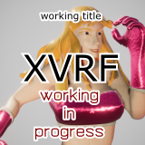

[🔙](../README.md) | [`取扱説明書`](manual.md) | [`操作方法`](controls.md) | `更新履歴` | [`デバッグツール`](debug.md) | `English (N/A)` | `Japanese`

----

# 更新履歴 / Update Logs

## `2019-05-16` 0.1.67 on `Unity 2019.1.2f1` `UniVRM 0.5.0`+ `VRoidSDK 0.0.17`
* `👤Character Selection`のあなたのキャラクターモデルの場合（`VRoid Hub`の☑に該当）、利用条件の設定によらず、遊べるようにしました。
## `2019-05-15` 0.1.66 on `Unity 2019.1.2f1` `UniVRM 0.5.0`+ `VRoidSDK 0.0.17`
* `👤Character Selection`の`Local`にて、読み込み失敗するVRMファイルを無視するようにしました。リストに列挙されないVRMファイルは、対称フォルダ📁階層から外すことをおすすめします。
* `Character Profile`画面に、参考情報として省略部位を列挙するようにしました。処理上で着目する特定の部位に該当がなかったことを示します。
* 戦闘キャラクターアイコンにて、キャラクター選択とその周辺の動作を改善しました。
## `2019-05-14` 0.1.65 on `Unity 2019.1.2f1` `UniVRM 0.5.0`+ `VRoidSDK 0.0.17`
* 一部依存パッケージを更新しました。
* 見かけ体重推定を調整しました。
* プレイ中のキャラクターから算出した見かけの身長/体重/頭身の数値を見られるようにしました。
  * `Eascape Menu`に`Character Profile`を開く`P1`/`P2`ボタンを追加しました。
  * `Character Profile`画面を追加しました。
## `2019-05-13` 0.1.64 on `Unity 2019.1.2f1` `UniVRM 0.5.0`+ `VRoidSDK 0.0.17`
* 見かけ体重を推定するようにしました。（暫定）
* 押し具合に体重の違いを反映するようにしました。
## `2019-05-12` 0.1.63 on `Unity 2019.1.2f1` `UniVRM 0.5.0`+ `VRoidSDK 0.0.17`
* 昼/星空を選択できるようにしました。
  * `Lobby`に`Scene`ボタンを追加しました。
  * `Scene Settings`画面を追加しました。
  * `Scene Settings`画面に`Starry Sky`トグルを追加しました。
## `2019-05-11` 0.1.62 on `Unity 2019.1.2f1` `UniVRM 0.5.0`+ `VRoidSDK 0.0.17`
* Unityを更新しました。
* `👤Character Selection`にて、化けていた詳細情報のアイコンを修正しました。
## `2019-05-10` 0.1.61 on `Unity 2019.1.1f1` `UniVRM 0.5.0`+ `VRoidSDK 0.0.17`
* 一部依存パッケージを更新しました。
* 起動時にダウンロードサイトに最新版があるか確認するようにしました。
## `2019-05-09` 0.1.56 on `Unity 2019.1.1f1` `UniVRM 0.5.0`+ `VRoidSDK 0.0.17`
* 簡単なパフォーマンス確認用として、統計モニタ`Graphy`を設置しました。XVRFでの表示方法などは取扱説明書の[`Graphy`](debug.md#統計モニタgraphy)の項目をご覧ください。
## `2019-05-08` 0.1.50 on `Unity 2019.1.1f1` `UniVRM 0.5.0`+ `VRoidSDK 0.0.17`
* `📜Report`のログの切り出し処理を修正し、内容が自動記入されないことがある問題を修正しました。
## `2019-05-07` 0.1.46 on `Unity 2019.1.1f1` `UniVRM 0.5.0`+ `VRoidSDK 0.0.17`
* 一部依存パッケージを更新しました。
* `⚙Settings`画面の配置を調整しました。
## `2019-05-06` 0.1.45 on `Unity 2019.1.1f1` `UniVRM 0.5.0`+ `VRoidSDK 0.0.17`
* `VRoid Hub★`の☑状態を正しく反映するようにしました。
## `2019-05-05` 0.1.43 on `Unity 2019.1.1f1` `UniVRM 0.5.0`+ `VRoidSDK 0.0.17`
* 一部依存パッケージを更新しました。
* `🤖🆚🤖`/`Discord`/デバッグ画面で🔙操作に応答するように修正しました。
* 品質設定の一部を変更しました。
## `2019-05-04` 0.1.41 on `Unity 2019.1.1f1` `UniVRM 0.5.0`+ `VRoidSDK 0.0.17`
* 一部依存パッケージを更新しました。
* `⚙Settings`の読み込み動作を修正しました。
* `⚙Settings`で🔙操作に応答するように修正しました。
* `⚙Settings`と`Escape Menu`に`AI Level`を追加しました。現在のところ単純に防御行動の割合に関与します。
## `2019-05-03` 0.1.40 on `Unity 2019.1.0f2` `UniVRM 0.5.0`+ `VRoidSDK 0.0.17`
* 一部画像を更新しました。
* 有効期限を設定しました。期限切れの表示となった場合は最新版を探してみてください。
## `2019-05-02` 0.1.38 on `Unity 2019.1.0f2` `UniVRM 0.5.0`+ `VRoidSDK 0.0.17`
* MToon描画を`Unity 2019.1.0f2`対応版に部分更新 ← [MToon #44](https://github.com/Santarh/MToon/issues/44) / [diff](https://github.com/Santarh/MToon/commit/cbd3777fa9f29333c618eacb7b01857b953d729d#diff-50d180701d9ac0bb8b4772401996da0f)
  * `Unity 2019.1.0f2`で`MToon`シェーダを使うキャラクターモデルの描画がおかしくなります。
## `2019-05-01` 0.1.37 on `Unity 2019.1.0f2` `UniVRM 0.5.0`+ `VRoidSDK 0.0.17`
* 初公開（アーリーアクセス版）

--------
🆇🅴🅻🅵
©2018-2019 XELF
